# ActiveMQ

:mailbox: MQ 是消息中间件，是一种在分布式系统中应用程序借以传递消息的媒介，常用的有 ActiveMQ，RabbitMQ，kafka。ActiveMQ 是 Apache 下的开源项目，完全支持 JMS1.1 和 J2EE1.4 规范的 JMS Provider 实现。

<!-- more -->

## 前言

### mq 产品种类

- kafka
- rabbitmq
- rocketmq
- activemq

### 优势

1. 能够做到系统解耦,当新的模块接进来时,可以做到代码改动最小;`能够解耦`
2. 设置流量缓冲池,可以让后端系统按照自身吞吐能力进行消费,不被冲垮;`能够削峰`
3. 强弱依赖梳理能将非关键调用链路的操作异步化并提升整体系统的吞吐能力;`能够异步`

## 使用步骤

### 1 安装

[官网下载]: https://activemq.apache.org/components/classic/download/

```shell
#解压
tar -zxf apache-activemq-5.15.15-bin.tar.gz
#移动
mv apache-activemq-5.15.15 /opt/
#进入
cd /opt/apache-activemq-5.15.15/bin/
#启动
./activemq start
```

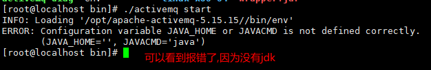

安装好 jdk 环境,又回来了(建议搞一台虚拟机作为原型,需要环境学习时就克隆一台 )

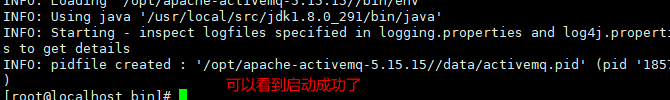

```shell
#停止服务
./activemq stop
#启动服务并将日志写入指定文件(前提文件夹存在)
./activemq start > /opt/activemq-logs/myrunmq.log
#浏览器访问(web访问端口是8161)
http://192.168.59.140:8161/
#默认账户
admin	admin
```

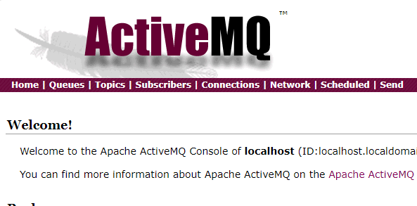

### 2 java 操作 activemq

#### 2.1 队列模式

**发送消息**

```java
    private static final String ACTIVEMQ_URL="tcp://192.168.59.140:61616";
    private static final String QUEUE_NAME="queue01";
    public static void main(String[] args) throws JMSException {
        //1.创建连接工厂,按照指定的url,采用默认的用户名密码
        ActiveMQConnectionFactory factory = new ActiveMQConnectionFactory(ACTIVEMQ_URL);
        //2.通过连接工厂,获得连接connection
        Connection connection = factory.createConnection();
        connection.start();
        //3.创建会话
        //两个参数,第一个叫事务,第二个叫签收
        Session session = connection.createSession(false, Session.AUTO_ACKNOWLEDGE);
        //4.创建目的地(具体是队列还是主题,不论队列还是主题都是继承自destination)
        Queue queue = session.createQueue(QUEUE_NAME);
        //5.创建消息生产者
        MessageProducer messageProducer = session.createProducer(queue);
        //6.通过使用messageProducer生产3条消息发送到mq的队列里面
        for (int i = 0; i < 3; i++) {
            //7.创建消息
            TextMessage textMessage = session.createTextMessage("msg---" + (i + 1));
            //8.通过messageProducer发送给mq
            messageProducer.send(textMessage);
        }
        //9.关闭资源
        messageProducer.close();
        session.close();
        connection.close();
        System.out.println("*******消息发布到MQ完成");
    }
```

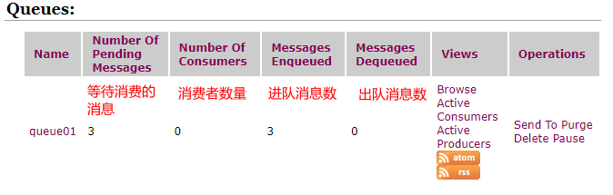

**接收消息**

1. 普通接收消息

```java
    private static final String ACTIVEMQ_URL="tcp://192.168.59.140:61616";
    private static final String QUEUE_NAME="queue01";
    public static void main(String[] args) throws JMSException {
        //1.创建连接工厂,按照指定的url,采用默认的用户名密码
        ActiveMQConnectionFactory factory = new ActiveMQConnectionFactory(ACTIVEMQ_URL);
        //2.通过连接工厂,获得连接connection
        Connection connection = factory.createConnection();
        connection.start();
        //3.创建会话
        //两个参数,第一个叫事务,第二个叫签收
        Session session = connection.createSession(false, Session.AUTO_ACKNOWLEDGE);
        //4.创建目的地(具体是队列还是主题,不论队列还是主题都是继承自destination)
        Queue queue = session.createQueue(QUEUE_NAME);
        //5.创建消费者
        MessageConsumer consumer = session.createConsumer(queue);
        while (true){
            //6.接收消息
            TextMessage textMessage = (TextMessage) consumer.receive();
            if (textMessage != null) {
                System.out.println("********消费者接受到消息:"+textMessage.getText());
            }else{
                break;
            }
        }
        consumer.close();
        session.close();
        connection.close();
        //9.关闭资源
        System.out.println("*******接收消息完成");
    }
```

2. 通过监听的方式接收消息

```java
        consumer.setMessageListener(new MessageListener() {
            @Override
            public void onMessage(Message message) {
                if (message != null && message instanceof TextMessage) {
                    TextMessage textMessage=(TextMessage)message;
                    try {
                        System.out.println("********消费者监听到的消息是:"+textMessage.getText());
                    } catch (JMSException e) {
                        e.printStackTrace();
                    }
                }
            }
        });
        //保证main方法不退出
        System.in.read();
        consumer.close();
        session.close();
        connection.close();
```

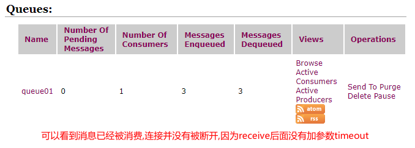

**队列模式特点**

1. 没有时间上的相关性
2. 保存消息,等待消费者消费
3. 如果同时有多名消费者(相同的 queue),那么消息会被平均分配

#### 2.2 主题模式

**发送消息**

```java
//目的地变了,由queue变成了topic
Topic topic = session.createTopic(TOPIC_NAME);
```

**接收消息**

```java
//接收消息也是一样的
Topic topic = session.createTopic(TOPIC_NAME);
MessageConsumer consumer = session.createConsumer(topic);
//当然可以用Lambda表达式简化代码
consumer.setMessageListener((message)->{
    if(message!=null && message instanceof TextMessage){
        TextMessage textMessage= (TextMessage) message;
        try {
            System.out.println("********消费者监听到的消息是:"+textMessage.getText());
        } catch (JMSException e) {
            e.printStackTrace();
        }
    }
});
```

**主题模式特点**

1. 有时间上的相关性,只能消费自它订阅之后发布的消息
2. 不保存消息,假如无人订阅就去生产,那就是一条废消息,一般先启动消费者再启动生产者
3. 每条消息都会被所有订阅者消费(人人有份)

#### 2.3 topic 和 queue 的对比总结

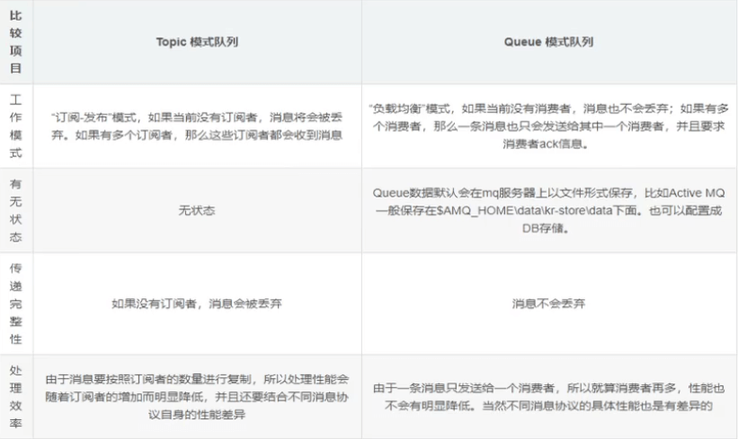

### 3 jms

java message service(java 消息服务是 javaEE 中的一个技术)

#### 3.1 jms 的组成结构和特点

- jms provider --> 实现就 jms 接口和规范的消息中间件,也就是我们的 mq 服务器

- jms producer --> 消息生产者,创建和发送 jms 消息的客户端应用

- jms consumer --> 消息消费者,接收和处理 jms 消息的客户端应用

- jms message --> 重要

  - `消息头`

    - jmsdestination --> 目的地
    - jmsdeliverymode --> 是否持久化(默认持久化)
    - jmsexpiration --> 过期时间(默认永不过期)
    - jmspriority --> 消息优先级(0-9 十个级别,0-4 是普通消息,5-9 是加急消息,默认是 4 级)
    - jmsmessageid -->唯一识别每个消息的标识由 mq 产生

  - `消息体`

    - 封装集体的消息数据
    - 5 种消息体格式
      1. textmessage --> 普通字符串消息,包含一个 string
      2. mapmessage --> 一个 map 类型的消息,key 作为 string 类型,而值为 java 的基本类型
      3. bytesmessage --> 二进制数据消息,包含一个 byte[]
      4. streammessage --> java 数据流消息,用标准流操作来顺序的填充和
      5. objectmessage --> 对象消息,包含一个可序列化的 java 对象
    - 发送和接受的消息体类型必须一致

  - `消息属性`

    - 如果需要除消息头字段以外的值,那么可以使用消息属性

    - 识别,去重,重点标注等操作

    - ```java
      textMessage.setStringProperty("chen", "vip");
      ```

### 4 发布订阅

发布订阅模式本质其实是一个持久化的 topic

**发送消息**

```java
private static final String ACTIVEMQ_URL="tcp://192.168.59.140:61616";
private static final String TOPIC_NAME="pub-sub";
public static void main(String[] args) throws JMSException {
    ActiveMQConnectionFactory factory = new ActiveMQConnectionFactory(ACTIVEMQ_URL);
    Connection connection = factory.createConnection();
    Session session = connection.createSession(false, Session.AUTO_ACKNOWLEDGE);
    Topic topic = session.createTopic(TOPIC_NAME);
    MessageProducer messageProducer = session.createProducer(topic);
    //持久化
    messageProducer.setDeliveryMode(DeliveryMode.PERSISTENT);
    //start调用的位置变了
    connection.start();
    for (int i = 0; i < 3; i++) {
        TextMessage textMessage = session.createTextMessage("topic name---" + (i + 1));
        messageProducer.send(textMessage);
    }
    messageProducer.close();
    session.close();
    connection.close();
    System.out.println("*******持久化topic name 消息发布到MQ完成");
}
```

**接收消息**

```java
private static final String ACTIVEMQ_URL="tcp://192.168.59.140:61616";
private static final String TOPIC_NAME="pub-sub";
public static void main(String[] args) throws JMSException, IOException {
    ActiveMQConnectionFactory factory = new ActiveMQConnectionFactory(ACTIVEMQ_URL);
    Connection connection = factory.createConnection();
    //谁订阅
    connection.setClientID("zs");
    Session session = connection.createSession(false, Session.AUTO_ACKNOWLEDGE);
    Topic topic = session.createTopic(TOPIC_NAME);
    //持久化topic
    TopicSubscriber topicSubscriber = session.createDurableSubscriber(topic, "remark ...");
    //start调用的位置变了
    connection.start();
    Message message = topicSubscriber.receive();
    while (message != null) {
        TextMessage textMessage= (TextMessage) message;
        System.out.println("收到的持久化topic: "+textMessage.getText());
        message = topicSubscriber.receive(5000L);
    }
    session.close();
    connection.close();
}
```

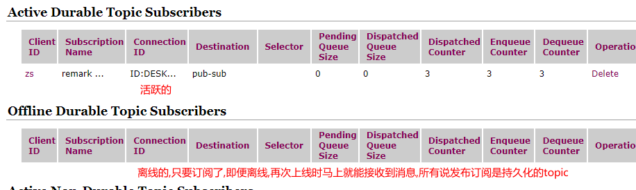

1. 一定先运行一次消费者,等于先 mq 注册,类似我订阅了这个主题
2. 然后在运行生产者发送消息
3. 此时,无论消费者是否在线,都会接收到,不在线的话,下次连接时会把没收到的消息都接下来

### 5 事务

事务偏生产者

#### 5.1 生产者立场

Session session = connection.createSession(false, Session.AUTO_ACKNOWLEDGE);

1. 当事务为 false 时,只要执行 send,就会进入到队列中
2. 当事务未 true 时,先执行 send 在执行 commit,消息才被真正的提交的队列中

#### 5.2 消费者立场

Session session = connection.createSession(false, Session.AUTO_ACKNOWLEDGE);

1.  当事务为 false 时,只要执行 receive,消息就会被消费
2.  当事务未 true 时,先执行 receive 在执行 commit,消息才会被真正消费

### 6 签收

签收偏消费者，自动签收就不说了

#### 6.1 非事务手动签收

```java
//手动签收
Session session = connection.createSession(false, Session.CLIENT_ACKNOWLEDGE);
//一旦设置成手动签收,需要对每一条消息,进行签收
textMessage.acknowledge();
```

#### 6.2 有事务手动签收

```java
//有事务的手动签收
Session session = connection.createSession(true, Session.CLIENT_ACKNOWLEDGE);
//情况1:只commit不acknowledge,消息被正常消费,不存在重复消费
session.commit();
//情况2:只acknowledge不commit,消费未被正常消费,存在重复消费
textMessage.acknowledge();
//结论:事务大于ack
```

### 7 broker

相当于一个 activemq 服务器实例

说白了,broker 其实就是实现了用代码的形式启动 activemq 将 mq 嵌入到 java 代码中,以便随时用随时启动,在用的时候再去启动这样能节省了资源,也保证了可靠性

```shell
#指定配置文件启动,类同redis
./activemq start xbean:file:/opt/apache-activemq-5.15.15/conf/activemq.xml
```

### 8 springboot 整合 activemq

**activemq-produce(生产者)**

引入依赖

```pom
<dependency>
	<groupId>org.springframework.boot</groupId>
	<artifactId>spring-boot-starter-activemq</artifactId>
</dependency>
```

yaml 配置

```yaml
server:
  port: 8001
spring:
  activemq:
    broker-url: tcp://192.168.59.140:61616
    user: admin
    password: admin
  jms:
    pub-sub-domain: false #false=queue true=topic
#定义队列名称
myqueue: boot-activemq-queue
```

配置 bean(声明队列)

```java
@Configuration
public class ActivemqConfig {
    @Value("${myqueue}")
    private String myqueue;

    @Bean
    public Queue queue(){
        return new ActiveMQQueue(myqueue);
    }
}
```

编写消息生产者

```java
@Component
public class QueueProduce {
    @Autowired
    JmsMessagingTemplate jmsMessagingTemplate;

    @Autowired
    Queue queue;

    public void produceMsg(){
        jmsMessagingTemplate.convertAndSend(queue,"*****"+ UUID.randomUUID().toString());
    }
}
```

主程序

```java
@SpringBootApplication
@EnableJms
public class ActivemqApplication {
    public static void main(String[] args) {
        SpringApplication.run(ActivemqApplication.class, args);
    }
}
```

测试消息发送

```java
@SpringBootTest
class ActivemqApplicationTests {
    @Autowired
    QueueProduce queueProduce;
    @Test
    void contextLoads() {
        queueProduce.produceMsg();
    }
}
```

**activemq-consumer(消费者)**

和 produce 差不多，修改下端口，删除队列声明和消息发送，新建消费消息类，consumer 主程序不需要@EnableJms

```java
@Component
public class QueueConsumer {
    @Autowired
    JmsMessagingTemplate jmsMessagingTemplate;

    @JmsListener(destination = "${myqueue}")
    public void receive(TextMessage textMessage) throws JMSException {
        System.out.println("*******消费者收到的消息是:"+textMessage.getText());
    }
}
```

**topic 模式**

topic 模式就是把配置文件的 pub-sub-domain 改成 true

声明 queue 改成声明 topic

### 9 传输协议

#### 9.1 nio 协议(重点)

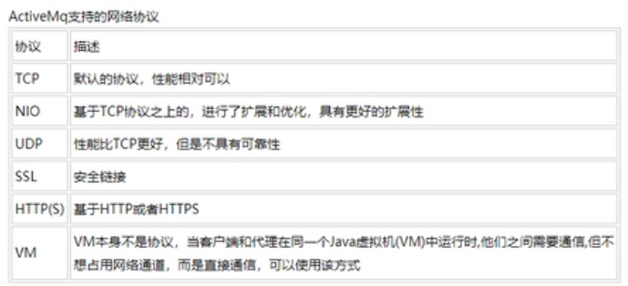

```shell
#进入
cd /opt/apache-activemq-5.15.15/conf/
#备份
cp activemq.xml activemq.xml.bak
#修改
vi activemq.xml
```

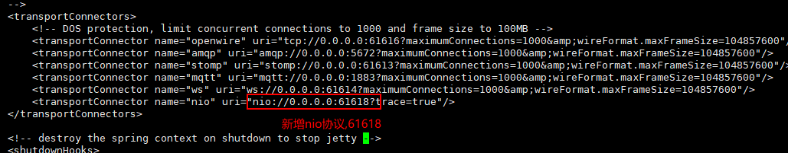

```shell
<transportConnector name="nio" uri="nio://0.0.0.0:61618?trace=true"/>
```

修改 url 连接协议

```java
private static final String ACTIVEMQ_URL="nio://192.168.59.140:61618";
```

#### 9.2 auto+nio

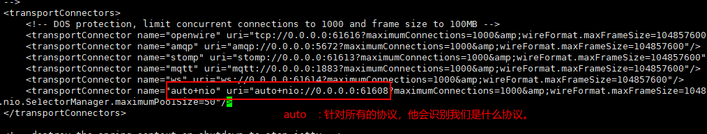

```shell
<transportConnector name="auto+nio" uri="auto+nio://0.0.0.0:61608?maximumConnections=1000&amp;wireFormat.maxFrameSize=104857600&amp;org.apache.activemq.transport.nio.SelectorManager.corePoolSize=20&amp;org.apache.activemq.transport.nio.Se1ectorManager.maximumPoo1Size=50"/>
```

```java
//可以使用nio协议连接
private static final String ACTIVEMQ_URL="nio://192.168.59.140:61608";
//也可以用tcp协议连接
private static final String ACTIVEMQ_URL="tcp://192.168.59.140:61608";
```

### 10 activemq 存储机制

#### 10.1 kahaDB 消息存储

基于日志文件,从 activemq5.4 开始默认的持久化插件

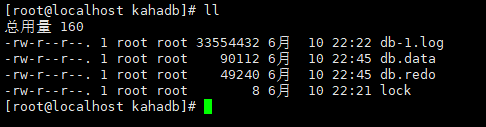

- db-number.log
  - 每 32M 一个文件,文件名按照数字进行编号,当不再有引用到数据文件中的任何消息时,文件会被删除或归档
- db.data
  - 该文件包含了持久化的 BTree 索引,索引了消息数据记录中的消息,他是消息的索引文件
- db.free
  - 当前 db.data 文件里哪些页面是空闲的,文件具体内容是所有空闲业的 id
- db.redo
  - 用来进行消息回复,如果 kahaDB 消息存储在强制退出后启动,用来回复 BTree 索引
- lock
  - 文件锁,表示当前获得 kahaDB 读写权限的 broker

#### 10.2 jdbc 消息存储

添加 mysql 驱动

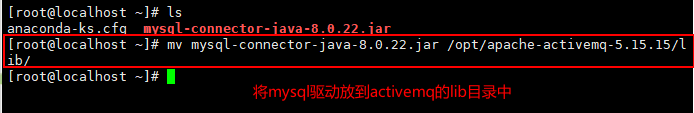

修改配置

```shell
vi /opt/apache-activemq-5.15.15/conf/activemq.xml
```

修改消息存储类型为 jdbc

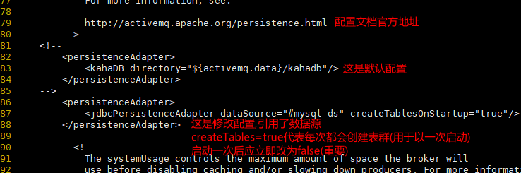

定义数据源

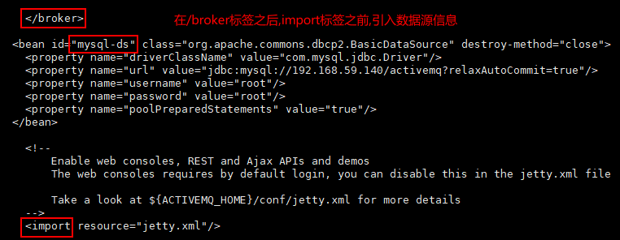

创建 activemq 数据库

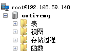

```shell
<persistenceAdapter>
  <jdbcPersistenceAdapter dataSource="#mysql-ds" createTablesOnStartup="true"/>
</persistenceAdapter>

  <bean id="mysql-ds" class="org.apache.commons.dbcp2.BasicDataSource" destroy-method="close">
    <property name="driverClassName" value="com.mysql.jdbc.Driver"/>
        <property name="url" value="jdbc:mysql://192.168.59.140/activemq?relaxAutoCommit=true"/>
        <property name="username" value="root"/>
        <property name="password" value="root"/>
        <property name="poolPreparedStatements" value="true"/>
  </bean>
```

启动 activemq,成功就可以看到表已经建好了

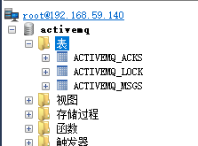

测试发送消息(当消息被消费时则会从数据库删除)

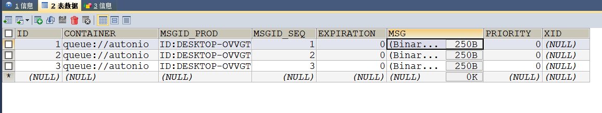

#### 10.2 activemq journal

使用高速缓存写入技术,大大提高了性能

当消费者的消费速度能够及时跟上生产消息的生产速度时,journal 文件能够大大减少需要写入到 DB 中的消息

举个例子:

生产者生产了 1000 条消息,这 1000 条消息会保存到 journal 文件,如果消费者消费速度很快的情况下,在 journal 文件还没有同步到 DB 之前,消费者已经消费了 90%以上的消息,那么这个时候只需要同步剩余的 10%的消息到 DB.如果消费者的消费速度很慢,这个时候 journal 文件可以使消息以批量方式写到 DB

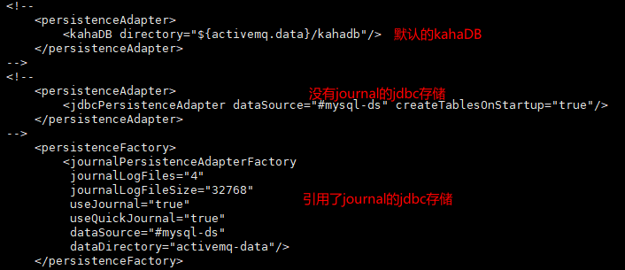

```shell
#编辑配置文件
vi /opt/apache-activemq-5.15.15/conf/activemq.xml
#修改配置
<persistenceFactory>
  <journalPersistenceAdapterFactory
  	journalLogFiles="4"
  	journalLogFileSize="32768"
  	useJournal="true"
  	useQuickJournal="true"
  	dataSource="#mysql-ds"
  	dataDirectory="activemq-data"/>
</persistenceFactory>
```

测试发送消息

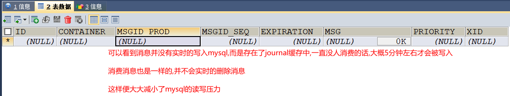

### 11 zookeeper+replicated+leveldb 的主从集群

#### 11.1 环境搭建

需要 zookeeper 集群

[zookeeper集群跳转链接]: https://blog.csdn.net/qq_51138261/article/details/117827028

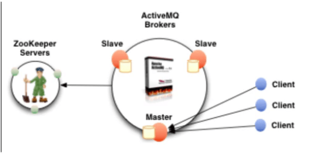

用全新的原生的,之前修改过的放一边

```shell
#创建文件夹
mkdir mq_cluster && cd mq_cluster
#递归拷贝,并重命名文件
cp -r /opt/apache-activemq-5.15.15 mq_node01
cp -r /opt/apache-activemq-5.15.15 mq_node02
cp -r /opt/apache-activemq-5.15.15 mq_node03
#修改mq_node02和mq_node03(01不动)
vi mq_node02/conf/jetty.xml
vi mq_node03/conf/jetty.xml
#编辑hosts
vi /etc/hosts:
#新增名字映射
192.168.59.140 myactivemq
#修改brokername(activemq.xml)
vi mq_node01/conf/activemq.xml
vi mq_node02/conf/activemq.xml
vi mq_node03/conf/activemq.xml
```

修改 web 端口(jetty.xml)

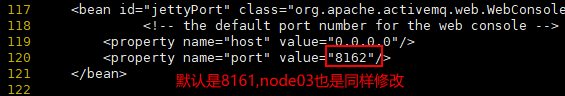

修改 brokerName(activemq.xml)

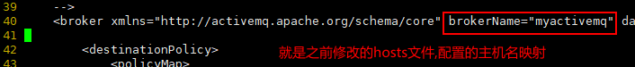

```shell
#修改存储模式(activemq.xml)
vi mq_node01/conf/activemq.xml
vi mq_node02/conf/activemq.xml
vi mq_node03/conf/activemq.xml
#node1
<persistenceAdapter>
    <replicatedLevelDB
      directory="${activemq.data}/leveldb"
      replicas="3"
      bind="tcp://0.0.0.0:63631"
      zkAddress="localhost:2181,localhost:2182,localhost:2183"
	  sync="local_disk"
      zkPath="/activemq/leveldb-stores"
      hostname="chen-server"/>
  </persistenceAdapter>
```

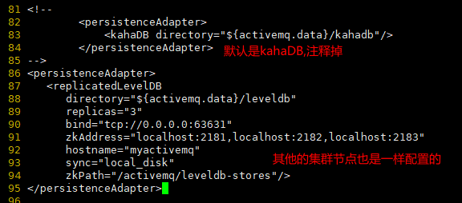

```shell
#修改node02和node03的消息端口
vi mq_node02/conf/activemq.xml
vi mq_node03/conf/activemq.xml
```

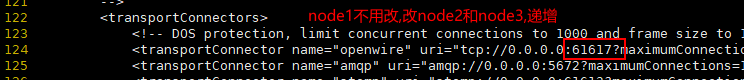

保证 zookeeper 集群正常运行的情况下

```shell
#启动activemq
./mq_node01/bin/activemq start
./mq_node02/bin/activemq start
./mq_node03/bin/activemq start
```

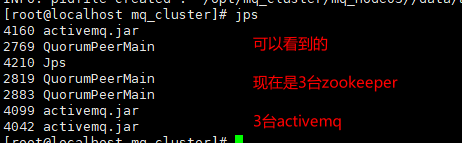

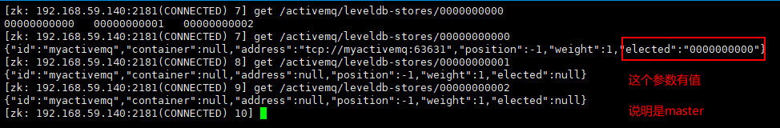

#### 11.2 集群可用性测试

干掉一个 activemq 节点,它会自动切换到另外一个活着的

```java
//修改连接url(故障迁移)
private static final String ACTIVEMQ_URL="failover:(tcp://192.168.59.140:61616,tcp://192.168.59.140:61617,tcp://192.168.59.140:61618)?randomize=false";
private static final String QUEUE_NAME="cluster-queue";
```

测试发送(不贴代码了,用之前的)

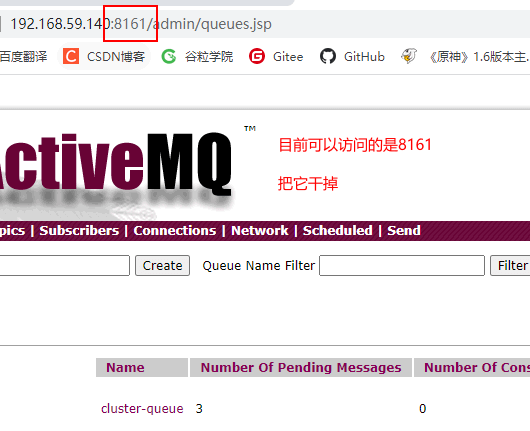

故障迁移失败,zookeeper 选举了,但是 address 为 null,原因是(我找了一天,就离谱,我用的最新的发行版 5.15.15)

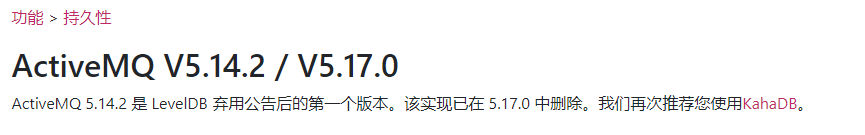

更换 activemq 版本 5.13.4

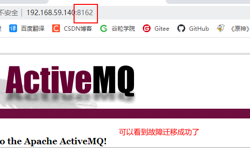

### 12 高级特性和大厂参考重点

#### 12.1 异步投递

activemq 支持同步和异步两种模式(默认是异步的)

除非指定使用同步,或者在未使用事务的前提下发送持久化消息,这两种情况下都是同步的

同步发送,会阻塞 produce 直到 broker 返回一个确认,表示消息已经被安全持久化到磁盘.确认机制提供了消息安全的保障,但同时会阻塞客户端带来了很大的延迟

异步发送,最大化 produce 端的发送效率,但是不能有效的保证消息发送成功

且需要消耗较多的 client 短内存同时也会导致 broker 端性能消耗增加

```java
ActiveMQConnectionFactory factory = new ActiveMQConnectionFactory(ACTIVEMQ_URL);
//开启异步投递
factory.setUseAsyncSend(true);
```

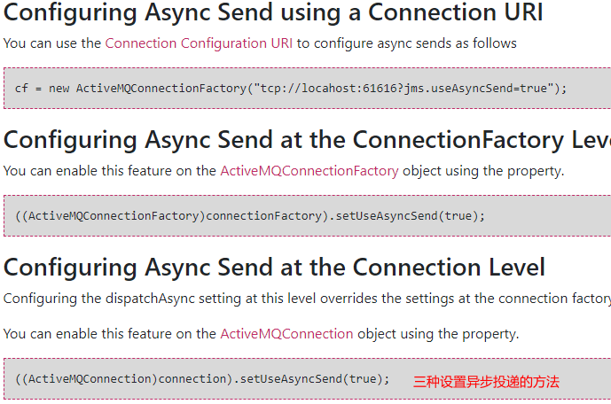

#### 12.2 异步投递如何确认发送成功

由于消息不阻塞,生产者会认为所有 send 的消息均被成功发送至 mq

如果 mq 突然宕机,此时生产者端内存中尚未被发送至 mq 的消息都会丢失

所以,正确的异步发送方法是需要接收回调的

并由客户端在判断一次是否发送成功

```java
    private static final String ACTIVEMQ_URL="failover:(tcp://192.168.59.140:61616,tcp://192.168.59.140:61617,tcp://192.168.59.140:61618)?randomize=false";
    private static final String QUEUE_NAME="cluster-queue";
    public static void main(String[] args) throws JMSException {
        ActiveMQConnectionFactory factory = new ActiveMQConnectionFactory(ACTIVEMQ_URL);
        //开启异步投递
        factory.setUseAsyncSend(true);
        Connection connection = factory.createConnection();
        connection.start();
        Session session = connection.createSession(false, Session.AUTO_ACKNOWLEDGE);
        Queue queue = session.createQueue(QUEUE_NAME);
        //注意这里变了,ActiveMQMessageProducer(更加细粒度的)
        ActiveMQMessageProducer messageProducer = (ActiveMQMessageProducer) session.createProducer(queue);
        for (int i = 0; i < 3; i++) {
            //设置messageid
            TextMessage textMessage = session.createTextMessage("msg---" + (i + 1));
            textMessage.setJMSMessageID("order:"+UUID.randomUUID().toString());
            String id = textMessage.getJMSMessageID();
            //发送消息并接受回调
            messageProducer.send(textMessage, new AsyncCallback() {
                @Override
                public void onSuccess() {
                    System.out.println(id+"---成功");
                }

                @Override
                public void onException(JMSException e) {
                    System.out.println(id+"---失败");
                }
            });
        }
        messageProducer.close();
        session.close();
        connection.close();
        System.out.println("*******消息发布到MQ完成");
```

#### 12.3 延迟投递和定时投递

默认没有开启,需要修改 activemq.xml 文件 broker 属性(记得重启)

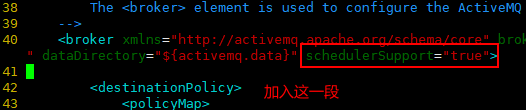

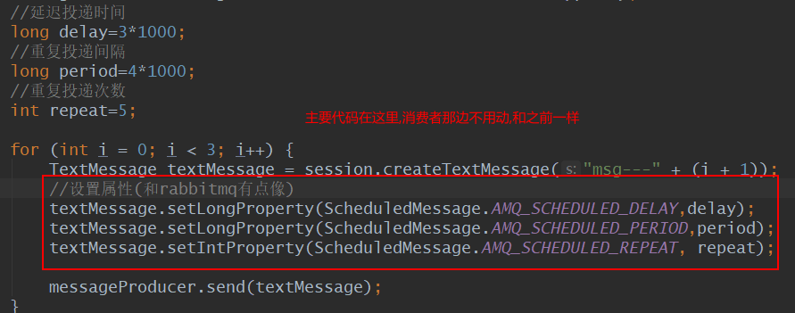

#### 12.4 消息重试机制

哪些情况会引起消息重发

1. client 开启了事务,且在 session 中调用了 rollback()
2. client 开启了事务,并在调用 commit()之前关闭或者没有 commit
3. client 在手动签收模式下,在 session 中调用了 recover()

消息默认重发时间间隔和重发次数

间隔: 1

次数: 6

有毒消息 poison ACK

一个消息超过了最大重发次数,消费端会给 mq 发送一个"poison ack",表示这个消息有毒,告诉 broker 不要再发了,这个时候 broker 会把这个消息放到 DLQ(死信队列)中

测试-->生产者发送消息,消费者开启事务,但是不 commit,重复消费 6 次,第 7 次拿不到消息

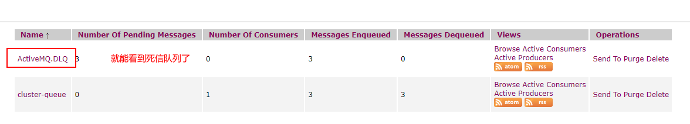

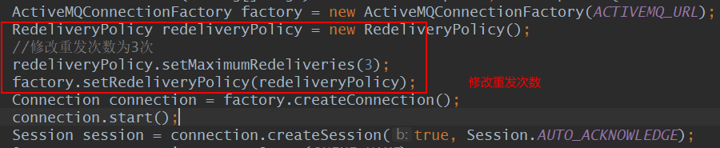

#### 12.5 死信队列

当一条消息被重发了多次以后(默认 6 次)将会被 mq 移入死信队列,开发人员可以在这个队列中查看处理出错的消息,进行人工干预
