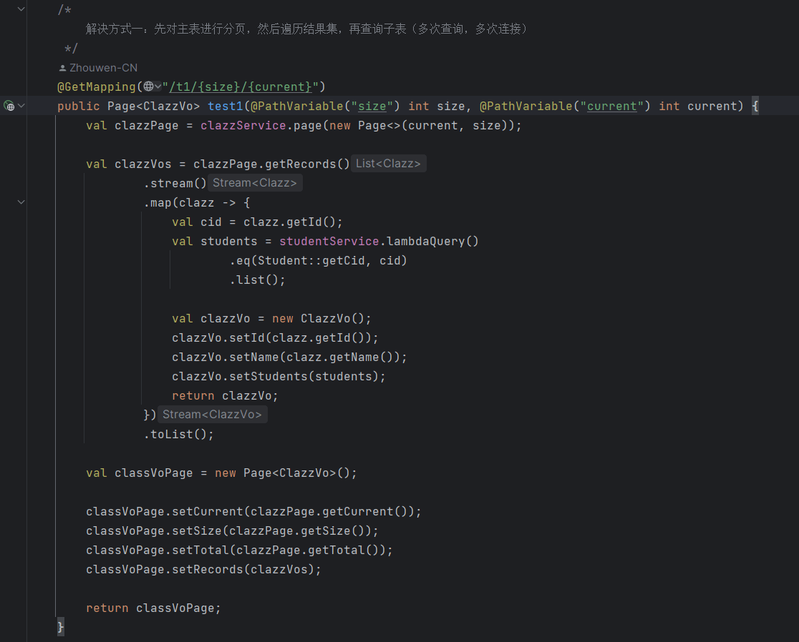

# Mybatis 一对多分页问题

:bird: 文章主要目的是为了解决 mybatis 分页插件，在面对 join 一对多关系时，分页结果不正确的问题

<!-- more -->

:::info 常见的解决方案有：

1. 先对主表进行分页，然后遍历结果集，再查询子表（多次查询，多次连接）
2. 在 Mybatis xml 文件中的 collection 中嵌套查询（多次查询，一次连接）
3. 自己手写分页（一次查询，一次连接，比较麻烦，这里并不做实现）

:::

那有没有更加有效、便捷、优雅的解决方案呢？其实是有的（一次查询，一次连接，不需要手写分页，沿用 mybatis 分页插件）

## 1、造数据

```sql
CREATE TABLE t_clazz (
    `id` INT AUTO_INCREMENT PRIMARY KEY comment '班级id',
    `name` VARCHAR(30) comment '班级名称'
) comment '班级表';

CREATE TABLE t_student (
    `id` INT PRIMARY KEY comment '学生id',
    `cid` INT comment '班级id',
    `name` VARCHAR(30) comment '学生姓名'
) comment '学生表';

INSERT INTO t_clazz (id, name) VALUES (1,'一班'),(2,'二班'),(3,'三班');

INSERT INTO t_student (id, cid, name) VALUES (1,1,'张三'),(2,1,'李四'),(3,1, '王五'),(4,2, '赵六'),(5,2, '钱七'),(6,2, '孙八'),(7,3, '周九'),(8,3, '吴十'),(9,3, '郑十一'),(10,3, '王十二');
```

::: info 需求
对班级表进行分页，一个班级对应多个学生
:::

## 2、创建项目

[项目地址: gitee](https://gitee.com/Zhouwen-CN/demo-list/tree/master/mybatis-page-solution)


## 3、问题复现


service 略


::: warning
可以看到 limit 是添加在 sql 的末尾，从而导致分页的结果不正确
:::

## 4、解决方案

### 4.1、遍历

先对主表进行分页，然后遍历结果集，再查询子表（多次查询，多次连接）




::: tip
通过控制台打印可以看到，创建了多个 SqlSession
:::

### 4.2、嵌套查询

在 Mybatis xml 文件中的 collection 中嵌套查询（多次查询，一次连接）

mapper 略

service 略


::: tip
通过控制台打印可以看到，只创建了一个 SqlSession
:::

## 5、最佳解决方案

通过上面的解决方案不难发现，都需要对 student 表进行多次的查询

如果 limit 下推到 class 表，是不是一次连接、一次查询就可以解决了呢，具体的 sql 如下

```sql
select
    a.id,
    a.name,
    b.id as sid,
    b.cid,
    b.name
from (
    select
        *
    from t_clazz
    limit ?,?
) a
join t_student b
on a.id=b.cid
```

我们可以通过实现 mysql 的分页方言来实现这一目的，默认的分页方言长这样：


可以看到，只是简单往 sql 的末尾添加 limit，我们可以实现我们自己的分页方言，通过 JsqlParser 来改写 sql

### 5.1、实现 mysql 分页方言

```java
public class MySqlPaginationDialect implements IDialect {
    public static final String HINT_VALUE = "UseLimitPushDown";

    @Override
    public DialectModel buildPaginationSql(String originalSql, long offset, long limit) {
        // 解析 sql
        Statement parse;
        try {
            parse = CCJSqlParserUtil.parse(originalSql);
        } catch (JSQLParserException e) {
            throw new RuntimeException("mysql 分页方言 sql 解析异常：" + e.getMessage());
        }

        /*
            是否存在 hint UseLimitPushDown:
                1. 存在 且 value相等：重构 sql，对主表进行 limit
                2. 按照之前的逻辑直接加 limit
         */
        PlainSelect plainSelect = (PlainSelect) parse;
        OracleHint oracleHint = plainSelect.getOracleHint();

        if (oracleHint != null && HINT_VALUE.equalsIgnoreCase(oracleHint.getValue())) {

            // from (select * from table) a 转换为 from (select * from table limit ?,?) a
            FromItem fromItem = plainSelect.getFromItem();
            if (fromItem instanceof ParenthesedSelect parenthesedSelect) {
                PlainSelect fromPlainSelect = parenthesedSelect.getPlainSelect();
                this.addLimit(fromPlainSelect);
            }

            /*
                1. from table a 转换为 from (select * from table limit ?,?) a
                2. from table 转换为 from (select * from table limit ?,?) table
            */
            if (fromItem instanceof Table table) {
                ParenthesedSelect parenthesedSelect = new ParenthesedSelect();

                // select
                PlainSelect fromPlainSelect = new PlainSelect();
                fromPlainSelect.addSelectItem(new AllColumns());
                fromPlainSelect.setFromItem(table);
                this.addLimit(fromPlainSelect);
                parenthesedSelect.setSelect(fromPlainSelect);

                // alias
                if (table.getAlias() == null) {
                    parenthesedSelect.setAlias(new Alias(table.getName()));
                } else {
                    parenthesedSelect.setAlias(table.getAlias());
                }

                plainSelect.setFromItem(parenthesedSelect);
            }
        } else {
            this.addLimit(plainSelect);
        }

        return (new DialectModel(plainSelect.toString(), offset, limit)).setConsumerChain();
    }

    private void addLimit(PlainSelect plainSelect) {
        Limit limitExpression = new Limit()
                .withRowCount(new JdbcParameter())
                .withOffset(new JdbcParameter());
        plainSelect.withLimit(limitExpression);
    }

}
```

逻辑很简单，如果存在 hint UseLimitPushDown，使用 JsqlParser 重构 sql，将 limit 下推到主表，否则直接添加 limit

为什么使用 hint，这是为了不对以前的代码造成影响

### 5.2、在分页插件中使用

```java {11,12}
@Configuration
public class MybatisPlusConfig {

    /**
     * 添加分页插件
     */
    @Bean
    public MybatisPlusInterceptor mybatisPlusInterceptor() {
        MybatisPlusInterceptor interceptor = new MybatisPlusInterceptor();
        val paginationInnerInterceptor = new PaginationInnerInterceptor(DbType.MYSQL);
        // 方言实现类
        paginationInnerInterceptor.setDialect(new MySqlPaginationDialect());
        // 如果配置多个插件, 切记分页最后添加
        interceptor.addInnerInterceptor(paginationInnerInterceptor);
        // 如果有多数据源可以不配具体类型, 否则都建议配上具体的 DbType
        return interceptor;
    }
}
```

### 5.3、测试

mapper 略

service 略


::: tip
通过控制台打印可以看到，limit 被下推到了 class 表，并且仅用了一次连接，一次查询，就得到了正确的结果

不是 mysql 数据库，则需要自己实现对应的方言
:::
