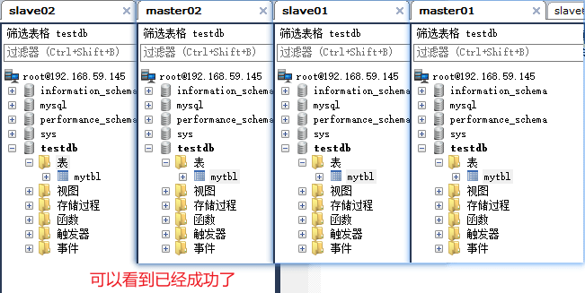
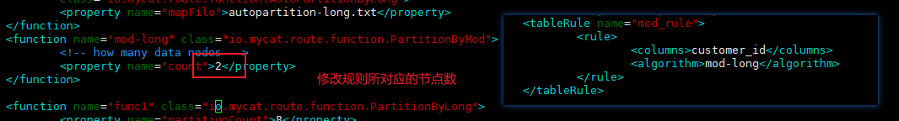
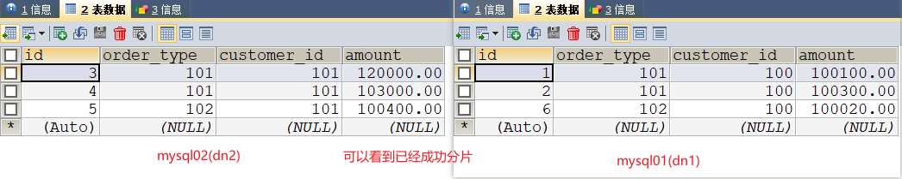
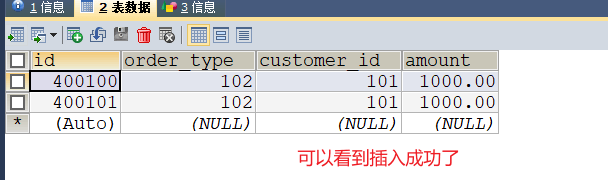
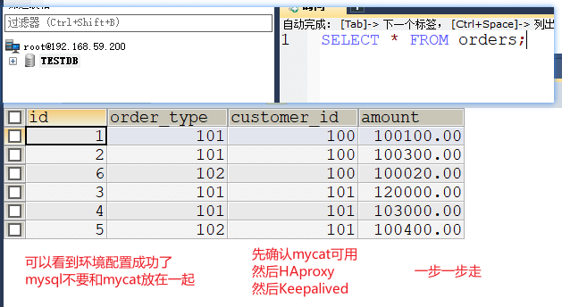
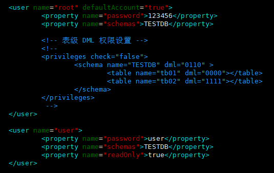
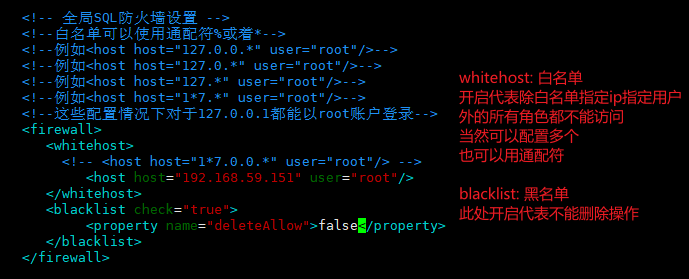

# Mycat

:cat: `MyCat` 是一个开源的分布式数据库系统，是一个实现了 MySQL 协议的服务器，前端用户可以把它看作是一个数据库代理，用 MySQL 客户端工具和命令行访问，而其后端可以用 MySQL 原生协议与多个 MySQL 服务器通信，也可以用 JDBC 协议与大多数主流数据库服务器通信，其核心功能是分表分库，即将一个大表水平分割为 N 个小表，存储在后端 MySQL 服务器里或者其他数据库里。

<!-- more -->

## 1 概述

### 1.1 mycat 是什么

1、mycat 是数据库中间件

数据库中间件 中间件：是一类连接软件组件和应用的计算机软件，以便于软件各部件之间的沟通。 例子：Tomcat，web 中间件。 数据库中间件：连接 java 应用程序和数据库

2、为什么要用 Mycat？

- Java 与数据库紧耦合
- 高访问量高并发对数据库的压力。
- 读写请求数据不一致

### 1.2 能干什么

1. 读写分离


2. 数据分片 垂直拆分（分库）、水平拆分（分表）、垂直+水平拆分（分库分表）


3. 多数据源整合


### 1.3 原理

Mycat 的原理中最重要的一个动词是“拦截”，它拦截了用户发送过来的 SQL 语句，首先对 SQL 语句做了一些特定的分析：如分片分析、路由分析、读写分离分析、缓存分析等，然后将此 SQL 发往后端的真实数据库，并将返回的结果做适当的处理，最终再返回给用户


这种方式把数据库的分布式从代码中解耦出来，程序员察觉不出来后台使用 Mycat 还是 MySQL。

## 2 安装启动

### 2.1 配置读写分离

[官网下载]: http://www.mycat.org.cn/

```shell
#解压
tar -zxf Mycat-server-1.6.7.1-release-20190627191042-linux.tar.gz
#移动
mv mycat/ /opt/
#进入配置文件目录
cd mycat/conf/
```

三个配置文件

1. schema.xml：定义逻辑库，表、分片节点等内容

2. rule.xml：定义分片规则

3. server.xml：定义用户以及系统相关变量，如端口等

```shell
#编辑配置文件
vim schema.xml
```

先不配 mysql 读写分离

将 schema.xml 配置文件内容替换成以下内容(这里 mysql 是用 docker 起的)

```xml
<?xml version="1.0"?>
<!DOCTYPE mycat:schema SYSTEM "schema.dtd">
<mycat:schema xmlns:mycat="http://io.mycat/">
		<!--逻辑库-->
        <schema name="TESTDB" checkSQLschema="false" sqlMaxLimit="100" dataNode="dn1">
        </schema>
        <dataNode name="dn1" dataHost="host1" database="testdb" />
        <dataHost name="host1" maxCon="1000" minCon="10" balance="0"
                          writeType="0" dbType="mysql" dbDriver="native" switchType="1"  slaveThreshold="100">
                <heartbeat>select user()</heartbeat>
            	<!--写主机-->
                <writeHost host="hostM1" url="192.168.59.145:3306" user="root"
                                   password="root">
                    	<!--读主机-->
                        <readHost host="hostS2" url="192.168.59.145:3307" user="root" password="root" />
                </writeHost>
        </dataHost>
</mycat:schema>
```

在主从 mysql 都创建 testdb 数据库并创建表


```shell
#进入启动目录
cd /opt/mycat/bin/
#以控制台方式启动
./mycat console
#后台启动
./mycat start
```

两个端口: 9066(用于后台管理) 8066(数据处理)


测试(在 mycat TESRDB 中执行)

```sql
#测试1:插入数据
INSERT INTO `t_test` VALUES(1,'zs');
#测试2:查询数据
SELECT * FROM `t_test`;
```

注意: 这时候查询发现可以查到数据,然后我就以为自己配置有问题,经过 2 个小时的查找,我找到了这个

`balance：`

1. balance="0", 不开启读写分离机制，所有读操作都发送到当前可用的 writeHost 上。

2. balance="1"，全部的 readHost 与 stand by writeHost 参与 select 语句的负载均衡，简单的说，当双主双从 模式(M1->S1，M2->S2，并且 M1 与 M2 互为主备)，正常情况下，M2,S1,S2 都参与 select 语句的负载均衡。

3. balance="2"，所有读操作都随机的在 writeHost、readhost 上分发。

4. balance="3"，所有读请求随机的分发到 readhost 执行，writerHost 不负担读压力

`writeType： `

1. writeType="0": 所有写操作发送到配置的第一个 writeHost，第一个挂了切到还生存的第二个

2. writeType="1"，所有写操作都随机的发送到配置的 writeHost，1.5 以后废弃不推荐 #writeHost，重新启动后以切换后的为准，切换记录在配置文件中:dnindex.properties 。

`switchType:  `

1. 1 默认值，自动切换。
2. -1 表示不自动切换
3. 2 基于 MySQL 主从同步的状态决定是否切换。

将 balance 的值改为 3 以后重启 mycat,发现确实查不到数据了

### 2.2 配置 mysql 的主从复制

[引用之前shardingsphere中的内容]: https://blog.csdn.net/qq_51138261/article/details/118001730

logbin 日志的三种格式

1. `STATEMENT`: 每一条会修改数据的 sql 都会记录在 binlog 中。
2. `ROW`: 不记录 sql 语句上下文相关信息，仅保存哪条记录被修改
3. `MIXED`: 是以上两种 level 的混合使用，一般的语句修改使用 statment 格式保存 binlog，如一些函数，statement 无法完成主从复制的操作，则采用 row 格式保存 binlog

### 2.2 配置 mysql 的双主双从

| 角色     | ip                  |
| -------- | ------------------- |
| master01 | 192.168.59.145:3306 |
| slave01  | 192.168.59.145:3307 |
| master02 | 192.168.59.145:3308 |
| slave02  | 192.168.59.145:3309 |

启动 4 个 mysql,用 docker 启动

```shell
#启动master01
docker run -d -p 3306:3306 --name mysql-m01 --net mynet -v /mydata/mysql-m01/log:/var/log/mysql -v /mydata/mysql-m01/data:/var/lib/mysql -v /mydata/mysql-m01/conf:/etc/mysql -e MYSQL_ROOT_PASSWORD=root mysql:5.7
#启动slave01
docker run -d -p 3307:3306 --name mysql-s01 --net mynet -v /mydata/mysql-s01/log:/var/log/mysql -v /mydata/mysql-s01/data:/var/lib/mysql -v /mydata/mysql-s01/conf:/etc/mysql -e MYSQL_ROOT_PASSWORD=root mysql:5.7
#启动master02
docker run -d -p 3308:3306 --name mysql-m02 --net mynet -v /mydata/mysql-m02/log:/var/log/mysql -v /mydata/mysql-m02/data:/var/lib/mysql -v /mydata/mysql-m02/conf:/etc/mysql -e MYSQL_ROOT_PASSWORD=root mysql:5.7
#启动slave02
docker run -d -p 3309:3306 --name mysql-s02 --net mynet -v /mydata/mysql-s02/log:/var/log/mysql -v /mydata/mysql-s02/data:/var/lib/mysql -v /mydata/mysql-s02/conf:/etc/mysql -e MYSQL_ROOT_PASSWORD=root mysql:5.7
```

一个主机 m1 用于处理所有写请求，它的从机 s1 和另一台主机 m2 还有它的从机 s2 负责所有读请求。当 m1 主机宕机后，m2 主机负责写请求，m1、m2 互为备机


修改 master01 配置文件

`vi /mydata/mysql-m01/conf/my.cnf`

```shell
[client]
default-character-set=utf8
[mysql]
default-character-set=utf8
[mysqld]
init_connect='SET collation_connection = utf8_unicode_ci'
init_connect='SET NAMES utf8'
character-set-server=utf8
collation-server=utf8_unicode_ci
skip-character-set-client-handshake
skip-name-resolve
#开启日志
log-bin=mysql-bin
#选择row模式
binlog-format=ROW
#设置服务id，主从不能一致
server-id=1
#设置需要复制的数据库(不设置则代表同步除屏蔽外的所有数据库)
#binlog-do-db=需要复制的主数据库名字
#屏蔽系统库同步
binlog_ignore_db=mysql
binlog_ignore_db=information_schema
binlog_ignore_db=performance_schema
# 在作为从数据库的时候，有写入操作也要更新二进制日志文件
log-slave-updates
#表示自增长字段每次递增的量，指自增字段的起始值，其默认值是1，取值范围是1 .. 65535
auto-increment-increment=2
# 表示自增长字段从哪个数开始，指字段一次递增多少，他的取值范围是1 .. 65535
auto-increment-offset=1
```

修改 master02 配置文件(复制 m1 的配置,并做如下修改,其他不变)

`vi /mydata/mysql-m02/conf/my.cnf`

```shell
server-id=3
auto-increment-offset=2
```

修改 slave01 配置文件

`vi /mydata/mysql-s01/conf/my.cnf`

```shell
[client]
default-character-set=utf8
[mysql]
default-character-set=utf8
[mysqld]
init_connect='SET collation_connection = utf8_unicode_ci'
init_connect='SET NAMES utf8'
character-set-server=utf8
collation-server=utf8_unicode_ci
skip-character-set-client-handshake
skip-name-resolve
#启用中继日志
relay-log=mysql-relay
#设置服务id，主从不能一致
server-id=2
#设置需要复制的数据库(不设置则代表同步除屏蔽外的所有数据库)
#binlog-do-db=需要复制的主数据库名字
```

修改 slave02 配置文件(复制 s1 的配置,并做如下修改,其他不变)

`vi /mydata/mysql-s02/conf/my.cnf`

```shell
server-id=4
```

重启服务

```shell
docker restart $(docker ps -aq)
```

查看 master01 和 master02 的 master 状态

```sql
SHOW MASTER STATUS
```


slave01 连接 master01,slave02 连接 master02


```sql
#先停止同步
STOP SLAVE;
#修改从库指向到主库，使用上一步记录的文件名以及位点
CHANGE MASTER TO
MASTER_HOST = '192.168.59.145',
MASTER_PORT=3306,
MASTER_USER = 'root',
MASTER_PASSWORD = 'root',
MASTER_LOG_FILE = 'mysql-bin.000001',
MASTER_LOG_POS = 154;
#启动同步
START SLAVE;
#Slave_SQL_Runing字段值为Yes,Slave_IO_Running字段值为Connecting，表示同步配置成功。
SHOW SLAVE STATUS
#注意 如果之前此从库已有主库指向 需要先执行以下命令清空
#STOP SLAVE IO_THREAD FOR CHANNEL '';
#reset slave all;
```

master01 和 master02 相互复制(互为备机)

即把 slave02 上面的命令放在 master01 上运行一遍,让 master01 连接 master02

然后把 slave01 上面的命令放在 master02 上运行一遍,让 master02 连接 master01

可能有点绕,就是让 master01 和 master02 互为主从


测试: 在 master01 上创建数据库 testdb,创建表 mytbl



也可以测试数据插入,但是要注意,增删改操作必须要 master 执行,如果在 slave 执行,会造成数据不一致而断开主从复制

### 2.3 mycat 实现双主双从读写分离

修改 mycat 配置文件 schema.xml

注意: 此时 balance 值为 1 ,还有 host 不能重名

```xml
<?xml version="1.0"?>
<!DOCTYPE mycat:schema SYSTEM "schema.dtd">
<mycat:schema xmlns:mycat="http://io.mycat/">

        <schema name="TESTDB" checkSQLschema="false" sqlMaxLimit="100" dataNode="dn1">
        </schema>
        <dataNode name="dn1" dataHost="host1" database="testdb" />
        <dataHost name="host1" maxCon="1000" minCon="10" balance="1"
                          writeType="0" dbType="mysql" dbDriver="native" switchType="1"  slaveThreshold="100">
                <heartbeat>select user()</heartbeat>
                <writeHost host="hostM1" url="192.168.59.145:3306" user="root"
                                   password="root">
                        <readHost host="hostS1" url="192.168.59.145:3307" user="root" password="root" />
                </writeHost>
                <writeHost host="hostM2" url="192.168.59.145:3308" user="root"
                                   password="root">
                        <readHost host="hostS2" url="192.168.59.145:3309" user="root" password="root" />
                </writeHost>
        </dataHost>
</mycat:schema>
```

启动 mycat 测试

1. 测试 1: 只能测试插入了,因为是单机搭的伪集群,所以不能像视频里面那样测试了,插入没问题应该就没啥大问题了
2. 测试 2: 高可用测试,停止 master01,然后测试 mycat 是否能进行写入操作

```shell
docker stop mysql-m01
```


3. 再启动 master01,会发现,数据同步了,master01 沦为读主机,master02 自动成为写主机

```shell
docker start mysql-m01
```


## 3 垂直拆分-分库

删除之前双主双从环境,重新布置环境,反正 docker 搞起来也快

启动两台 mysql( mysql01:3306 和 mysql02:3307 ),不需要主从复制,所以 balance 为 0

```shell
<?xml version="1.0"?>
<!DOCTYPE mycat:schema SYSTEM "schema.dtd">
<mycat:schema xmlns:mycat="http://io.mycat/">

        <schema name="TESTDB" checkSQLschema="false" sqlMaxLimit="100" dataNode="dn1">
                <table name="customer" dataNode="dn2" ></table>
        </schema>
        <dataNode name="dn1" dataHost="host1" database="orders" />
        <dataNode name="dn2" dataHost="host2" database="orders" />
        <dataHost name="host1" maxCon="1000" minCon="10" balance="0"
                          writeType="0" dbType="mysql" dbDriver="native" switchType="1"  slaveThreshold="100">
                <heartbeat>select user()</heartbeat>
                <writeHost host="hostM1" url="192.168.59.145:3306" user="root"
                                   password="root">
                </writeHost>
        </dataHost>
        <dataHost name="host2" maxCon="1000" minCon="10" balance="0"
                          writeType="0" dbType="mysql" dbDriver="native" switchType="1"  slaveThreshold="100">
                <heartbeat>select user()</heartbeat>
                <writeHost host="hostM1" url="192.168.59.145:3307" user="root"
                                   password="root">
                </writeHost>
        </dataHost>
</mycat:schema>
```

在 mysql01 和 mysql02 上面分别创建数据库 orders


启动 mycat,连接 mycat,并创建表,只能用 sql 语句创建,不然会报错(因为它是逻辑库)

```sql
#客户表 rows:20万
CREATE TABLE customer(
 id INT AUTO_INCREMENT,
 NAME VARCHAR(200),
 PRIMARY KEY(id)
);
#订单表 rows:600万
CREATE TABLE orders(
 id INT AUTO_INCREMENT,
 order_type INT,
 customer_id INT,
 amount DECIMAL(10,2),
 PRIMARY KEY(id)
);
#订单详细表 rows:600万
CREATE TABLE orders_detail(
 id INT AUTO_INCREMENT,
 detail VARCHAR(2000),
 order_id INT,
 PRIMARY KEY(id)
);
#订单状态字典表 rows:20
CREATE TABLE dict_order_type(
 id INT AUTO_INCREMENT,
 order_type VARCHAR(200),
 PRIMARY KEY(id)
);
```

结论: 只有 customer 表被创建在了 dn2 数据源上.其他表都被创建在了 dn1 数据源上

## 4 水平拆分-分表

### 4.1 实现分表

相对于垂直拆分，水平拆分不是将表做分类，而是按照某个字段的某种规则来分散到多个库之中，每个表中包含一部分数据

简单来说，我们可以将数据的水平切分理解为是按照数据行的切分，就是将表中的某些行切分 到一个数据库，而另外的某些行又切分到其他的数据库中

1. 修改配置文件 mycat 配置文件 schema.xml

在 schema 标签中添加: 即 orders 表分成两片 dn1 数据源和 dn2 数据源,按照 mod_rule 规则

```xml
<table name="orders" dataNode="dn1,dn2" rule="mod_rule" ></table>
```


2. 修改配置文件 rule.xml(在下面规则中,复制一个,修修改改就可以了)

```xml
<tableRule name="mod_rule">
    <rule>
        <columns>customer_id</columns>
        <algorithm>mod-long</algorithm>
    </rule>
</tableRule>
```



3. 因为之前的垂直拆分,mysql02(也就是 dn2)上并没有 orders 这张表,所以需要在 mysql02 中创建 orders 表

```sql
CREATE TABLE orders(
 id INT AUTO_INCREMENT,
 order_type INT,
 customer_id INT,
 amount DECIMAL(10,2),
 PRIMARY KEY(id)
);
```

4. 启动 mycat 并测试插入数据,规则是 customer_id%2

注意: 这里 orders 后面的字段名不能省略,因为得告诉 mycat,到底哪一个字段是 customer_id

```sql
INSERT INTO orders(id,order_type,customer_id,amount) VALUES (1,101,100,100100);
INSERT INTO orders(id,order_type,customer_id,amount) VALUES(2,101,100,100300);
INSERT INTO orders(id,order_type,customer_id,amount) VALUES(3,101,101,120000);
INSERT INTO orders(id,order_type,customer_id,amount) VALUES(4,101,101,103000);
INSERT INTO orders(id,order_type,customer_id,amount) VALUES(5,102,101,100400);
INSERT INTO orders(id,order_type,customer_id,amount) VALUES(6,102,100,100020);
```



### 4.2 mycat 的分片 join

Orders 订单表已经进行分表操作了，和它关联的 orders_detail 订单详情表如何进行 join 查询。我们要对 orders_detail 也要进行分片操作

通俗点说: 向 mycat 发送 join 请求,mycat 分发给 mysql01 和 mysql02,由于 orders_detail 没有分片,mysql02 中并没有 orders_detail 这张表,所以会报错

**ER 表**

Mycat 借鉴了 NewSQL 领域的新秀 Foundation DB 的设计思路，Foundation DB 创新性的提出了 Table Group 的概念，其将子表的存储位置依赖于主表，并且物理上紧邻存放，因此彻底解决了 JION 的效率和性能问 题，根据这一思路，提出了基于 E-R 关系的数据分片策略，子表的记录与所关联的父表记录存放在同一个数据分片上

1. 修改 mycat 配置文件 schema.xml

```xml
<childTable name="orders_detail" primaryKey="id" joinKey="order_id" parentKey="id" />
```


2. 在 mysql02 上创建 orders_detail 表

```sql
#订单详细表 rows:600万
CREATE TABLE orders_detail(
 id INT AUTO_INCREMENT,
 detail VARCHAR(2000),
 order_id INT,
 PRIMARY KEY(id)
);
```

3. 启动 mycat 并插入数据测试

```sql
INSERT INTO orders_detail(id,detail,order_id) values(1,'detail1',1);
INSERT INTO orders_detail(id,detail,order_id) VALUES(2,'detail1',2);
INSERT INTO orders_detail(id,detail,order_id) VALUES(3,'detail1',3);
INSERT INTO orders_detail(id,detail,order_id) VALUES(4,'detail1',4);
INSERT INTO orders_detail(id,detail,order_id) VALUES(5,'detail1',5);
INSERT INTO orders_detail(id,detail,order_id) VALUES(6,'detail1',6);
-- 测试join连表查询
SELECT o.*,od.detail FROM orders o INNER JOIN orders_detail od ON o.id=od.order_id;
```


### 4.3 全局表

在分片的情况下，当业务表因为规模而进行分片以后，业务表与这些附属的字典表之间的关联，

就成了比较 棘手的问题，考虑到字典表具有以下几个特性：

① 变动不频繁

② 数据量总体变化不大

③ 数据规模不大，很少有超过数十万条记录

1. 修改 mycat 配置文件 schema.xml

```xml
<table name="dict_order_type" dataNode="dn1,dn2" type="global" ></table>
```


2. 在 mysql02(dn2)上面创建 dict_order_type 表

```sql
#订单状态字典表 rows:20
CREATE TABLE dict_order_type(
 id INT AUTO_INCREMENT,
 order_type VARCHAR(200),
 PRIMARY KEY(id)
);
```

3. 启动 mycat 并插入数据测试

```sql
INSERT INTO dict_order_type(id,order_type) VALUES(101,'type1');
INSERT INTO dict_order_type(id,order_type) VALUES(102,'type2');
```

4. 结论: mysql01 和 mysql02 都会有数据

### 4.4 常用的分片规则

#### 4.4.1 取模

此规则为对分片字段求摸运算。也是水平分表最常用规则。`4.1 配置分表中，orders 表采用了此规 则。 `

#### 4.2.2 分片枚举

通过在配置文件中配置可能的枚举 id，自己配置分片，本规则适用于特定的场景，比如有些业务 需要按照省份或区县来做保存，而全国省份区县固定的，这类业务使用本条规则。

1. 修改 mycat 配置文件 schema.xml

```xml
<table name="orders_ware_info" dataNode="dn1,dn2" rule="sharding_by_intfile" ></table>
```


2. 修改规则配置文件 rule.xml

> columns：分片字段
> algorithm：分片函数
>
> mapFile：标识配置文件名称
> type：0 为 int 型、非 0 为 String
> defaultNode：默认节点:小于 0 表示不设置默认节点，大于等于 0 表示设置默认节点
> 设置默认节点如果碰到不识别的枚举值，就让它路由到默认节点，如不设置不识别就报错

```xml
<tableRule name="sharding_by_intfile">
    <rule>
        <columns>areacode</columns>
        <algorithm>hash-int</algorithm>
    </rule>
</tableRule>

<function name="hash-int"
          class="io.mycat.route.function.PartitionByFileMap">
    <property name="mapFile">partition-hash-int.txt</property>
    <property name="type">1</property>
    <property name="defaultNode">0</property>
</function>
```


> 即: orders_ware_info 表分片 dn1,dn2,采用 sharding_by_intfile 规则
>
> sharding_by_intfile 通过字段 areacode 来调用 hash-int 函数
>
> hash-int 映射 partition-hash-int.txt 文件

3. 修改配置文件 partition-hash-int.txt

```tex
110=0
120=1
```

4. 启动 mycat 连接,并用 mycat 创建 orders_ware_info 表

会发现,mysql01 和 mysql02 都会创建表 orders_ware_info

```sql
CREATE TABLE orders_ware_info
(
 `id` INT AUTO_INCREMENT comment '编号',
 `order_id` INT comment '订单编号',
 `address` VARCHAR(200) comment '地址',
 `areacode` VARCHAR(20) comment '区域编号',
 PRIMARY KEY(id)
);
```

5. 在 mycat 上插入数据测试

```sql
INSERT INTO orders_ware_info(id, order_id,address,areacode) VALUES (1,1,'as','110');
INSERT INTO orders_ware_info(id, order_id,address,areacode) VALUES (2,2,'ds','120');
```

6. 结论: areacode=110,分到 dn1 ; areacode=120,分到 dn2 ; 其他默认分到 dn1

#### 4.2.3 范围约定

1. 修改 mycat 配置文件 schema.xml

```xml
<table name="payment_info" dataNode="dn1,dn2" rule="auto_sharding_long" ></table>
```


2. 修改规则配置文件 rule.xml

```xml
<tableRule name="auto_sharding_long">
    <rule>
        <columns>order_id</columns>
        <algorithm>rang-long</algorithm>
    </rule>
</tableRule>

<function name="rang-long"
          class="io.mycat.route.function.AutoPartitionByLong">
    <property name="mapFile">autopartition-long.txt</property>
    <property name="defaultNode">0</property>
</function>
```


3. 修改配置文件 autopartition-long.txt

```tex
0-102=0
103-200=1
```

4. 启动 mycat,并用 mycat 创建表(刚刚修改 autopartition-long.txt 文件多了个空白行,console 启动警告了)

```sql
CREATE TABLE payment_info
(
 `id` INT AUTO_INCREMENT COMMENT '编号',
 `order_id` INT COMMENT '订单编号',
 `payment_status` INT COMMENT '支付状态',
 PRIMARY KEY(id)
);
```

5. 插入数据测试

```sql
INSERT INTO payment_info (id,order_id,payment_status) VALUES (1,101,0);
INSERT INTO payment_info (id,order_id,payment_status) VALUES (2,102,1);
INSERT INTO payment_info (id,order_id ,payment_status) VALUES (3,103,0);
INSERT INTO payment_info (id,order_id,payment_status) VALUES (4,104,1);
```

6. 结论: order_id=101,102,被分到了 mysql01 ; order_id=103,104 被分到了 mysql02

#### 4.2.4 按日期（天）分片

1. 修改 mycat 配置文件 schema.xml

```xml
<table name="login_info" dataNode="dn1,dn2" rule="sharding_by_date" ></table>
```

2. 修改规则配置文件 rule.xml(这个函数示例里面没有,要自己写)

> dateFormat ：日期格式
>
> sBeginDate ：开始日期
>
> sEndDate：结束日期,则代表数据达到了这个日期的分片后循环从开始分片插入
>
> sPartionDay ：分区天数，即默认从开始日期算起，分隔 2 天一个分区

```xml
<tableRule name="sharding_by_date">
    <rule>
        <columns>login_date</columns>
        <algorithm>shardingByDate</algorithm>
    </rule>
</tableRule>

<function name="shardingByDate"
          class="io.mycat.route.function.PartitionByDate">
    <property name="dateFormat">yyyy-MM-dd</property>
    <property name="sBeginDate">2019-01-01</property>
    <property name="sEndDate">2019-01-04</property>
    <property name="sPartionDay">2</property>
</function>
```

3. 启动 mycat,并连接建表

```sql
CREATE TABLE login_info
(
 `id` INT AUTO_INCREMENT comment '编号',
 `user_id` INT comment '用户编号',
 `login_date` date comment '登录日期',
 PRIMARY KEY(id)
);
```

4. 插入数据测试

```sql
INSERT INTO login_info(id,user_id,login_date) VALUES (1,101,'2019-01-01');
INSERT INTO login_info(id,user_id,login_date) VALUES (2,102,'2019-01-02');
INSERT INTO login_info(id,user_id,login_date) VALUES (3,103,'2019-01-03');
INSERT INTO login_info(id,user_id,login_date) VALUES (4,104,'2019-01-04');
INSERT INTO login_info(id,user_id,login_date) VALUES (5,103,'2019-01-05');
INSERT INTO login_info(id,user_id,login_date) VALUES (6,104,'2019-01-06');
```

5. 结论两天一换,循环往复

### 4.5 全局序列

在实现分库分表的情况下，数据库自增主键已无法保证自增主键的全局唯一。为此，Mycat 提供 了全局 sequence，并且提供了包含本地配置和数据库配置等多种实现方式

#### 4.5.1 本地文件

此方式 Mycat 将 sequence 配置到文件中，当使用到 sequence 中的配置后，Mycat 会更下 classpath 中的 sequence_conf.properties 文件中 sequence 当前的值。

① 优点：本地加载，读取速度较快

② 缺点：抗风险能力差，Mycat 所在主机宕机后，无法读取本地文件

#### 4.5.2 数据库方式(重点)

利用数据库一个表 来进行计数累加。但是并不是每次生成序列都读写数据库，这样效率太低。 Mycat 会预加载一部分号段到 Mycat 的内存中，这样大部分读写序列都是在内存中完成的。 如果内存中的号段用完了 Mycat 会再向数据库要一次。

1. 在 mysql01(dn1)上创建全局序列表已经所需序列函数(序列函数属于 sql 编程,无需深入研究,复制粘贴就好)

```sql
#创建全局序列表
CREATE TABLE MYCAT_SEQUENCE (NAME VARCHAR(50) NOT NULL,current_value INT NOT
NULL,increment INT NOT NULL DEFAULT 100, PRIMARY KEY(NAME)) ENGINE=INNODB;
#创建全局序列所需函数
#第一个
DELIMITER $$
CREATE FUNCTION mycat_seq_currval(seq_name VARCHAR(50)) RETURNS VARCHAR(64)
DETERMINISTIC
BEGIN
DECLARE retval VARCHAR(64);
SET retval="-999999999,null";
SELECT CONCAT(CAST(current_value AS CHAR),",",CAST(increment AS CHAR)) INTO retval FROM
MYCAT_SEQUENCE WHERE NAME = seq_name;
RETURN retval;
END $$
DELIMITER ;
#第二个
DELIMITER $$
CREATE FUNCTION mycat_seq_setval(seq_name VARCHAR(50),VALUE INTEGER) RETURNS
VARCHAR(64)
DETERMINISTIC
BEGIN
UPDATE MYCAT_SEQUENCE
SET current_value = VALUE
WHERE NAME = seq_name;
RETURN mycat_seq_currval(seq_name);
END $$
DELIMITER ;
#第三个
DELIMITER $$
CREATE FUNCTION mycat_seq_nextval(seq_name VARCHAR(50)) RETURNS VARCHAR(64)
DETERMINISTIC
BEGIN
UPDATE MYCAT_SEQUENCE
SET current_value = current_value + increment WHERE NAME = seq_name;
RETURN mycat_seq_currval(seq_name);
END $$
DELIMITER ;
#初始化序列表记录
INSERT INTO MYCAT_SEQUENCE(NAME,current_value,increment) VALUES ('ORDERS', 400000,
100);
#查看表
SELECT * FROM `MYCAT_SEQUENCE`;
```

名字: ORDERS 起始值: 400000 步长: 100

步长即一次分配多少个 mycat,减少 IO 操作,提高性能

2. 修改 mycat 序列配置`sequence_db_conf.properties`


3. 修改 server.xml 配置文件


4. 启动 mycat 并插入数据测试

```sql
insert into orders(id,amount,customer_id,order_type) values(next value for
MYCATSEQ_ORDERS,1000,101,102);
```



5. 测试: 重启 mycat,再测试插入,看序列是否从 400200 开始


#### 4.5.3 时间戳方式

全局序列 ID= 64 位二进制 (42(毫秒)+5(机器 ID)+5(业务编码)+12(重复累加) 换算成十进制为 18 位数的 long 类型，每毫秒可以并发 12 位二进制的累加。

① 优点：配置简单

② 缺点：18 位 ID 过长

#### 4.5.4 自主生成全局序列

可在 java 项目里自己生成全局序列，如下：

① 根据业务逻辑组合

② 可以利用 redis 的单线程原子性 incr 来生成序列 但，自主生成需要单独在工程中用 java 代码实现，还是推荐使用 Mycat 自带全局序列。

## 5 基于 HA 机制的 Mycat 高可用

在实际项目中，Mycat 服务也需要考虑高可用性，如果 Mycat 所在服务器出现宕机，或 Mycat 服 务故障，需要有备机提供服务，需要考虑 Mycat 集群。

### 5.1 高可用方案

我们可以使用 HAProxy + Keepalived 配合两台 Mycat 搭起 Mycat 集群，实现高可用性。HAProxy 实现了 MyCat 多节点的集群高可用和负载均衡，而 HAProxy 自身的高可用则可以通过 Keepalived 来 实现。


| 编号 | 角色                      | IP 地址        | 机器名    |
| ---- | ------------------------- | -------------- | --------- |
| 1    | Mycat01                   | 192.168.59.151 | mycat01   |
| 2    | Mycat02                   | 192.168.59.152 | mycat02   |
| 3    | HAProxy（master）         | 192.168.59.153 | hk-master |
| 4    | Keepalived（master）      | 192.168.59.153 | hk-master |
| 5    | HAProxy（backup）         | 192.168.59.154 | hk-backup |
| 6    | Keepalived（backup）      | 192.168.59.154 | hk-backup |
| 7    | mysql(专门用来启动 mysql) | 192.168.59.155 |           |

### 5.2 安装配置 HAProxy

1. 安装 HAProxy(陌生技术,尽量使用和视频相同版本 1.5.18)

[1.5.18下载]: https://www.haproxy.org/download/1.5/src/haproxy-1.5.18.tar.gz

如果没有 gcc 环境,编译会报错,安装一下就好了

```shell
#解压
tar -zxvf haproxy-1.5.18.tar.gz -C /usr/local/src/
#进入目录
cd /usr/local/src/haproxy-1.5.18/
#查看linux内核版本
uname -r
#查询结果
#3.10.0-1160.el7.x86_64
#指定参数编译(310,编译后存放位置,x86_64 )
make TARGET=linux310 PREFIX=/usr/local/haproxy ARCH=x86_64
#报错提示没有gcc环境
#yum install gcc
#yum install gcc-c++
#编译完成之后进行安装
make install PREFIX=/usr/local/haproxy
#安装完成后，创建目录
mkdir -p /usr/data/haproxy/
#创建配置文件并编辑
vim /usr/local/haproxy/haproxy.conf
```

向配置文件中插入以下配置信息,并保存

```ini
global
        log 127.0.0.1 local0
        #log 127.0.0.1 local1 notice
        #log loghost local0 info
        maxconn 4096
        chroot /usr/local/haproxy
        pidfile /usr/data/haproxy/haproxy.pid
        uid 99
        gid 99
        daemon
        #debug
        #quiet

defaults
        log global
        mode tcp
        option abortonclose
        option redispatch
        retries 3
        maxconn 2000
        timeout connect 5000
        timeout client 50000
        timeout server 50000

listen proxy_status
        bind :48066
        mode tcp
        balance roundrobin
        server mycat_1 192.168.59.151:8066 check inter 10s
        server mycat_2 192.168.59.152:8066 check inter 10s

frontend admin_stats
        bind :7777
        mode http
        stats enable
        option httplog
        maxconn 10
        stats refresh 30s
        stats uri /admin
        stats auth admin:123123
        stats hide-version
        stats admin if TRUE
```


2. 启动验证

web 访问要有前缀/admin 账号: admin 密码: 123123

```shell
#启动
/usr/local/haproxy/sbin/haproxy -f /usr/local/haproxy/haproxy.conf
#查看HAProxy进程
ps -ef|grep haproxy
#打开浏览器访问
http://192.168.59.153:7777/admin
```


3. 验证负载均衡(能连接在加上 mycat01 和 mycat02 启动都是绿色健康的应该就是成功的)


### 5.3 配置 Keepalived

HAProxy 保证 mycat 的高可用,而 Keepalived 是保证 HAProxy 的高可用

老规矩,不熟悉的技术尽量用来视频版本一致

[官网下载]: https://www.keepalived.org/download.html

1. 安装 Keepalived

```shell
#解压
tar -zxvf keepalived-1.4.2.tar.gz -C /usr/local/src
#安装依赖插件
yum install -y gcc openssl-devel popt-devel
#进入解压后的目录，进行配置，进行编译
cd /usr/local/src/keepalived-1.4.2
#配置安装目录
./configure --prefix=/usr/local/keepalived
#4进行编译，完成后进行安装
make && make install
#运行前配置
cp /usr/local/src/keepalived-1.4.2/keepalived/etc/init.d/keepalived /etc/init.d/
mkdir /etc/keepalived
cp /usr/local/keepalived/etc/keepalived/keepalived.conf /etc/keepalived/
cp /usr/local/src/keepalived-1.4.2/keepalived/etc/sysconfig/keepalived /etc/sysconfig/
cp /usr/local/keepalived/sbin/keepalived /usr/sbin/
#修改配置文件
vim /etc/keepalived/keepalived.conf
```

修改内容如下

```ini
#修改内容如下
! Configuration File for keepalived

global_defs {
    notification_email {
         xlcocoon@foxmail.com
     }
     notification_email_from keepalived@showjoy.com
     smtp_server 127.0.0.1
     smtp_connect_timeout 30
     router_id LVS_DEVEL
     vrrp_skip_check_adv_addr
     vrrp_garp_interval 0
     vrrp_gna_interval 0
}

vrrp_instance VI_1 {
     #主机配MASTER，备机配BACKUP
     state MASTER
     #所在机器网卡
     interface ens33
     virtual_router_id 51
     #数值越大优先级越高
     priority 100
     advert_int 1
     authentication {
         auth_type PASS
         auth_pass 1111
    } virtual_ipaddress {
         #虚拟IP
         192.168.59.200
    }
}
virtual_server 192.168.140.200 48066 {
     delay_loop 6
     lb_algo rr
     lb_kind NAT
     persistence_timeout 50
     protocol TCP

     real_server 192.168.59.153 48066 {
        weight 1
        TCP_CHECK {
             connect_timeout 3
             retry 3
             delay_before_retry 3
        }
}
     real_server 192.168.59.154 48600 {
        weight 1
        TCP_CHECK {
             connect_timeout 3
             nb_get_retry 3
             delay_before_retry 3
        }
    }
}
```


2. 启动验证

```shell
#启动服务
systemctl start keepalived
```


### 5.4 一些重复操作(区别点)

在 192.168.59.154 上面安装 HAProxy

1. 显然端口是 48600,在 Keepalived 配置上可以看出来

在 192.168.59.154 上面安装 Keepalived

1. state BACKUP (他是备机)

2. priority 90 (优先值小于 master)

### 5.5 小结



## 6 mycat 安全设置

### 6.1 权限配置

#### 6.1.1 **user** 标签权限控制



配置说明:

| 标签属性 | 说明                                                                          |
| -------- | ----------------------------------------------------------------------------- |
| name     | 应用连接中间件逻辑库的用户名                                                  |
| password | 该用户对应的密码                                                              |
| schemas  | 应用当前连接的逻辑库中所对应的逻辑表。schemas 中可以配置一个或多个            |
| readOnly | 应用连接中间件逻辑库所具有的权限。true 为只读，false 为读写都有，默认为 false |

#### 6.1.2 privileges 标签权限控制(表级 DML 权限设置)


配置说明:

| **DML** 权限 | 增加（insert） | 更新（update） | 查询（select） | 删除（select） |
| ------------ | -------------- | -------------- | -------------- | -------------- |
| 0000         | 禁止           | 禁止           | 禁止           | 禁止           |
| 0010         | 禁止           | 禁止           | 可以           | 禁止           |
| 1110         | 可以           | 禁止           | 禁止           | 禁止           |
| 1111         | 可以           | 可以           | 可以           | 可以           |

### 6.2 SQL 拦截

firewall 标签用来定义防火墙；firewall 下 whitehost 标签用来定义 IP 白名单 ，blacklist 用来定义 SQL 黑名单



配置说明:

| 配置项           | 缺省值 | 描述                          |
| ---------------- | ------ | ----------------------------- |
| selelctAllow     | true   | 是否允许执行 SELECT 语句      |
| deleteAllow      | true   | 是否允许执行 DELETE 语句      |
| updateAllow      | true   | 是否允许执行 UPDATE 语句      |
| insertAllow      | true   | 是否允许执行 INSERT 语句      |
| createTableAllow | true   | 是否允许创建表                |
| setAllow         | true   | 是否允许使用 SET 语法         |
| alterTableAllow  | true   | 是否允许执行 Alter Table 语句 |
| dropTableAllow   | true   | 是否允许修改表                |
| commitAllow      | true   | 是否允许执行 commit 操作      |
| rollbackAllow    | true   | 是否允许执行 roll back 操作   |

## 7 mycat 监控工具

### 7.1 Mycat-web 简介

Mycat-web 是 Mycat 可视化运维的管理和监控平台，弥补了 Mycat 在监控上的空白。帮 Mycat 分 担统计任务和配置管理任务。Mycat-web 引入了 ZooKeeper 作为配置中心，可以管理多个节点。 Mycat-web 主要管理和监控 Mycat 的流量、连接、活动线程和内存等，具备 IP 白名单、邮件告警等模 块，还可以统计 SQL 并分析慢 SQL 和高频 SQL 等。为优化 SQL 提供依据。


### 7.2 Mycat-web 配置使用

1. zookeeper 安装(跳过)

[或可看以前写的zookeeper文章]: https://blog.csdn.net/qq_51138261/article/details/117827028

2. mycat-web 安装

如果 mycatweb 和 zookeeper 在一台机器的话,会自动配置 zookeeper

```shell
#下载安装包http://www.mycat.io/
#解压
tar -zxvf Mycat-web-1.0-SNAPSHOT-20170102153329-linux.tar.gz
#移动
mv mycat-web/ /opt/
#进入mycat-web
cd /usr/local/mycat-web/
#启动(&符代表后台启动)
./start.sh &
#通过浏览器访问(默认端口号8082)
http://192.168.59.151:8082/mycat
```

然后就是一些界面化操作,到处点点就会了
