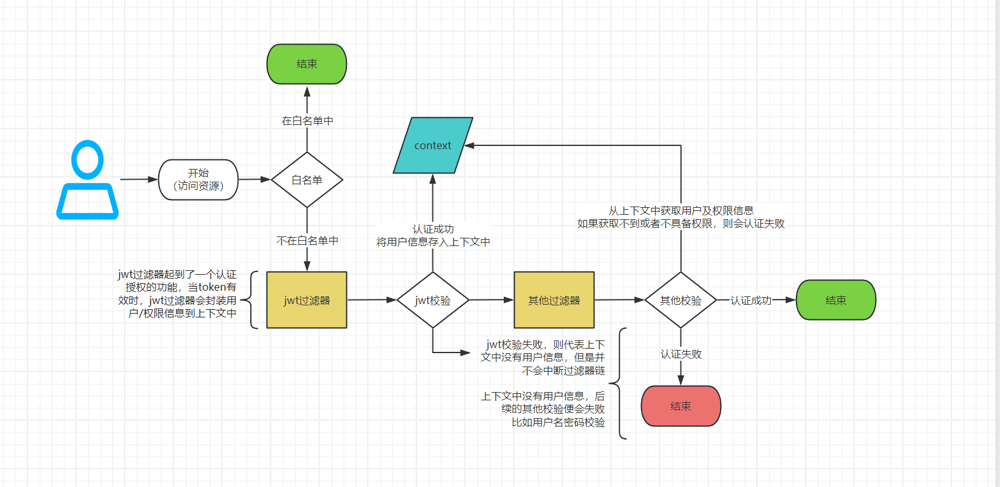
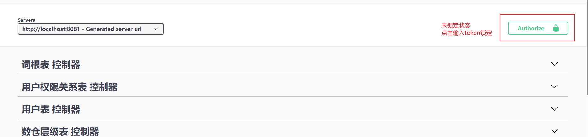
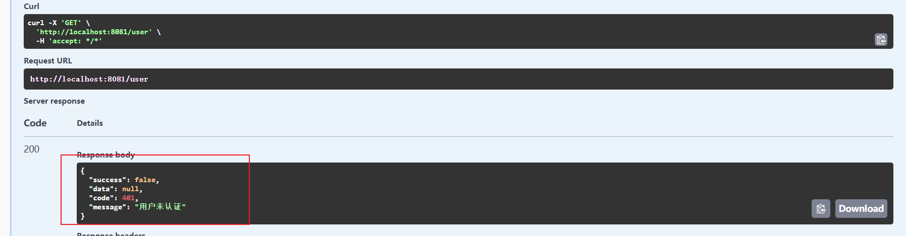
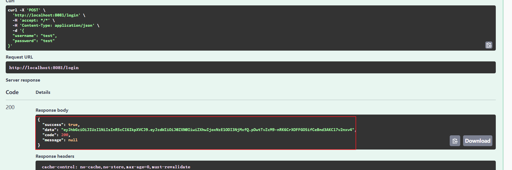
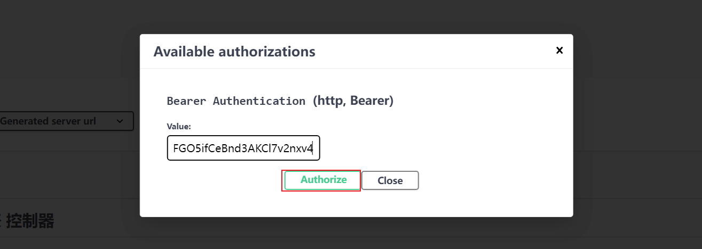
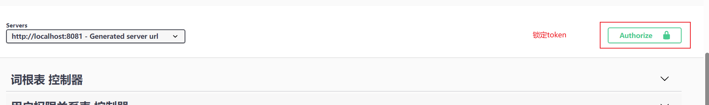
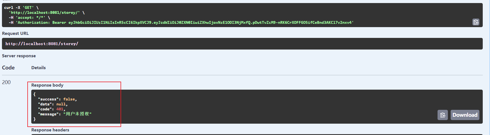

# SpringSecurity 实战

:lock: 文章主要介绍在 `SpringBoot` 项目中如何集成 `SpringSecurity`

以及在前后端分离的架构中，如何使用 `JWT` + `SpringSecurity` 进行身份验证和授权

<!-- more -->

## 项目地址

项目的创建基于前面的 springboot 项目，地址：[SpringBoot 项目构建](./SpringBoot项目构建.md#项目地址)

## 版本信息

| 依赖                         | 版本  |
| ---------------------------- | ----- |
| JDK                          | 17+   |
| MySQL                        | 8+    |
| Springboot                   | 3.2.0 |
| mybatis-plus                 | 3.5.6 |
| mybatis-plus-generator       | 3.5.6 |
| spring-boot-starter-security | 3.2.0 |
| java-jwt                     | 4.4.0 |

## 1、引入依赖

java-jwt 依赖 jackson，但是 spring-boot-starter-web 包含了 jackson，而且版本不一致

这里我们选择排除掉 java-jwt 的 jackson

```xml{11-16}
<!-- security -->
<dependency>
    <groupId>org.springframework.boot</groupId>
    <artifactId>spring-boot-starter-security</artifactId>
</dependency>
<!-- jwt -->
<dependency>
    <groupId>com.auth0</groupId>
    <artifactId>java-jwt</artifactId>
    <version>4.4.0</version>
    <exclusions>
        <exclusion>
            <groupId>com.fasterxml.jackson.core</groupId>
            <artifactId>jackson-databind</artifactId>
        </exclusion>
    </exclusions>
</dependency>
```

## 2、数据源准备

[文件太大了，这里引用一下项目中的 init.sql 文件](https://gitee.com/Zhouwen-CN/meta-tool/raw/master/meta-tool-app/src/main/resources/init.sql)

## 3、JWT 工具类

SECRET_KEY 是一串随机字符串，用于加密 JWT 令牌。EXPIRE 是 JWT 令牌的过期时间，单位为天。

```java
@Slf4j
public final class JwtTokenUtil {
    private static final String SECRET_KEY = "ApZmvgBrjutc69dCBzLKBXNi4xc%CVjAxCyAc2Q@nM^SgNQyJS2H^$dq5fsj&vu#KAR6^!*Msqs4nM#^zFhY@AXbLBnMR*uyBS4P@L3#bUhBUqUYfQDujSHj9ZXaWcK2";
    private static final int EXPIRE = 7;

    public static String generateToken(Authentication authentication) {
        String username = authentication.getName();

        Calendar instance = Calendar.getInstance();
        instance.add(Calendar.DATE, EXPIRE);

        return JWT.create()
                .withSubject(username)
                // 指定令牌过期时间
                .withExpiresAt(instance.getTime())
                // sign
                .sign(Algorithm.HMAC256(SECRET_KEY));
    }

    public static Optional<String> getSubject(String token) {
        try {
            DecodedJWT jwt = JWT.require(Algorithm.HMAC256(SECRET_KEY)).build().verify(token);

            return Optional.ofNullable(jwt.getSubject());
        } catch (Exception e) {
            // do nothing
        }
        return Optional.empty();
    }
}
```

## 4、 查询数据库获取用户信息

::: tip
Service 分 `UserDetailsService` 和 `UserService`

**UserDetailsService**

- UserDetailsService 是 Spring Security 的接口。主要是实现 loadUserByUsername 方法，查询数据库，返回 UserDetails 对象

**UserService**

- 主要是实现登入、获取用户信息

如果把两个 Service 功能合并在一起，可能会导致循环依赖

:::

### 4.1、Mapper 层

根据用户名称查询用户信息

```java title="UserMapper.java"
public interface UserMapper extends BaseMapper<User> {
    UserDto getUserByName(@Param("username") String username);
}
```

复杂 sql 查询，这里使用编写 xml 的方式

```xml title="UserMapper.xml"
<!-- UserDto -->
<resultMap id="UserDto" type="com.yeeiee.entity.dto.UserDto">
    <id column="id" property="id"/>
    <result column="username" property="username"/>
    <result column="password" property="password"/>
    <collection property="authorities" ofType="java.lang.String">
        <result column="authority"/>
    </collection>
</resultMap>

<select id="getUserByName" resultMap="UserDto">
    select a.*,
            c.authority
    from (select id,
                    username,
                    `password`
            from t_user
            where username = #{username}) a
                left join t_user_auth b
                        on a.id = b.user_id
                left join t_auth c
                        on b.auth_id = c.id
</select>
```

### 4.1、Service 层

#### UserDetailsServiceImpl

```java title="JwtUserDetailServiceImpl.java"
@Component
@AllArgsConstructor
public class JwtUserDetailServiceImpl implements UserDetailsService {

    private UserMapper userMapper;

    @Override
    public UserDetails loadUserByUsername(String username) throws UsernameNotFoundException {
        val securityUser = userMapper.getUserByName(username);
        if (securityUser == null) {
            throw new UsernameNotFoundException("cannot find username: " + username);
        }
        return User.builder()
                .username(securityUser.getUsername())
                .password(securityUser.getPassword())
                .authorities(securityUser.getAuthorities().toArray(new String[0]))
                .build();
    }
}
```

#### UserService

```java
public interface UserService extends IService<User> {
    String login(LoginDto loginDto);

    UserDto getUser();
}
```

::: tip
这里还没有对 UserService 做具体实现，因为登入功能需要依赖 `AuthenticationProvider `

而 `AuthenticationProvider` 在 SpringSecurity 配置类中，这里暂不做实现
:::

## 5、JWT 过滤器

对 token 进行验证，并从 token 中获取用户信息，然后设置到 SecurityContext 中，以便后续的请求可以获取到用户信息

```java
@Component
@AllArgsConstructor
@Slf4j
public class JwtAuthenticationFilter extends OncePerRequestFilter {

    private static final String HEADER_STRING = "Authorization";
    private static final String TOKEN_PREFIX = "Bearer ";

    private JwtUserDetailServiceImpl jwtUserDetailServiceImpl;

    @Override
    protected void doFilterInternal(HttpServletRequest request,
                                    HttpServletResponse response,
                                    FilterChain filterChain) throws ServletException, IOException {

        // 从 request 获取 JWT token
        val token = getTokenFromRequest(request);

        val optional = JwtTokenUtil.getSubject(token);
        // 校验 token
        if (optional.isPresent()) {
            // 从 token 获取 username
            val username = optional.get();
            // 加载与令 token 关联的用户
            val userDetails = jwtUserDetailServiceImpl.loadUserByUsername(username);
            // 将用户信息存入 authentication
            val authenticated = UsernamePasswordAuthenticationToken.authenticated(
                    userDetails,
                    null,
                    userDetails.getAuthorities());
            authenticated.setDetails(new WebAuthenticationDetailsSource().buildDetails(request));
            // 将 authentication 存入 ThreadLocal
            log.info("authenticated user {}, setting security context", username);
            SecurityContextHolder.getContext().setAuthentication(authenticated);
        }

        filterChain.doFilter(request, response);
    }

    private String getTokenFromRequest(HttpServletRequest request) {
        String bearerToken = request.getHeader(HEADER_STRING);
        if (StringUtils.hasText(bearerToken) && bearerToken.startsWith(TOKEN_PREFIX)) {
            return bearerToken.substring(7);
        }
        return null;
    }
}
```

## 6、SpringSecurity 配置类

::: info SpringSecurity 核心配置

- 白名单（比如静态资源，登入，swagger 等）
- 密码加密器
- AuthenticationProvider
- 认证/授权失败处理
- 路由权限配置（路由权限配置也可以使用注解的方式）

:::

::: details WebSecurityConfig.java

```java
@Configuration
@AllArgsConstructor
public class WebSecurityConfig {

    private JwtUserDetailServiceImpl jwtUserDetailServiceImpl;

    private JwtAuthenticationFilter jwtAuthFilter;

    private static final String[] WHITE_LIST = new String[]{
            "/",
            "/index.html",
            "/favicon.ico",
            "/assets/**.js",
            "/assets/**.css",
            "/assets/**.jpg",
            "/assets/**.png",
            "/login",
            "/swagger-ui.html",
            "/v3/api-docs/**",
            "/swagger-ui/**"
    };

    @Bean
    public SecurityFilterChain filterChain(HttpSecurity http) throws Exception {
        http
                .cors(AbstractHttpConfigurer::disable)
                .csrf(AbstractHttpConfigurer::disable)
                .formLogin(AbstractHttpConfigurer::disable)
                .sessionManagement(session -> session.sessionCreationPolicy(SessionCreationPolicy.STATELESS))
                .authorizeHttpRequests(authorize -> authorize.requestMatchers(WHITE_LIST)
                        // permitAll 表示不进行拦截
                        .permitAll()
                        // 访问某些资源需要某些权限，这是使用更为简单的ACL，而不是RBAC
                        .requestMatchers("/field/**").hasAuthority("field")
                        .requestMatchers("/range/**").hasAuthority("range")
                        .requestMatchers("/storey/**").hasAuthority("storey")
                        .requestMatchers("/word/**").hasAuthority("word")
                        // 对所有的请求开启权限保护
                        .anyRequest()
                        // 已认证的请求会被自动授权
                        .authenticated()
                )
                // 在账号密码认证之前，先进行jwt校验
                .addFilterBefore(jwtAuthFilter, UsernamePasswordAuthenticationFilter.class)
                .exceptionHandling(exception -> {
                            // 未认证处理
                            exception.authenticationEntryPoint((HttpServletRequest request,
                                                                HttpServletResponse response,
                                                                AuthenticationException authException
                                    ) -> writeResponse(response, R.error(HttpStatus.UNAUTHORIZED, "用户未认证"))
                                    // 未授权处理
                            ).accessDeniedHandler((HttpServletRequest request,
                                                   HttpServletResponse response,
                                                   AccessDeniedException accessDeniedException
                            ) -> writeResponse(response, R.error(HttpStatus.UNAUTHORIZED, "用户未授权")));
                        }
                );
        return http.build();
    }

    @Bean
    public AuthenticationProvider authenticationProvider() {
        DaoAuthenticationProvider provider = new DaoAuthenticationProvider(passwordEncoder());
        provider.setUserDetailsService(jwtUserDetailServiceImpl);
        return provider;
    }

    @Bean
    public BCryptPasswordEncoder passwordEncoder() {
        return new BCryptPasswordEncoder();
    }

    private <T> void writeResponse(HttpServletResponse response, R<T> result) throws IOException {
        val objectMapper = new ObjectMapper();
        val resultAsJson = objectMapper.writeValueAsString(result);
        response.setContentType("application/json;charset=UTF-8");
        response.getWriter().println(resultAsJson);
    }
}
```

:::

当有了 `AuthenticationProvider` 之后，咱们就可以编写 `UserServiceImpl` 了

```java title="UserServiceImpl.java"
@Service
@AllArgsConstructor
public class UserServiceImpl extends ServiceImpl<UserMapper, User> implements UserService {
    private AuthenticationProvider authenticationProvider;

    private UserMapper userMapper;

    @Override
    public String login(LoginDto loginDto) {
        val authenticate = authenticationProvider.authenticate(
                UsernamePasswordAuthenticationToken.unauthenticated(loginDto.getUsername(), loginDto.getPassword())
        );
        SecurityContextHolder.getContext().setAuthentication(authenticate);
        return JwtTokenUtil.generateToken(authenticate);
    }

    @Override
    public UserDto getUser() {
        UserDetails userDetails = (UserDetails) SecurityContextHolder.getContext().getAuthentication().getPrincipal();
        return userMapper.getUserByName(userDetails.getUsername());
    }
}
```

## 7、一些额外的配置

springdocs openapi 配置，在 swagger-ui.html 页面上添加 Bearer Authentication 认证方式

认证成功后，所有的请求头都会携带 token

```java title="OpenApiConfig.java"
@Configuration
public class OpenApiConfig {
    @Bean
    public OpenAPI openAPI() {
        return new OpenAPI()
                .addSecurityItem(new SecurityRequirement().addList("Bearer Authentication"))
                .components(new Components().addSecuritySchemes("Bearer Authentication", createAPIKeyScheme()))
                .info(new Info().title("Meta Tool")
                        .description("hive 元数据工具")
                        .version("1.0.0")
                        .license(new License().name("Apache 2.0"))
                );
    }

    private SecurityScheme createAPIKeyScheme() {
        return new SecurityScheme().type(SecurityScheme.Type.HTTP)
                .bearerFormat("JWT")
                .scheme("bearer");
    }
}
```

全局异常处理，用户名密码错误 SpringSecurity 会抛出这个异常

```java title="GlobalExceptionHandler.java"
@RestControllerAdvice
public class GlobalExceptionHandler {
    @ExceptionHandler(BadCredentialsException.class)
    public R<Void> badCredentialsHandler() {
        return R.error(HttpStatus.FORBIDDEN, "用户名或密码错误");
    }
}
```

## 8、简略的流程图



## 使用 swagger-ui 测试

未锁定 token



这个时候我们测试获取用户信息，可以看到返回用户未认证



这个时候我们测试使用 test 用户登入，返回了 token



复制 token 添加到 swagger-ui 认证中





这个时候我们在尝试获取用户信息，可以看到请求携带了 token，并成功返回了用户信息


上面可以看到用户信息中，只有 word 权限，这个时候我们去请求没有权限的接口。虽然携带了 token，但是权限不足，不能访问



完结，撒花！！！
