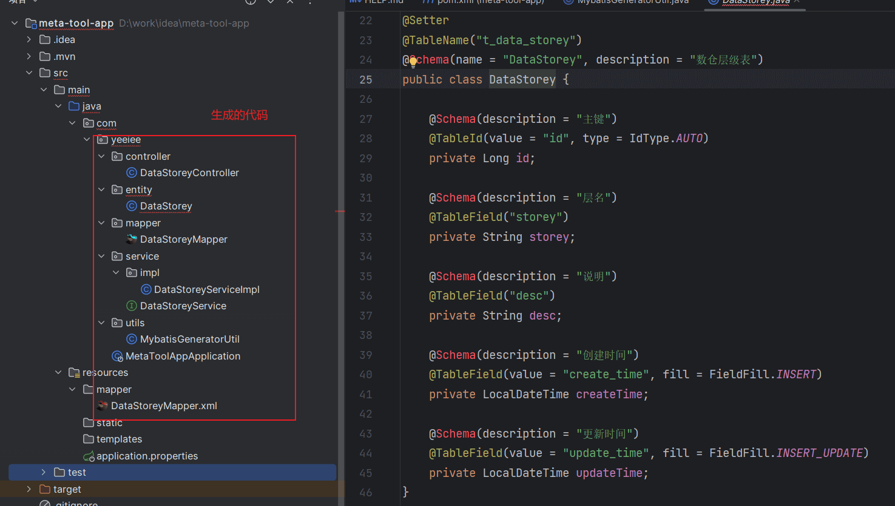

# SpringBoot 项目构建

:sunny: 文章主要介绍如何使用 `springboot` 进行快速开发

- 通过 mybatis-plus-generator，一键生成 mapper、service、controller
- 通过 BaseController 使每个生成的 Controller 都具备简单的增删改查功能

<!-- more -->

## 项目地址

[项目地址：gitee](https://gitee.com/Zhouwen-CN/meta-tool)

## 版本信息

| 依赖                   | 版本  |
| ---------------------- | ----- |
| JDK                    | 17+   |
| MySQL                  | 8+    |
| Springboot             | 3.2.0 |
| mybatis-plus           | 3.5.6 |
| mybatis-plus-generator | 3.5.6 |

## 1 创建 springboot 项目

使用 `springboot initializr` 快速创建项目


添加依赖，先选择这些，后面不够再添加


## 2 mybatis-plus

[官网地址](https://baomidou.com/)

::: tip 确定版本

1. 通过官网知道 mybatis-plus springboot3 的场景启动器名称为：mybatis-plus-spring-boot3-starter
2. 通过 mvnrepository 查询依赖发现最新版本为 3.5.6
3. 通过查看最新版本依赖发现 springboot 版本为 3.2.0

就可以确定了 springboot 和 mybatis-plus 的版本
:::


引入依赖

```xml
<!-- mybatis plus -->
<dependency>
    <groupId>com.baomidou</groupId>
    <artifactId>mybatis-plus-spring-boot3-starter</artifactId>
    <version>3.5.6</version>
</dependency>
<!-- mybatis plus 代码生成工具 -->
<dependency>
    <groupId>com.baomidou</groupId>
    <artifactId>mybatis-plus-generator</artifactId>
    <version>3.5.6</version>
    <scope>provided</scope>
</dependency>
<!-- mybatis plus 代码生成工具需要的模板引擎 -->
<dependency>
    <groupId>org.freemarker</groupId>
    <artifactId>freemarker</artifactId>
    <scope>provided</scope>
</dependency>
```

### 2.2 mysql 数据表准备

```sql
CREATE DATABASE IF NOT EXISTS `meta_tool`;
USE `meta_tool`;
DROP TABLE IF EXISTS `t_data_storey`;
CREATE TABLE `t_data_storey` (
  `id` bigint NOT NULL AUTO_INCREMENT COMMENT '主键',
  `storey` varchar(100) NOT NULL COMMENT '层名',
  `desc` varchar(255) DEFAULT NULL COMMENT '说明',
  `create_time` timestamp NOT NULL DEFAULT CURRENT_TIMESTAMP COMMENT '创建时间',
  `update_time` timestamp NOT NULL DEFAULT CURRENT_TIMESTAMP COMMENT '更新时间',
  PRIMARY KEY (`id`),
  UNIQUE KEY `uniq_storey` (`storey`)
) ENGINE=InnoDB AUTO_INCREMENT=9 DEFAULT CHARSET=utf8mb3 COMMENT='数仓层级表';

INSERT INTO `t_data_storey`(`id`,`storey`,`desc`) VALUES (1,'ods','原始数据层'),(2,'dwd','数据明细层'),(3,'dwm','数据中间层'),(4,'dws','数据服务层'),(5,'ads','数据应用层'),(6,'dim','维度层'),(7,'mid','中间表-可以删除'),(8,'tmp','临时表-可以删除');
```

### 2.3 创建代码生成工具类

::: details MybatisGeneratorUtil.java

```java
public class MybatisGeneratorUtil {

    public static void generator(String... tableName) {
        val url = "jdbc:mysql://localhost:3306/meta_tool";
        val username = "root";
        val password = "123";
        val projectPath = System.getProperty("user.dir");

        FastAutoGenerator.create(url, username, password)
                .globalConfig(builder -> builder.author("chen")
                        .enableSpringdoc()
                        .outputDir(projectPath + "/src/main/java")
                )
                .dataSourceConfig(builder -> builder.typeConvertHandler((globalConfig, typeRegistry, metaInfo) -> {
                    int typeCode = metaInfo.getJdbcType().TYPE_CODE;
                    if (typeCode == Types.SMALLINT) {
                        // 自定义类型转换
                        return DbColumnType.INTEGER;
                    }
                    return typeRegistry.getColumnType(metaInfo);
                }))
                .packageConfig(builder -> {
                    builder.parent("com.yeeiee") // 设置父包名
                            .entity("entity")
                            .controller("controller")
                            .mapper("mapper")
                            .service("service")
                            .serviceImpl("service.impl")
                            .pathInfo(Collections.singletonMap(OutputFile.xml, projectPath + "/src/main/resources/mapper")); // 设置mapperXml生成路径
                })
                .strategyConfig(builder -> {
                    builder.addInclude(tableName) // 设置需要生成的表名
                            .addTablePrefix("t_"); // 设置过滤表前缀

                    builder.entityBuilder()
                            .idType(IdType.AUTO)
                            .enableRemoveIsPrefix()
                            .enableTableFieldAnnotation()
                            .enableLombok()
                            .disableSerialVersionUID()
                            .addTableFills(
                                    new Column("create_time", FieldFill.INSERT),
                                    new Column("update_time", FieldFill.INSERT_UPDATE)
                            )
                            .enableFileOverride();

                    builder.controllerBuilder()
                            .enableRestStyle()
                            .enableFileOverride();

                    builder.serviceBuilder()
                            .formatServiceFileName("%sService")
                            .enableFileOverride();

                    builder.mapperBuilder()
                            .enableBaseResultMap()
                            .enableBaseColumnList()
                            .enableFileOverride();

                })
                // 使用Freemarker引擎模板，默认的是Velocity引擎模板
                .templateEngine(new FreemarkerTemplateEngine())
                .execute();
    }

    public static void main(String[] args) {
        generator("t_data_storey");
    }
}
```

:::

运行发现报错了


这是运行的时候没有包含 provided，通过设置运行包含 provided 依赖解决问题


查看生成后的实体类发现有问题，这是因为没有引入 swagger



### 2.4 引入 springdoc-openapi

引入依赖

```xml
<!-- springdoc openapi -->
<dependency>
    <groupId>org.springdoc</groupId>
    <artifactId>springdoc-openapi-starter-webmvc-ui</artifactId>
    <version>2.3.0</version>
</dependency>
```

springdoc 配置类

```java
@Configuration
@OpenAPIDefinition(info = @Info(
        title = "meta tool",
        description = "hive 元数据工具",
        version = "1.0.0",
        license = @License(
                name = "Apache 2.0"
        )
))
public class OpenApiConfig {
}
```

引入依赖后恢复正常，但是尝试启动项目发现报错


这是因为没有指定 mapper scan 的位置，在启动类上加上就好了

```java{2}
@SpringBootApplication
@MapperScan("com.yeeiee.mapper")
public class MetaToolAppApplication {

    public static void main(String[] args) {
        SpringApplication.run(MetaToolAppApplication.class, args);
    }

}
```

再次启动又报错了，这是因为忘记了配置数据源（有点水文的嫌疑了）


### 2.5 配置数据源

```properties
spring.datasource.driver-class-name=com.mysql.cj.jdbc.Driver
spring.datasource.url=jdbc:mysql://localhost:3306/meta_tool
spring.datasource.username=root
spring.datasource.password=123

mybatis-plus.configuration.log-impl=org.apache.ibatis.logging.stdout.StdOutImpl
```

## 3 创建公共的 controller

### 3.1 编写统一响应对象

::: details R.java

```java
@NoArgsConstructor
@AllArgsConstructor
@Getter
@Setter
@Schema(title = "R", description = "统一响应对象")
public class R<T> {
    @Schema(title = "是否成功")
    private boolean success;
    @Nullable
    @Schema(title = "数据")
    private T data;
    @Nullable
    @Schema(title = "状态码")
    private int code;
    @Nullable
    @Schema(title = "消息")
    private String message;

    public static <T> R<T> ok() {
        return new R<>(true, null, 200, null);
    }

    public static <T> R<T> ok(T data) {
        return new R<>(true, data, 200, null);
    }

    public static <T> R<T> error(HttpStatus httpStatus) {
        return new R<>(false, null, httpStatus.value(), httpStatus.getReasonPhrase());
    }

    public static <T> R<T> error(int code, Exception e) {
        return new R<>(false, null, code, e.getMessage());
    }

    public static <T> R<T> error(HttpStatus httpStatus, Exception e) {
        return new R<>(false, null, httpStatus.value(), e.getMessage());
    }
}
```

:::

### 3.2 编写 dml 操作异常类

insert、update、delete 操作时，影响条数可能是 0，这个时候可以抛出 dml 操作异常

@StandardException 是 lombok 的注解，可以快速的编写一个异常类

```java
@StandardException
public class DmlOperationException extends RuntimeException {
}
```

### 3.3 编写全局处理异常类

```java
@RestControllerAdvice
public class GlobalExceptionHandler {

    @ExceptionHandler(DmlOperationException.class)
    public R<Void> dmlFailureHandler(DmlOperationException e) {
        return R.error(HttpStatus.NOT_MODIFIED, e);
    }

    @ExceptionHandler(Exception.class)
    public R<Void> defaultHandler(Exception e) {
        return R.error(HttpStatus.INTERNAL_SERVER_ERROR, e);
    }
}
```

### 3.4 编写 base controller

:::details BaseController.java

```java
public abstract class BaseController<T> {
    protected IService<T> service;

    public BaseController(IService<T> service) {
        this.service = service;
    }

    @Operation(summary = "分页查询")
    @GetMapping("/{size}/{current}")
    public R<Page<T>> page(@PathVariable("size") @Parameter(description = "页面大小") Integer size,
                           @PathVariable("current") @Parameter(description = "当前页面") Integer current) {
        val page = service.page(new Page<>(current, size), new QueryWrapper<>());
        return R.ok(page);
    }

    @Operation(summary = "查询所有")
    @GetMapping("/")
    public R<List<T>> getList() {
        val list = service.list();
        return R.ok(list);
    }

    @Operation(summary = "按照id查询")
    @GetMapping("/{id}")
    public R<T> getById(@PathVariable("id") Long id) {
        val one = service.getById(id);
        return R.ok(one);
    }

    @Operation(summary = "按照id删除")
    @DeleteMapping("/{id}")
    public R<T> removeById(@PathVariable("id") Long id) {
        val status = service.removeById(id);
        if (!status) {
            throw new DmlOperationException("删除失败【id】：" + id);
        }
        return R.ok();
    }

    @Operation(summary = "新增")
    @PostMapping("/")
    public R<T> save(@RequestBody T entity) {
        val status = service.save(entity);
        if (!status) {
            throw new DmlOperationException("新增失败【entity】：" + entity);
        }
        return R.ok();
    }

    @Operation(summary = "更新")
    @PutMapping("/")
    public R<T> update(@RequestBody T entity) {
        val status = service.updateById(entity);
        if (!status) {
            throw new DmlOperationException("更新失败【entity】：" + entity);
        }
        return R.ok();
    }

    @Operation(summary = "新增或者更新")
    @PostMapping("/save")
    public R<T> saveOrUpdate(@RequestBody T entity) {
        val status = service.saveOrUpdate(entity);
        if (!status) {
            throw new DmlOperationException("upsert失败【entity】：" + entity);
        }
        return R.ok();
    }
}
```

:::

:::warning 注意
这个时候，我们想让生成的代码都继承这个 base controller

就需要修改代码生成的模板，这边已经改好了，直接使用即可
:::

## 4 修改代码生成模板

将模板文件放在 templates 文件夹下面

:::: details 代码生成模板文件

::: tabs

@tab controller.java.ftl

```freemarker
package ${package.Controller};

import com.baomidou.mybatisplus.extension.service.IService;
import ${package.Entity}.${entity};
import io.swagger.v3.oas.annotations.tags.Tag;
import org.springframework.web.bind.annotation.RequestMapping;
<#if restControllerStyle>
    import org.springframework.web.bind.annotation.RestController;
<#else>
    import org.springframework.stereotype.Controller;
</#if>
<#if superControllerClassPackage??>
    import ${superControllerClassPackage};
</#if>

/**
* <p>
    * ${table.comment!}
    * </p>
*
* @author ${author}
* @since ${date}
*/
<#if restControllerStyle>
    @RestController
<#else>
    @Controller
</#if>
@RequestMapping("<#if package.ModuleName?? && package.ModuleName != "">/${package.ModuleName}</#if>/<#if controllerMappingHyphenStyle>${controllerMappingHyphen}<#else>${table.entityPath}</#if>")
@Tag(name = "${table.comment!} 控制器")
<#if kotlin>
    class ${table.controllerName}<#if superControllerClass??> : ${superControllerClass}()</#if>
<#else>
    <#if superControllerClass??>
        public class ${table.controllerName} extends ${superControllerClass}<${entity}> {

        public ${table.controllerName}(IService<${entity}> service) {
        super(service);
        }
    <#else>
        public class ${table.controllerName} {
    </#if>
    }
</#if>
```

@tab entity.java.ftl

```freemarker
package ${package.Entity};

<#list table.importPackages as pkg>
    import ${pkg};
</#list>
<#if springdoc>
    import io.swagger.v3.oas.annotations.media.Schema;
<#elseif swagger>
    import io.swagger.annotations.ApiModel;
    import io.swagger.annotations.ApiModelProperty;
</#if>
<#if entityLombokModel>
    import lombok.Getter;
    import lombok.Setter;
    import lombok.ToString;
    <#if chainModel>
        import lombok.experimental.Accessors;
    </#if>
</#if>

/**
* <p>
    * ${table.comment!}
    * </p>
*
* @author ${author}
* @since ${date}
*/
<#if entityLombokModel>
    @Getter
    @Setter
    @ToString
    <#if chainModel>
        @Accessors(chain = true)
    </#if>
</#if>
<#if table.convert>
    @TableName("`${schemaName}${table.name}`")
</#if>
<#if springdoc>
    @Schema(name = "${entity}", description = "${table.comment!}")
<#elseif swagger>
    @ApiModel(value = "${entity}对象", description = "${table.comment!}")
</#if>
<#if superEntityClass??>
    public class ${entity} extends ${superEntityClass}<#if activeRecord><${entity}></#if> {
<#elseif activeRecord>
    public class ${entity} extends Model<${entity}> {
<#elseif entitySerialVersionUID>
    public class ${entity} implements Serializable {
<#else>
    public class ${entity} {
</#if>
<#if entitySerialVersionUID>
    private static final long serialVersionUID = 1L;
</#if>
<#-- ----------  BEGIN 字段循环遍历  ---------->
<#list table.fields as field>
    <#if field.keyFlag>
        <#assign keyPropertyName="${field.propertyName}"/>
    </#if>

    <#if field.comment!?length gt 0>
        <#if springdoc>
            @Schema(description = "${field.comment}")
        <#elseif swagger>
            @ApiModelProperty("${field.comment}")
        <#else>
            /**
            * ${field.comment}
            */
        </#if>
    </#if>
    <#if field.keyFlag>
    <#-- 主键 -->
        <#if field.keyIdentityFlag>
            @TableId(value = "`${field.annotationColumnName}`", type = IdType.AUTO)
        <#elseif idType??>
            @TableId(value = "`${field.annotationColumnName}`", type = IdType.${idType})
        <#elseif field.convert>
            @TableId("`${field.annotationColumnName}`")
        </#if>
    <#-- 普通字段 -->
    <#elseif field.fill??>
    <#-- -----   存在字段填充设置   ----->
        <#if field.convert>
            @TableField(value = "`${field.annotationColumnName}`", fill = FieldFill.${field.fill})
        <#else>
            @TableField(fill = FieldFill.${field.fill})
        </#if>
    <#elseif field.convert>
        @TableField("`${field.annotationColumnName}`")
    </#if>
<#-- 乐观锁注解 -->
    <#if field.versionField>
        @Version
    </#if>
<#-- 逻辑删除注解 -->
    <#if field.logicDeleteField>
        @TableLogic
    </#if>
    private ${field.propertyType} ${field.propertyName};
</#list>
<#------------  END 字段循环遍历  ---------->
<#if !entityLombokModel>
    <#list table.fields as field>
        <#if field.propertyType == "boolean">
            <#assign getprefix="is"/>
        <#else>
            <#assign getprefix="get"/>
        </#if>

        public ${field.propertyType} ${getprefix}${field.capitalName}() {
        return ${field.propertyName};
        }

        <#if chainModel>
            public ${entity} set${field.capitalName}(${field.propertyType} ${field.propertyName}) {
        <#else>
            public void set${field.capitalName}(${field.propertyType} ${field.propertyName}) {
        </#if>
        this.${field.propertyName} = ${field.propertyName};
        <#if chainModel>
            return this;
        </#if>
        }
    </#list>
</#if>
<#if entityColumnConstant>
    <#list table.fields as field>

        public static final String ${field.name?upper_case} = "${field.name}";
    </#list>
</#if>
<#if activeRecord>

    @Override
    public Serializable pkVal() {
    <#if keyPropertyName??>
        return this.${keyPropertyName};
    <#else>
        return null;
    </#if>
    }
</#if>
<#if !entityLombokModel>

    @Override
    public String toString() {
    return "${entity}{" +
    <#list table.fields as field>
        <#if field_index==0>
            "${field.propertyName} = " + ${field.propertyName} +
        <#else>
            ", ${field.propertyName} = " + ${field.propertyName} +
        </#if>
    </#list>
    "}";
    }
</#if>
}
```

:::

::::


修改代码生成工具类

:::details MybatisGeneratorUtil.java

```java
public class MybatisGeneratorUtil {

    public static void generator(String... tableName) {
        val url = "jdbc:mysql://localhost:3306/meta_tool";
        val username = "root";
        val password = "123";
        val projectPath = System.getProperty("user.dir");

        FastAutoGenerator.create(url, username, password)
                .globalConfig(builder -> builder.author("chen")
                        .enableSpringdoc()
                        .outputDir(projectPath + "/src/main/java")
                )
                .dataSourceConfig(builder -> builder.typeConvertHandler((globalConfig, typeRegistry, metaInfo) -> {
                    int typeCode = metaInfo.getJdbcType().TYPE_CODE;
                    if (typeCode == Types.SMALLINT) {
                        // 自定义类型转换
                        return DbColumnType.INTEGER;
                    }
                    return typeRegistry.getColumnType(metaInfo);
                }))
                .packageConfig(builder -> {
                    builder.parent("com.yeeiee") // 设置父包名
                            .entity("entity")
                            .controller("controller")
                            .mapper("mapper")
                            .service("service")
                            .serviceImpl("service.impl")
                            .pathInfo(Collections.singletonMap(OutputFile.xml, projectPath + "/src/main/resources/mapper")); // 设置mapperXml生成路径
                })
                .strategyConfig(builder -> {
                    builder.addInclude(tableName) // 设置需要生成的表名
                            .addTablePrefix("t_"); // 设置过滤表前缀

                    builder.entityBuilder()
                            .javaTemplate("/templates/entity.java")
                            .idType(IdType.AUTO)
                            .enableRemoveIsPrefix()
                            .enableTableFieldAnnotation()
                            .enableLombok()
                            .disableSerialVersionUID()
                            .addTableFills(
                                    new Column("create_time", FieldFill.INSERT),
                                    new Column("update_time",FieldFill.INSERT_UPDATE)
                            )
                            .enableFileOverride();

                    builder.controllerBuilder()
                            .template("/templates/controller.java")
                            .superClass(BaseController.class)
                            .enableRestStyle()
                            .enableFileOverride();

                    builder.serviceBuilder()
                            .formatServiceFileName("%sService")
                            .enableFileOverride();

                    builder.mapperBuilder()
                            .enableBaseResultMap()
                            .enableBaseColumnList()
                            .enableFileOverride();

                })
                // 使用Freemarker引擎模板，默认的是Velocity引擎模板
                .templateEngine(new FreemarkerTemplateEngine())
                .execute();
    }

    public static void main(String[] args) {
        generator("t_data_storey");
    }
}
```

:::

重新生成代码，是否重写可以在代码生成工具类里面修改


::: important
可以看到通过修改模板文件的方式基本实现了需求

现在我们只要生成代码，不管生成多少个 controller，使其都具备基本的增删改查能力
:::

## 5 mybatis-plus 分页插件和字段填充

字段填充：当执行插入或者更新操作时，会根据规则填充字段

常用作 `create_time`、`update_time`

::: details MybatisPlusConfig.java

```java
@Configuration
public class MybatisPlusConfig implements MetaObjectHandler {

    /**
     * 添加分页插件
     */
    @Bean
    public MybatisPlusInterceptor mybatisPlusInterceptor() {
        MybatisPlusInterceptor interceptor = new MybatisPlusInterceptor();
        interceptor.addInnerInterceptor(new PaginationInnerInterceptor(DbType.MYSQL));
        //如果配置多个插件,切记分页最后添加
        //interceptor.addInnerInterceptor(new PaginationInnerInterceptor()); 如果有多数据源可以不配具体类型 否则都建议配上具体的DbType
        return interceptor;
    }

    /**
     * 插入时 字段填充
     */
    @Override
    public void insertFill(MetaObject metaObject) {
        this.strictInsertFill(metaObject, "createTime", LocalDateTime::now, LocalDateTime.class); // 起始版本 3.3.3(推荐)
        this.strictInsertFill(metaObject, "updateTime", LocalDateTime::now, LocalDateTime.class); // 起始版本 3.3.3(推荐)
    }

    /**
     * 更新时 字段填充
     */
    @Override
    public void updateFill(MetaObject metaObject) {
        this.strictUpdateFill(metaObject, "updateTime", LocalDateTime::now, LocalDateTime.class); // 起始版本 3.3.3(推荐)
    }
}
```

:::

::: tip 提示
当然，mybatis-plus 还提供了一些好玩的开箱即用的功能

比如：逻辑删除，乐观锁等等，这里就不一一展开了
:::

## 6 使用 aspectj 控制事务

通常使用注解的方式控制事务，但是当业务复杂时，注解的方式会变得繁琐

这里使用 `aspectj` ，只要是 com.yeeiee.service.impl 包下符合命名规则的方法，都纳入事务控制

添加依赖

```xml
<!-- spring aspectj -->
<dependency>
    <groupId>org.springframework</groupId>
    <artifactId>spring-aspects</artifactId>
</dependency>
```

编写切面类

::: details TransactionAdviceConfig.java

```java
@Aspect
@Component
public class TransactionAdviceConfig {
    private static final String AOP_POINTCUT_EXPRESSION = "execution (* com.yeeiee.service.impl.*.*(..))";

    @Bean
    public TransactionInterceptor transactionInterceptor(TransactionManager transactionManager) {
        DefaultTransactionAttribute txAttrRequired = new DefaultTransactionAttribute();
        txAttrRequired.setPropagationBehavior(TransactionDefinition.PROPAGATION_REQUIRED);

        DefaultTransactionAttribute txAttrRequiredReadonly = new DefaultTransactionAttribute();
        txAttrRequiredReadonly.setPropagationBehavior(TransactionDefinition.PROPAGATION_REQUIRED);
        txAttrRequiredReadonly.setReadOnly(true);

        NameMatchTransactionAttributeSource transactionAttributeSource = new NameMatchTransactionAttributeSource();

        // read
        transactionAttributeSource.addTransactionalMethod("query*", txAttrRequiredReadonly);
        transactionAttributeSource.addTransactionalMethod("get*", txAttrRequiredReadonly);
        transactionAttributeSource.addTransactionalMethod("select*", txAttrRequiredReadonly);
        transactionAttributeSource.addTransactionalMethod("find*", txAttrRequiredReadonly);

        // write
        transactionAttributeSource.addTransactionalMethod("save*", txAttrRequired);
        transactionAttributeSource.addTransactionalMethod("insert*", txAttrRequired);
        transactionAttributeSource.addTransactionalMethod("add*", txAttrRequired);
        transactionAttributeSource.addTransactionalMethod("create*", txAttrRequired);
        transactionAttributeSource.addTransactionalMethod("delete*", txAttrRequired);
        transactionAttributeSource.addTransactionalMethod("update*", txAttrRequired);
        transactionAttributeSource.addTransactionalMethod("remove*", txAttrRequired);
        transactionAttributeSource.addTransactionalMethod("modify*", txAttrRequired);

        return new TransactionInterceptor(transactionManager, transactionAttributeSource);
    }

    @Bean
    public Advisor transactionAdviceAdvisor(TransactionInterceptor transactionInterceptor) {
        AspectJExpressionPointcut pointcut = new AspectJExpressionPointcut();
        // 定义切面
        pointcut.setExpression(AOP_POINTCUT_EXPRESSION);
        return new DefaultPointcutAdvisor(pointcut, transactionInterceptor);
    }
}
```

:::

还需要在启动类上面添加

```java
@EnableTransactionManagement(mode = AdviceMode.ASPECTJ)
@SpringBootApplication
@MapperScan("com.yeeiee.mapper")
public class MetaToolAppApplication {

    public static void main(String[] args) {
        SpringApplication.run(MetaToolAppApplication.class, args);
    }

}
```

## 7 最佳实战

一件生成多张表的增删改查


查看 swagger ui


可以看到每个 controller 都具备了基础的增删改查能力
