# Centos7 安装

:sparkles: 使用 `VMware` 安装 `centos` 虚拟机

<!-- more -->

## 准备资源

- VMware
- centos7 镜像
- jdk1.8

## 创建虚拟机

::: tip
没有截图选择默认
:::

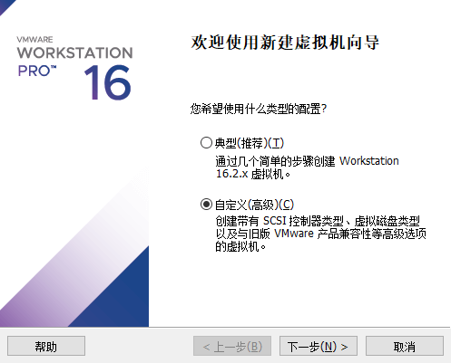

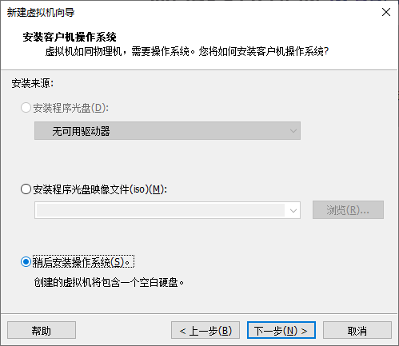

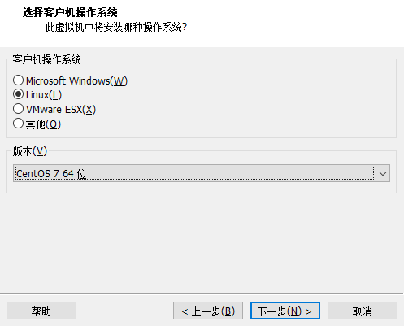

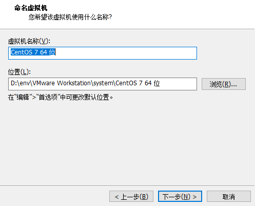

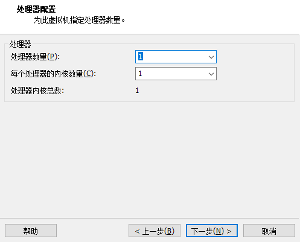

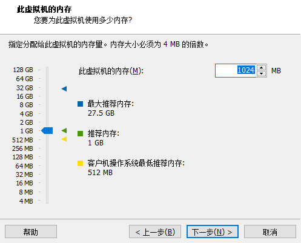

::: info
**host-only 模式**（adapter = VMnet1）：虚拟机和主机之间可以相互访问，虚拟机不能访问外网

**NET 模式**（adapter = VMnet8）：虚拟机和主机之间可以相互访问，虚拟机可以访问外网，外网不能访问虚拟机

**桥接模式**（adapter = VMnet0）：虚拟机就相当于一台实体机，可以自由访问和被访问以及上网
:::

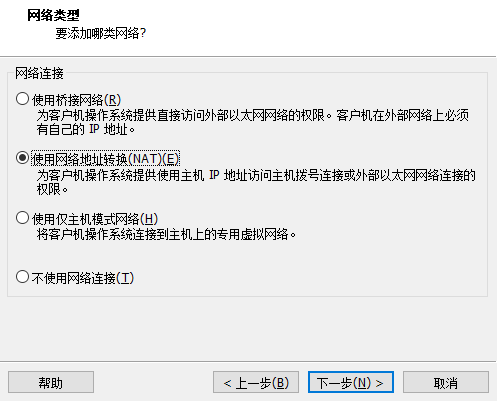

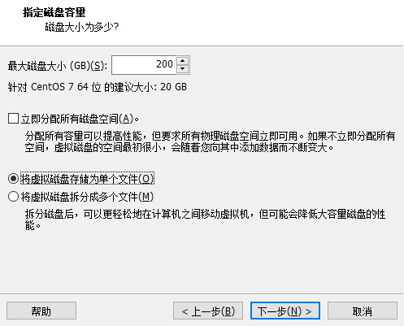

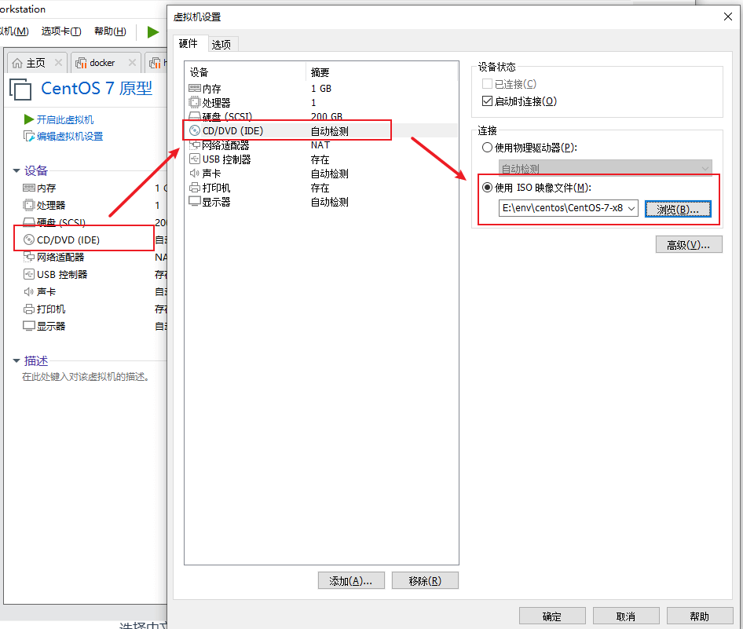

完了开启虚拟机，安装系统，不需要 test，选第一个

## 1 linux 系统安装

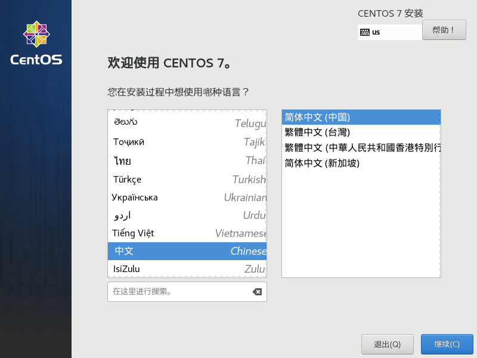

### 1.1 日期和时间

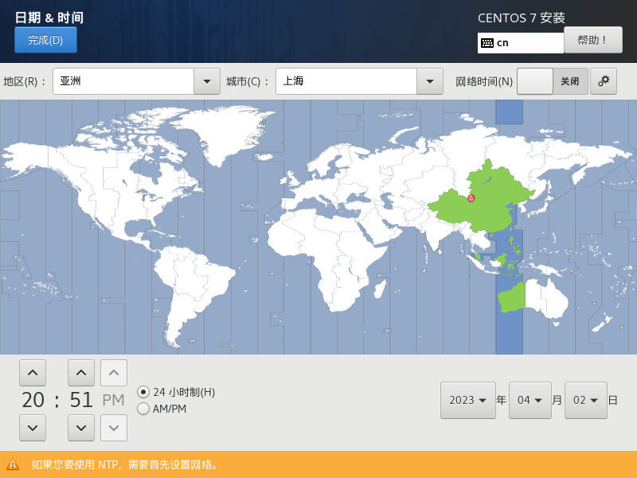

### 1.2 磁盘分区

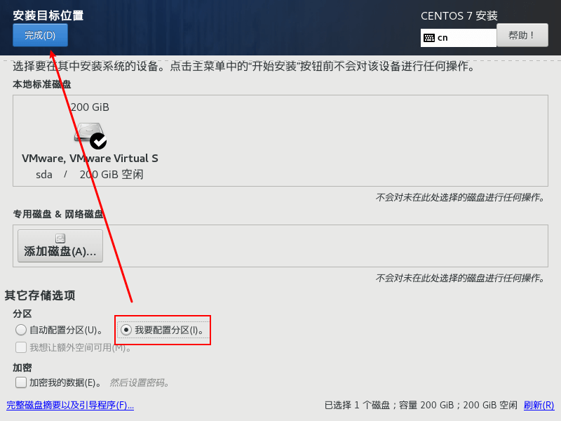

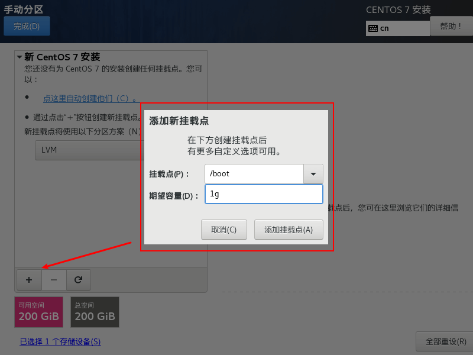

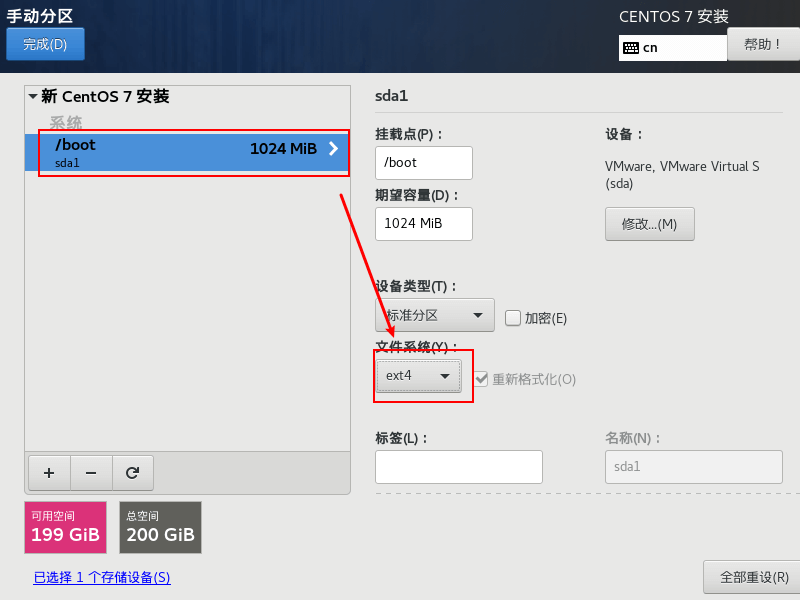

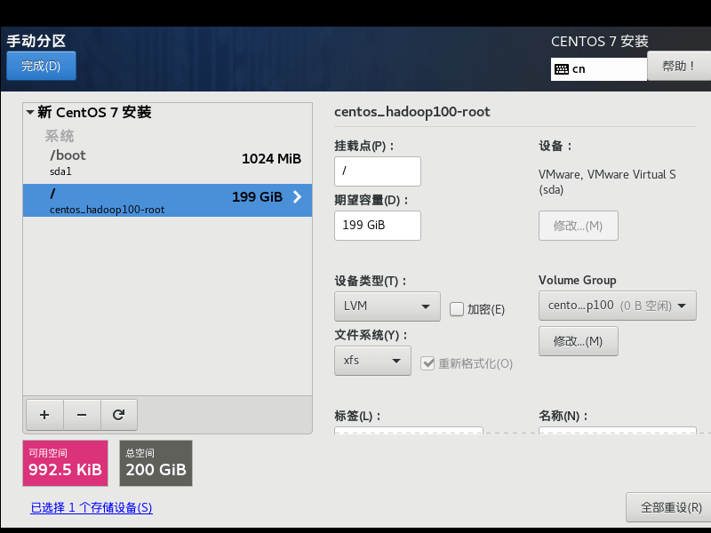

### 1.3 KDUMP

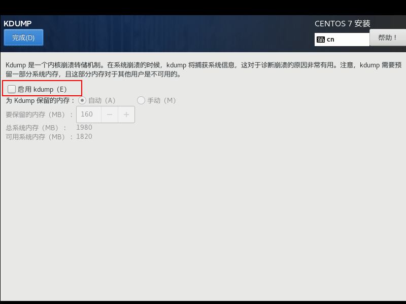

### 1.4 网络和主机名称

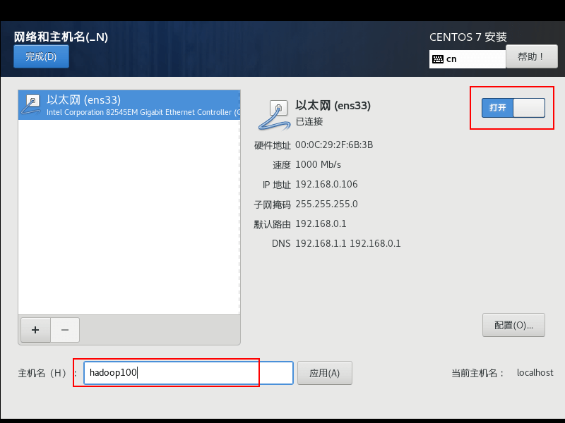

==点击开始安装==

### 1.5 ROOT 密码

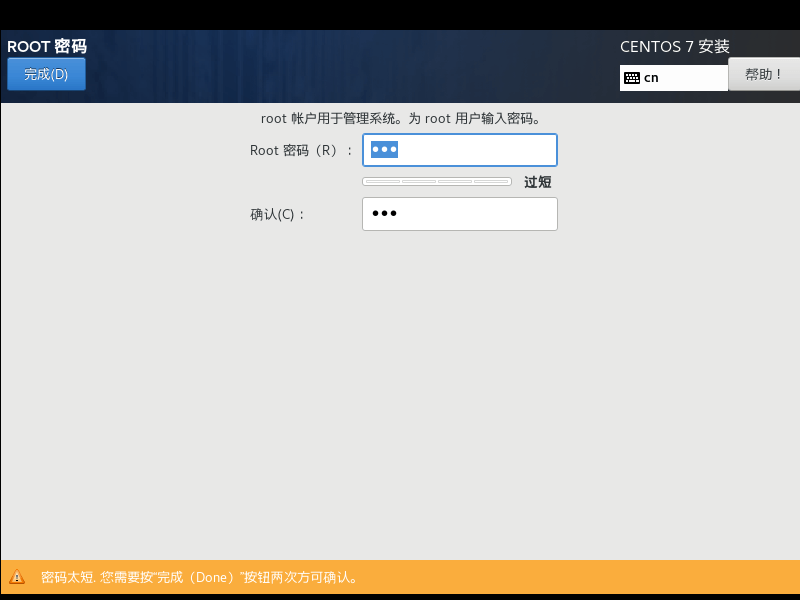

## 2 linux 初始化

### 2.1 ip 地址修改

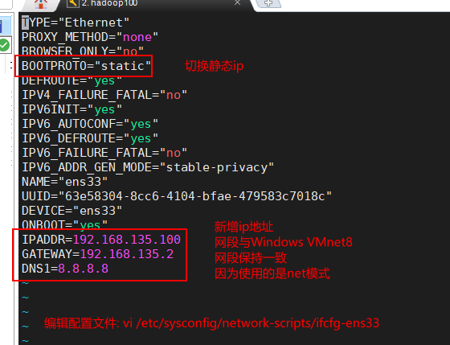

### 2.2 使用 ssh 工具连接虚拟机

略

### 2.2 一些准备工作

```shell
#关闭并禁用NetworkManager，图形化用的网络管理，我没有图形化
systemctl stop NetworkManager
systemctl disable NetworkManager

#关闭并禁用防火墙
systemctl stop firewalld
systemctl disable firewalld

#关闭并禁用selinux
sed -i 's/enforcing/disabled/' /etc/selinux/config  #永久
setenforce 0  #临时

#关闭并禁用swap
sed -ri 's/.*swap.*/#&/' /etc/fstab  #永久
swapoff -a  #临时

#设置时区，图形化的时候已经设置了，这里只是把它记录下载
ll /etc/localtime  #查看当前时区
timedatectl list-timezones | grep Shanghai  #查找中国时区的完整名称
timedatectl set-timezone Asia/Shanghai  #其他时区以此类推

#设置hostname，图形化的时候已经设置了，这里只是把它记录下载
hostname  #查看当前hostname
hostnamectl set-hostname hadoop100  #设置hostname，不用重启

#添加yum 阿里镜像源
curl -o /etc/yum.repos.d/CentOS-Base.repo https://mirrors.aliyun.com/repo/Centos-7.repo
#重新构建yum缓存
yum clean all  #清除缓存
yum update -y  #升级软件包，需要一会
yum makecache  #构建缓存
#安装vim
yum install -y vim
#查看是否安装java和mariadb，命令可以分段执行，不然会直接卸载
rpm -qa | grep -i -E mysql\|mariadb | xargs -n1 rpm -e --nodeps
rpm -qa | grep -i java | xargs -n1 rpm -e --nodeps

#创建文件夹赋予权限，用来安装软件
mkdir /opt/module
mkdir /opt/software
chown -R atguigu:atguigu /opt/

#添加用户
useradd atguigu
echo 123 | passwd --stdin atguigu
#添加sudo权限(sudo就是使用root身份执行命令)，如图
vim /etc/sudoers
```

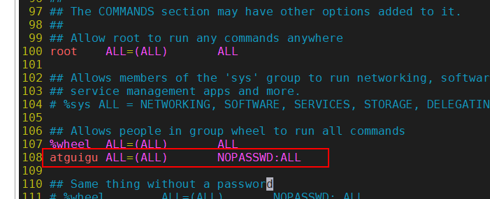

### 2.3 安装 jdk

```shell
#上传安装包
#解压
tar -zxvf jdk-8u361-linux-x64.tar.gz -C /opt/module/

#改短名字
cd /opt/module/
mv jdk1.8.0_361 jdk-1.8.0

#设置环境变量
sudo vim /etc/profile.d/my_env.sh
#添加以下内容
export JAVA_HOME=/opt/module/jdk-1.8.0
export PATH=$JAVA_HOME/bin:$PATH
export CLASSPATH=.:$JAVA_HOME/lib/dt.jar:$JAVA_HOME/lib/tools.jar
#刷新环境变量
source /etc/profile
#查看java版本，出现版本号就说明对了
java -version
```

## 3 拍摄快照

将当前虚拟机作为原型机，需要用的时候克隆修改 ip 即可

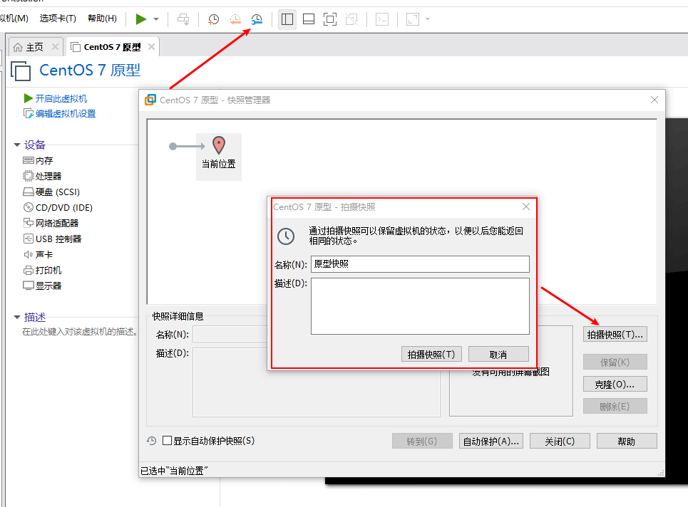

## 4 克隆虚拟机

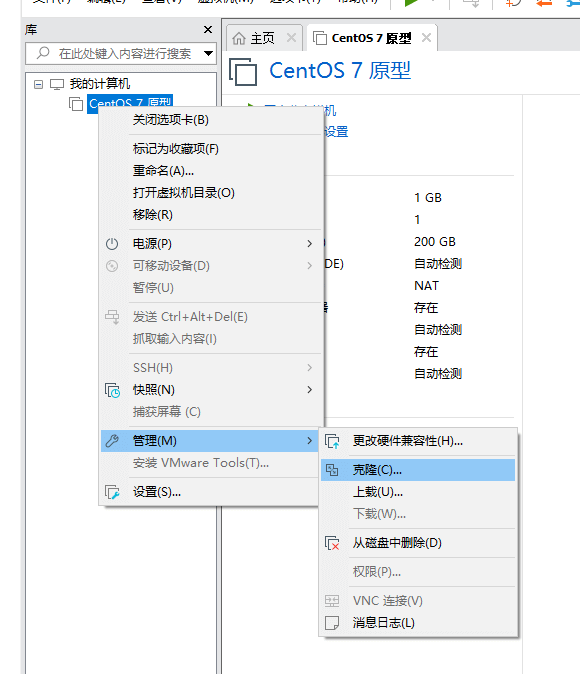

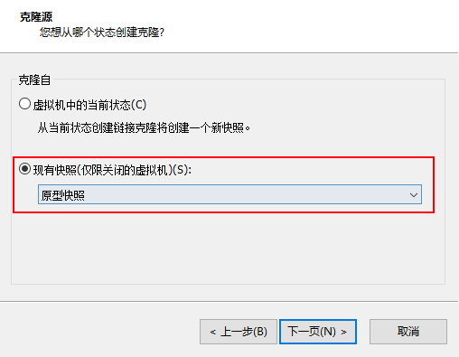

::: info
完整克隆会占用更多的硬盘，原型快照损坏不影响

链接克隆，原型快照损坏将导致无法打开
:::

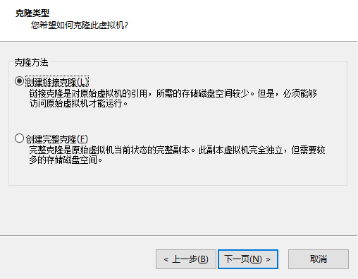
