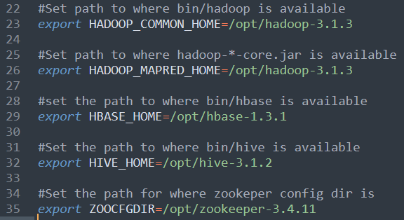
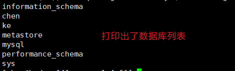
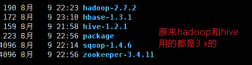

# Sqoop

:horse: `Sqoop` 是一款开源的工具，主要用于在 Hadoop(Hive)与传统的数据库(mysql、postgresql...) 间进行数据的传递，可以将一个关系型数据库（例如 ： MySQL ,Oracle ,Postgres 等）中的 数据导进到 Hadoop 的 HDFS 中，也可以将 HDFS 的数据导进到关系型数据库中。

<!-- more -->

Sqoop 项目开始于 2009 年，最早是作为 Hadoop 的一个第三方模块存在，后来为了让使 用者能够快速部署，也为了让开发人员能够更快速的迭代开发，Sqoop 独立成为一个 Apache 项目。

Sqoop2 的最新版本是 1.99.7。请注意，2 与 1 不兼容，且特征不完整，它并不打算用于 生产部署。

## 1 Sqoop 原理

将导入或导出命令翻译成 mapreduce 程序来实现。

在翻译出的 mapreduce 中主要是对 inputformat 和 outputformat 进行定制。

## 2 Sqoop 安装

安装 Sqoop 的前提是已经具备 Java 和 Hadoop 的环境。

```shell
#解压 sqoop 安装包到指定目录
tar -zxvf sqoop-1.4.6.bin__hadoop-2.0.4-alpha.tar.gz -C /opt/
#改个名字
mv sqoop-1.4.6.bin__hadoop-2.0.4-alpha/ sqoop-1.4.6
```

修改配置文件

```shell
#进入配置文件目录
cd /opt/sqoop-1.4.6/conf/
#cp配置文件
cp sqoop-env-template.sh sqoop-env.sh
#编辑配置文件
vim sqoop-env.sh
```



拷贝 JDBC 驱动

```shell
cp mysql-connector-java-5.1.27-bin.jar /opt/sqoop-1.4.6/lib/
```

验证 Sqoop

```shell
bin/sqoop help
```

测试 Sqoop 是否能够成功连接数据库

```shell
bin/sqoop list-databases --connect jdbc:mysql://hadoop143:3306/ --username root --password root
```



## 3 Sqoop 的简单使用案例

### 3.1 导入数据

在 Sqoop 中，“导入”概念指：从非大数据集群（RDBMS）向大数据集群（HDFS，HIVE， HBASE）中传输数据，叫做：导入，即使用 import 关键字。

#### 3.1.1 RDBMS 到 HDFS

1. 确定 Mysql 服务开启正常
2. 在 Mysql 中新建一张表并插入一些数据
3. 导入数据

::: tip 提示
参数 `--delete-target-dir` 如果路径存在，会删除

`--num-mappers` 参数指定 map task 个数，默认是四个

当指定为 1 时，可以不用设置 split-by 参数，不指定 num-mappers 时，默认为 4

当不指定或者 num-mappers 大于 1 时，需要指定 split-by 参数。
:::

> 全量导入

```shell
bin/sqoop import \
--connect jdbc:mysql://hadoop143:3306/chen \
--username root \
--password root \
--table dept \
--target-dir /user/chen/dept \
--delete-target-dir \
--num-mappers 1 \
--fields-terminated-by "\t"
```

> 查询导入

```shell
#如果 query 后面的语句用的 ""，那么 $CONDITIONS 前面要加反斜杠 \ 转义
bin/sqoop import \
--connect jdbc:mysql://hadoop143:3306/chen \
--username root \
--password root \
--target-dir /user/chen/dept \
--delete-target-dir \
--num-mappers 1 \
--fields-terminated-by "\t" \
--query 'select * from dept where deptno=10 and $CONDITIONS'
```

> 导入指定列

```shell
bin/sqoop import \
--connect jdbc:mysql://hadoop143:3306/chen \
--username root \
--password root \
--target-dir /user/chen/dept \
--delete-target-dir \
--num-mappers 1 \
--fields-terminated-by "\t" \
--columns deptno,dname \
--table dept
```

> 筛选导入

```shell
#--columns 可以和 --where 一起使用
bin/sqoop import \
--connect jdbc:mysql://hadoop143:3306/chen \
--username root \
--password root \
--target-dir /user/chen/dept \
--delete-target-dir \
--num-mappers 1 \
--fields-terminated-by "\t" \
--table dept \
--where "deptno=40"
```

#### 3.1.2 RDBMS 到 Hive

如果版本冲突的话,会报一个找不到方法异常(getpassword),我也不知道怎么解决

所以重新搞了套集群,hadoop141,142,143,变成了 hadoop151,152,153



```shell
bin/sqoop import \
--connect jdbc:mysql://hadoop153:3306/chen \
--username root \
--password root \
--table dept \
--delete-target-dir \
--num-mappers 1 \
--hive-import \
--fields-terminated-by "\t" \
--hive-overwrite \
--hive-table dept_hive
```

::: tip 提示
该过程分为两步，第一步将数据导入到 HDFS，第二步将导入到 HDFS 的数据迁移到 Hive 仓库
:::

#### 3.1.3 RDBMS 到 Hbase

这里 sqoop 和 hbase 还是兼容的不好,hbase 需要提前建好表,不然会报错

```shell
bin/sqoop import \
--connect jdbc:mysql://hadoop153:3306/chen \
--username root \
--password root \
--table dept \
--columns "deptno,dname,loc" \
--column-family "info" \
--hbase-create-table \
--hbase-row-key "deptno" \
--hbase-table "hbase_dept" \
--num-mappers 1 \
--split-by deptno
```

::: tip 提示
sqoop1.4.6 只支持 HBase1.0.1 之前的版本的自动创建 HBase 表的功能

这里只有 1 步,通过 mr 直接写入 hbase,之前有写过 java 代码
:::

### 3.2 导出数据

在 Sqoop 中，“导出”概念指：从大数据集群（HDFS，HIVE，HBASE）向非大数据集群 （RDBMS）中传输数据，叫做：导出，即使用 export 关键字。

#### 3.2.1 HIVE/HDFS 到 RDBMS

这里直接 truncate 了 dept 表,否则主键重复会报错

```shell
bin/sqoop export \
--connect jdbc:mysql://hadoop153:3306/chen \
--username root \
--password root \
--table dept \
--num-mappers 1 \
--export-dir /user/hive/warehouse/dept_hive \
--input-fields-terminated-by "\t"
```

::: tip 提示

Mysql 中如果表不存在，不会自动创建

:::

### 3.3 脚本打包

使用 opt 格式的文件打包 sqoop 命令，然后执行

1. 创建一个.opt 文件

```shell
mkdir opt
touch opt/job_HDFS2RDBMS.opt
```

2. 编写 sqoop 脚本

```shell
export
--connect
jdbc:mysql://hadoop153:3306/chen
--username
root
--password
root
--table
dept
--num-mappers
1
--export-dir
/user/hive/warehouse/dept_hive
--input-fields-terminated-by
"\t"
```

3. 执行该脚本

```shell
bin/sqoop --options-file opt/job_HDFS2RDBMS.opt
```

## 4 Sqoop 一些常用命令及参数

### 4.1 常用命令列举

这里给大家列出来了一部分 Sqoop 操作时的常用参数，以供参考，需要深入学习的可以参 看对应类的源代码。

| 命令              | 类                  | 说明                                                                                                                                                                  |
| ----------------- | ------------------- | --------------------------------------------------------------------------------------------------------------------------------------------------------------------- |
| import            | ImportTool          | 将数据导入到集群                                                                                                                                                      |
| export            | ExportTool          | 将集群数据导出                                                                                                                                                        |
| codegen           | CodeGenTool         | 获取数据库中某张表 数据生成 Java 并打包 Jar                                                                                                                           |
| create-hive-table | CreateHiveTableTool | 创建 Hive 表                                                                                                                                                          |
| eval              | EvalSqlTool         | 查看 SQL 执行结果                                                                                                                                                     |
| import-all-tables | ImportAllTablesTool | 导入某个数据库下所 有表到 HDFS 中                                                                                                                                     |
| job               | JobTool             | 用来生成一个 sqoop 的任务，生成后，该 任务并不执行，除非 使用命令执行该任 务。                                                                                        |
| list-databases    | ListDatabasesTool   | 列出所有数据库名                                                                                                                                                      |
| list-tables       | ListTablesTool      | 列出某个数据库下所 有表                                                                                                                                               |
| merge             | MergeTool           | 将 HDFS 中不同目录 下面的数据合在一 起，并存放在指定的 目录中                                                                                                         |
| metastore         | MetastoreTool       | 记录 sqoop job 的元数据信息，如果不启 动 metastore 实例，则 默认的元数据存储目 录为：~/.sqoop，如果 要更改存储目录，可 以 在 配 置 文 件 sqoop-site.xml 中进行 更改。 |
| help              | HelpTool            | 打印 sqoop 帮助信息                                                                                                                                                   |
| version           | VersionTool         | 打印 sqoop 版本信息                                                                                                                                                   |

### 4.2 命令&参数详解

刚才列举了一些 Sqoop 的常用命令，对于不同的命令，有不同的参数，让我们来一一列举 说明。

首先来我们来介绍一下公用的参数，所谓公用参数，就是大多数命令都支持的参数。

#### 4.2.1 公用参数：数据库连接

| 参数                 | 说明                   |
| -------------------- | ---------------------- |
| --connect            | 连接关系型数据库的 URL |
| --connection-manager | 指定要使用的连接管理类 |
| --driver             | Hadoop 根目录          |
| --help               | 打印帮助信息           |
| --password           | 连接数据库的密码       |
| --username           | 连接数据库的用户名     |
| --verbose            | 在控制台打印出详细信息 |

#### 4.2.2 公用参数：import

| 参数                             | 说明                                                                                                |
| -------------------------------- | --------------------------------------------------------------------------------------------------- |
| --enclosed-by< char >            | 给字段值前加上指定的字符                                                                            |
| --escaped-by< char >             | 对字段中的双引号加转义符                                                                            |
| --fields-terminated-by< char >   | 设定每个字段是以什么符号 作为结束，默认为逗号                                                       |
| --lines-terminated-by< char >    | 设定每行记录之间的分隔符， 默认是\n                                                                 |
| --mysql-delimiters               | Mysql 默认的分隔符设置，字 段之间以逗号分隔，行之间以 \n 分隔，默认转义符是\，字 段值以单引号包裹。 |
| --optionally-enclosed-by< char > |                                                                                                     |

#### 4.2.3 公用参数：export

| 参数                                    | 说明                                        |
| --------------------------------------- | ------------------------------------------- |
| --input-enclosed-by < char >            | 对字段值前后加上指定字符                    |
| --input-escaped-by < char >             | 对含有转移符的字段做转义 处理               |
| --input-fields-terminated-by < char >   | 字段之间的分隔符                            |
| --input-lines-terminated-by < char >    | 行之间的分隔符                              |
| --input-optionally-enclosed-by < char > | 给带有双引号或单引号的字 段前后加上指定字符 |

#### 4.2.4 公用参数：hive

| 参数                              | 说明                                                         |
| --------------------------------- | ------------------------------------------------------------ |
| --hive-delims-replacement < arg > | 用自定义的字符串替换掉数 据中的\r\n 和\013 \010 等字符       |
| --hive-drop-import-delims         | 在导入数据到 hive 时，去掉 数据中的\r\n\013\010 这样的 字符  |
| --map-column-hive < arg >         | 生成 hive 表时，可以更改生 成字段的数据类型                  |
| --hive-partition-key              | 创建分区，后面直接跟分区 名，分区字段的默认类型为 string     |
| --hive-partition-value < v >      | 导入数据时，指定某个分区的 值                                |
| --hive-home < dir >               | hive 的安装目录，可以通过该 参数覆盖之前默认配置的目 录      |
| --hive-import                     | 将数据从关系数据库中导入 到 hive 表中                        |
| --hive-overwrite                  | 覆盖掉在 hive 表中已经存在 的数据                            |
| --create-hive-table               | 默认是 false，即，如果目标 表已经存在了，那么创建任务 失败。 |
| --hive-table                      | 后面接要创建的 hive 表,默认 使用 MySQL 的表名                |
| --table                           | 指定关系数据库的表名                                         |

公用参数介绍完之后，我们来按照命令介绍命令对应的特有参数。

#### 4.2.5 命令&参数：import

将关系型数据库中的数据导入到 HDFS（包括 Hive，HBase）中，如果导入的是 Hive，那么 当 Hive 中没有对应表时，则自动创建。

如：导入数据到 hive 中

```shell
bin/sqoop import \
--connect jdbc:mysql://hadoop153:3306/chen \
--username root \
--password root \
--table dept \
--hive-import
```

如：增量导入数据到 hive 中，mode=append

```shell
bin/sqoop import \
--connect jdbc:mysql://hadoop153:3306/chen \
--username root \
--password root \
--table dept \
--num-mappers 1 \
--fields-terminated-by "\t" \
--target-dir /user/hive/warehouse/dept_hive \
--check-column deptno \
--incremental append \
--last-value 3
```

::: tip
append 不能与--hive-等参数同时使用（Append mode for hive imports is not yet supported. Please remove the parameter --append-mode）
:::

如：增量导入数据到 hdfs 中，mode=lastmodified

先在 mysql 中建表并插入几条数据：

```sql
mysql> create table staff_timestamp(id int(4), name varchar(255), sex varchar(255),last_modified timestamp DEFAULT CURRENT_TIMESTAMP ON UPDATE CURRENT_TIMESTAMP);
mysql> insert into staff_timestamp (id, name, sex) values(1, 'AAA', 'female');
mysql> insert into staff_timestamp (id, name, sex) values(2, 'BBB', 'female');
```

先导入一部分数据：

```shell
bin/sqoop import \
--connect jdbc:mysql://hadoop153:3306/chen \
--username root \
--password root \
--table staff_timestamp \
--delete-target-dir \
--m 1
```

再增量导入一部分数据：

```sql
mysql> insert into staff_timestamp (id, name, sex) values(3, 'CCC', 'female');
```

```shell
bin/sqoop import \
--connect jdbc:mysql://hadoop153:3306/chen \
--username root \
--password root \
--table staff_timestamp \
--check-column last_modified \
--incremental lastmodified \
--last-value "2021-08-11 21:16:21" \
--m 1 \
--append
```

::: tip
使用 lastmodified 方式导入数据要指定增量数据是要--append（追加）还是要 --merge-key（合并）

last-value 指定的值是会包含于增量导入的数据中
:::

| 参数                              | 说明                                                                                                                             |
| --------------------------------- | -------------------------------------------------------------------------------------------------------------------------------- |
| --append                          | 将数据追加到 HDFS 中已经 存在的 DataSet 中，如果使用 该参数，sqoop 会把数据先导 入到临时文件目录，再合并。                       |
| --as-avrodatafile                 | 将数据导入到一个 Avro 数据 文件中                                                                                                |
| --as-sequencefile                 | 将数据导入到一个 sequence 文件中                                                                                                 |
| --as-textfile                     | 将数据导入到一个普通文本 文件中                                                                                                  |
| --boundary-query < statement >    | 边界查询，导入的数据为该参 数的值（一条 sql 语句）所执 行的结果区间内的数据。                                                    |
| --columns < col1, col2, col3 >    | 指定要导入的字段                                                                                                                 |
| --direct                          | 直接导入模式，使用的是关系 数据库自带的导入导出工具， 以便加快导入导出过程。                                                     |
| --direct-split-size               | 在使用上面 direct 直接导入 的基础上，对导入的流按字节 分块，即达到该阈值就产生一 个新的文件                                      |
| --inline-lob-limit                | 设定大对象数据类型的最大 值                                                                                                      |
| --m 或–num-mappers                | 启动 N 个 map 来并行导入数 据，默认 4 个。                                                                                       |
| --query 或--e < statement >       | 将查询结果的数据导入，使用 时必须伴随参--target-dir， --hive-table，如果查询中有 where 条件，则条件后必须加 上$CONDITIONS 关键字 |
| --split-by < column-name >        | 按照某一列来切分表的工作 单元，不能与--autoreset-to-one-mapper 连 用（请参考官方文档）                                           |
| --table < table-name >            | 关系数据库的表名                                                                                                                 |
| --target-dir < dir >              | 指定 HDFS 路径                                                                                                                   |
| --warehouse-dir < dir >           | 与 14 参数不能同时使用，导 入数据到 HDFS 时指定的目 录                                                                           |
| --where                           | 从关系数据库导入数据时的 查询条件                                                                                                |
| --z 或--compress                  | 允许压缩                                                                                                                         |
| --compression-codec               | 指定 hadoop 压缩编码类，默 认为 gzip(Use Hadoop codec default gzip)                                                              |
| --null-string < null-string >     | string 类型的列如果 null，替 换为指定字符串                                                                                      |
| --null-non-string < null-string > | 非 string 类型的列如果 null， 替换为指定字符串                                                                                   |
| --check-column < col >            | 作为增量导入判断的列名                                                                                                           |
| --incremental < mode >            | mode：append 或 lastmodified                                                                                                     |
| --last-value < value >            | 指定某一个值，用于标记增量 导入的位置                                                                                            |

#### 4.2.6 命令&参数：export

从 HDFS（包括 Hive 和 HBase）中奖数据导出到关系型数据库中。

```shell
bin/sqoop export \
--connect jdbc:mysql://hadoop153:3306/chen \
--username root \
--password root \
--table dept \
--export-dir /user/hive/warehouse/dept_hive \
--input-fields-terminated-by "\t" \
--num-mappers 1
```

| 参数                                    | 说明                                                                                          |
| --------------------------------------- | --------------------------------------------------------------------------------------------- |
| --direct                                | 利用数据库自带的导入导出 工具，以便于提高效率                                                 |
| --export-dir < dir >                    | 存放数据的 HDFS 的源目录                                                                      |
| -m 或--num-mappers < n >                | 启动 N 个 map 来并行导入数 据，默认 4 个                                                      |
| --table < table-name >                  | 指定导出到哪个 RDBMS 中 的表                                                                  |
| --update-key < col-name >               | 对某一列的字段进行更新操 作                                                                   |
| --update-mode < mode >                  | updateonly allowinsert(默认)                                                                  |
| --input-null-string < null-string >     | 请参考 import 该类似参数说 明                                                                 |
| --input-null-non-string < null-string > | 请参考 import 该类似参数说 明                                                                 |
| --staging-table < staging-table-name >  | 创建一张临时表，用于存放所 有事务的结果，然后将所有事 务结果一次性导入到目标表 中，防止错误。 |
| --clear-staging-table                   | 如果第 9 个参数非空，则可以在导出操作执行前，清空临时 事务结果表                              |

#### 4.2.7 命令&参数：codegen

将关系型数据库中的表映射为一个 Java 类，在该类中有各列对应的各个字段。 如：

```shell
bin/sqoop codegen \
--connect jdbc:mysql://hadoop153:3306/chen \
--username root \
--password root \
--table dept \
--bindir /opt/dept \
--class-name Dept \
--fields-terminated-by "\t"
```

| 参数                                 | 说明                                                                                                                                                                |
| ------------------------------------ | ------------------------------------------------------------------------------------------------------------------------------------------------------------------- |
| --bindir < dir >                     | 指定生成的 Java 文件、编译 成的 class 文件及将生成文件 打包为 jar 的文件输出路径                                                                                    |
| --class-name < name >                | 设定生成的 Java 文件指定的 名称                                                                                                                                     |
| --outdir < dir >                     | 生成 Java 文件存放的路径                                                                                                                                            |
| --package-name < name >              | 包名，如 com.z，就会生成 com 和 z 两级目录                                                                                                                          |
| --input-null-non-string < null-str > | 在生成的 Java 文件中，可以 将 null 字符串或者不存在的 字符串设置为想要设定的值 （例如空字符串）                                                                     |
| --input-null-string < null-str >     | 将 null 字符串替换成想要替 换的值（一般与 5 同时使用）                                                                                                              |
| --map-column-java < arg >            | 数据库字段在生成的 Java 文 件中会映射成各种属性，且默 认的数据类型与数据库类型 保持对应关系。该参数可以改 变默认类型，例如： --map-column-java id=long, name=String |
| --null-non-string < null-str >       | 在生成 Java 文件时，可以将 不存在或者 null 的字符串设 置为其他值                                                                                                    |
| --null-string < null-str >           | 在生成 Java 文件时，将 null 字符串设置为其他值（一般与 8 同时使用）                                                                                                 |
| --table < table-name >               | 对应关系数据库中的表名，生 成的 Java 文件中的各个属性 与该表的各个字段一一对应                                                                                      |

#### 4.2.8 命令&参数：create-hive-table

生成与关系数据库表结构对应的 hive 表结构。

命令：

```shell
bin/sqoop create-hive-table \
--connect jdbc:mysql://hadoop153:3306/chen \
--username root \
--password root \
--table dept \
--hive-table hive_dept
```

| 参数                | 说明                                                     |
| ------------------- | -------------------------------------------------------- |
| --hive-home < dir > | Hive 的安装目录，可以通过 该参数覆盖掉默认的 Hive 目 录  |
| --hive-overwrite    | 覆盖掉在 Hive 表中已经存在 的数据                        |
| --create-hive-table | 默认是 false，如果目标表已 经存在了，那么创建任务会失 败 |
| --hive-table        | 后面接要创建的 hive 表                                   |
| --table             | 指定关系数据库的表名                                     |

#### 4.2.9 命令&参数：eval

可以快速的使用 SQL 语句对关系型数据库进行操作，经常用于在 import 数据之前，了解一 下 SQL 语句是否正确，数据是否正常，并可以将结果显示在控制台。

命令：

```shell
bin/sqoop eval \
--connect jdbc:mysql://hadoop153:3306/chen \
--username root \
--password root \
--query "SELECT * FROM dept"
```

| 参数          | 说明                |
| ------------- | ------------------- |
| --query 或--e | 后跟查询的 SQL 语句 |

#### 4.2.10 命令&参数：import-all-tables

可以将 RDBMS 中的所有表导入到 HDFS 中，每一个表都对应一个 HDFS 目录

命令：

```shell
bin/sqoop import-all-tables \
--connect jdbc:mysql://hadoop153:3306/chen \
--username root \
--password root \
--warehouse-dir /all_tables
```

这些参数的含义均和 import 对应的含义一致

#### 4.2.11 命令&参数：job

用来生成一个 sqoop 任务，生成后不会立即执行，需要手动执行。

命令：

```shell
bin/sqoop job \
--create myjob -- import-all-tables \
--connect jdbc:mysql://hadoop153:3306/chen \
--username root \
--password root
```

查看 job

```shell
bin/sqoop job --list
```

执行 job

```shell
bin/sqoop job --exec myjob
```

::: tip
import-all-tables 和它左边的--之间有一个空格

如果需要连接 metastore，则--meta-connect jdbc:hsqldb:hsql://hadoop151:16000/sqoop
:::

参数：

| 参数                        | 说明                     |
| --------------------------- | ------------------------ |
| --create < job-id >         | 创建 job 参数            |
| --delete < job-id >         | 删除一个 job             |
| --exec < job-id >           | 执行一个 job             |
| --help                      | 显示 job 帮助            |
| --list                      | 显示 job 列表            |
| --meta-connect < jdbc-uri > | 用来连接 metastore 服务  |
| --show < job-id >           | 显示一个 job 的信息      |
| --verbose                   | 打印命令运行时的详细信息 |

::: tip
在执行一个 job 时，如果需要手动输入数据库密码，可以做如下优化
:::

```xml
<property>
    <name>sqoop.metastore.client.record.password</name>
    <value>true</value>
    <description>If true, allow saved passwords in the metastore.</description>
</property>
```

#### 4.2.12 命令&参数：list-databases

命令：

```shell
bin/sqoop list-databases \
--connect jdbc:mysql://hadoop153:3306/ \
--username root \
--password root
```

参数：与公用参数一样

#### 4.2.13 命令&参数：list-tables

命令：

```shell
bin/sqoop list-tables \
--connect jdbc:mysql://hadoop153:3306/chen \
--username root \
--password root
```

参数：与公用参数一样

#### 4.2.14 命令&参数：merge

将 HDFS 中不同目录下面的数据合并在一起并放入指定目录中

数据环境：

```shell
new_staff
1 AAA male
2 BBB male
3 CCC male
4 DDD male
old_staff
1 AAA female
2 CCC female
3 BBB female
6 DDD female
```

创建 JavaBean：

```shell
bin/sqoop codegen \
--connect jdbc:mysql://hadoop153:3306/chen \
--username root \
--password root \
--table dept \
--bindir /opt/dept \
--class-name Dept \
--fields-terminated-by " "
```

开始合并：

```shell
bin/sqoop merge \
--new-data /test/new/ \
--onto /test/old/ \
--target-dir /test/merged \
--jar-file /opt/dept/Dept.jar \
--class-name Dept \
--merge-key deptno
```

结果：

```shell
1 AAA MALE
2 BBB MALE
3 CCC MALE
4 DDD MALE
6 DDD FEMALE
```

参数：

| 参数                   | 说明                                                            |
| ---------------------- | --------------------------------------------------------------- |
| --new-data < path >    | HDFS 待合并的数据目录， 合并后在新的数据集中保留                |
| --onto < path >        | HDFS 合并后，重复的部分在 新的数据集中被覆盖                    |
| --merge-key < col >    | 合并键，一般是主键 ID                                           |
| --jar-file < file >    | 合并时引入的 jar 包，该 jar 包是通过 Codegen 工具生成 的 jar 包 |
| --class-name < class > | 对应的表名或对象名，该 class 类是包含在 jar 包中的              |
| --target-dir < path >  | 合并后的数据在 HDFS 里存 放的目录                               |

#### 4.2.15 命令&参数：metastore

记录了 Sqoop job 的元数据信息，如果不启动该服务，那么默认 job 元数据的存储目录为 ~/.sqoop，可在 sqoop-site.xml 中修改。

命令：

如：启动 sqoop 的 metastore 服务

```shell
bin/sqoop metastore
```

参数：

| 参数       | 说明           |
| ---------- | -------------- |
| --shutdown | 关闭 metastore |
