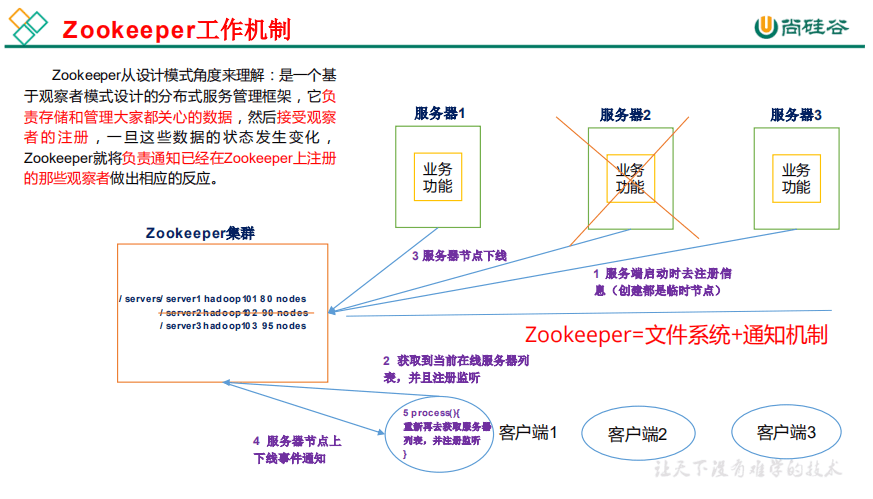
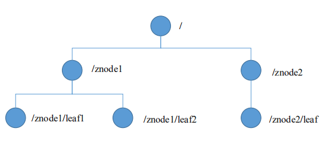
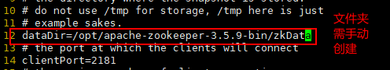
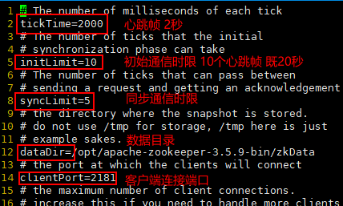
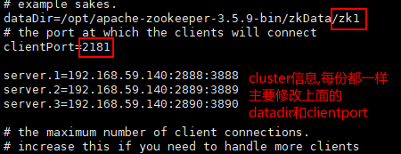
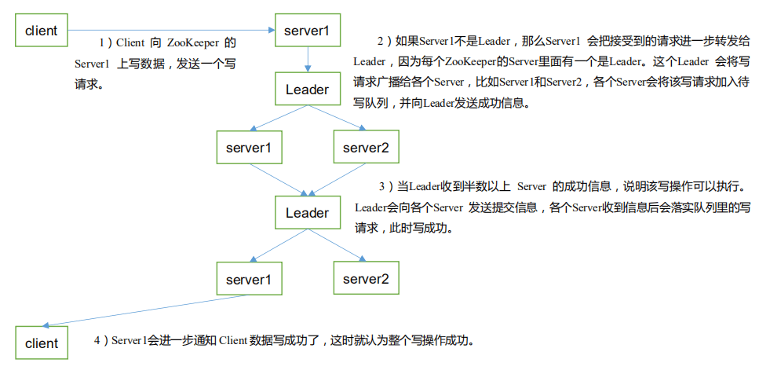

# Zookeeper

:panda_face: 文章主要描述 `zookeeper` 的简单使用、部署、原理、应用场景等。

<!-- more -->

## 1 zookeeper 入门

### 1.1 概述

> zookeeper 是一个开源的分布式的，为分布式应用提供协调服务的 Apache 项目



### 1.2 zookeeper 特点

1. zookeeper: 一个领导者(Leader)，多个跟随者(Follower)组成的集群
2. 集群中只要有半数以上节点存货，zookeeper 集群就能正常服务
3. 全局数据一致: 每个 server 保存一份相同的数据副本，client 无论连接到哪个 server，数据都是一致的
4. 更新请求顺序进行，来自同一个 client 的更新请求按其发送顺序依次执行
5. 数据更新原子性，一次数据更新要么成功，要么失败
6. 实时性，在一定时间范围内，client 能读到最新数据

### 1.3 数据结构

> zookeeper 数据模型的结构与 Unix 文件系统很类似，整体上可以看做是一棵树，每个节点称作一个 ZNode.每个 ZNode 默认能够存储 1MB 的数据，每个 ZNode 都可以通过其路径唯一标识



### 1.4 应用场景

- 统一命名服务
  - 例如: ip 不容易记住，而域名容易记住
- 统一配置管理
  - 可将配置信息写入 zookeeper 上的一个 ZNode
  - 各个客户端服务器监听这个 ZNode
  - 一旦 ZNode 中的数据被修改，zookeeper 将通知各个客户端服务器
- 统一集群管理
  - 可将节点信息写入 zookeeper 上的一个 ZNode
  - 监听这 ZNode 可获取它的实时状态变化
- 服务器动态上下线
  - 客户端能实时洞察到服务器上下线的变化
- 负载均衡
  - 在 zookeeper 中记录每台服务器的访问数，让访问数最少的服务器去处理最新的客户端请求

### 1.5 下载地址

[官网下载]: https://zookeeper.apache.org/releases.html

## 2 zookeeper 安装

### 2.1 安装部署

> 需具备 jdk 环境

```shell
#解压
tar -zxf apache-zookeeper-3.5.9-bin.tar.gz
#移动
mv apache-zookeeper-3.5.9-bin /opt/
#进入配置文件目录
cd /opt/apache-zookeeper-3.5.9-bin/conf/
#cp配置文件
cp zoo_sample.cfg zoo.cfg
#修改配置文件
vi zoo.cfg
```



```shell
#进入bin目录
cd /opt/apache-zookeeper-3.5.9-bin/bin/
#启动服务端
./zkServer.sh start
#启动客户端
./zkCli.sh
```

### 2.2 配置参数解读



## 3 zookeeper 内部原理

### 3.1 选举机制

1. 半数机制: 集群中半数以上机器存活，集群可用.所以 zookeeper 适合安装奇数太服务器
2. zookeeper 虽然在配置文件中并没有指定 Master 和 Slave.但是，zookeeper 工作时，是有一个节点为 Leader，其他则为 Follower，Leader 是通过内部的选举机制临时产生的
3. 每个 ZNode 自己投票，未选出 Leader 就会把票投给 id 最大的，当票超过半数则 Leader 产生，后面再新增多少 ZNode 都无法改变 Leader

### 3.2 节点类型

> 持久(persistent): 客户端和服务器断开连接后，创建的节点不删除
>
> 短暂(ephemeral): 客户端和服务器断开连接后，创建的节点删除

## 4 zookeeper 实战(开发重点)

### 4.1 伪分布式集群

```shell
#进入数据目录
cd /opt/apache-zookeeper-3.5.9-bin/zkData/
#创建节点数据目录
mkdir zk1
mkdir zk2
mkdir zk3
#创建myid文件
echo "1" > zk1/myid
echo "2" > zk2/myid
echo "3" > zk3/myid
#进入配置文件目录
cd /opt/apache-zookeeper-3.5.9-bin/conf/
#复制配置文件
cp zoo.cfg zk1.cfg
#修改配置文件
vi zk1.cfg
```



> server.X --> X 就是 myid 中的数字，表示这是第几号服务器
>
> 第一个端口是 Leader 与 Follower 交换信息端口(数据副本)
>
> 第二个端口是 leader 服务器挂了，用来选举的通信端口(选举)

```shell
#在复制两份配置文件
cp zk1.cfg zk2.cfg
cp zk1.cfg zk3.cfg
```

> 修改 dataDir 和 clientport(递增)

```shell
#进入bin目录
cd /opt/apache-zookeeper-3.5.9-bin/bin/
#启动服务
./zkServer.sh start zk1.cfg
./zkServer.sh start zk2.cfg
./zkServer.sh start zk3.cfg
#查看节点状态
./zkServer.sh status zk1.cfg
./zkServer.sh status zk2.cfg
./zkServer.sh status zk3.cfg
#客户端连接(可以和任意的ZNode连接)
./zkCli.sh -server 192.168.59.140:2181
```

### 4.2 客户端命令行操作

```shell
#查看所有操作命令
help
#查看当前znode中所包含的内容
ls /
#查看当前节点详细数据
ls -s /
#创建普通节点(可以递归创建节点，但是必须要有数据，没有数据创建不了)
create /sanguo "刘备"
#获取节点的值
get /sanguo
#创建短暂的节点(当客户端断开，zf被删除)
create -e /sanguo/zf "张飞"
#创建带序号的节点
create -s /sanguo/gy "关羽"
#修改节点的值
set /sanguo "织席贩履--刘备也"
#监听节点的变化(再开一个client)
#注意:监听触发器是一次性的，也就是一次就会失效
get -w /sanguo
#监听节点的子节点变化(路径变化)
ls -w /sanguo
#删除节点
delete /sanguo/zf
#递归删除(如果有子节点，delete是无法删除的，需用deleteall)
deleteall /sanguo
```

### 4.3 写数据流程



### 4.4 java 连接 zookeeper

> 引入依赖

```xml
        <dependency>
            <groupId>org.apache.zookeeper</groupId>
            <artifactId>zookeeper</artifactId>
            <version>3.5.9</version>
        </dependency>
```

> 编写测试类

```java
public class TestZookeeper {

    private static String ip = "192.168.59.140:2181";

    private static int  session_timeout = 40000;

    private static CountDownLatch latch = new CountDownLatch(1);

    public static void main(String[] args) throws Exception {
        ZooKeeper zooKeeper = new ZooKeeper(ip, session_timeout, new Watcher() {
            @Override
            public void process(WatchedEvent watchedEvent) {
                if(watchedEvent.getState() == Event.KeeperState.SyncConnected) {
                    //确认已经连接完毕后再进行操作
                    latch.countDown();
                    System.out.println("已经获得了连接");
                }
            }
        });
        //连接完成之前先等待
        latch.await();
        String s = zooKeeper.create("/sanguo", "三国".getBytes(), ZooDefs.Ids.OPEN_ACL_UNSAFE, CreateMode.PERSISTENT);
        System.out.println(s);
    }
}
```
