# Flume

:train: Flume 是 Cloudera 提供的一个高可用的，高可靠的，分布式的 `海量日志采集、聚合和传 输的系统`。Flume 基于流式架构，灵活简单。

<!-- more -->

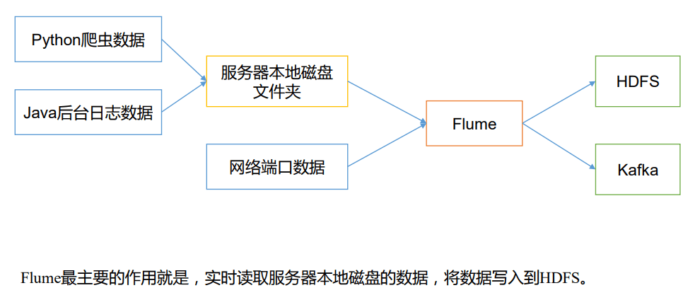

## 1 Flume 基础架构

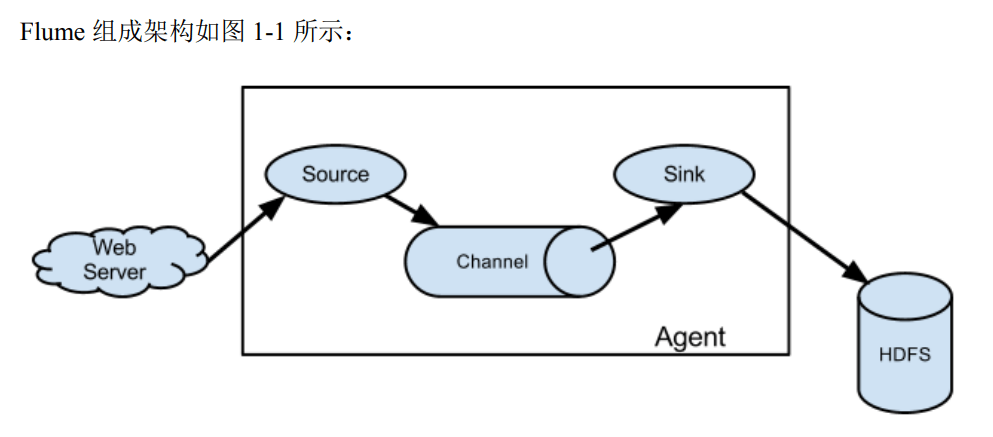

### 1.1 Agent

Agent 是一个 JVM 进程，它以`事件`的形式将数据从源头送至目的。

Agent 主要有 3 个部分组成，`Source`、`Channel`、`Sink`。

### 1.2 Source

Source 是负责接收数据到 Flume Agent 的组件。Source 组件可以处理各种类型、各种 格式的日志数据，包括` avro`、thrift、`exec`、jms、`spooling directory`、`netcat`、sequence generator、syslog、http、legacy。

### 1.3 Sink

Sink 不断地轮询 Channel 中的事件且批量地移除它们，并将这些事件批量写入到存储 或索引系统、或者被发送到另一个 Flume Agent。

Sink 组件目的地包括 `hdfs`、`logger`、`avro`、thrift、ipc、`file`、`HBase`、solr、自定 义。

### 1.4 Channel

Channel 是位于 Source 和 Sink 之间的缓冲区。因此，Channel 允许 Source 和 Sink 运 作在不同的速率上。Channel 是线程安全的，可以同时处理几个 Source 的写入操作和几个 Sink 的读取操作。

Flume 自带两种 Channel：`Memory Channel` 和 `File Channel 以及 Kafka Channel`。

Memory Channel 是内存中的队列。Memory Channel 在不需要关心数据丢失的情景下适 用。如果需要关心数据丢失，那么 Memory Channel 就不应该使用，因为程序死亡、机器宕 机或者重启都会导致数据丢失。

File Channel 将所有事件写到磁盘。因此在程序关闭或机器宕机的情况下不会丢失数 据。

### 1.5 Event

传输单元，Flume 数据传输的基本单元，以 Event 的形式将数据从源头送至目的地。 Event 由 `Header` 和 `Body` 两部分组成，Header 用来存放该 event 的一些属性，为 K-V 结构， Body 用来存放该条数据，形式为字节数组。

## 2 Flume 快速入门

### 2.1 Flume 安装部署

#### 2.1.1 安装地址

[官网地址](https://flume.apache.org/)

#### 2.1.2 安装部署

```shell
#解压
tar -zxvf apache-flume-1.7.0-bin.tar.gz -C /opt/
#改个名字
mv apache-flume-1.7.0-bin/ flume-1.7.0
#进入配置文件目录
cd /opt/flume-1.7.0/conf/
#拷贝配置文件
cp flume-env.sh.template flume-env.sh
#编辑配置文件
vim flume-env.sh
```

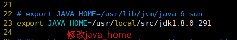

### 2.2 Flume 入门案例

#### 2.2.1 监控端口数据官方案例

1）案例需求：

使用 Flume 监听一个端口，收集该端口数据，并打印到控制台。

2）需求分析：

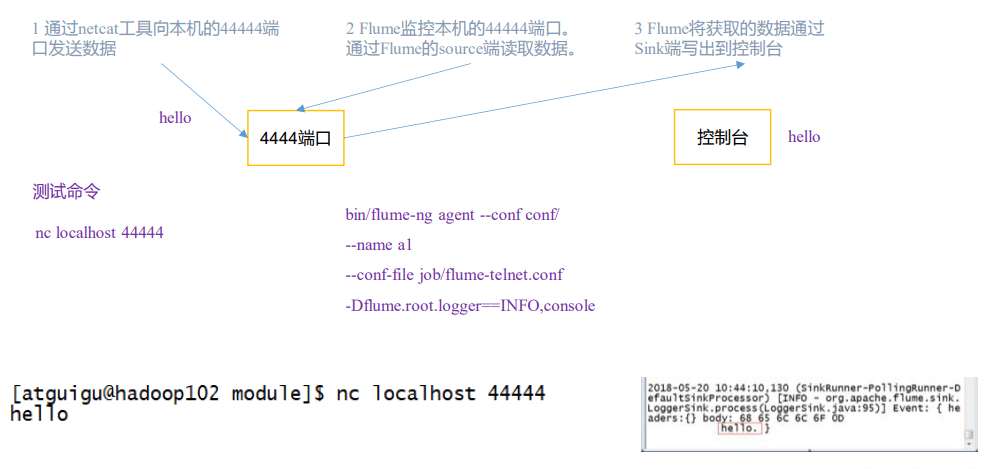

3）实现步骤：

```shell
#安装 netcat 工具
sudo yum install -y nc
#判断 44444 端口是否被占用
sudo netstat -tunlp | grep 44444
#创建 Flume Agent 配置文件 flume-netcat-logger.conf
#进入flume家目录
cd /opt/flume-1.7.0/
#创建job文件夹
mkdir job && cd job/
#降级配置文件
vim flume-netcat-logger.conf
#添加配置文件内容
#===============================================#
# Name the components on this agent
a1.sources = r1
a1.sinks = k1
a1.channels = c1
# Describe/configure the source
a1.sources.r1.type = netcat
a1.sources.r1.bind = localhost
a1.sources.r1.port = 44444
# Describe the sink
a1.sinks.k1.type = logger
# Use a channel which buffers events in memory
a1.channels.c1.type = memory
a1.channels.c1.capacity = 1000
a1.channels.c1.transactionCapacity = 100
# Bind the source and sink to the channel
a1.sources.r1.channels = c1
a1.sinks.k1.channel = c1
#===============================================#
```

[注：配置文件来源于官方手册](http://flume.apache.org/FlumeUserGuide.html)

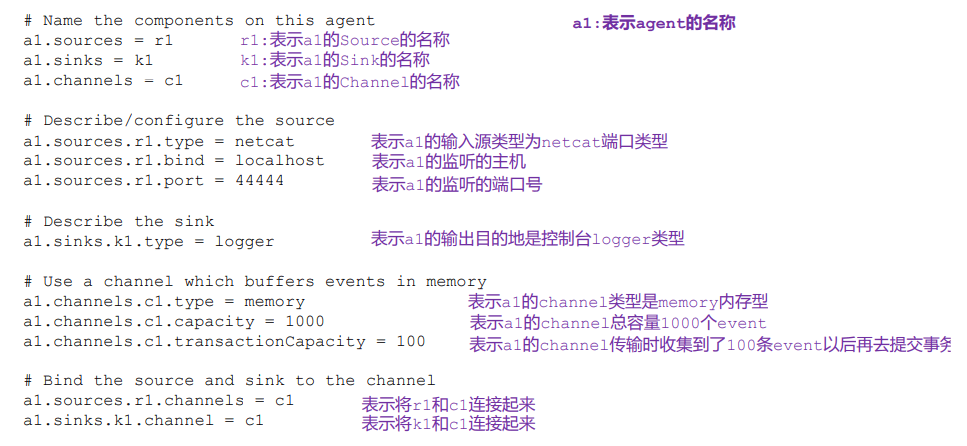

启动 nc 客户端与服务端

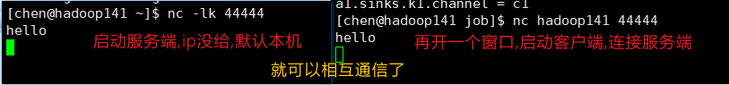

4）先开启 flume 监听端口

第一种写法：

```shell
bin/flume-ng agent --conf conf/ --conf-file job/flume-netcat-logger.conf --name a1 -Dflume.root.logger=INFO,console
```

第二种写法:

```shell
bin/flume-ng agent -c conf/ -f job/flume-netcat-logger.conf -n a1 -Dflume.root.logger=INFO,console
```

当开启成功之后,会阻塞当前窗口,**相当于开了一个 nc 客户端**,此时只要用**nc 客户端连接(nc localhost 44444)**,客户端发送的内容就会被当做日志打印在控制台

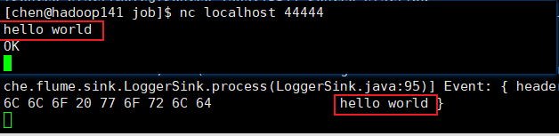

#### 2.2.2 实时监控单个追加文件-exec

1）案例需求：实时监控 Hive 日志，并上传到 HDFS 中

2）需求分析：

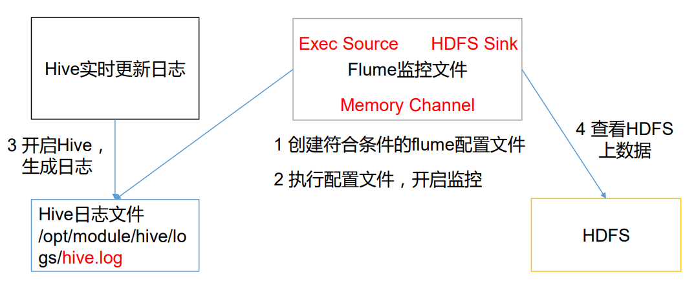

3）实现步骤：

1.Flume 要想将数据输出到 HDFS，须持有 Hadoop 相关 jar 包

```shell
commons-configuration-1.6.jar
hadoop-auth-2.7.2.jar
hadoop-common-2.7.2.jar
hadoop-hdfs-2.7.2.jar
commons-io-2.4.jar
htrace-core-3.1.0-incubating.jar
```

拷贝到/opt/module/flume/lib 文件夹下。

2.创建 flume-file-hdfs.conf 文件

```shell
# Name the components on this agent
a2.sources = r2
a2.sinks = k2
a2.channels = c2

# Describe/configure the source
a2.sources.r2.type = exec
a2.sources.r2.command = tail -F /opt/hive-3.1.2/logs/hive.log

# Describe the sink
a2.sinks.k2.type = hdfs
a2.sinks.k2.hdfs.path = hdfs://hadoop141:8020/flume/%Y%m%d/%H
#上传文件的前缀
a2.sinks.k2.hdfs.filePrefix = logs-
#是否按照时间滚动文件夹
a2.sinks.k2.hdfs.round = true
#多少时间单位创建一个新的文件夹
a2.sinks.k2.hdfs.roundValue = 1
#重新定义时间单位
a2.sinks.k2.hdfs.roundUnit = hour
#是否使用本地时间戳
a2.sinks.k2.hdfs.useLocalTimeStamp = true
#积攒多少个 Event 才 flush 到 HDFS 一次
a2.sinks.k2.hdfs.batchSize = 1000
#设置文件类型，可支持压缩
a2.sinks.k2.hdfs.fileType = DataStream
#多久生成一个新的文件(30秒,用来测试)
a2.sinks.k2.hdfs.rollInterval = 30
#设置每个文件的滚动大小(块大小)
a2.sinks.k2.hdfs.rollSize = 134217700
#文件的滚动与 Event 数量无关
a2.sinks.k2.hdfs.rollCount = 0

# Use a channel which buffers events in memory
a2.channels.c2.type = memory
a2.channels.c2.capacity = 1000
a2.channels.c2.transactionCapacity = 100

# Bind the source and sink to the channel
a2.sources.r2.channels = c2
a2.sinks.k2.channel = c2
```

注意：对于所有与时间相关的转义序列，Event Header 中必须存在以 “timestamp”的 key（除非 hdfs.useLocalTimeStamp 设置为 true，此方法会使用 TimestampInterceptor 自动添加 timestamp）。

a3.sinks.k3.hdfs.useLocalTimeStamp = true

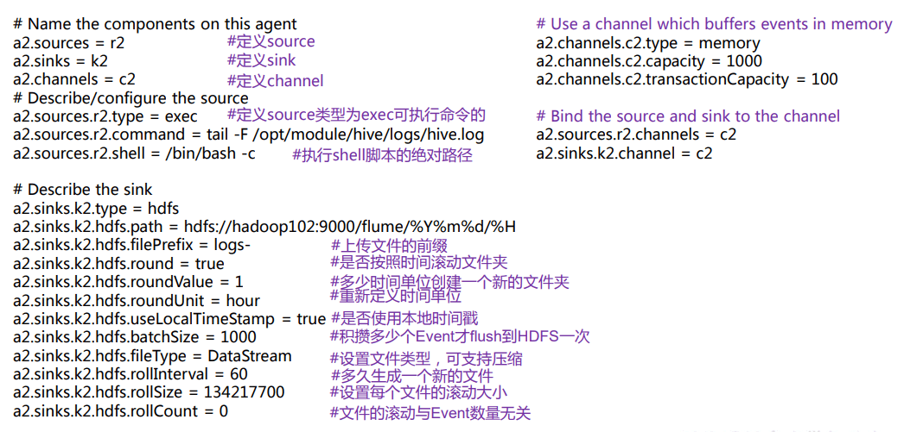

3.运行 Flume

```shell
bin/flume-ng agent -c conf -f job/hive-flume-hdfs.conf -n a2
```

4.开启 Hive 操作产生日志

5.在 HDFS 上查看文件。

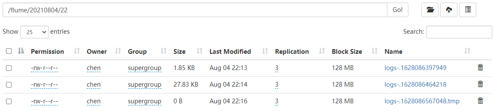

#### 2.2.3 实时监控目录下多个新文件-spooldir

1）案例需求：使用 Flume 监听整个目录的文件，并上传至 HDFS (文件修改是不会被监控的,即不能监控动态变化的数据)

2）需求分析：

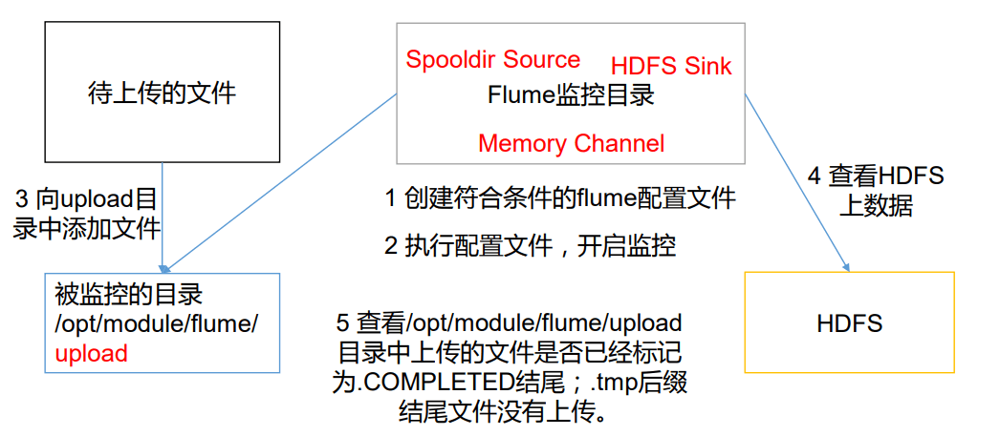

实现步骤：

1．创建配置文件 flume-dir-hdfs.conf

```shell
...省略代码

# Describe/configure the source
a2.sources.r2.type = spooldir
a2.sources.r2.spoolDir = /opt/flume-1.7.0/upload
# 忽略所有以.tmp 结尾的文件，不上传
a3.sources.r3.ignorePattern = ([^ ]*\.tmp)

...省略代码
```

2.启动监控文件夹命令

```shell
bin/flume-ng agent -c conf -f job/dir-flume-hdfs.conf -n a2
```

**说明**：在使用 Spooling Directory Source 时

不要在监控目录中创建并持续修改文件

上传完成的文件会以.COMPLETED 结尾

被监控文件夹每 500 毫秒扫描一次文件变动

3.向 upload 文件夹中添加文件 (随便添加点什么,文件处理完成后会被添加.COMPLETED 后缀)

4.查看 HDFS 上的数据

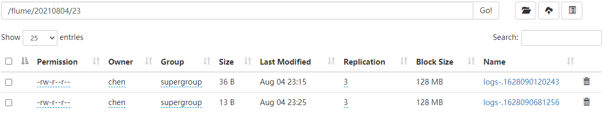

#### 2.2.4 实时监控目录下的多个追加文件-taildir

Exec source 适用于监控一个实时追加的文件，但不能保证数据不丢失；Spooldir Source 能够保证数据不丢失，且能够实现断点续传，但延迟较高，不能实时监控；而 Taildir Source 既能够实现断点续传，又可以保证数据不丢失，还能够进行实时监控。

1）案例需求：使用 Flume 监听整个目录的实时追加文件，并上传至 HDFS

2）需求分析：

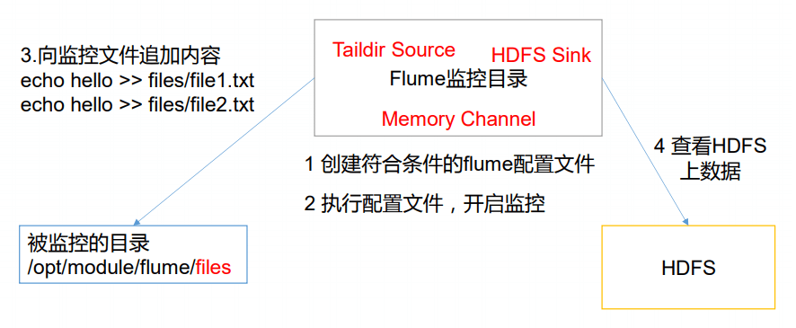

1．创建配置文件 flume-taildir-hdfs.conf

```shell
...省略代码

# Describe/configure the source
a1.sources.r1.type = TAILDIR
a1.sources.r1.filegroups = f1
a1.sources.r1.filegroups.f1 = /opt/flume-1.7.0/files/file.*
# taildir-position.json记录文件的偏移量
a1.sources.r1.positionFile = /opt/flume-1.7.0/files/taildir-position.json

...省略代码
```

2.启动监控文件夹命令

```shell
bin/flume-ng agent -c conf -f job/taildir-flume-hdfs.conf  -n a1
```

3.向 files 文件夹中追加内容

```shell
echo hello >> file1.txt
echo atguigu >> file2.txt
```

4.查看 HDFS 上的数据

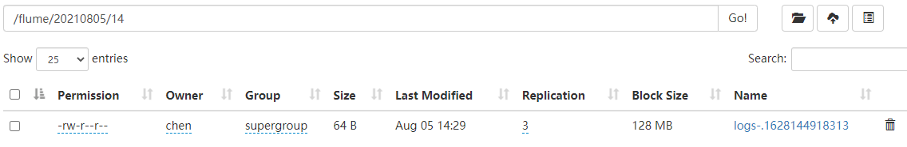

**Taildir 说明(断点续传)**： Taildir Source 维护了一个 json 格式的 position File，其会定期的往 position File 中更新每个文件读取到的最新的位置，因此能够实现断点续传

注：Linux 中储存文件元数据的区域就叫做 inode，每个 inode 都有一个号码，操作系统 用 inode 号码来识别不同的文件，Unix/Linux 系统内部不使用文件名，而使用 inode 号码来识别文件。

## 3 Flume 进阶

### 3.1 Flume 事务

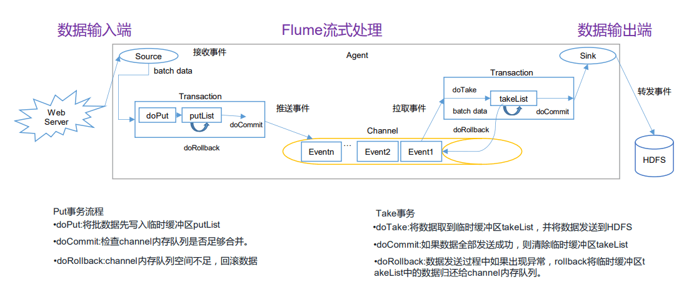

### 3.2 Flume Agent 内部原理

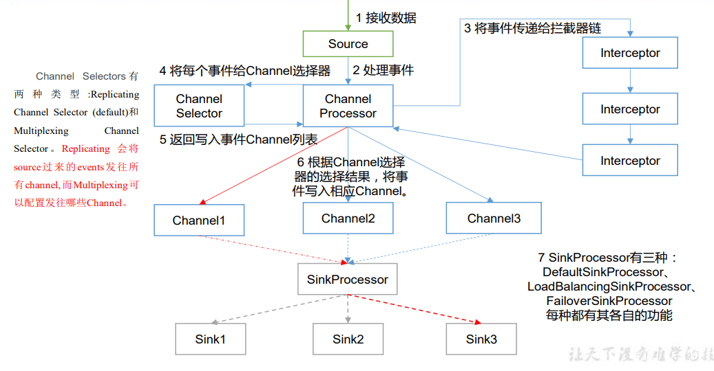

重要组件：

1）ChannelSelector

ChannelSelector 的作用就是选出 Event 将要被发往哪个 Channel。其共有两种类型， 分别是 **Replicating**（复制）和 **Multiplexing**（多路复用）。

ReplicatingSelector 会将同一个 Event 发往所有的 Channel，Multiplexing 会根据相 应的原则，将不同的 Event 发往不同的 Channel。

2）SinkProcessor

SinkProcessor 共 有 三 种 类 型 ， 分 别 是 **DefaultSinkProcessor** 、 **LoadBalancingSinkProcessor** 和 **FailoverSinkProcessor**

DefaultSinkProcessor 对 应 的 是 单 个 的 Sink ， LoadBalancingSinkProcessor 和 FailoverSinkProcessor 对应的是 Sink Group，LoadBalancingSinkProcessor 可以实现负 载均衡的功能，FailoverSinkProcessor 可以实现故障转移的功能。

### 3.3 Flume 拓扑结构

#### 3.3.1 简单串联


这种模式是将多个 flume 顺序连接起来了，从最初的 source 开始到最终 sink 传送的 目的存储系统。此模式不建议桥接过多的 flume 数量，flume 数量过多不仅会影响传输速率， 而且一旦传输过程中某个节点 flume 宕机，会影响整个传输系统。

#### 3.3.2 复制和多路复用

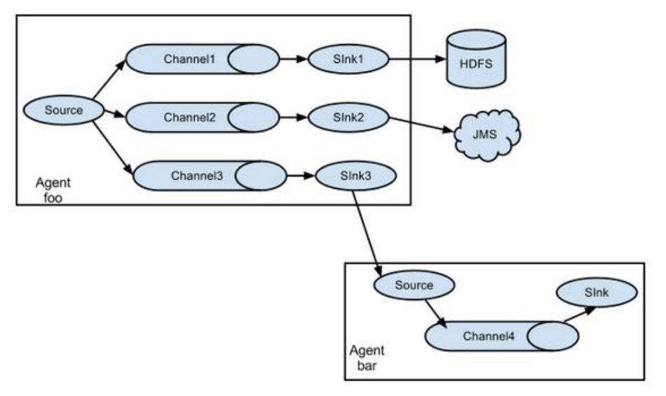

Flume 支持将事件流向一个或者多个目的地。这种模式可以将相同数据复制到多个 channel 中，或者将不同数据分发到不同的 channel 中，sink 可以选择传送到不同的目的 地。

#### 3.3.3 负载均衡和故障转移

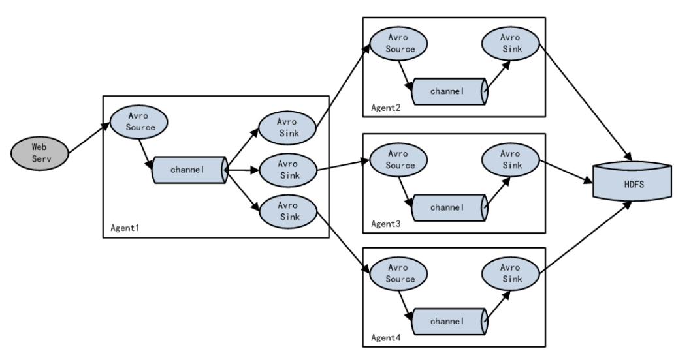

Flume 支持使用将多个 sink 逻辑上分到一个 sink 组，sink 组配合不同的 SinkProcessor 可以实现负载均衡和错误恢复的功能。

#### 3.3.4 聚合

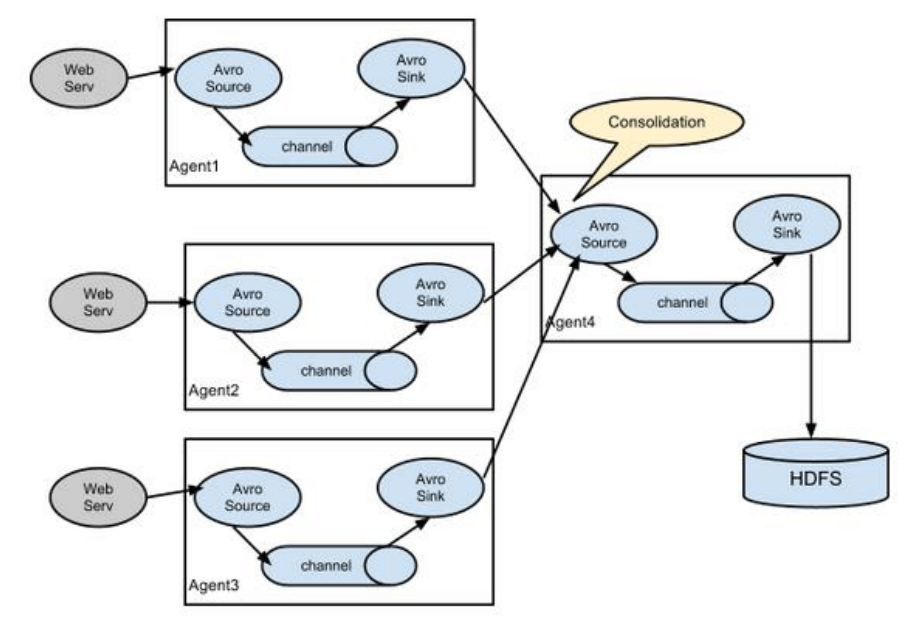

这种模式是我们最常见的，也非常实用，日常 web 应用通常分布在上百个服务器，大者 甚至上千个、上万个服务器。产生的日志，处理起来也非常麻烦。用 flume 的这种组合方式 能很好的解决这一问题，每台服务器部署一个 flume 采集日志，传送到一个集中收集日志的 flume，再由此 flume 上传到 hdfs、hive、hbase 等，进行日志分析。

### 3.4 Flume 企业开发案例

#### 3.4.1 复制和多路复用

1）案例需求

使用 Flume-1 监控文件变动，Flume-1 将变动内容传递给 Flume-2，Flume-2 负责存储 到 HDFS。同时 Flume-1 将变动内容传递给 Flume-3，Flume-3 负责输出到 Local FileSystem。

2）需求分析：

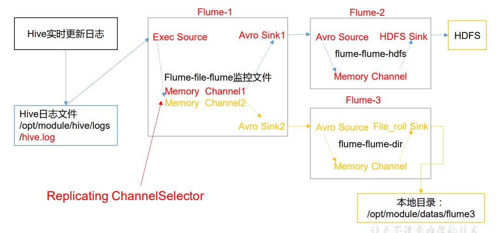

3）实现步骤：

```shell
#创建一个文件夹,用来放置配置文件
mkdir group_01 && cd group_01
#创建配置文件
touch flume01.conf
touch flume02.conf
touch flume03.conf
```

**编辑配置文件 flume01.conf**

source: avro | channel: memory _ 2 | sink: avro _ 2

该配置文件通过 taildir 监控一个文件,通过两个 channel 传送到,两个 sink 通过 avro 对应两个 agent

```shell
#name
a1.sources = r1
a1.channels = c1 c2
a1.sinks = k1 k2

#source
a1.sources.r1.type = TAILDIR
a1.sources.r1.filegroups = f1
a1.sources.r1.filegroups.f1 = /opt/flume-1.7.0/data/hive.log
a1.sources.r1.positionFile = /opt/flume-1.7.0/data/taildir-position.json
# 将数据流复制给所有 channel(默认的,不写也是可以的)
a1.sources.r1.selector.type = replicating

#channel
a1.channels.c1.type = memory
a1.channels.c1.capacity = 1000
a1.channels.c1.transactionCapacity = 100
a1.channels.c2.type = memory
a1.channels.c2.capacity = 1000
a1.channels.c2.transactionCapacity = 100

#sink
a1.sinks.k1.type = avro
a1.sinks.k1.hostname = hadoop141
a1.sinks.k1.port = 4141
a1.sinks.k2.type = avro
a1.sinks.k2.hostname = hadoop141
a1.sinks.k2.port = 4142

#bind
a1.sources.r1.channels = c1 c2
a1.sinks.k1.channel = c1
a1.sinks.k2.channel = c2
```

**编辑配置文件 flume2.conf**

source: avro | channel: memory | sink: hdfs

```shell
#name
a2.sources = r1
a2.channels = c1
a2.sinks = k1

#source
a2.sources.r1.type = avro
a2.sources.r1.bind = hadoop141
a2.sources.r1.port = 4141

#channel
a2.channels.c1.type = memory
a2.channels.c1.capacity = 1000
a2.channels.c1.transactionCapacity = 100

#sink
a2.sinks.k1.type = hdfs
a2.sinks.k1.hdfs.path = hdfs://hadoop141:8020/group01/%Y%m%d/%H
#上传文件的前缀
a2.sinks.k1.hdfs.filePrefix = logs-
#是否按照时间滚动文件夹
a2.sinks.k1.hdfs.round = true
#多少时间单位创建一个新的文件夹
a2.sinks.k1.hdfs.roundValue = 1
#重新定义时间单位
a2.sinks.k1.hdfs.roundUnit = hour
#是否使用本地时间戳
a2.sinks.k1.hdfs.useLocalTimeStamp = true
#积攒多少个 Event 才 flush 到 HDFS 一次
a2.sinks.k1.hdfs.batchSize = 1000
#设置文件类型，可支持压缩
a2.sinks.k1.hdfs.fileType = DataStream
#多久生成一个新的文件(30秒,用来测试)
a2.sinks.k1.hdfs.rollInterval = 30
#设置每个文件的滚动大小(块大小)
a2.sinks.k1.hdfs.rollSize = 134217700
#文件的滚动与 Event 数量无关
a2.sinks.k1.hdfs.rollCount = 0

#bind
a2.sources.r1.channels = c1
a2.sinks.k1.channel = c1
```

**编辑配置文件 flume3.conf**

source: avro | channel: memory | sink: file_roll

```shell
#name
a3.sources = r1
a3.channels = c1
a3.sinks = k1

#source
a3.sources.r1.type = avro
a3.sources.r1.bind = hadoop141
a3.sources.r1.port = 4142

#channel
a3.channels.c1.type = memory
a3.channels.c1.capacity = 1000
a3.channels.c1.transactionCapacity = 100

#sink
a3.sinks.k1.type = file_roll
a3.sinks.k1.sink.directory = /opt/flume-1.7.0/data/

#bind
a3.sources.r1.channels = c1
a3.sinks.k1.channel = c1
```

4）执行配置文件

avro source 相当于服务端,avro skin 相当于客户端

如果先开启 flume1,日志文件会报错,连接被拒绝,所以一般来说,先开启下游服务

```shell
bin/flume-ng agent -c conf -f job/group_01/flume3.conf -n a3
bin/flume-ng agent -c conf -f job/group_01/flume2.conf -n a2
bin/flume-ng agent -c conf -f job/group_01/flume1.conf -n a1
```

5）查看 hdfs 和本地的文件,并测试插入数据

6）改案例只体现了复制,多路复用需要和拦截器一起使用

#### 3.4.2 负载均衡和故障转移

1）案例需求

使用 Flume1 监控一个端口，其 sink 组中的 sink 分别对接 Flume2 和 Flume3，采用 FailoverSinkProcessor，实现故障转移的功能。


3）实现步骤

```shell
#创建一个文件夹,用来放置配置文件
mkdir group_02 && cd group_02
#创建配置文件
touch flume01.conf
touch flume02.conf
touch flume03.conf
```

**编辑配置文件 flume01.conf**

source: avro | channel: memory | sink: avro \* 2

```shell
#name
a1.sources = r1
a1.sinks = k1 k2
a1.channels = c1
a1.sinkgroups = g1

#source
a1.sources.r1.type = netcat
a1.sources.r1.bind = localhost
a1.sources.r1.port = 44444

#channel
a1.channels.c1.type = memory
a1.channels.c1.capacity = 1000
a1.channels.c1.transactionCapacity = 100

#sink
a1.sinks.k1.type = avro
a1.sinks.k1.hostname = hadoop141
a1.sinks.k1.port = 4141
a1.sinks.k2.type = avro
a1.sinks.k2.hostname = hadoop141
a1.sinks.k2.port = 4142

#sink group
a1.sinkgroups.g1.sinks = k1 k2
a1.sinkgroups.g1.processor.type = failover
a1.sinkgroups.g1.processor.priority.k1 = 5
a1.sinkgroups.g1.processor.priority.k2 = 10
a1.sinkgroups.g1.processor.maxpenalty = 10000

#bind
a1.sources.r1.channels = c1
a1.sinks.k1.channel = c1
a1.sinks.k2.channel = c1
```

**编辑配置文件 flume02.conf**

source: avro | channel: memory | sink: logger

```shell
#name
a2.sources = r1
a2.sinks = k1
a2.channels = c1

#source
a2.sources.r1.type = avro
a2.sources.r1.bind = hadoop141
a2.sources.r1.port = 4141

#channel
a2.channels.c1.type = memory
a2.channels.c1.capacity = 1000
a2.channels.c1.transactionCapacity = 100

#sink
a2.sinks.k1.type = logger

#bind
a2.sources.r1.channels = c1
a2.sinks.k1.channel = c1
```

**编辑配置文件 flume03.conf**

source: avro | channel: memory | sink: logger

```shell
#配置文件和flume02.conf一致,改一下端口和agent的名字
a3.sources.r1.port = 4142
```

4）执行配置文件

```shell
#启动a3
bin/flume-ng agent -c conf -f job/group_02/flume3.txt -n a3 -Dflume.root.logger=INFO,console
#启动a2
bin/flume-ng agent -c conf -f job/group_02/flume2.txt -n a2 -Dflume.root.logger=INFO,console
#启动a1
bin/flume-ng agent -c conf -f job/group_02/flume1.txt -n a1
```

5）使用 netcat 工具向本机的 44444 端口发送内容

```shell
nc localhost 44444
```

6）测试

nc 发送数据,观察是哪个 agent 在打印日志

关闭当前 agent,观察是否成功失败转移

`负载均衡`

负载均衡就是把 Sink groups 的策略改成 load_balance 就可以了

```shell
a1.sinkgroups = g1
a1.sinkgroups.g1.sinks = k1 k2
a1.sinkgroups.g1.processor.type = load_balance
a1.sinkgroups.g1.processor.backoff = true
a1.sinkgroups.g1.processor.selector = random
```

#### 3.4.3 聚合

1）案例需求

hadoop102 上的 Flume-1 监控文件/opt/module/data/group.log，

hadoop103 上的 Flume-2 监控某一个端口的数据流，

Flume-1 与 Flume-2 将数据发送给 hadoop104 上的 Flume-3，Flume-3 将最终数据打印到控 制台。

2）需求分析

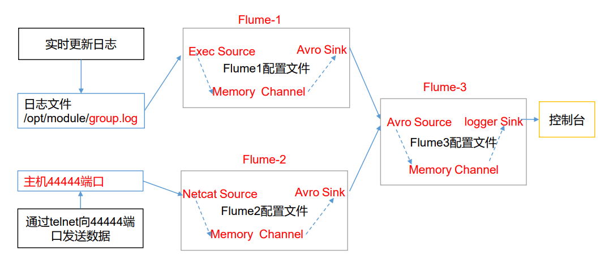

3）实现步骤：

```shell
#创建一个文件夹,用来放置配置文件
mkdir group_03 && cd group_03
#创建配置文件
touch flume01.conf
touch flume02.conf
touch flume03.conf
```

**编辑配置文件 flume01.conf**

source: taildir | channel: memory | sink: avro

```shell
#name
a1.sources = r1
a1.sinks = k1
a1.channels = c1

#source
a1.sources.r1.type = TAILDIR
a1.sources.r1.filegroups = f1
a1.sources.r1.filegroups.f1 = /opt/flume-1.7.0/data/flume.log
a1.sources.r1.positionFile = /opt/flume-1.7.0/data/taildir-position2.json

#channel
a1.channels.c1.type = memory
a1.channels.c1.capacity = 1000
a1.channels.c1.transactionCapacity = 100

#sink
a1.sinks.k1.type = avro
a1.sinks.k1.hostname = hadoop143
a1.sinks.k1.port = 4141

#bind
a1.sources.r1.channels = c1
a1.sinks.k1.channel = c1
```

**编辑配置文件 flume02.conf**

source: netcat | channel: memory | sink: avro

```shell
#name
a2.sources = r1
a2.sinks = k1
a2.channels = c1

#source
a2.sources.r1.type = netcat
a2.sources.r1.bind = localhost
a2.sources.r1.port = 44444

#channel
a2.channels.c1.type = memory
a2.channels.c1.capacity = 1000
a2.channels.c1.transactionCapacity = 100

#sink
a2.sinks.k1.type = avro
a2.sinks.k1.hostname = hadoop143
a2.sinks.k1.port = 4141

#bind
a2.sources.r1.channels = c1
a2.sinks.k1.channel = c1
```

**编辑配置文件 flume03.conf**

source: avro | channel: memory | sink: logger

```shell
#name
a3.sources = r1
a3.sinks = k1
a3.channels = c1

#source
a3.sources.r1.type = avro
a3.sources.r1.bind = hadoop143
a3.sources.r1.port = 4141

#channel
a3.channels.c1.type = memory
a3.channels.c1.capacity = 1000
a3.channels.c1.transactionCapacity = 100

#sink
a3.sinks.k1.type = logger

#bind
a3.sources.r1.channels = c1
a3.sinks.k1.channel = c1
```

4）执行配置文件

```shell
#a1
bin/flume-ng agent -c conf -f job/group_03/flume1.txt -n a1
#a2
bin/flume-ng agent -c conf -f job/group_03/flume2.txt -n a2
#a3
bin/flume-ng agent -c conf -f job/group_03/flume3.txt -n a3 -Dflume.root.logger=INFO,console
```

5）测试

向 hadoop141 的/opt/flume-1.7.0/data/flume.log 追加数据

向 hadoop142 的 nc 44444 端口发送消息

观察 hadoop143 的 logger,是否成功集合

6）思考

如果 flume1 和 flume2 的 avro sink 端口不一致,该如何操作

答: flume3 指定两个 avro source 即可

### 3.5 自定义 Interceptor

1）案例需求

使用 Flume 采集服务器本地日志，需要按照日志类型的不同，将不同种类的日志发往不 同的分析系统。

2）需求分析

在实际的开发中，一台服务器产生的日志类型可能有很多种，不同类型的日志可能需要 发送到不同的分析系统。此时会用到 Flume 拓扑结构中的 Multiplexing 结构，Multiplexing 的原理是，根据 event 中 Header 的某个 key 的值，将不同的 event 发送到不同的 Channel 中，所以我们需要自定义一个 Interceptor，为不同类型的 event 的 Header 中的 key 赋予 不同的值。

在该案例中，我们以端口数据模拟日志，以数字（单个）和字母（单个）模拟不同类型 的日志，我们需要自定义 interceptor 区分数字和字母，将其分别发往不同的分析系统 （Channel）。

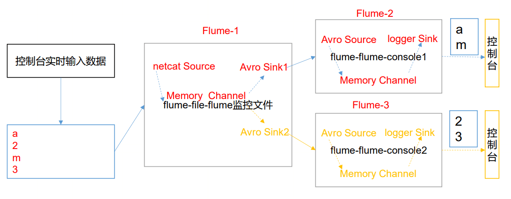

3）实现步骤

1.创建一个 maven 项目，并引入以下依赖。

```xml
<dependency>
    <groupId>org.apache.flume</groupId>
    <artifactId>flume-ng-core</artifactId>
    <version>1.7.0</version>
</dependency>
```

2.定义 CustomInterceptor 类并实现 Interceptor 接口。

```java
public class TypeIntercept implements Interceptor {
    // 声明一个存放事件的集合
    private List<Event> addHeaderEvents;

    @Override
    public void initialize() {
        // 初始化
        addHeaderEvents = new ArrayList<>();
    }

    // 单个事件拦截
    @Override
    public Event intercept(Event event) {
        // 1.获取事件中的头信息
        Map<String, String> headers = event.getHeaders();
        // 2.获取事件中的body
        String body = new String(event.getBody());
        // 3.根据body中是否有hello来决定添加怎样的头信息
        if (body.contains("hello")) {
            headers.put("type", "chen");
        } else {
            headers.put("type", "zhou");
        }
        return event;
    }

    // 批量事件拦截
    @Override
    public List<Event> intercept(List<Event> list) {
        // 1.清空集合
        addHeaderEvents.clear();
        // 2.遍历events
        for (Event event : list) {
            // 3.给每一个事件添加头信息
            addHeaderEvents.add(intercept(event));
        }
        return addHeaderEvents;
    }

    @Override
    public void close() {

    }

    public static class Builder implements Interceptor.Builder {

        @Override
        public Interceptor build() {
            return new TypeIntercept();
        }

        @Override
        public void configure(Context context) {

        }
    }
}
```

3.打 jar 包并上传到 flume 的 lib 文件夹下面

4.编辑 flume 配置文件

**在 hadoop141 上面编辑配置文件 flume1.conf**

source: netcat | channel: memory | sink: avro \* 2

```shell
#name
a1.sources = r1
a1.sinks = k1 k2
a1.channels = c1 c2

#source
a1.sources.r1.type = netcat
a1.sources.r1.bind = localhost
a1.sources.r1.port = 44444

#interceptor
a1.sources.r1.interceptors = i1
a1.sources.r1.interceptors.i1.type = com.cssl.intercept.TypeIntercept$Builder

#channel selector
a1.sources.r1.selector.type = multiplexing
a1.sources.r1.selector.header = type
a1.sources.r1.selector.mapping.chen = c1
a1.sources.r1.selector.mapping.zhou = c2

#channel
a1.channels.c1.type = memory
a1.channels.c1.capacity = 1000
a1.channels.c1.transactionCapacity = 100

a1.channels.c2.type = memory
a1.channels.c2.capacity = 1000
a1.channels.c2.transactionCapacity = 100

#sink
a1.sinks.k1.type = avro
a1.sinks.k1.hostname = hadoop142
a1.sinks.k1.port = 4141

a1.sinks.k2.type = avro
a1.sinks.k2.hostname = hadoop143
a1.sinks.k2.port = 4141

#bind
a1.sources.r1.channels = c1 c2
a1.sinks.k1.channel = c1
a1.sinks.k2.channel = c2
```

**在 hadoop142 上面编辑配置文件 flume2.conf**

source: avro | channel: memory | sink: logger

```shell
#name
a2.sources = r1
a2.sinks = k1
a2.channels = c1

#source
a2.sources.r1.type = avro
a2.sources.r1.bind = hadoop142
a2.sources.r1.port = 4141

#channel
a2.channels.c1.type = memory
a2.channels.c1.capacity = 1000
a2.channels.c1.transactionCapacity = 100

#sink
a2.sinks.k1.type = logger

#bind
a2.sources.r1.channels = c1
a2.sinks.k1.channel = c1
```

**在 hadoop143 上面编辑配置文件 flume3.conf**

source: avro | channel: memory | sink: logger

```shell
#name
a3.sources = r1
a3.sinks = k1
a3.channels = c1

#source
a3.sources.r1.type = avro
a3.sources.r1.bind = hadoop143
a3.sources.r1.port = 4141

#channel
a3.channels.c1.type = memory
a3.channels.c1.capacity = 1000
a3.channels.c1.transactionCapacity = 100

#sink
a3.sinks.k1.type = logger

#bind
a3.sources.r1.channels = c1
a3.sinks.k1.channel = c1
```

5.执行配置文件

avro source 相当于服务端,需要先启动,监听的是本机端口

```shell
#a3
bin/flume-ng agent -c conf -f job/intercept/flume3.conf -n a3 -Dflume.root.logger=INFO,console
#a2
bin/flume-ng agent -c conf -f job/intercept/flume2.conf -n a2 -Dflume.root.logger=INFO,console
#a1
bin/flume-ng agent -c conf -f job/intercept/flume1.conf -n a1
```

6.测试

按照拦截器和多路复用的策略,向 hadoop141 的 nc 44444 端口发送消息

观察 hadoop142,hadoop143 上的 logger,是否成功多路复用

### 3.6 自定义 Source

1）介绍

Source 是负责接收数据到 Flume Agent 的组件。Source 组件可以处理各种类型、各种 格式的日志数据，包括 avro、thrift、exec、jms、spooling directory、netcat、sequence generator、syslog、http、legacy。官方提供的 source 类型已经很多，但是有时候并不能 满足实际开发当中的需求，此时我们就需要根据实际需求自定义某些 source。

官方也提供了自定义 source 的接口：

https://flume.apache.org/FlumeDeveloperGuide.html#source 根据官方说明自定义 MySource 需要继承 AbstractSource 类并实现 Configurable 和 PollableSource 接口。

实现相应方法：

getBackOffSleepIncrement()//暂不用

getMaxBackOffSleepInterval()//暂不用

configure(Context context)//初始化

context（读取配置文件内容）

process()//获取数据封装成 event 并写入 channel，这个方法将被循环调用。

使用场景：读取 MySQL 数据或者其他文件系统。

2）需求

使用 flume 接收数据，并给每条数据添加前缀，输出到控制台。前缀可从 flume 配置文 件中配置。

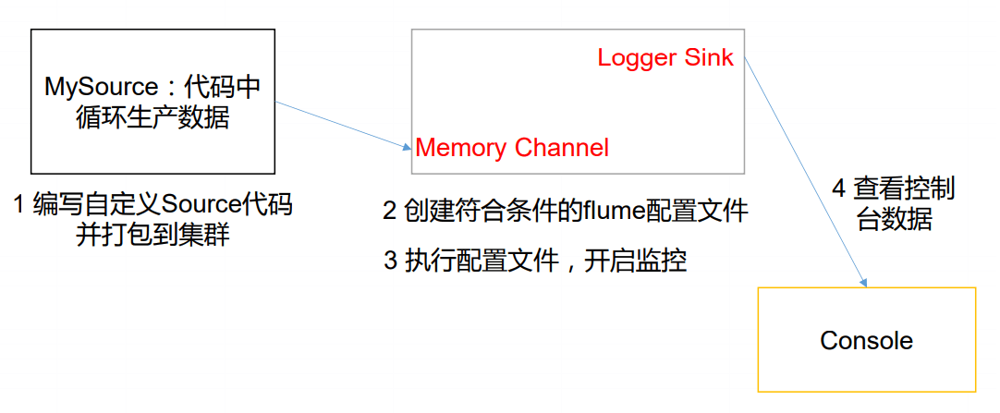

3）分析

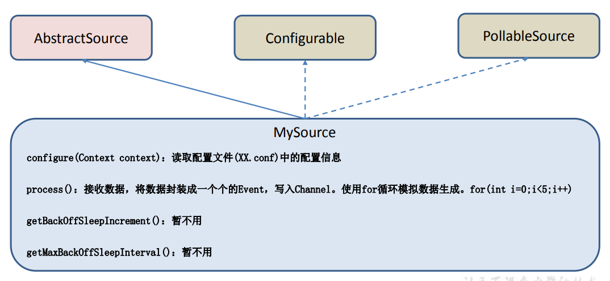

4）编写代码 (循环打印从配置文件中读取的属性)

```java
public class MySource extends AbstractSource implements Configurable, PollableSource {
    // 定义全局的前缀和后缀
    private String prefix;
    private String suffix;

    @Override
    public void configure(Context context) {
        // 读取配置信息给前后缀赋值
        prefix = context.getString("prefix");
        suffix = context.getString("suffix", "atguigu");
    }

    /**
     * @Description 1. 接收数据(for循环造数据) 2. 封装为事件 3. 将事件传给channel
     * @Author chen
     * @Date 2021/8/6 11:30
     */
    @Override
    public Status process() throws EventDeliveryException {
        Status status = null;
        try {
            // 1.接收数据
            for (int i = 0; i < 5; i++) {
                // 2.构建事件对象
                SimpleEvent event = new SimpleEvent();
                // 3.给event body赋值
                event.setBody((prefix + "--" + i + "--" + suffix).getBytes());
                // 4.减事件传给channel
                getChannelProcessor().processEvent(event);
                status = Status.READY;
                // 休息一会
                TimeUnit.SECONDS.sleep(2);
            }
        } catch (Exception e) {
            e.printStackTrace();
            status = Status.BACKOFF;
        }

        return status;
    }

    @Override
    public long getBackOffSleepIncrement() {
        return 0;
    }

    @Override
    public long getMaxBackOffSleepInterval() {
        return 0;
    }
}
```

5）打成 jar 包上传到 flume 的 lib 目录

6）编写配置文件 (prefix 没有默认值,suffix 有默认值)

```shell
# Name the components on this agent
a1.sources = r1
a1.sinks = k1
a1.channels = c1

# Describe/configure the source
a1.sources.r1.type = com.cssl.source.MySource
a1.sources.r1.prefix = chen
# a1.sources.r1.suffix = student

# Describe the sink
a1.sinks.k1.type = logger

# Use a channel which buffers events in memory
a1.channels.c1.type = memory
a1.channels.c1.capacity = 1000
a1.channels.c1.transactionCapacity = 100

# Bind the source and sink to the channel
a1.sources.r1.channels = c1
a1.sinks.k1.channel = c1
```

7）执行配置文件并测试

```shell
bin/flume-ng agent -c conf -f job/mysource.conf -n a1 -Dflume.root.logger=INFO,console
```

### 3.7 自定义 Sink

1）介绍

Sink 不断地轮询 Channel 中的事件且批量地移除它们，并将这些事件批量写入到存储 或索引系统、或者被发送到另一个 Flume Agent。

Sink 是完全事务性的。在从 Channel 批量删除数据之前，每个 Sink 用 Channel 启动一 个事务。批量事件一旦成功写出到存储系统或下一个 Flume Agent，Sink 就利用 Channel 提 交事务。**事务一旦被提交，该 Channel 从自己的内部缓冲区删除事件**。

Sink 组件目的地包括 hdfs、logger、avro、thrift、ipc、file、null、HBase、solr、 自定义。官方提供的 Sink 类型已经很多，但是有时候并不能满足实际开发当中的需求，此 时我们就需要根据实际需求自定义某些 Sink。

官方也提供了自定义 sink 的接口：

https://flume.apache.org/FlumeDeveloperGuide.html#sink 根据官方说明自定义 MySink 需要继承 AbstractSink 类并实现 Configurable 接口。

实现相应方法：

configure(Context context)//初始化 context（读取配置文件内容）

process()//从 Channel 读取获取数据（event），这个方法将被循环调用

使用场景：读取 Channel 数据写入 MySQL 或者其他文件系统。

2）需求

使用 flume 接收数据，并在 Sink 端给每条数据添加前缀和后缀，输出到控制台。前后 缀可在 flume 任务配置文件中配置

流程分析：


3）编写代码

```java
public class MySink extends AbstractSink implements Configurable {
    // 获取logger对象
    private Logger logger = LoggerFactory.getLogger(MySink.class);
    // 定义两个属性,前后缀
    private String prefix;
    private String suffix;

    /**
     * @Description 1.获取channel 2.从channel获取事务以及数据 3.发送数据
     * @Author chen
     * @Date 2021/8/6 15:56
     */
    @Override
    public Status process() throws EventDeliveryException {

        // 1.定义返回值
        Status status = null;
        // 2.获取channel
        Channel channel = getChannel();
        // 3.从channel获取事务
        Transaction tx = channel.getTransaction();
        // 4.开启事务
        tx.begin();
        try {
            // 5.从channel获取数据
            Event event = channel.take();
            if (event != null) {
                // 6.处理事件
                String body = new String(event.getBody());
                logger.info(prefix + "--" + body + "--" + suffix);

            }
            // 7.提交事物
            tx.commit();
            // 8.成功提交,修改状态信息
            status = Status.READY;
        } catch (ChannelException e) {
            e.printStackTrace();
            // 9.提交失败
            tx.rollback();
            status = Status.BACKOFF;
        } finally {
            // 11.关闭事务
            tx.close();
        }
        // 12.返回状态信息
        return status;
    }

    @Override
    public void configure(Context context) {
        // 读取配置文件给前后缀赋值
        prefix = context.getString("prefix");
        suffix = context.getString("suffix", "atguigu");
    }
}
```

4）打成 jar 包上传到 flume 的 lib 目录

5）编写配置文件 mysink.conf

```shell
# Name the components on this agent
a1.sources = r1
a1.sinks = k1
a1.channels = c1

# Describe/configure the source
a1.sources.r1.type = netcat
a1.sources.r1.bind = localhost
a1.sources.r1.port = 44444

# Describe the sink
a1.sinks.k1.type = com.cssl.sink.MySink
a1.sinks.k1.prefix = start
a1.sinks.k1.suffix = end

# Use a channel which buffers events in memory
a1.channels.c1.type = memory
a1.channels.c1.capacity = 1000
a1.channels.c1.transactionCapacity = 100

# Bind the source and sink to the channel
a1.sources.r1.channels = c1
a1.sinks.k1.channel = c1
```

6）执行配置文件

```shell
bin/flume-ng agent -c conf -f job/mysink.conf -n a1 -Dfme.root.logger=INFO,console
```

7）测试

开启 nc localhost 44444 发送消息,观察控制台打印日志

## 4 Flume 对接 Kafka

### 4.1 kafka-sink

需求: kafka 连接 flume,即 kafka-sink

1.**编写配置文件 flume-kafka.conf**

source: netcat | channel: memory | sink: kafka

```shell
#name
a1.sources = r1
a1.sinks = k1
a1.channels = c1

#source
a1.sources.r1.type = netcat
a1.sources.r1.bind = localhost
a1.sources.r1.port = 44444

#sink
a1.sinks.k1.type = org.apache.flume.sink.kafka.KafkaSink
a1.sinks.k1.kafka.topic = first
a1.sinks.k1.kafka.bootstrap.servers = hadoop141:9092,hadoop142:9092,hadoop143:9092
a1.sinks.k1.kafka.flumeBatchSize = 20
a1.sinks.k1.kafka.producer.acks = 1
a1.sinks.k1.kafka.producer.linger.ms = 1

# Use a channel which buffers events in memory
a1.channels.c1.type = memory
a1.channels.c1.capacity = 1000
a1.channels.c1.transactionCapacity = 100

#bind
a1.sources.r1.channels = c1
a1.sinks.k1.channel = c1
```

2.启动 kafka 消费者

```shell
bin/kafka-console-consumer.sh --zookeeper hadoop141:2181 --topic first
```

3.启动 flume

```shell
bin/flume-ng agent -c conf -f job/flume-kafka.conf -n a1
```

4.启动 netcat 发送消息,并观察 kafka 消费者是否能正常消费

```shell
nc localhost 44444
```

### 4.2 flume 拦截器 topic 分类

需求: 编写 flume 拦截器,将不同的消费分类发送给不同 topic

1.编写拦截器

```java
public class TopicIntercept implements Interceptor {
    private List<Event> events;

    @Override
    public void initialize() {
        events = new ArrayList<>();
    }

    @Override
    public Event intercept(Event event) {
        Map<String, String> headers = event.getHeaders();
        String body = new String(event.getBody());
        if (body.contains("hello")) {
            headers.put("topic", "first");
        } else {
            headers.put("topic", "second");
        }
        return event;
    }

    @Override
    public List<Event> intercept(List<Event> list) {
        events.clear();
        for (Event event : list) {
            events.add(intercept(event));
        }
        return events;
    }

    @Override
    public void close() {

    }

    public static class Builder implements Interceptor.Builder {

        @Override
        public Interceptor build() {
            return new TopicIntercept();
        }

        @Override
        public void configure(Context context) {

        }
    }
}
```

2.打成 jar 包上传到 flume 的 lib 目录

3.编写 flume 配置文件

```shell
#name
a1.sources = r1
a1.sinks = k1
a1.channels = c1

#source
a1.sources.r1.type = netcat
a1.sources.r1.bind = localhost
a1.sources.r1.port = 44444

#interceptor
a1.sources.r1.interceptors = i1
a1.sources.r1.interceptors.i1.type = com.cssl.intercept.TopicIntercept$Builder

#sink
a1.sinks.k1.type = org.apache.flume.sink.kafka.KafkaSink
a1.sinks.k1.kafka.topic = first
a1.sinks.k1.kafka.bootstrap.servers = hadoop141:9092,hadoop142:9092,hadoop143:9092
a1.sinks.k1.kafka.flumeBatchSize = 20
a1.sinks.k1.kafka.producer.acks = 1
a1.sinks.k1.kafka.producer.linger.ms = 1

#channel
a1.channels.c1.type = memory
a1.channels.c1.capacity = 1000
a1.channels.c1.transactionCapacity = 100

#bind
a1.sources.r1.channels = c1
a1.sinks.k1.channel = c1
```

4.开启两个 kafka 消费者(first 和 second)

```shell
#first
bin/kafka-console-consumer.sh --zookeeper hadoop141:2181 --topic first
#second
bin/kafka-console-consumer.sh --zookeeper hadoop141:2181 --topic second
```

5.开启 flume

```shell
bin/flume-ng agent -c conf -f job/flume-type-kafka.conf -n a1
```

6.开启 netcat 发送消息,观察两个 kafka 的消费情况

```shell
nc localhost 44444
```

7.根据拦截器规则,含有 hello 的字符串会进入 first topic,其他的则会进入 second topic

**注意**: 只有 kafka sink 才可以这样使用,并且 event 头信息的 key 必须是 topic
