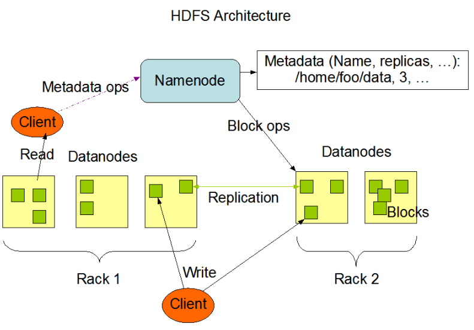
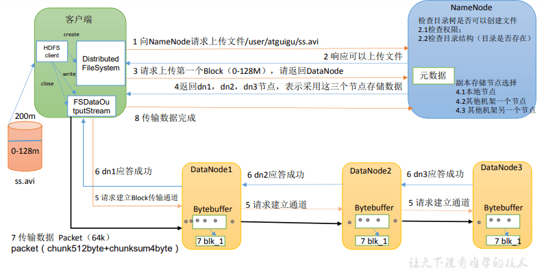
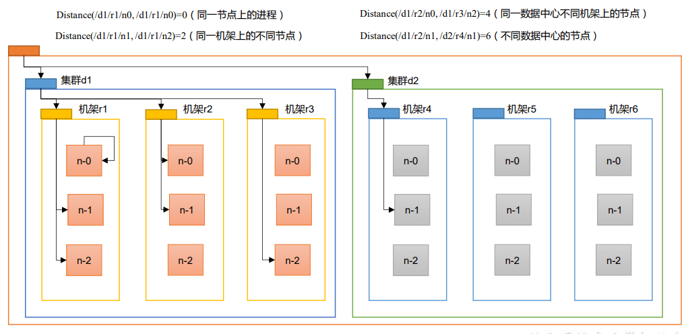
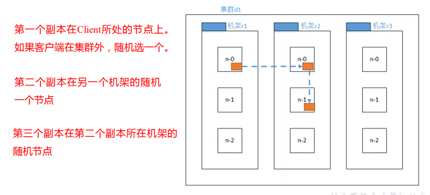
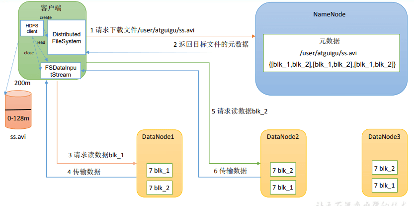
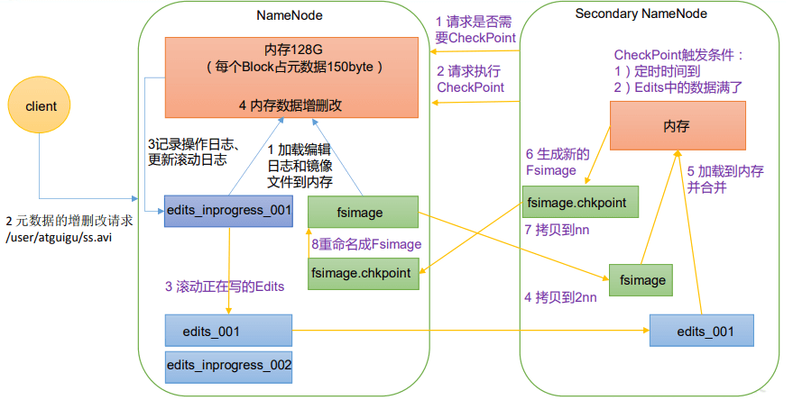
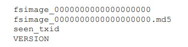
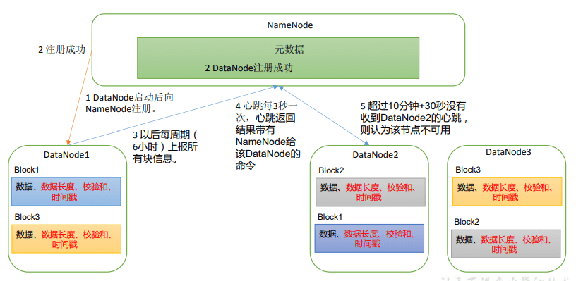

# Hadoop 之 Hdfs

:open_file_folder: `HDFS` 定义 HDFS（Hadoop Distributed File System），它是一个分布式文件系统，用于存储文件，通过目录树来定位文件。

<!-- more -->

## 1 HDFS 概述

### 1.1 HDFS 产出背景及定义

1）HDFS 产生背景 随着数据量越来越大，在一个操作系统存不下所有的数据，那么就分配到更多的操作系 统管理的磁盘中，但是不方便管理和维护，迫切`需要一种系统来管理多台机器上的文件`，这 就是分布式文件管理系统。`HDFS 只是分布式文件管理系统中的一种`。

2）`HDFS 定义 HDFS（Hadoop Distributed File System），它是一个文件系统`，用于存储文件，通过目录树来定位文件；其次，它是分布式的，由很多服务器联合起来实现其功能，集群中的服务 器有各自的角色。

HDFS 的使用场景：`适合一次写入，多次读出的场景`。一个文件经过创建、写入和关闭 之后就不需要改变。

### 1.2 HDFS 优缺点

**HDFS 优点**

1）高容错性

➢ 数据自动保存多个副本。它通过增加副本的形式，提高容错性。

➢ 某一个副本丢失以后，它可以自动恢复。

2）适合处理大数据

➢ 数据规模：能够处理数据规模达到 GB、TB、甚至 PB 级别的数据；

➢ 文件规模：`能够处理百万规模以上的文件数量`，数量相当之大。

3）`可构建在廉价机器上`，通过多副本机制，提高可靠性。

**HDFS 缺点**.

1）`不适合低延时数据访问`，比如毫秒级的存储数据，是做不到的。

2）`无法高效的对大量小文件进行存储`。

➢ 存储大量小文件的话，它会占用 NameNode 大量的内存来存储文件目录和 块信息。这样是不可取的，因为 NameNode 的内存总是有限的；

➢ 小文件存储的寻址时间会超过读取时间，它违反了 HDFS 的设计目标。

3）不支持并发写入、文件随机修改。

➢ 一个文件只能有一个写，不允许多个线程同时写；

➢ `仅支持数据append（追加）`，不支持文件的随机修改。

### 1.3 HDFS 组成架构



NameNode（nn）：就是 Master，它 是一个主管、管理者。

1. 管理 HDFS 的名称空间；
2. 配置副本策略；
3. 管理数据块（Block）映射信息；
4. 处理客户端读写请求。

DataNode：就是 Slave。NameNode 下达命令，DataNode 执行实际的操作。

1. 存储实际的数据块；
2. 执行数据块的读/写操作。

Client：就是客户端。

1. 文件切分。文件上传 HDFS 的时候，Client 将文件切分成一个一个的 Block，然后进行上传；
2. 与 NameNode 交互，获取文件的位置信息；
3. 与 DataNode 交互，读取或者写入数据；
4. Client 提供一些命令来管理 HDFS，比如 NameNode 格式化；
5. Client 可以通过一些命令来访问 HDFS，比如对 HDFS 增删查改操作；

Secondary NameNode：并非 NameNode 的热备。当 NameNode 挂掉的时候，它并不 能马上替换 NameNode 并提供服务。

1. 辅助 NameNode，分担其工作量，比如定期合并 Fsimage 和 Edits，并推送给 NameNode ；
2. 在紧急情况下，可辅助恢复 NameNode。

### 1.4 HDFS 文件块大小（面试重点）

HDFS 中的文件在物理上是分块存储（Block），块的大小可以通过配置参数（dfs.blocksize）来规定，默认大小在 Hadoop2.x/3.x 版本中是 128M，1.x 版本中是 64M。

1）如果寻址时间约为 10ms， 即查找到目标 block 的时间为 10ms。

2）寻址时间为传输时间的 1% 时，则为最佳状态。（专家） 因此，传输时间 =10ms/0.01=1000ms=1s

3）而目前磁盘的传输速率普遍为 100MB/s。

思考：为什么块的大小不能设置太小，也不能设置太大？

1）HDFS 的块设置`太小，会增加寻址时间`，程序一直在找块的开始位置；

2）如果块设置的`太大`，`从磁盘传输数据的时间会明显大于定位这个块开始位置所需的时间`。导致程序在处理这块数据时，会非常慢。

总结：HDFS 块的大小设置主要取决于磁盘传输速率。

## 2 HDFS 的 Shell 操作（开发重点）

### 2.1 基本语法

hadoop fs 具体命令 OR hdfs dfs 具体命令

两个是完全相同的。

## 2.2 命令大全

```shell
hadoop fs --help
```

### 2.3 常用命令实操

#### 2.3.1 上传

```shell
#在hadoop根路径下创建一个sanguo的文件夹
hadoop fs -mkdir /sanguo
#moveFromLocal(从本地剪切到hadoop)
hadoop fs -moveFromLocal shuguo.txt /sanguo
#copyFromLocal(从本地复制到hadoop)
hadoop fs -copyFromLocal weiguo.txt /sa(生产环境put用的更多)guo
#等同于copyFromLocal(生产环境put用的更多)
hadoop fs -put wuguo.txt /sanguo
#文件追加
hadoop fs -appendToFile liubei.txt /sanguo/shuguo.txt
```

#### 2.3.2 下载

```shell
#将shuguo.txt拷贝到当前文件夹(后面的 . 代表当前文件夹)
hadoop fs -copyToLocal /sanguo/shuguo.txt .
#等同于copyToLocal(生产环境更多用get,shuguo2指定转存后的文件名)
hadoop -get /sanguo/shuguo.txt ./shuguo2.txt
```

#### 2.3.3 HDFS 直接操作

```shell
#查看根路径
hadoop fs -ls /
#查看sanguo文件夹
hadoop fs -ls /sanguo
#查看文件内容
hadoop fs -cat /sanguo/shuguo.txt
#-chgrp、-chmod、-chown：Linux 文件系统中的用法一样，修改文件所属权限
hadoop fs -chgrp chen /sanguo/shuguo.txt
#创建文件夹
hadoop fs -mkdir /qingguo
#从HDFS的一个路径拷贝HDFS的另一个路径
hadoop fs -cp /sanguo/shuguo.txt /qingguo
#移动剪切
hadoop fs -mv /sanguo/weiguo.txt /qingguo
#显示一个文件的末尾 1kb 的数据
hadoop fs -tail /sanguo/wuguo.txt
#删除文件或文件夹
hadoop fs -rm /sanguo/wuguo.txt
#递归删除目录及目录里面内容
hadoop fs -rm -r /sanguo
#统计文件夹的大小信息
hadoop fs -du -s -h /qingguo
#查看每个文件大小信息
hadoop fs -du -h /qingguo
#设置 HDFS 中文件的副本数量
hadoop fs -setrep 10 /qingguo/shuguo.txt
```

## 3 HDFS 的 API 操作

### 3.1 客户端环境准备

1）找到资料包路径下的 Windows 依赖文件夹，拷贝 hadoop-3.1.0 到非中文路径（比如 d:\）。

2）配置 HADOOP_HOME 环境变量

3）配置 Path 环境变量。

4）验证 Hadoop 环境变量是否正常。双击 winutils.exe，如果报如下错误。说明缺少微软运

5）在 IDEA 中创建一个 Maven 工程 HdfsClientDemo，并导入相应的依赖坐标+日志添加

```xml
<dependencies>
    <dependency>
        <groupId>org.apache.hadoop</groupId>
        <artifactId>hadoop-client</artifactId>
        <version>3.1.3</version>
    </dependency>
    <dependency>
        <groupId>junit</groupId>
        <artifactId>junit</artifactId>
        <version>4.12</version>
    </dependency>
    <dependency>
        <groupId>org.slf4j</groupId>
        <artifactId>slf4j-log4j12</artifactId>
        <version>1.7.30</version>
    </dependency>
</dependencies>
```

6）在项目的 src/main/resources 目录下，新建一个文件，命名为“log4j.properties”，在文件 中填入

```properties
log4j.rootLogger=INFO, stdout
log4j.appender.stdout=org.apache.log4j.ConsoleAppender
log4j.appender.stdout.layout=org.apache.log4j.PatternLayout
log4j.appender.stdout.layout.ConversionPattern=%d %p [%c] - %m%n
log4j.appender.logfile=org.apache.log4j.FileAppender
log4j.appender.logfile.File=target/spring.log
log4j.appender.logfile.layout=org.apache.log4j.PatternLayout
log4j.appender.logfile.layout.ConversionPattern=%d %p [%c] - %m%n
```

7）编写 demo-->胡乱封装一下

```java
public class HdfsClient {
    private static final String URI_ADDRESS="hdfs://hadoop141:8020";
    private static final String USER = "chen";
    private static FileSystem fs;

    static {
        try {
            Configuration configuration = new Configuration();
            fs = FileSystem.get(new URI(URI_ADDRESS), configuration, USER);
        } catch (IOException | InterruptedException | URISyntaxException e) {
            e.printStackTrace();
        }
    }
    //此处编写测试代码
}
```

8）创建目录

```java
    @Test
    public void testMkdir() throws IOException {
        fs.mkdirs(new Path("/sanguo/wuguo"));
        //关闭资源
        fs.close();
    }
```

9）上传

```java
    //配置优先级:hdfs-default.xml-->hdfs-site.xml-->在项目资源目录下的配置文件-->代码里面设置
    @Test
    public void testPut() throws IOException {
        /*
        * 参数1. 是否删除源数据
        * 参数2. 是否允许覆盖
        * 参数3. 源数据路径
        * 参数4. 目的地路径
        * */
        fs.copyFromLocalFile(false,true,new Path("D:\\a.txt"),new Path("/sanguo/shuguo"));
        fs.close();
    }
```

10）文件下载

```java
    @Test
    public void testGet() throws IOException {
        /*
         * 参数1. 源文件是否参数
         * 参数2. 源文件路径
         * 参数3. 目标地址路径
         * 参数4.
         * */
        fs.copyToLocalFile(false, new Path("/sanguo/shuguo/a.txt"), new Path("D:\\b.txt"), true);
        fs.close();
    }
```

11）删除

```java
    @Test
    public void testDel() throws IOException {
        /*
        * 参数1. 要删除的路径
        * 参数2. 是否递归删除
        * */
        //删除文件
        //fs.delete(new Path("/sanguo/shuguo/a.txt"), false);
        //删除空目录
        //fs.delete(new Path("/sanguo/wuguo"),false);
        //删除非空目录
        fs.delete(new Path("/qingguo"), true);
    }
```

12）文件的更名和移动

```java
    @Test
    public void testMove() throws IOException {
        /*
        * 参数1. 源文件路径
        * 参数2. 目标文件路径
        * */
        //对文件名称的修改
        //fs.rename(new Path("/sanguo/shuguo/a.txt"), new Path("/sanguo/shuguo/asd.txt"));
        //文件的移动和更名
        //fs.rename(new Path("/sanguo/shuguo/asd.txt"), new Path("/sanguo/wuguo/qwe.txt"));
        //目录的更名
        fs.rename(new Path("/sanguo/wuguo"), new Path("/sanguo/weiguo"));
    }
```

13）获取文件详情

```java
    @Test
    public void fileDetail() throws IOException {
        RemoteIterator<LocatedFileStatus> remoteIterator = fs.listFiles(new Path("/"), true);
        while (remoteIterator.hasNext()) {
            LocatedFileStatus fileStatus = remoteIterator.next();
            System.out.println("文件路径: "+fileStatus.getPath());
            System.out.println("权限: "+fileStatus.getPermission());
            System.out.println("所有权: "+fileStatus.getOwner());
            System.out.println("所属组: "+fileStatus.getGroup());
            System.out.println("长度: "+fileStatus.getLen());
            System.out.println("修改时间: "+new Date(fileStatus.getModificationTime()));
            System.out.println("副本: "+fileStatus.getReplication());
            System.out.println("块大小: "+fileStatus.getBlockSize());
            System.out.println(Arrays.toString(fileStatus.getBlockLocations()));
        }
    }
```

14）判断是文件还是文件夹

```java
    @Test
    public void testFile() throws IOException {
        FileStatus[] fileStatuses = fs.listStatus(new Path("/"));
        for (FileStatus status : fileStatuses) {
            if (status.isFile()) {
                System.out.println("文件: "+status.getPath().getName());
            }else{
                System.out.println("目录: "+status.getPath().getName());
            }

        }
    }
```

## 4 HDFS 的读写流程（面试重点）

#### 4.1.1 剖析文件写入



1）客户端通过 Distributed FileSystem 模块向 NameNode 请求上传文件，NameNode 检查目标文件是否已存在，父目录是否存在。

2）NameNode 返回是否可以上传。

3）客户端请求第一个 Block 上传到哪几个 DataNode 服务器上。

4）NameNode 返回 3 个 DataNode 节点，分别为 dn1、dn2、dn3。

5）客户端通过 FSDataOutputStream 模块请求 dn1 上传数据，dn1 收到请求会继续调用 dn2，然后 dn2 调用 dn3，将这个通信管道建立完成。

6）dn1、dn2、dn3 逐级应答客户端。

7）客户端开始往 dn1 上传第一个 Block（先从磁盘读取数据放到一个本地内存缓存）， 以 Packet 为单位，dn1 收到一个 Packet 就会传给 dn2，dn2 传给 dn3；dn1 每传一个 packet 会放入一个应答队列等待应答。

8）当一个 Block 传输完成之后，客户端再次请求 NameNode 上传第二个 Block 的服务 器。（重复执行 3-7 步）。

#### 4.1.2 网络拓扑-节点距离计算

在 HDFS 写数据的过程中，NameNode 会选择距离待上传数据最近距离的 DataNode 接 收数据。那么这个最近距离怎么计算呢？



#### 4.1.3 机架感知（副本存储节点选择）



## 4.2 HDFS 读数据流程



1）客户端通过 DistributedFileSystem 向 NameNode 请求下载文件，NameNode 通过查 询元数据，找到文件块所在的 DataNode 地址。

2）挑选一台 DataNode（就近原则，然后随机）服务器，请求读取数据。

3）DataNode 开始传输数据给客户端（从磁盘里面读取数据输入流，以 Packet 为单位 来做校验）。

4）客户端以 Packet 为单位接收，先在本地缓存，然后写入目标文件。

## 5 NameNode 和 SecondaryNameNode

### 5.1 NN 和 2NN 工作机制

首先，我们做个假设，如果存储在 NameNode 节点的磁盘中，因为经常需要进行随机访 问，还有响应客户请求，必然是效率过低。

`因此，元数据需要存放在内存中`。但如果只存在 内存中，一旦断电，元数据丢失，整个集群就无法工作了。因此产生在磁盘中备份元数据的 `FsImage`

这样又会带来新的问题，当在内存中的元数据更新时，如果同时更新 FsImage，就会导 致效率过低，但如果不更新，就会发生一致性问题，一旦 NameNode 节点断电，就会产生数 据丢失。`因此，引入 Edits 文件（只进行追加操作，效率很高,类似redis的AOF）`。每当元数据有更新或者添 加元数据时，修改内存中的元数据并追加到 Edits 中。这样，一旦 NameNode 节点断电，可 以通过 FsImage 和 Edits 的合并，合成元数据

但是，如果长时间添加数据到 Edits 中，会导致该文件数据过大，效率降低，而且一旦 断电，恢复元数据需要的时间过长。因此，需要定期进行 FsImage 和 Edits 的合并，如果这 个操作由 NameNode 节点完成，又会效率过低。`因此，引入一个新的节点SecondaryNamenode， 专门用于 FsImage 和 Edits 的合并`



1）第一阶段：NameNode 启动

（1）第一次启动 NameNode 格式化后，创建 Fsimage 和 Edits 文件。如果不是第一次启动，直接加载编辑日志和镜像文件到内存

（2）客户端对元数据进行增删改的请求。

（3）NameNode 记录操作日志，更新滚动日志。

（4）NameNode 在内存中对元数据进行增删改。

2）第二阶段：Secondary NameNode 工作

（1）Secondary NameNode 询问 NameNode 是否需要 CheckPoint。直接带回 NameNode 是否检查结果。

（2）Secondary NameNode 请求执行 CheckPoint。

（3）NameNode 滚动正在写的 Edits 日志。

（4）将滚动前的编辑日志和镜像文件拷贝到 Secondary NameNode。

（5）Secondary NameNode 加载编辑日志和镜像文件到内存，并合并。

（6）生成新的镜像文件 fsimage.chkpoint。

（7）拷贝 fsimage.chkpoint 到 NameNode。

（8）NameNode 将 fsimage.chkpoint 重新命名成 fsimage。

### 5.2 Fsimage 和 Edits 解析

NameNode 被格式化之后，将在/opt/module/hadoop-3.1.3/data/tmp/dfs/name/current 目录中产生如下文件



（1）Fsimage 文件：HDFS 文件系统元数据的一个`永久性的检查点`，其中包含 HDFS 文件系统的所有目 录和文件 inode 的序列化信息。

（2）Edits 文件：存放 HDFS 文件系统的所有更新操作的路径，文件系统客户端执行的所有写操作首先 会被记录到 Edits 文件中。

（3）seen*txid 文件保存的是一个数字，就是最后一个 edits*的数字

（4）每 次`NameNode`启动的时候都会将 Fsimage 文件读入内存，加 载 Edits 里面的更新操作，保证内存 中的元数据信息是最新的、同步的，可以看成 NameNode 启动的时候就将 Fsimage 和 Edits 文件进行了合并。

1）oiv 查看 Fsimage 文件

hdfs oiv -p 文件类型 -i 镜像文件 -o 转换后文件输出路径

```shell
hdfs oiv -p XML -i fsimage_0000000000000000435 -o /opt/oivtest.xml
```

2）oev 查看 Edits 文件

hdfs oev -p 文件类型 -i 编辑日志 -o 转换后文件输出路径

```shell
hdfs oev -p XML -i edits_0000000000000000438-0000000000000000439 -o /opt/oevtest.xml
```

### 5.3 CheckPoint 时间设置

1）通常情况下，SecondaryNameNode 每隔一小时执行一次。

```xml
<property>
 	<name>dfs.namenode.checkpoint.period</name>
 	<value>3600s</value>
</property>
```

2）一分钟检查一次操作次数，当操作次数达到 1 百万时，SecondaryNameNode 执行一次。

```xml
<property>
 	<name>dfs.namenode.checkpoint.txns</name>
 	<value>1000000</value>
	<description>操作动作次数</description>
</property>
<property>
 	<name>dfs.namenode.checkpoint.check.period</name>
 	<value>60s</value>
	<description> 1 分钟检查一次操作次数</description>
</property>
```

## 6 DataNode

### 6.1 DataNode 工作机制



（1）一个数据块在 DataNode 上以文件形式存储在磁盘上，包括两个文件，一个是数据 本身，一个是元数据包括数据块的长度，块数据的校验和，以及时间戳。

（2）DataNode 启动后向 NameNode 注册，通过后，周期性（6 小时）的向 NameNode 上 报所有的块信息。

DN 向 NN 汇报当前解读信息的时间间隔，默认 6 小时；

```xml
<property>
	<name>dfs.blockreport.intervalMsec</name>
	<value>21600000</value>
</property>
```

DN 扫描自己节点块信息列表的时间，默认 6 小时

```xml
<property>
	<name>dfs.datanode.directoryscan.interval</name>
	<value>21600s</value>
</property>
```

（3）心跳是每 3 秒一次，心跳返回结果带有 NameNode 给该 DataNode 的命令如复制块数据到另一台机器，或删除某个数据块。如果超过 10 分钟没有收到某个 DataNode 的心跳， 则认为该节点不可用。

（4）集群运行中可以安全加入和退出一些机器。

### 6.2 数据完整性

思考：如果电脑磁盘里面存储的数据是控制高铁信号灯的红灯信号（1）和绿灯信号（0）， 但是存储该数据的磁盘坏了，一直显示是绿灯，是否很危险？同理 DataNode 节点上的数据 损坏了，却没有发现，是否也很危险，那么如何解决呢？ 如下是 DataNode 节点保证数据完整性的方法。

（1）当 DataNode 读取 Block 的时候，它会计算 CheckSum。

（2）如果计算后的 CheckSum，与 Block 创建时值不一样，说明 Block 已经损坏。 （3）Client 读取其他 DataNode 上的 Block。

（4）常见的校验算法 crc（32），md5（128），sha1（160）

（5）DataNode 在其文件创建后周期验证 CheckSum。

### 6.3 掉线时限参数设置

TimeOut = 2 _ dfs.namenode.heartbeat.recheck-interval + 10 _ dfs.heartbeat.interval。

```xml
<property>
 	<name>dfs.namenode.heartbeat.recheck-interval</name>
 	<value>300000</value>
</property>
<property>
 	<name>dfs.heartbeat.interval</name>
 	<value>3</value>
</property>
```
