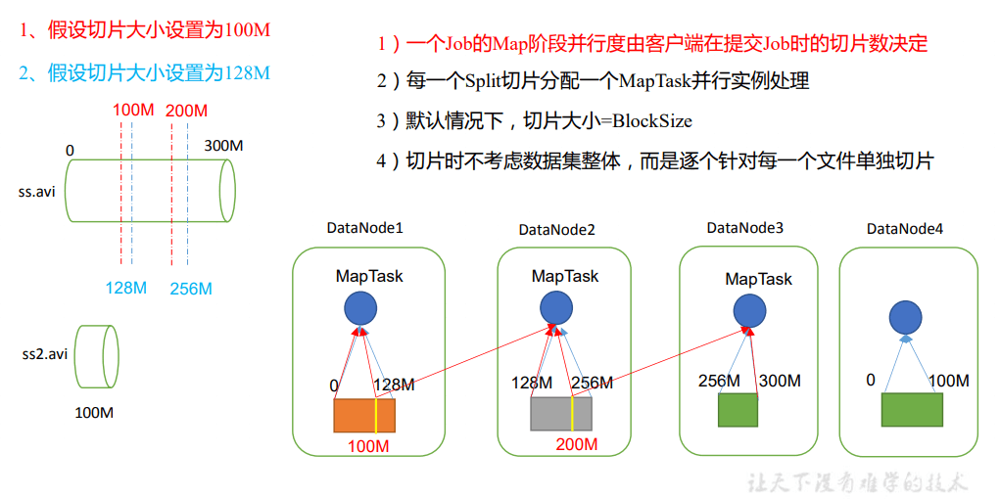
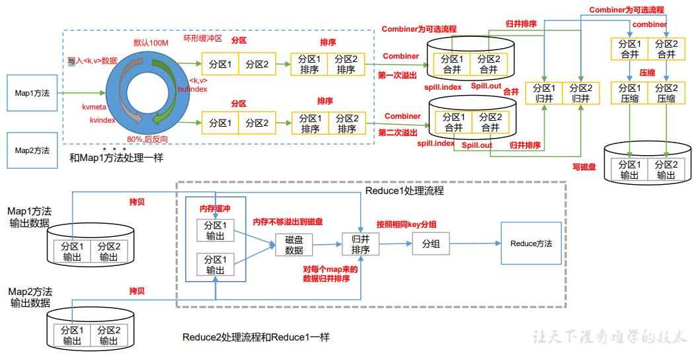

# Hadoop 之 MapReduce

:8ball: `MapReduce` 是一个 `分布式运算程序` 的编程框架，是用户开发“基于 Hadoop 的数据分析应用”的核心框架。

<!-- more -->

## 1 MapReduce 概述

### 1.1 MapReduce 定义

MapReduce 核心功能是将`用户编写的业务逻辑代码`和`自带默认组件`整合成一个完整的 `分布式运算程序`，并发运行在一个 Hadoop 集群上。

### 1.2 MapReduce 优缺点

#### 1.2.1 优点

1）MapReduce 易于编程

`它简单的实现一些接口`，就可以完成一个分布式程序，这个分布式程序可以分布到大量 廉价的 PC 机器上运行。也就是说你写一个分布式程序，跟写一个简单的串行程序是一模一 样的。就是因为这个特点使得 MapReduce 编程变得非常流行。

2）良好的扩展性

当你的计算资源不能得到满足的时候，你可以通过`简单的增加机器`来扩展它的计算能力。

3）高容错性

MapReduce 设计的初衷就是使程序能够部署在廉价的 PC 机器上，这就要求它具有很高 的容错性。比如`其中一台机器挂了，它可以把上面的计算任务转移到另外一个节点上运行， 不至于这个任务运行失败`，而且这个过程不需要人工参与，而完全是由 Hadoop 内部完成的。

4）适合 PB 级以上海量数据的离线处理

可以实现上千台服务器集群并发工作，提供数据处理能力。

#### 1.2.2 缺点

1）不擅长实时计算

MapReduce 无法像 MySQL 一样，在毫秒或者秒级内返回结果。

2）不擅长流式计算

流式计算的输入数据是动态的，而 MapReduce 的输入数据集是静态的，不能动态变化。 这是因为 MapReduce 自身的设计特点决定了数据源必须是静态的。

3）不擅长 DAG（有向无环图）计算

多个应用程序存在依赖关系，后一个应用程序的输入为前一个的输出。在这种情况下， MapReduce 并不是不能做，而是使用后，每个 MapReduce 作业的输出结果都会写入到磁盘， 会造成大量的磁盘 IO，导致性能非常的低下。

### 1.3 MapReduce 核心思想


### 1.4 MapReduce 进程

一个完整的 MapReduce 程序在分布式运行时有三类实例进程：

（1）MrAppMaster：负责整个程序的过程调度及状态协调。

（2）MapTask：负责 Map 阶段的整个数据处理流程。

（3）ReduceTask：负责 Reduce 阶段的整个数据处理流程。

### 1.5 官方 WordCount 源码

采用反编译工具反编译源码，发现 WordCount 案例有 Map 类、Reduce 类和驱动类。且 数据的类型是 Hadoop 自身封装的序列化类型。

### 1.6 常用数据序列化类型

| Java 类型 | Hadoop Writable 类型 |
| --------- | -------------------- |
| Boolean   | BooleanWritable      |
| Byte      | ByteWritable         |
| Int       | IntWritable          |
| Float     | FloatWritable        |
| Long      | LongWritable         |
| Double    | DoubleWritable       |
| String    | Text                 |
| Map       | MapWritable          |
| Array     | ArrayWritable        |
| Null      | NullWritable         |

### 1.7 MapReduce 编程规范

用户编写的程序分成三个部分：Mapper、Reducer 和 Driver。

1．Mapper 阶段

（1）用户自定义的 Mapper 要继承自己的父类

（2）Mapper 的输入数据是 KV 对的形式（KV 的类型可自定义）

（3）Mapper 中的业务逻辑写在 map()方法中

（4）Mapper 的输出数据是 KV 对的形式（KV 的类型可自定义）

（5）map()方法（MapTask 进程）对每一个<K,V>调用一次

2．Reducer 阶段

（1）用户自定义的 Reducer 要继承自己的父类

（2）Reducer 的输入数据类型对应 Mapper 的输出数据类型，也是 KV

（3）Reducer 的业务逻辑写在 reduce()方法中

（4）ReduceTask 进程对每一组相同 k 的组调用一次 reduce()方法

3．Driver 阶段

相当于 YARN 集群的客户端，用于提交我们整个程序到 YARN 集群，提交的是 封装了 MapReduce 程序相关运行参数的 job 对象

#### 1.8.1 本地测试

1）需求

在给定的文本文件中统计输出每一个单词出现的总次数

```tex
atguigu atguigu
ss ss
cls cls
jiao
banzhang
xue
hadoop
```

2）需求分析

按照 MapReduce 编程规范，分别编写 Mapper，Reducer，Driver。

3）环境准备

（1）创建 maven 工程，MapReduceDemo

（2）在 pom.xml 文件中添加如下依赖

```xml
<dependencies>
 	<dependency>
 		<groupId>org.apache.hadoop</groupId>
 		<artifactId>hadoop-client</artifactId>
 		<version>3.1.3</version>
 	</dependency>
 	<dependency>
 		<groupId>junit</groupId>
 		<artifactId>junit</artifactId>
 		<version>4.12</version>
 	</dependency>
 	<dependency>
	 	<groupId>org.slf4j</groupId>
 		<artifactId>slf4j-log4j12</artifactId>
 		<version>1.7.30</version>
 	</dependency>
</dependencies>
```

（3）在项目的 src/main/resources 目录下，新建一个文件，命名为“log4j.properties”，在 文件中填入。

```properties
log4j.rootLogger=INFO, stdout
log4j.appender.stdout=org.apache.log4j.ConsoleAppender
log4j.appender.stdout.layout=org.apache.log4j.PatternLayout
log4j.appender.stdout.layout.ConversionPattern=%d %p [%c] - %m%n
log4j.appender.logfile=org.apache.log4j.FileAppender
log4j.appender.logfile.File=target/spring.log
log4j.appender.logfile.layout=org.apache.log4j.PatternLayout
log4j.appender.logfile.layout.ConversionPattern=%d %p [%c] - %m%n
```

#### 1.8.2 编写测试类

**Mapper**

```java
public class WorldCountMapper extends Mapper<LongWritable, Text, Text, IntWritable> {
    private Text text = new Text();
    private IntWritable intWritable = new IntWritable(1);

    @Override
    protected void map(LongWritable key, Text value, Context context) throws IOException, InterruptedException {
        //1. 获取一行
        String line = value.toString();
        //2. 切割
        String[] words = line.split(" ");
        //3. 循环写出
        for (String word : words) {
            text.set(word);
            //写出
            context.write(text, intWritable);
        }
    }
}
```

**Reducer**

```java
public class WorldCountReduce extends Reducer<Text, IntWritable,Text,IntWritable> {
    private IntWritable intWritable=new IntWritable();
    @Override
    protected void reduce(Text key, Iterable<IntWritable> values, Context context) throws IOException, InterruptedException {
        //累加
        int sum=0;
        for (IntWritable value : values) {
            sum+=value.get();
        }
        intWritable.set(sum);
        //写出
        context.write(key, intWritable);
    }
}
```

**Driver**

```java
public class WorldCountDriver {
    public static void main(String[] args) throws IOException, ClassNotFoundException, InterruptedException {
        //1 获取job
        Configuration configuration=new Configuration();
        Job job = Job.getInstance(configuration);
        //2 设置jar包路径
        job.setJarByClass(WorldCountDriver.class);
        //3 关联mapper和reduce
        job.setMapperClass(WorldCountMapper.class);
        job.setReducerClass(WorldCountReduce.class);
        //4 设置map输出的kv类型
        job.setMapOutputKeyClass(Text.class);
        job.setMapOutputValueClass(IntWritable.class);
        //5 设置最终输出的kv类型
        job.setOutputKeyClass(Text.class);
        job.setOutputValueClass(IntWritable.class);
        //6 设置输入路径和输出路径
        FileInputFormat.setInputPaths(job, new Path("D:\\hadoop-test\\input"));
        FileOutputFormat.setOutputPath(job, new Path("D:\\hadoop-test\\output"));
        //7 提交job
        boolean b = job.waitForCompletion(true);
        System.exit(b?0:1);
    }
}
```

#### 1.8.3 提交到集群测试

**修改路径参数**(改为命令行参数)

```java
FileInputFormat.setInputPaths(job, new Path(args[0]));
FileOutputFormat.setOutputPath(job, new Path(args[1]));
```

**打包插件**

```xml
<build>
    <plugins>
        <plugin>
            <artifactId>maven-compiler-plugin</artifactId>
            <version>3.6.1</version>
            <configuration>
                <source>1.8</source>
                <target>1.8</target>
            </configuration>
        </plugin>
        <plugin>
            <artifactId>maven-assembly-plugin</artifactId>
            <configuration>
                <descriptorRefs>
                    <descriptorRef>jar-with-dependencies</descriptorRef>
                </descriptorRefs>
            </configuration>
            <executions>
                <execution>
                    <id>make-assembly</id>
                    <phase>package</phase>
                    <goals>
                        <goal>single</goal>
                    </goals>
                </execution>
            </executions>
        </plugin>
    </plugins>
</build>
```

**打好 jar 包,在 linux 上运行 jar 包**(最小包,环境 linux 上面有)

com.cssl.WorldCountDriver(指定 main 函数)

```shell
hadoop jar MapReduce-Test-1.0-SNAPSHOT.jar com.cssl.WorldCountDriver /qingguo /output
```

## 2 Hadoop 序列化

### 2.1 序列化概述

1）什么是序列化

序列化就是`把内存中的对象，转换成字节序列`（或其他数据传输协议）以便于存储到磁 盘（持久化）和网络传输。

反序列化就是将收到字节序列（或其他数据传输协议）或者是`磁盘的持久化数据，转换成内存中的对象。 `

2）为什么要序列化

一般来说，“活的”对象只生存在内存里，关机断电就没有了。而且“活的”对象只能 由本地的进程使用，不能被发送到网络上的另外一台计算机。 然而`序列化可以存储“活的” 对象，可以将“活的”对象发送到远程计算机。`

3）为什么不用 Java 的序列化

Java 的序列化是一个重量级序列化框架（Serializable），一个对象被序列化后，会附带 很多额外的信息（各种校验信息，Header，继承体系等），不便于在网络中高效传输。所以， Hadoop 自己开发了一套序列化机制（Writable）。

4）Hadoop 序列化特点：

（1）**紧凑** ：高效使用存储空间。

（2）**快速**：读写数据的额外开销小。

（3）**互操作**：支持多语言的交互

### 2.2 自定义 bean 对象实现序列化接口（Writable）

在企业开发中往往常用的基本序列化类型不能满足所有需求，比如在 Hadoop 框架内部 传递一个 bean 对象，那么该对象就需要实现序列化接口。

（1）必须实现 Writable 接口

（2）反序列化时，需要反射调用空参构造函数，所以必须有空参构造

（3）重写序列化方法

（4）重写反序列化方法

（5）注意反序列化的顺序和序列化的顺序完全一致

（6）要想把结果显示在文件中，需要重写 toString()，可用"\t"分开，方便后续用。

（7）如果需要将自定义的 bean 放在 key 中传输，则还需要实现 Comparable 接口，因为 MapReduce 框中的 Shuffle 过程要求对 key 必须能排序。

### 2.3 序列化案例实操

1）需求

统计每一个手机号耗费的总上行流量、总下行流量、总流量

（1）输入数据 phone_data .txt

（2）输入数据格式：


（3）期望输出数据格式


2）需求分析


3）编写 MapReduce 程序

**编写流量统计的 Bean 对象**

```java
public class FlowBean implements Writable {
    private long upFlow;
    private long downFlow;
    private long sumFlow;

    ...省略get and set

    public FlowBean() {
    }

    @Override
    public void write(DataOutput dataOutput) throws IOException {
        dataOutput.writeLong(upFlow);
        dataOutput.writeLong(downFlow);
        dataOutput.writeLong(sumFlow);
    }

    @Override
    public void readFields(DataInput dataInput) throws IOException {
        this.upFlow = dataInput.readLong();
        this.downFlow = dataInput.readLong();
        this.sumFlow = dataInput.readLong();
    }

    @Override
    public String toString() {
        return upFlow +"\t" + downFlow +"\t" + sumFlow;
    }
}
```

**编写 Mapper 类**

```java
public class FlowMapper extends Mapper<LongWritable, Text, Text, FlowBean> {
    private  Text outK=new Text();
    private  FlowBean outV=new FlowBean();
    @Override
    protected void map(LongWritable key, Text value, Context context) throws IOException, InterruptedException {
        //1. 获取一行
        String line = value.toString();
        //2. 切割
        String[] split = line.split("\t");
        //3. 抓取想要的数据    手机号 上行流量 下行流量
        String phone=split[1];
        String up=split[split.length-3];
        String down=split[split.length-2];
        //4. 封装数据
        outK.set(phone);
        outV.setUpFlow(Long.parseLong(up));
        outV.setDownFlow(Long.parseLong(down));
        outV.setSumFlow();
        //5. 写出
        context.write(outK, outV);
    }
}
```

**编写 Reducer 类**

```java
public class FlowReducer extends Reducer<Text,FlowBean,Text,FlowBean> {

    private FlowBean outV=new FlowBean();
    @Override
    protected void reduce(Text key, Iterable<FlowBean> values, Context context) throws IOException, InterruptedException {
        //1. 变量集合累加值
        long totalUp=0;
        long totalDown=0;
        for (FlowBean value : values) {
            totalUp+=value.getUpFlow();
            totalDown+=value.getDownFlow();
        }
        //2. 封装outK,outV
        outV.setUpFlow(totalUp);
        outV.setDownFlow(totalDown);
        outV.setSumFlow();

        //3. 写出
        context.write(key, outV);
    }
}
```

**编写 Driver 类**

```java
public class FlowDriver {
    public static void main(String[] args) throws IOException, ClassNotFoundException, InterruptedException {
        //获取job
        Configuration configuration = new Configuration();
        Job job = Job.getInstance(configuration);
        //设置jar
        job.setJarByClass(FlowDriver.class);
        //绑定mapper和reducer
        job.setMapperClass(FlowMapper.class);
        job.setReducerClass(FlowReducer.class);
        //设置mapper输出类型
        job.setMapOutputKeyClass(Text.class);
        job.setMapOutputValueClass(FlowBean.class);
        //设置最终输出类型
        job.setOutputKeyClass(Text.class);
        job.setOutputValueClass(FlowBean.class);
        //设置输入输出路径
        FileInputFormat.setInputPaths(job, new Path("D:\\hadoop-test\\input"));
        FileOutputFormat.setOutputPath(job, new Path("D:\\hadoop-test\\output"));
        //提交job
        boolean b = job.waitForCompletion(true);
        System.exit(b?0:1);
    }
}
```

## 3 MapReduce 框架原理


### 3.1 InputFormat 数据输入

#### 3.1.1 切片与 MapTask 并行度决定机制

1）问题引出

MapTask 的并行度决定 Map 阶段的任务处理并发度，进而影响到整个 Job 的处理速度。

`思考：1G 的数据，启动 8 个 MapTask，可以提高集群的并发处理能力。那么 1K 的数 据，也启动 8 个 MapTask，会提高集群性能吗？MapTask 并行任务是否越多越好呢？哪些因 素影响了 MapTask 并行度？`

2）MapTask 并行度决定机制

数据块：Block 是 HDFS 物理上把数据分成一块一块。`数据块是 HDFS 存储数据单位。`

数据切片：数据切片只是在逻辑上对输入进行分片，并不会在磁盘上将其切分成片进行 存储。`数据切片是 MapReduce 程序计算输入数据的单位`，一个切片会对应启动一个 MapTask。



#### 3.1.2 Job 提交流程源码和切片源码详解

1）Job 提交流程源码详解

```java
waitForCompletion()
submit();
	// 1 建立连接
	connect();
		// 1）创建提交 Job 的代理
		new Cluster(getConfiguration());
			// （1）判断是本地运行环境还是 yarn 集群运行环境
			initialize(jobTrackAddr, conf);
	// 2 提交 job
	submitter.submitJobInternal(Job.this, cluster)
		// 1）创建给集群提交数据的 Stag 路径
		Path jobStagingArea = JobSubmissionFiles.getStagingDir(cluster, conf);
		// 2）获取 jobid ，并创建 Job 路径
		JobID jobId = submitClient.getNewJobID();
		// 3）拷贝 jar 包到集群
		copyAndConfigureFiles(job, submitJobDir);
		rUploader.uploadFiles(job, jobSubmitDir);
		// 4）计算切片，生成切片规划文件
		writeSplits(job, submitJobDir);
		maps = writeNewSplits(job, jobSubmitDir);
		input.getSplits(job);
		// 5）向 Stag 路径写 XML 配置文件
		writeConf(conf, submitJobFile);
		conf.writeXml(out);
		// 6）提交 Job,返回提交状态
		status = submitClient.submitJob(jobId,submitJobDir.toString(),job.getCredentials());
```


2）FileInputFormat 切片源码解析（input.getSplits(job)）

（1）程序先找到你数据存储的目录。

（2）开始遍历处理（规划切片）目录下的每一个文件

（3）遍历第一个文件 ss.txt

1. 获取文件大小 fs.sizeOf(ss.txt)

2. 计算切片大小 computeSplitSize(Math.max(minSize,Math.min(maxSize,blocksize)))=blocksize=128M

3. 默认情况下，切片大小=blocksize

4. 开始切，形成第 1 个切片：ss.txt—0:128M 第 2 个切片 ss.txt—128:256M 第 3 个切片 ss.txt—256M:300M （每次切片时，都要判断切完剩下的部分是否大于块的 1.1 倍，不大于 1.1 倍就划分一块切片）

5. 将切片信息写到一个切片规划文件中

6. 整个切片的核心过程在 getSplit()方法中完成

7. InputSplit 只记录了切片的元数据信息，比如起始位置、长度以及所在的节点列表等。

（4）提交切片规划文件到 YARN 上，YARN 上的 MrAppMaster 就可以根据切片规划文件计算开启 MapTask 个数

#### 3.1.3 FileInputFormat 切片大小的参数配置

（1）源码中计算切片大小的公式

Math.max(minSize, Math.min(maxSize, blockSize)); mapreduce.input.fileinputformat.split.minsize=1 默认值为 1 mapreduce.input.fileinputformat.split.maxsize= Long.MAXValue 默认值 Long.MAXValue

因此，默认情况下，切片大小=blocksize。

（2）切片大小设置

maxsize（切片最大值）：参数如果调得比 blockSize 小，则会让切片变小，而且就等于配置的这个参数的值。

minsize（切片最小值）：参数调的比 blockSize 大，则可以让切片变得比 blockSize 还大。

（3）获取切片信息 API

// 获取切片的文件名称

String name = inputSplit.getPath().getName();

// 根据文件类型获取切片信息

FileSplit inputSplit = (FileSplit) context.getInputSplit();

#### 3.1.4 TextInputFormat

1）FileInputFormat 实现类

思考：在运行 MapReduce 程序时，输入的文件格式包括：基于行的日志文件、二进制 格式文件、数据库表等。那么，针对不同的数据类型，MapReduce 是如何读取这些数据的呢？

FileInputFormat 常见的接口实现类包括：`TextInputFormat`、`KeyValueTextInputFormat`、 `NLineInputFormat`、`CombineTextInputFormat 和自定义 InputFormat 等`。

2）TextInputFormat

TextInputFormat 是默认的 FileInputFormat 实现类。按行读取每条记录。`键是存储该行在整个文件中的起始字节偏移量， LongWritable 类型。值是这行的内容，不包括任何行终止 符（换行符和回车符），Text 类型`

#### 3.1.5 CombineTextInputFormat 切片机制

框架默认的 TextInputFormat 切片机制是对任务按文件规划切片，`不管文件多小，都会 是一个单独的切片`，都会交给一个 MapTask，这样如果有大量小文件，就会`产生大量的 MapTask`，处理效率极其低下。

1）应用场景：

CombineTextInputFormat 用于小文件过多的场景，它可以将多个小文件从逻辑上规划到 一个切片中，这样，多个小文件就可以交给一个 MapTask 处理。

2）虚拟存储切片最大值设置

CombineTextInputFormat.setMaxInputSplitSize(job, 4194304);// 4m

注意：虚拟存储切片最大值设置最好根据实际的小文件大小情况来设置具体的值。

3）切片机制

生成切片过程包括：虚拟存储过程和切片过程二部分。


#### 3.1.6 CombineTextInputFormat 案例实操

1）需求

将输入的大量小文件合并成一个切片统一处理。

（1）输入数据

准备 4 个小文件

（2）期望

期望一个切片处理 4 个文件

2）实现过程

1. 不做任何处理，运行 1.8 节的 WordCount 案例程序，观察切片个数为 4。

```shell
number of splits:4
```

2. 在 WordcountDriver 中增加如下代码，运行程序，并观察运行的切片个数为 3。

（a）驱动类中添加代码如下：

```java
// 如果不设置 InputFormat，它默认用的是 TextInputFormat.class
job.setInputFormatClass(CombineTextInputFormat.class);
//虚拟存储切片最大值设置 4m
CombineTextInputFormat.setMaxInputSplitSize(job, 4194304);
```

（b）运行如果为 3 个切片。

```shell
number of splits:3
```

3. 将虚拟存储切片最大值设置 20m 继续测试,切片结果为 1

### 3.2 MapReduce 工作流程


上面的流程是整个 MapReduce 最全工作流程，但是 Shuffle 过程只是从第 7 步开始到第 16 步结束，具体 Shuffle 过程详解，如下：

（1）MapTask 收集我们的 map()方法输出的 kv 对，放到内存缓冲区中

（2）从内存缓冲区不断溢出本地磁盘文件，可能会溢出多个文件

（3）多个溢出文件会被合并成大的溢出文件

（4）在溢出过程及合并的过程中，都要调用 Partitioner 进行分区和针对 key 进行排序

（5）ReduceTask 根据自己的分区号，去各个 MapTask 机器上取相应的结果分区数据

（6）ReduceTask 会抓取到同一个分区的来自不同 MapTask 的结果文件，ReduceTask 会将这些文件再进行合并（归并排序）

（7）合并成大文件后，Shuffle 的过程也就结束了，后面进入 ReduceTask 的逻辑运算过 程（从文件中取出一个一个的键值对 Group，调用用户自定义的 reduce()方法）

注意：

（1）Shuffle 中的缓冲区大小会影响到 MapReduce 程序的执行效率，原则上说，缓冲区 越大，磁盘 io 的次数越少，执行速度就越快。

（2）缓冲区的大小可以通过参数调整，参数：mapreduce.task.io.sort.mb 默认 100M。

### 3.3 Shuffle 机制

#### 3.3.1 Shuffle 机制

Map 方法之后，Reduce 方法之前的数据处理过程称之为 Shuffle。



#### 3.3.2 Partition 分区

1、问题引出

要求将统计结果按照条件输出到不同文件中（分区）。比如：将统计结果按照手机 归属地不同省份输出到不同文件中（分区）

2、默认 Partitioner 分区

```java
public class HashPartitioner<K, V> extends Partitioner<K, V> {
	public int getPartition(K key, V value, int numReduceTasks) {
		return (key.hashCode() & Integer.MAX_VALUE) % numReduceTasks;
	}
}
```

默 认分区是根据 key 的 hashCode 对 ReduceTasks 个数取模得到的。用户没法控制哪个 key 存储到哪个分区。

```java
//设置ReduceTasks个数,即 numReduceTasks
job.setNumReduceTasks,(2);
//不设置默认1个ReduceTasks,不会走前面取模方法
```

3、自定义 Partitioner 步骤

（1）自定义类继承 Partitioner，重写 getPartition()方法

```java
public class CustomPartitioner extends Partitioner<Text, FlowBean> {
	@Override
	public int getPartition(Text key, FlowBean value, int numPartitions) {
		// 控制分区代码逻辑
		… …
		return partition;
	}
}
```

（2）在 Job 驱动中，设置自定义 Partitioner

```java
job.setPartitionerClass(CustomPartitioner.class);
```

（3）自定义 Partition 后，要根据自定义 Partitioner 的逻辑设置相应数量的 ReduceTask

```java
job.setNumReduceTasks(5);
```

#### 3.3.3 Partition 分区案例实操

1）需求

将统计结果按照手机归属地不同省份输出到不同文件中（分区）

（1）输入数据

phone_data .txt

（2）期望输出数据

手机号 136、137、138、139 开头都分别放到一个独立的 4 个文件中，其他开头的放到 一个文件中。

2）在案例 2.3 的基础上，增加一个分区类

```java
public class ProvincePartitioner extends Partitioner<Text, FlowBean> {

    @Override
    public int getPartition(Text text, FlowBean flowBean, int numPartitions) {
        String phone = text.toString();
        String prefix = phone.substring(0, 3);

        int partition;
        if("136".equals(prefix)){
            partition=0;
        }else if("137".equals(prefix)){
            partition=1;
        }else if("138".equals(prefix)){
            partition=2;
        }else if("139".equals(prefix)){
            partition=3;
        }else{
            partition=4;
        }

        return partition;
    }
}
```

3）在驱动函数中指定自定义数据分区设置和 ReduceTask 个数

```java
//设置自定义PartitionerClass
job.setPartitionerClass(ProvincePartitioner.class);
//设置ReduceTasks个数
job.setNumReduceTasks(5);
```

4）分区总结

（1）如果 ReduceTask 的数量> getPartition 的结果数，则会多产生几个空的输出文件 part-r-000xx；

（2）如果 1<ReduceTask 的数量<getPartition 的结果数，则有一部分分区数据无处安放，会 Exception；

（3）如 果 ReduceTask 的数量=1，则不管 MapTask 端输出多少个分区文件，最终结果都交给这一个 ReduceTask，最终也就只会产生一个结果文件 part-r-00000；

（4）分区号必须从零开始，逐一累加。

##### 3.3.4 WritableComparable 排序

排序是 MapReduce 框架中最重要的操作之一。

MapTask 和 ReduceTask 均会对数据`按照key进行排序`。该操作属于 Hadoop 的默认行为。`任何应用程序中的数据均会被排序，而不管逻辑上是 否需要`。

默认排序是按照`字典顺序排序`，且实现该排序的方法是`快速排序`。

对于 MapTask，它会将处理的结果暂时放到环形缓冲区中，`当环形缓冲区使 用率达到一定阈值后，再对缓冲区中的数据进行一次快速排序`，并将这些有序数 据溢写到磁盘上，而当数据处理完毕后，`它会对磁盘上所有文件进行归并排序`。

对于 ReduceTask，它从每个 MapTask 上远程拷贝相应的数据文件，如果文件大 小超过一定阈值，则溢写磁盘上，否则存储在内存中。如果磁盘上文件数目达到 一定阈值，则进行一次归并排序以生成一个更大文件；如果内存中文件大小或者 数目超过一定阈值，则进行一次合并后将数据溢写到磁盘上。当所有数据拷贝完 毕后，`ReduceTask统一对内存和磁盘上的所有数据进行一次归并排序`。

（1）部分排序 MapReduce 根据输入记录的键对数据集排序。保证输出的每个文件内部有序。

（2）全排序 最终输出结果只有一个文件，且文件内部有序。实现方式是只设置一个 ReduceTask。但该方法在 处理大型文件时效率极低，因为一台机器处理所有文件，完全丧失了 MapReduce 所提供的并行架构。

（3）辅助排序：（GroupingComparator 分组） 在 Reduce 端对 key 进行分组。应用于：在接收的 key 为 bean 对象时，想让一个或几个字段相同（全部 字段比较不相同）的 key 进入到同一个 reduce 方法时，可以采用分组排序。

（4）二次排序 在自定义排序过程中，如果 compareTo 中的判断条件为两个即为二次排序。

##### 3.3.5 WritableComparable 排序案例实操（全排序）

1）需求

根据案例 2.3 序列化案例产生的结果再次对总流量进行倒序排序。

2）需求分析


3）修改案例 2.3FlowBean,实现 Comparable 接口

````java
public class FlowBean implements WritableComparable<FlowBean> {
    ```省略代码```

    @Override
    public int compareTo( FlowBean o) {
        //总流量的倒序排序
        if(this.sumFlow>o.getSumFlow()){
            return -1;
        }else if(this.sumFlow<o.getSumFlow()){
            return 1;
        }else{
            if(this.upFlow>o.getUpFlow()){
                return 1;
            }else if(this.upFlow<o.getUpFlow()){
                return -1;
            }else{
                return 0;
            }
        }
    }
}
````

4）修改 mapper 的输出类型,K 为 FlowBean,V 为 Text

5）修改 Reducer 的输入类型,K 为 FlowBean,V 为 Text

```java
@Override
protected void reduce(FlowBean key, Iterable<Text> values, Context context) throws IOException, InterruptedException {
    for (Text value : values) {
        context.write(value, key);
    }
}
```

6）修改 Driver

```java
//设置mapper输出类型
job.setMapOutputKeyClass(FlowBean.class);
job.setMapOutputValueClass(Text.class);
```

7）使用案例 2.3 的结果文件重新 MapReduce

#### 3.3.7 Combiner 合并

（1）Combiner 是 MR 程序中 Mapper 和 Reducer 之外的一种组件。

（2）Combiner 组件的父类就是 Reducer。

（3）Combiner 和 Reducer 的区别在于运行的位置

Combiner 是在每一个 MapTask 所在的节点运行;

Reducer 是接收全局所有 Mapper 的输出结果；

（4）Combiner 的意义就是对每一个 MapTask 的输出进行局部汇总，以减小网络传输量。

（5）`Combiner能够应用的前提是不能影响最终的业务逻辑`，而且，Combiner 的输出 kv 应该跟 Reducer 的输入 kv 类型要对应起来。

（6）自定义 Combiner 实现步骤

（a）自定义一个 Combiner 继承 Reducer，重写 Reduce 方法

```java
public class WordCountCombiner extends Reducer<Text, IntWritable,Text, IntWritable> {
    private IntWritable outV=new IntWritable();
    @Override
    protected void reduce(Text key, Iterable<IntWritable> values, Context context) throws IOException, InterruptedException {
        int sum=0;
        for (IntWritable value : values) {
            sum += value.get();
        }
        outV.set(sum);
        context.write(key, outV);
    }
}
```

（b）在 Job 驱动类中设置：

```java
job.setCombinerClass(WordCountCombiner.class);
```

### 3.4 OutputFormat 数据输出

#### 3.4.1 OutputFormat 接口实现类

OutputFormat 是 MapReduce 输出的基类，所有实现 MapReduce 输出都实现了 OutputFormat 接口。下面我们介绍几种常见的 OutputFormat 实现类。

1．OutputFormat 实现类

2．默认输出格式 TextOutputFormat

3．自定义 OutputFormat

3.1 应用场景： 例如：输出数据到 MySQL/HBase/Elasticsearch 等存储框架中。

3.2 自定义 OutputFormat 步骤

➢ 自定义一个类继承 FileOutputFormat。

➢ 改写 RecordWriter，具体改写输出数据的方法 write()。

#### 3.4.2 自定义 OutputFormat 案例实操


（1）编写 Mapper 类

```java
public class OutPutFormatMapper extends Mapper<LongWritable, Text, Text, NullWritable> {

    @Override
    protected void map(LongWritable key, Text value, Context context) throws IOException, InterruptedException {
        context.write(value, NullWritable.get());
    }
}
```

（2）编写 Reducer 类

```java
public class OutPutFormatReducer extends Reducer<Text, NullWritable,Text,NullWritable> {
    @Override
    protected void reduce(Text key, Iterable<NullWritable> values, Context context) throws IOException, InterruptedException {
        for (NullWritable value : values) {
            context.write(key, NullWritable.get());
        }
    }
}
```

（3）编写 OutputFormat 类

```java
public class LogOutputFormat extends FileOutputFormat<Text , NullWritable> {
    @Override
    public RecordWriter<Text, NullWritable> getRecordWriter(TaskAttemptContext job) throws IOException, InterruptedException {
        return new LogRecordWriter(job);
    }
}
```

（4）编写 RecordWriter 类

```java
public class LogRecordWriter extends RecordWriter<Text, NullWritable> {

    private FSDataOutputStream atguigu;
    private FSDataOutputStream other;

    public LogRecordWriter(TaskAttemptContext job) {
        //创建两条流
        try {
            FileSystem fs = FileSystem.get(job.getConfiguration());
            atguigu = fs.create(new Path("D:\\hadoop-test\\output\\atguigu.log"));
            other = fs.create(new Path("D:\\hadoop-test\\output\\other.log"));

        } catch (IOException e) {
            e.printStackTrace();
        }
    }

    @Override
    public void write(Text key, NullWritable value) throws IOException, InterruptedException {
        String outK = key.toString();
        if(outK.contains("atguigu")){
            atguigu.writeBytes(outK+"\n");
        }else{
            other.writeBytes(outK+"\n");
        }
    }

    @Override
    public void close(TaskAttemptContext context) throws IOException, InterruptedException {
        IOUtils.closeStreams(atguigu,other);
    }
}
```

（5）编写 Driver 类

```java
public class OutPutFormatDriver {
    public static void main(String[] args) throws IOException, ClassNotFoundException, InterruptedException {

        ...省略代码

        //设置自定义的 outputformat
        job.setOutputFormatClass(LogOutputFormat.class);
        //设置输入输出目录
        FileInputFormat.setInputPaths(job, new Path("D:\\hadoop-test\\input"));
        //虽然我们自定义了outputformat,但是因为我们的outputformat继承自fileoutputformat
        //而 fileoutputformat 要输出一个_SUCCESS 文件，所以在这还得指定一个输出目录
        FileOutputFormat.setOutputPath(job, new Path("D:\\hadoop-test\\output"));

        ...省略代码
    }
}
```

### 3.5 MapReduce 内核源码解析

#### 3.5.1 MapTask 工作机制


（1）Read 阶段：MapTask 通过 InputFormat 获得的 RecordReader，从输入 InputSplit 中 解析出一个个 key/value。

（2）Map 阶段：该节点主要是将解析出的 key/value 交给用户编写 map()函数处理，并 产生一系列新的 key/value。

（3）Collect 收集阶段：在用户编写 map()函数中，当数据处理完成后，一般会调用 OutputCollector.collect()输出结果。在该函数内部，它会将生成的 key/value 分区（调用 Partitioner），并写入一个环形内存缓冲区中。

（4）Spill 阶段：即“溢写”，当环形缓冲区满后，MapReduce 会将数据写到本地磁盘上， 生成一个临时文件。需要注意的是，将数据写入本地磁盘之前，先要对数据进行一次本地排序，并在必要时对数据进行合并、压缩等操作。

溢写阶段详情：

步骤 1：利用快速排序算法对缓存区内的数据进行排序，排序方式是，先按照分区编号 Partition 进行排序，然后按照 key 进行排序。这样，经过排序后，数据以分区为单位聚集在 一起，且同一分区内所有数据按照 key 有序。

步骤 2：按照分区编号由小到大依次将每个分区中的数据写入任务工作目录下的临时文 件 output/spillN.out（N 表示当前溢写次数）中。如果用户设置了 Combiner，则写入文件之 前，对每个分区中的数据进行一次聚集操作。

步骤 3：将分区数据的元信息写到内存索引数据结构 SpillRecord 中，其中每个分区的元 信息包括在临时文件中的偏移量、压缩前数据大小和压缩后数据大小。如果当前内存索引大 小超过 1MB，则将内存索引写到文件 output/spillN.out.index 中。

（5）Merge 阶段：当所有数据处理完成后，MapTask 对所有临时文件进行一次合并， 以确保最终只会生成一个数据文件。

当所有数据处理完后，MapTask 会将所有临时文件合并成一个大文件，并保存到文件 output/file.out 中，同时生成相应的索引文件 output/file.out.index。

在进行文件合并过程中，MapTask 以分区为单位进行合并。对于某个分区，它将采用多 轮递归合并的方式。每轮合并 mapreduce.task.io.sort.factor（默认 10）个文件，并将产生的文 件重新加入待合并列表中，对文件排序后，重复以上过程，直到最终得到一个大文件。

让每个 MapTask 最终只生成一个数据文件，可避免同时打开大量文件和同时读取大量 小文件产生的随机读取带来的开销。

#### 3.5.2 ReduceTask 工作机制


（1）Copy 阶段：ReduceTask 从各个 MapTask 上远程拷贝一片数据，并针对某一片数 据，如果其大小超过一定阈值，则写到磁盘上，否则直接放到内存中。

（2）Sort 阶段：在远程拷贝数据的同时，ReduceTask 启动了两个后台线程对内存和磁 盘上的文件进行合并，以防止内存使用过多或磁盘上文件过多。按照 MapReduce 语义，用 户编写 reduce()函数输入数据是按 key 进行聚集的一组数据。为了将 key 相同的数据聚在一 起，Hadoop 采用了基于排序的策略。由于各个 MapTask 已经实现对自己的处理结果进行了 局部排序，因此，ReduceTask 只需对所有数据进行一次归并排序即可。

（3）Reduce 阶段：reduce()函数将计算结果写到 HDFS 上。

#### 3.5.3 ReduceTask 并行度决定机制

回顾：MapTask 并行度由切片个数决定，切片个数由输入文件和切片规则决定。

思考：ReduceTask 并行度由谁决定？

1）设置 ReduceTask 并行度（个数）

ReduceTask 的并行度同样影响整个 Job 的执行并发度和执行效率，但与 MapTask 的并 发数由切片数决定不同，ReduceTask 数量的决定是可以直接手动设置：

2）实验：测试 ReduceTask 多少合适

（1）实验环境：1 个 Master 节点，16 个 Slave 节点：CPU:8GHZ，内存: 2G

（2）实验结论：


3）注意事项

（1）ReduceTask=0，表示没有 Reduce 阶段，输出文件个数和 Map 个数一致。

（2）ReduceTask 默认值就是 1，所以输出文件个数为一个。

（3）如果数据分布不均匀，就有可能在 Reduce 阶段产生数据倾斜

（4）ReduceTask 数量并不是任意设置，还要考虑业务逻辑需求，有些情况下，需要计算全 局汇总结果，就只能有 1 个 ReduceTask。

（5）具体多少个 ReduceTask，需要根据集群性能而定。

（6）如果分区数不是 1，但是 ReduceTask 为 1，是否执行分区过程。答案是：不执行分区过 程。因为在 MapTask 的源码中，执行分区的前提是先判断 ReduceNum 个数是否大于 1。不大于 1 肯定不执行。

#### 3.5.4 MapTask & ReduceTask 源码解析

1）MapTask 源码解析流程

```java
=================== MapTask ===================
context.write(k, NullWritable.get()); //自定义的 map 方法的写出，进入
	output.write(key, value);
		//MapTask727 行，收集方法，进入两次
		collector.collect(key, value,partitioner.getPartition(key, value,partitions));
			HashPartitioner(); //默认分区器
		collect() //MapTask1082 行 map 端所有的 kv 全部写出后会走下面的 close 方法
			close() //MapTask732 行
				collector.flush() // 溢出刷写方法，MapTask735 行，提前打个断点，进入
					sortAndSpill() //溢写排序，MapTask1505 行，进入
						sorter.sort() QuickSort //溢写排序方法，MapTask1625 行，进入
					mergeParts(); //合并文件，MapTask1527 行，进入
				collector.close(); //MapTask739 行,收集器关闭,即将进入 ReduceTask
```

2）ReduceTask 源码解析流程

```java
=================== ReduceTask ===================
if (isMapOrReduce()) //reduceTask324 行，提前打断点
initialize() // reduceTask333 行,进入
init(shuffleContext); // reduceTask375 行,走到这需要先给下面的打断点
	totalMaps = job.getNumMapTasks(); // ShuffleSchedulerImpl 第 120 行，提前打断点
	merger = createMergeManager(context); //合并方法，Shuffle 第 80 行
		// MergeManagerImpl 第 232 235 行，提前打断点
		this.inMemoryMerger = createInMemoryMerger(); //内存合并
		this.onDiskMerger = new OnDiskMerger(this); //磁盘合并
rIter = shuffleConsumerPlugin.run();
	eventFetcher.start(); //开始抓取数据，Shuffle 第 107 行，提前打断点
	eventFetcher.shutDown(); //抓取结束，Shuffle 第 141 行，提前打断点
	copyPhase.complete(); //copy 阶段完成，Shuffle 第 151 行
	taskStatus.setPhase(TaskStatus.Phase.SORT); //开始排序阶段，Shuffle 第 152 行
sortPhase.complete(); //排序阶段完成，即将进入 reduce 阶段 reduceTask382 行
reduce(); //reduce 阶段调用的就是我们自定义的 reduce 方法，会被调用多次
cleanup(context); //reduce 完成之前，会最后调用一次 Reducer 里面的 cleanup 方法
```

### 3.6 Join 应用

#### 3.6.1 Reduce Join

Map 端的主要工作：为来自不同表或文件的 key/value 对，`打标签以区别不同来源的记录`。然后`用连接字段作为 key`，其余部分和新加的标志作为 value，最后进行输出。

Reduce 端的主要工作：在 Reduce 端`以连接字段作为 key 的分组已经完成`，我们只需要 在每一个分组当中将那些来源于不同文件的记录（在 Map 阶段已经打标志）分开，最后进 行合并就 ok 了。

#### 3.6.2 Reduce Join 案例实操

1）需求分析

通过将关联条件作为 Map 输出的 key，将两表满足 Join 条件的数据并携带数据所来源 的文件信息，发往同一个 ReduceTask，在 Reduce 中进行数据的串联。


2）代码实现

（1）创建商品和订单合并后的 TableBean 类

```java
public class TableBean implements Writable {

    private String id;      //订单id
    private String pid;     //商品id
    private int amount;     //商品数量
    private String pname;   //商品名称
    private String flag;    //标记是哪张表

    ...省略get and set

    @Override
    public String toString() {
        return id + "\t" + pname + "\t" + amount;
    }

    @Override
    public void write(DataOutput dataOutput) throws IOException {
        dataOutput.writeUTF(id);
        dataOutput.writeUTF(pid);
        dataOutput.writeInt(amount);
        dataOutput.writeUTF(pname);
        dataOutput.writeUTF(flag);
    }

    @Override
    public void readFields(DataInput dataInput) throws IOException {
        this.id = dataInput.readUTF();
        this.pid = dataInput.readUTF();
        this.amount = dataInput.readInt();
        this.pname = dataInput.readUTF();
        this.flag = dataInput.readUTF();
    }
}
```

（2）编写 TableMapper 类

```java
public class TableMapper extends Mapper<LongWritable, Text, Text, TableBean> {

    private String fileName;
    private Text outK=new Text();
    private TableBean outV=new TableBean();
    @Override
    protected void setup(Context context) throws IOException, InterruptedException {
        //初始化,有两个文件
        FileSplit split = (FileSplit) context.getInputSplit();
        //获取文件名
        fileName = split.getPath().getName();
    }

    @Override
    protected void map(LongWritable key, Text value, Context context) throws IOException, InterruptedException {
        //1. 获取一行
        String line = value.toString();
        //2. 判断是哪个文件的
        if(fileName.contains("order")){//处理的是订单表
            String[] split = line.split("\t");
            outK.set(split[1]);
            outV.setId(split[0]);
            outV.setPid(split[1]);
            outV.setAmount(Integer.parseInt(split[2]));
            outV.setPname("");
            outV.setFlag("order");
        }else{//处理的是商品表
            String[] split = line.split("\t");
            outK.set(split[0]);
            outV.setId("");
            outV.setPid(split[0]);
            outV.setAmount(0);
            outV.setPname(split[1]);
            outV.setFlag("pd");
        }
        context.write(outK, outV);
    }
}
```

（3）编写 TableReducer 类

```java
public class TableReducer extends Reducer<Text,TableBean,TableBean, NullWritable> {
    @Override
    protected void reduce(Text key, Iterable<TableBean> values, Context context) throws IOException, InterruptedException {
        List<TableBean> orderBeans = new ArrayList<>();
        TableBean pdBean = new TableBean();

        for (TableBean value : values) {
            if("order".equals(value.getFlag())){//订单表
                TableBean temp = new TableBean();
                try {
                    BeanUtils.copyProperties(temp, value);
                } catch (IllegalAccessException | InvocationTargetException e) {
                    e.printStackTrace();
                }
                orderBeans.add(temp);
            }else{//商品表
                try {
                    BeanUtils.copyProperties(pdBean, value);
                } catch (IllegalAccessException | InvocationTargetException e) {
                    e.printStackTrace();
                }
            }
        }
        //循环遍历
        for (TableBean orderBean : orderBeans) {
            orderBean.setPname(pdBean.getPname());
            context.write(orderBean, NullWritable.get());
        }
    }
}
```

（4）编写 TableDriver 类

```java
...代码省略
```

3）总结

缺点：这种方式中，合并的操作是在 Reduce 阶段完成，Reduce 端的处理压力太大，Map 节点的运算负载则很低，资源利用率不高，且在 Reduce 阶段极易产生数据倾斜。

`解决方案：Map 端实现数据合并`。

#### 3.6.3 Map Join

1）使用场景 Map Join 适用于一张表十分小、一张表很大的场景。

2）优点 思考：在 Reduce 端处理过多的表，非常容易产生数据倾斜。怎么办？ 在 Map 端缓存多张表，提前处理业务逻辑，这样增加 Map 端业务，减少 Reduce 端数 据的压力，尽可能的减少数据倾斜。

3）具体办法：采用 DistributedCache

（1）在 Mapper 的 setup 阶段，将文件读取到缓存集合中。

（2）在 Driver 驱动类中加载缓存。

```java
//缓存普通文件到 Task 运行节点。
job.addCacheFile(new URI("file://e:/cache/pd.txt"));
//如果是集群运行,需要设置 HDFS 路径
job.addCacheFile(new URI("hdfs://hadoop102:8020/cache/pd.txt"));
```

#### 3.6.4 Map Join 案例实操

1）需求分析


2）代码实现

（1）创建商品和订单合并后的 TableBean 类

```java
public class TableBean implements Writable {

    private String id;      //订单id
    private String pid;     //商品id
    private int amount;     //商品数量
    private String pname;   //商品名称
    private String flag;    //标记是哪张表

	...省略 get and set

    @Override
    public String toString() {
        return id + "\t" + pname + "\t" + amount;
    }

    @Override
    public void write(DataOutput dataOutput) throws IOException {
        dataOutput.writeUTF(id);
        dataOutput.writeUTF(pid);
        dataOutput.writeInt(amount);
        dataOutput.writeUTF(pname);
        dataOutput.writeUTF(flag);
    }

    @Override
    public void readFields(DataInput dataInput) throws IOException {
        this.id = dataInput.readUTF();
        this.pid = dataInput.readUTF();
        this.amount = dataInput.readInt();
        this.pname = dataInput.readUTF();
        this.flag = dataInput.readUTF();
    }
}
```

（2）编写 TableMapper 类

```java
public class TableMapper extends Mapper<LongWritable, Text, Text, NullWritable> {

    private Map<String, String> map = new HashMap<>();
    private Text outK = new Text();

    @Override
    protected void setup(Context context) throws IOException, InterruptedException {
        //获取缓存文件并把文件内容封装到集合
        URI[] cacheFiles = context.getCacheFiles();
        FileSystem fs = FileSystem.get(context.getConfiguration());
        FSDataInputStream fis = fs.open(new Path(cacheFiles[0]));
        //从流中读取数据
        BufferedReader bufferedReader = new BufferedReader(new InputStreamReader(fis, StandardCharsets.UTF_8));
        String line;
        while (StringUtils.isNotEmpty(line = bufferedReader.readLine())) {
            //切割
            String[] split = line.split("\t");
            map.put(split[0], split[1]);
        }
        //关流
        IOUtils.closeStream(bufferedReader);
    }

    @Override
    protected void map(LongWritable key, Text value, Context context) throws IOException, InterruptedException {
        //处理order
        String line = value.toString();
        String[] split = line.split("\t");
        outK.set(split[0] + "\t" + map.get(split[1]) + "\t" + split[2]);
        context.write(outK, NullWritable.get());
    }
}
```

（3）编写 TableDriver 类

```java
public class TableDriver {
    public static void main(String[] args) throws IOException, ClassNotFoundException, InterruptedException, URISyntaxException {
        Configuration configuration = new Configuration();
        Job job = Job.getInstance(configuration);

        job.setJarByClass(TableDriver.class);
        job.setMapperClass(TableMapper.class);

        job.setMapOutputKeyClass(Text.class);
        job.setMapOutputValueClass(NullWritable.class);

        job.setOutputKeyClass(Text.class);
        job.setOutputValueClass(NullWritable.class);

        //添加缓存文件
        job.addCacheFile(new URI("file:///D:/hadoop-test/pd/pd.txt"));
        //关闭reducer tasks
        job.setNumReduceTasks(0);

        FileInputFormat.setInputPaths(job, new Path("D:\\hadoop-test\\input"));
        FileOutputFormat.setOutputPath(job, new Path("D:\\hadoop-test\\output"));

        boolean b = job.waitForCompletion(true);
        System.exit(b?0:1);
    }
}
```

### 3.7 数据清洗（ETL）

“ETL，是英文 Extract-Transform-Load 的缩写，用来描述将数据从来源端经过抽取 （Extract）、转换（Transform）、加载（Load）至目的端的过程。ETL 一词较常用在数据仓 库，但其对象并不限于数据仓库

在运行核心业务 MapReduce 程序之前，往往要先对数据进行清洗，清理掉不符合用户 要求的数据。`清理的过程往往只需要运行 Mapper 程序，不需要运行 Reduce 程序`。

1）需求

去除日志中字段个数小于等于 11 的日志。

（1）输入数据 web.log

（2）期望输出数据 每行字段长度都大于 11。

2）需求分析

需要在 Map 阶段对输入的数据根据规则进行过滤清洗。

3）实现代码

（1）编写 WebLogMapper 类

```java
public class WebLogMapper extends Mapper<LongWritable, Text,Text, NullWritable> {
    @Override
    protected void map(LongWritable key, Text value, Context context) throws IOException, InterruptedException {
        String line = value.toString();
        boolean result=parseLog(line,context);

        if(!result){
            return;
        }
        context.write(value, NullWritable.get());
    }

    private boolean parseLog(String line, Context context) {
        String[] split = line.split(" ");
        return split.length > 11;
    }
}
```

（2）编写 WebLogDriver 类

```java
public class WebLogDriver {
    public static void main(String[] args) throws IOException, ClassNotFoundException, InterruptedException {
        Configuration configuration = new Configuration();
        Job job = Job.getInstance(configuration);

        job.setJarByClass(WebLogDriver.class);
        job.setMapperClass(WebLogMapper.class);

        job.setOutputKeyClass(Text.class);
        job.setOutputValueClass(NullWritable.class);

        job.setNumReduceTasks(0);

        FileInputFormat.setInputPaths(job, new Path("D:\\hadoop-test\\input"));
        FileOutputFormat.setOutputPath(job, new Path("D:\\hadoop-test\\output"));

        boolean b = job.waitForCompletion(true);
        System.exit(b?0:1);
    }
}
```

### 3.8 MapReduce 开发总结

1）输入数据接口：InputFormat

（1）默认使用的实现类是：TextInputFormat

（2）TextInputFormat 的功能逻辑是：一次读一行文本，然后将该行的起始偏移量作为 key，行内容作为 value 返回。

（3）CombineTextInputFormat 可以把多个小文件合并成一个切片处理，提高处理效率。

2）逻辑处理接口：

Mapper 用户根据业务需求实现其中三个方法：map() setup() cleanup ()

3）Partitioner 分区

（1）有默认实现 HashPartitioner，逻辑是根据 key 的哈希值和 numReduces 来返回一个 分区号；key.hashCode()&Integer.MAXVALUE % numReduces

（2）如果业务上有特别的需求，可以自定义分区。

4）Comparable 排序

（1）当我们用自定义的对象作为 key 来输出时，就必须要实现 WritableComparable 接 口，重写其中的 compareTo()方法。

（2）部分排序：对最终输出的每一个文件进行内部排序。

（3）全排序：对所有数据进行排序，通常只有一个 Reduce。

（4）二次排序：排序的条件有两个。

5）Combiner 合并

Combiner 合并可以提高程序执行效率，减少 IO 传输。但是使用时必须不能影响原有的 业务处理结果。

6）逻辑处理接口：Reducer

用户根据业务需求实现其中三个方法：reduce() setup() cleanup ()

7）输出数据接口：OutputFormat

（1）默认实现类是 TextOutputFormat，功能逻辑是：将每一个 KV 对，向目标文本文件 输出一行。

（2）用户还可以自定义 OutputFormat。

## 4 Hadoop 数据压缩

### 4.1 概述

1）压缩的好处和坏处

压缩的优点：以减少磁盘 IO、减少磁盘存储空间。

压缩的缺点：增加 CPU 开销。

2）压缩原则

（1）运算密集型的 Job，少用压缩

（2）IO 密集型的 Job，多用压缩

### 4.2 MR 支持的压缩编码

1）压缩算法对比介绍

| 压缩格式 | Hadoop 自带？ | 算法    | 文件扩展名 | 是否可切片 | 换成压缩格式后，原来的程序是否需要修改 |
| -------- | ------------- | ------- | ---------- | ---------- | -------------------------------------- |
| DEFLATE  | 是            | DEFLATE | .deflate   | 否         | 不需要                                 |
| Gzip     | 是            | DEFLATE | .gz        | 否         | 不需要                                 |
| bzip2    | 是            | bzip2   | .bz2       | 是         | 不需要                                 |
| LZO      | 否            | LZO     | .lzo       | 是         | 需要建索引，还需要指定输入格式         |
| Snappy   | 是            | Snappy  | .snappy    | 否         | 不需要                                 |

2）压缩性能的比较

| 压缩算法 | 原始文件大小 | 压缩文件大小 | 压缩速度 | 解压速度 |
| -------- | ------------ | ------------ | -------- | -------- |
| gzip     | 8.3GB        | 1.8GB        | 17.5MB/s | 58MB/s   |
| bzip2    | 8.3GB        | 1.1GB        | 2.4MB/s  | 9.5MB/s  |
| LZO      | 8.3GB        | 2.9GB        | 49.3MB/s | 74.6MB/s |
| Snappy   |              |              | 250MB/s  | 500MB/s  |

### 4.3 压缩方式选择

压缩方式选择时重点考虑：`压缩/解压缩速度、压缩率（压缩后存储大小）、压缩后是否 可以支持切片。`

#### 4.3.1 Gzip 压缩

优点：压缩率比较高；

缺点：不支持 Split；压缩/解压速度一般；

#### 4.3.2 Bzip2 压缩

优点：压缩率高；支持 Split；

缺点：压缩/解压速度慢。

#### 4.3.3 Lzo 压缩

优点：压缩/解压速度比较快；支持 Split；

缺点：压缩率一般；想支持切片需要额外创建索引。

#### 4.3.4 Snappy 压缩

优点：压缩和解压缩速度快；

缺点：不支持 Split；压缩率一般；

#### 4.3.5 压缩位置选择

压缩可以在 MapReduce 作用的任意阶段启用。


### 4.4 压缩参数配置

1）为了支持多种压缩/解压缩算法，Hadoop 引入了编码/解码器

| 压缩格式 | 对应的编码/解码器                          |
| -------- | ------------------------------------------ |
| DEFLATE  | org.apache.hadoop.io.compress.DefaultCodec |
| gzip     | org.apache.hadoop.io.compress.GzipCodec    |
| bzip2    | org.apache.hadoop.io.compress.BZip2Codec   |
| LZO      | com.hadoop.compression.lzo.LzopCodec       |
| Snappy   | org.apache.hadoop.io.compress.SnappyCodec  |

2）要在 Hadoop 中启用压缩，可以配置如下参数

| 参数                                                                               | 默认值                                           | 阶段         | 建议                                               |
| ---------------------------------------------------------------------------------- | ------------------------------------------------ | ------------ | -------------------------------------------------- |
| io.compression.codecs <br/>（在 core-site.xml 中配置）                             | 无，这个需要在命令行输入 hadoop checknative 查看 | 输入压缩     | Hadoop 使用文件扩展名判断是否支持某种 编解码器     |
| mapreduce.map.output.compress<br/>（在 mapred-site.xml 中 配置）                   | false                                            | mapper 输出  | 这个参数设为 true 启用压缩                         |
| mapreduce.map.output.compress.codec<br/>（在 mapred-site.xml 中配置）              | org.apache.hadoop.io.compress.DefaultCodec       | mapper 输出  | 企业多使用 LZO 或 Snappy 编解码器在此 阶段压缩数据 |
| mapreduce.output.fileoutputformat.compress<br/>（在 mapred-site.xml 中配置）       | false                                            | reducer 输出 | 这个参数设为 true 启 用压缩                        |
| mapreduce.output.fileoutputformat.compress.codec<br/>（在 mapred-site.xml 中配置） | org.apache.hadoop.io.compress.DefaultCodec       | reducer 输出 | 使用标准工具或者编 解码器，如 gzip 和 bzip2        |

### 4.5 压缩实操案例

#### 4.5.1 Map 输出端采用压缩

即使你的 MapReduce 的输入输出文件都是未压缩的文件，你仍然可以对 Map 任务的中 间结果输出做压缩，因为它要写在硬盘并且通过网络传输到 Reduce 节点，对其压缩可以提 高很多性能，这些工作只要设置两个属性即可，我们来看下代码怎么设置。

1）开启 map 端输出压缩

```java
// 开启 map 端输出压缩
configuration.setBoolean("mapreduce.map.output.compress", true);
// 设置 map 端输出压缩方式
configuration.setClass("mapreduce.map.output.compress.codec", BZip2Codec.class, CompressionCodec.class);
```

1）开启 reducer 端输出压缩

```java
// 设置 reduce 端输出压缩开启
FileOutputFormat.setCompressOutput(job, true);
// 设置压缩的方式
//FileOutputFormat.setOutputCompressorClass(job, BZip2Codec.class);
//FileOutputFormat.setOutputCompressorClass(job, GzipCodec.class);
FileOutputFormat.setOutputCompressorClass(job, DefaultCodec.class);
```
