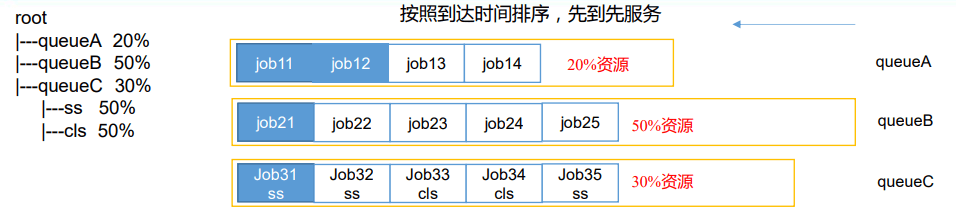
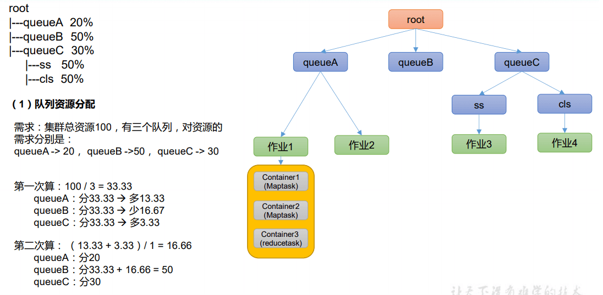

# 4、Hadoop 之 Yarn

:alarm_clock: `Yarn` 是一个资源调度平台，负责为运算程序提供服务器运算资源，`相当于一个分布式的操作系统平台`，`而 MapReduce 等运算程序则相当于运行于操作系统之上的应用程序`。

<!-- more -->

## 1 Yarn 资源调度器

### 1.1 Yarn 基础架构

YARN 主要由 ResourceManager、NodeManager、ApplicationMaster 和 Container 等组件 构成。


### 1.2 Yarn 工作机制


（1）MR 程序提交到客户端所在的节点。

（2）YarnRunner 向 ResourceManager 申请一个 Application。

（3）RM 将该应用程序的资源路径返回给 YarnRunner。

（4）该程序将运行所需资源提交到 HDFS 上。

（5）程序资源提交完毕后，申请运行 mrAppMaster。

（6）RM 将用户的请求初始化成一个 Task。

（7）其中一个 NodeManager 领取到 Task 任务。

（8）该 NodeManager 创建容器 Container，并产生 MRAppmaster。

（9）Container 从 HDFS 上拷贝资源到本地。

（10）MRAppmaster 向 RM 申请运行 MapTask 资源。

（11）RM 将运行 MapTask 任务分配给另外两个 NodeManager，另两个 NodeManager 分 别领取任务并创建容器。

（12）MR 向两个接收到任务的 NodeManager 发送程序启动脚本，这两个 NodeManager 分别启动 MapTask，MapTask 对数据分区排序。

（13）MrAppMaster 等待所有 MapTask 运行完毕后，向 RM 申请容器，运行 ReduceTask。

（14）ReduceTask 向 MapTask 获取相应分区的数据。

（15）程序运行完毕后，MR 会向 RM 申请注销自己。

### 1.3 作业提交全过程

作业提交全过程详解

（1）作业提交

第 1 步：Client 调用 job.waitForCompletion 方法，向整个集群提交 MapReduce 作业。

第 2 步：Client 向 RM 申请一个作业 id。

第 3 步：RM 给 Client 返回该 job 资源的提交路径和作业 id。

第 4 步：Client 提交 jar 包、切片信息和配置文件到指定的资源提交路径。

第 5 步：Client 提交完资源后，向 RM 申请运行 MrAppMaster。

（2）作业初始化

第 6 步：当 RM 收到 Client 的请求后，将该 job 添加到容量调度器中。

第 7 步：某一个空闲的 NM 领取到该 Job。

第 8 步：该 NM 创建 Container，并产生 MRAppmaster。

第 9 步：下载 Client 提交的资源到本地。

（3）任务分配

第 10 步：MrAppMaster 向 RM 申请运行多个 MapTask 任务资源。

第 11 步：RM 将运行 MapTask 任务分配给另外两个 NodeManager，另两个 NodeManager 分别领取任务并创建容器。

（4）任务运行

第 12 步：MR 向两个接收到任务的 NodeManager 发送程序启动脚本，这两个 NodeManager 分别启动 MapTask，MapTask 对数据分区排序。

第 13 步：MrAppMaster 等待所有 MapTask 运行完毕后，向 RM 申请容器，运行 ReduceTask。

第 14 步：ReduceTask 向 MapTask 获取相应分区的数据。

第 15 步：程序运行完毕后，MR 会向 RM 申请注销自己。

（5）进度和状态更新 YARN 中的任务将其进度和状态(包括 counter)返回给应用管理器, 客户端每秒(通过 mapreduce.client.progressmonitor.pollinterval 设置)向应用管理器请求进度更新, 展示给用户。

（6）作业完成 除了向应用管理器请求作业进度外, 客户端每 5 秒都会通过调用 waitForCompletion()来 检查作业是否完成。时间间隔可以通过 mapreduce.client.completion.pollinterval 来设置。作业 完成之后, 应用管理器和 Container 会清理工作状态。作业的信息会被作业历史服务器存储 以备之后用户核查。

### 1.4 Yarn 调度器和调度算法

目前，Hadoop 作业调度器主要有三种：FIFO、容量（Capacity Scheduler）和公平（Fair Scheduler）。Apache Hadoop3.1.3 默认的资源调度器是 Capacity Scheduler。

具体设置详见：yarn-default.xml 文件

```xml
  <property>
    <description>The class to use as the resource scheduler.</description>
    <name>yarn.resourcemanager.scheduler.class</name>
    <value>org.apache.hadoop.yarn.server.resourcemanager.scheduler.capacity.CapacityScheduler</value>
  </property>
```

#### 1.4.1 先进先出调度器（FIFO）

FIFO 调度器（First In First Out）：单队列，根据提交作业的先后顺序，先来先服务。


优点：简单易懂；

缺点：不支持多队列，生产环境很少使用；

#### 1.4.2 容量调度器（Capacity Scheduler）

Capacity Scheduler 是 Yahoo 开发的多用户调度器。

（1）容量调度器特点



1、多队列：每个队列可配置一定的资源量，每个队列采用 FIFO 调度策略。

2、容量保证：管理员可为每个队列设置资源最低保证和资源使用上限

3、灵活性：如果一个队列中的资源有剩余，可以暂时共享给那些需要资源的队列，而一旦该队列有新的应用 程序提交，则其他队列借调的资源会归还给该队列。

4、多租户： 支持多用户共享集群和多应用程序同时运行。 为了防止同一个用户的作业独占队列中的资源，该调度器会对同一用户提交的作业所占资源量进行限定。

（2）容量调度器资源分配算法


#### 1.4.3 公平调度器（Fair Scheduler）

Fair Schedulere 是 Facebook 开发的多用户调度器。

**公平调度器特点**


1）与容量调度器相同点

（1）多队列：支持多队列多作业

（2）容量保证：管理员可为每个队列设置资源最低保证和资源使用上线

（3）灵活性：如果一个队列中的资源有剩余，可以暂时共享给那些需要资源的队列，而一旦该队列有新的应用程序提 交，则其他队列借调的资源会归还给该队列。

（4）多租户：支持多用户共享集群和多应用程序同时运行；为了防止同一个用户的作业独占队列中的资源，该调度器 会对同一用户提交的作业所占资源量进行限定。

2）与容量调度器不同点

（1）核心调度策略不同

容量调度器：优先选择资源利用率低的队列

公平调度器：优先选择对资源的缺额比例大的

（2）每个队列可以单独设置资源分配方式

容量调度器：FIFO、 DRF

公平调度器：FIFO、FAIR、DRF

**公平调度器——缺额**


- 公平调度器设计目标是：在时间尺度上，所有作业获得公平的资源。某一 时刻一个作业应获资源和实际获取资源的差距叫“缺额”
- 调度器会优先为缺额大的作业分配资源

**公平调度器队列资源分配方式**


**公平调度器资源分配算法**



**公平调度器队列资源分配方式**


3）DRF 策略

DRF（Dominant Resource Fairness），我们之前说的资源，都是单一标准，例如只考虑内存（也是 Yarn 默 认的情况）。但是很多时候我们资源有很多种，例如内存，CPU，网络带宽等，这样我们很难衡量两个应用 应该分配的资源比例。

那么在 YARN 中，我们用 DRF 来决定如何调度：

假设集群一共有 100 CPU 和 10T 内存，而应用 A 需要（2 CPU, 300GB），应用 B 需要（6 CPU，100GB）。 则两个应用分别需要 A（2%CPU, 3%内存）和 B（6%CPU, 1%内存）的资源，这就意味着 A 是内存主导的, B 是 CPU 主导的，针对这种情况，我们可以选择 DRF 策略对不同应用进行不同资源（CPU 和内存）的一个不同比 例的限制。

### 1.5 Yarn 常用命令

Yarn 状态的查询，除了可以在 hadoop103:8088 页面查看外，还可以通过命令操作。常 见的命令操作如下所示：

#### 1.5.1 yarn application 查看任务

（1）列出所有 Application(运行状态才能查到)：

```shell
yarn application -list
```

（2）根据 Application 状态过滤：

```shell
# ALL、NEW、NEW_SAVING、SUBMITTED、ACCEPTED、RUNNING、FINISHED、FAILED、KILLED
yarn application -list -appStates 状态 #如: FINISHED
```

（3）Kill 掉 Application：

```shell
yarn application -kill application_1624374869321_0004
```

#### 1.5.2 yarn logs 查看日志

（1）查询 Application 日志：yarn logs -applicationId < ApplicationId >

```shell
yarn logs -applicationId application_1624374869321_0004
```

（2）查询 Container 日志：yarn logs -applicationId < ApplicationId > -containerId < ContainerId >

```shell
yarn logs -applicationId application_1624374869321_0004 -containerId container_1624374869321_0004_01_000001
```

#### 1.5.3 yarn applicationattempt 查看尝试运行的任务

（1）列出所有 Application 尝试的列表：yarn applicationattempt -list < ApplicationId >

`能查到 applicationattemptid 和 ContainerId `

```shell
yarn applicationattempt -list application_1624374869321_0004
```

（2）打印 ApplicationAttemp 状态：yarn applicationattempt -status < ApplicationAttemptId >

```shell
yarn applicationattempt -status appattempt_1624374869321_0004_000001
```

`ApplicationId 和 ApplicationAttemptId 是不一样的`

#### 1.5.4 yarn container 查看容器(运行状态才能查到)

（1）列出所有 Container：yarn container -list < ApplicationAttemptId >

```shell
yarn container -list appattempt_1624374869321_0004_000001
```

（2）打印 Container 状态：yarn container -status < ContainerId >

```shell
yarn container -status container_1624374869321_0004_01_000001
```

#### 1.5.5 yarn node 查看节点状态

列出所有节点：yarn node -list -all

```shell
yarn node -list -all
```

#### 1.5.6 yarn rmadmin 更新配置

加载队列配置：yarn rmadmin -refreshQueues

```shell
yarn rmadmin -refreshQueues
```

#### 1.5.7 yarn queue 查看队列

打印队列信息：yarn queue -status < QueueName >

```shell
yarn queue -status default
```

### 1.6 Yarn 生产环境核心参数


## 2 Yarn 案例实操

注：调整下列参数之前尽量拍摄 Linux 快照，否则后续的案例，还需要重写准备集群。

### 2.1 Yarn 生产环境核心参数配置案例

1）需求：从 1G 数据中，统计每个单词出现次数。服务器 3 台，每台配置 4G 内存，4 核 CPU，4 线程。

2）需求分析：

1G / 128m = 8 个 MapTask；1 个 ReduceTask；1 个 mrAppMaster

平均每个节点运行 10 个 / 3 台 ≈ 3 个任务（4 3 3）

3）修改 yarn-site.xml 配置参数如下：

```xml
<!-- 选择调度器，默认容量 -->
<property>
	<name>yarn.resourcemanager.scheduler.class</name>
	<value>org.apache.hadoop.yarn.server.resourcemanager.scheduler.capacity.CapacityScheduler</value>
</property>
<!-- ResourceManager 处理调度器请求的线程数量,默认 50；如果提交的任务数大于 50，可以增加该值，但是不能超过 3 台 * 4 线程 = 12 线程（去除其他应用程序实际不能超过 8） -->
<property>
	<name>yarn.resourcemanager.scheduler.client.thread-count</name>
	<value>8</value>
</property>
<!-- 是否让 yarn 自动检测硬件进行配置，默认是 false，如果该节点有很多其他应用程序，建议手动配置。如果该节点没有其他应用程序，可以采用自动 -->
<property>
	<name>yarn.nodemanager.resource.detect-hardware-capabilities</name>
	<value>false</value>
</property>
<!-- 是否将虚拟核数当作 CPU 核数，默认是 false，采用物理 CPU 核数 -->
<property>
	<name>yarn.nodemanager.resource.count-logical-processors-ascores</name>
	<value>false</value>
</property>
<!-- 虚拟核数和物理核数乘数，默认是 1.0 -->
<property>
	<name>yarn.nodemanager.resource.pcores-vcores-multiplier</name>
	<value>1.0</value>
</property>
<!-- NodeManager 使用内存数，默认 8G，修改为 4G 内存 -->
<property>
	<name>yarn.nodemanager.resource.memory-mb</name>
	<value>4096</value>
</property>
<!-- NodeManager 的 CPU 核数，不按照硬件环境自动设定时默认是 8 个，修改为 4 个 -->
<property>
	<name>yarn.nodemanager.resource.cpu-vcores</name>
	<value>4</value>
</property>
<!-- 容器最小内存，默认 1G -->
<property>
	<name>yarn.scheduler.minimum-allocation-mb</name>
	<value>1024</value>
</property>
<!-- 容器最大内存，默认 8G，修改为 2G -->
<property>
	<name>yarn.scheduler.maximum-allocation-mb</name>
	<value>2048</value>
</property>
<!-- 容器最小 CPU 核数，默认 1 个 -->
<property>
	<name>yarn.scheduler.minimum-allocation-vcores</name>
	<value>1</value>
</property>
<!-- 容器最大 CPU 核数，默认 4 个，修改为 2 个 -->
<property>
	<name>yarn.scheduler.maximum-allocation-vcores</name>
	<value>2</value>
</property>
<!-- 虚拟内存检查，默认打开，修改为关闭 -->
<property>
	<name>yarn.nodemanager.vmem-check-enabled</name>
	<value>false</value>
</property>
<!-- 虚拟内存和物理内存设置比例,默认 2.1 -->
<property>
	<name>yarn.nodemanager.vmem-pmem-ratio</name>
	<value>2.1</value>
</property>
```

4）分发配置。

```shell
xsync yarn-site.xml
```

注意：如果集群的硬件资源不一致，要每个 NodeManager 单独配置

5）重启集群

6）执行 WordCount 程序

```shell
hadoop jar share/hadoop/mapreduce/hadoop-mapreduce-examples-3.1.3.jar wordcount /qingguo /output
```

7）观察 Yarn 任务执行页面


### 2.2 容量调度器多队列提交案例

1）在生产环境怎么创建队列？

（1）调度器默认就 1 个 default 队列，不能满足生产要求。

（2）按照框架：hive /spark/ flink 每个框架的任务放入指定的队列（企业用的不是特别 多）

（3）按照业务模块：登录注册、购物车、下单、业务部门 1、业务部门 2

2）创建多队列的好处？

（1）因为担心员工不小心，写递归死循环代码，把所有资源全部耗尽。

（2）实现任务的降级使用，特殊时期保证重要的任务队列资源充足。11.11 6.18

业务部门 1（重要）=》业务部门 2（比较重要）=》下单（一般）=》购物车（一般）=》 登录注册（次要）

#### 2.2.1 需求

需求 1：default 队列占总内存的 40%，最大资源容量占总资源 60%，hive 队列占总内存 的 60%，最大资源容量占总资源 80%。

需求 2：配置队列优先级

#### 2.2.2 配置多队列的容量调度器

1）在 capacity-scheduler.xml 中配置如下：

（1）修改如下配置

```xml
<!-- 指定多队列，增加 hive 队列 -->
<property>
 	<name>yarn.scheduler.capacity.root.queues</name>
 	<value>default,hive</value>
</property>
<!-- 降低 default 队列资源额定容量为 40%，默认 100% -->
<property>
 	<name>yarn.scheduler.capacity.root.default.capacity</name>
 	<value>40</value>
</property>
<!-- 降低 default 队列资源最大容量为 60%，默认 100% -->
<property>
 	<name>yarn.scheduler.capacity.root.default.maximum-capacity</name>
 	<value>60</value>
</property>
```

（2）为新加队列添加必要属性：

```xml
<!-- 指定 hive 队列的资源额定容量 -->
<property>
 	<name>yarn.scheduler.capacity.root.hive.capacity</name>
 	<value>60</value>
</property>
<!-- 用户最多可以使用队列多少资源，1 表示全部 取值: 0.0 - 1 -->
<property>
 	<name>yarn.scheduler.capacity.root.hive.user-limit-factor</name>
 	<value>1</value>
</property>
<!-- 指定 hive 队列的资源最大容量 -->
<property>
 	<name>yarn.scheduler.capacity.root.hive.maximum-capacity</name>
 	<value>80</value>
</property>
<!-- 启动 hive 队列 -->
<property>
 	<name>yarn.scheduler.capacity.root.hive.state</name>
 	<value>RUNNING</value>
</property>
<!-- 哪些用户有权向队列提交作业 -->
<property>
 	<name>yarn.scheduler.capacity.root.hive.acl_submit_applications</name>
 	<value>*</value>
</property>
<!-- 哪些用户有权操作队列，管理员权限（查看/杀死） -->
<property>
 	<name>yarn.scheduler.capacity.root.hive.acl_administer_queue</name>
 	<value>*</value>
</property>
<!-- 哪些用户有权配置提交任务优先级 -->
<property>
	<name>yarn.scheduler.capacity.root.hive.acl_application_max_priority</name>
 	<value>*</value>
</property>
<!-- 任务的超时时间设置：yarn application -appId appId -updateLifetime Timeout参考资料： https://blog.cloudera.com/enforcingapplication-lifetime-slasyarn/ -->
<!-- 如果 application 指定了超时时间，则提交到该队列的 application 能够指定的最大超时时间不能超过该值。-->
<property>
 	<name>yarn.scheduler.capacity.root.hive.maximum-applicationlifetime</name>
 	<value>-1</value>
</property>
<!-- 如果 application 没指定超时时间，则用 default-application-lifetime 作为默认值 -->
<property>
 	<name>yarn.scheduler.capacity.root.hive.default-applicationlifetime</name>
 	<value>-1</value>
</property>
```

2）分发配置文件

```shell
xsync capacity-scheduler.xml
```

3）重启 Yarn 或者执行 yarn rmadmin -refreshQueues( 刷新队列 )，就可以看到两条队列：


#### 2.2.3 向 Hive 队列提交任务

1）hadoop jar 的方式

```shell
hadoop jar share/hadoop/mapreduce/hadoop-mapreduce-examples-3.1.3.jar wordcount -Dmapreduce.job.queuename=hive /qingguo /output
```

注: -D 表示运行时改变参数值 . mapreduce 没有 r

2）打 jar 包的方式

默认的任务提交都是提交到 default 队列的。如果希望向其他队列提交任务，需要在 Driver 中声明：

```java
public class WcDrvier {
 	public static void main(String[] args) throws IOException,ClassNotFoundException, InterruptedException {
 	Configuration conf = new Configuration();
 	conf.set("mapreduce.job.queuename","hive");
 	//1. 获取一个 Job 实例
 	Job job = Job.getInstance(conf);
 	。。。 。。。
 	//6. 提交 Job
 	boolean b = job.waitForCompletion(true);
 	System.exit(b ? 0 : 1);
 	}
}
```

这样，这个任务在集群提交时，就会提交到 hive 队列

#### 2.2.4 任务优先级

容量调度器，支持任务优先级的配置，在资源紧张时，优先级高的任务将优先获取资源。 默认情况，Yarn 将所有任务的优先级限制为 0，若想使用任务的优先级功能，须开放该限制。

1）修改 yarn-site.xml 文件，增加以下参数

```xml
<property>
 	<name>yarn.cluster.max-application-priority</name>
 	<value>5</value>
</property>
```

2）分发配置，并重启 Yarn

```shell
 xsync yarn-site.xml
 sbin/stop-yarn.sh
 sbin/start-yarn.sh
```

3）模拟资源紧张环境，可连续提交以下任务，直到新提交的任务申请不到资源为止。

```shell
hadoop jar share/hadoop/mapreduce/hadoop-mapreduce-examples-3.1.3.jar pi 5 2000000
```

4）再次重新提交优先级高的任务

```shell
hadoop jar share/hadoop/mapreduce/hadoop-mapreduce-examples-3.1.3.jar pi  -Dmapreduce.job.priority=5 5 2000000
```


5）也可以通过以下命令修改正在执行的任务的优先级。

yarn application -appID < ApplicationID > -updatePriority 优先级

```shell
yarn application -appID application_1611133087930_0009 -updatePriority 5
```

### 2.3 公平调度器案例

#### 2.3.1 需求

创建两个队列，分别是 test 和 atguigu（以用户所属组命名）。期望实现以下效果：若用 户提交任务时指定队列，则任务提交到指定队列运行；若未指定队列，test 用户提交的任务 到 root.group.test 队列运行，atguigu 提交的任务到 root.group.atguigu 队列运行（注：group 为用户所属组）。

公平调度器的配置涉及到两个文件，一个是 yarn-site.xml，另一个是公平调度器队列分 配文件 fair-scheduler.xml（文件名可自定义）。

[（1）配置文件参考资料：]: https://hadoop.apache.org/docs/r3.1.3/hadoop-yarn/hadoop-yarn-site/FairScheduler.html
[（2）任务队列放置规则参考资料：]: https://blog.cloudera.com/untangling-apache-hadoop-yarn-part-4-fair-scheduler-queue-basics/

#### 2.3.2 配置多队列的公平调度器

1）修改 yarn-site.xml 文件，加入以下参数

```xml
<!-- 配置使用公平调度器 -->
<property>
 	<name>yarn.resourcemanager.scheduler.class</name>
	<value>org.apache.hadoop.yarn.server.resourcemanager.scheduler.fair.FairScheduler</value>
</property>
<!-- 指明公平调度器队列分配配置文件 -->
<property>
 	<name>yarn.scheduler.fair.allocation.file</name>
 	<value>/opt/hadoop-3.1.3/etc/hadoop/fair-scheduler.xml</value>
</property>
<!-- 禁止队列间资源抢占 -->
<property>
 	<name>yarn.scheduler.fair.preemption</name>
 	<value>false</value>
</property>
```

2）配置 fair-scheduler.xml

```xml
<?xml version="1.0"?>
<allocations>
 	<!-- 单个队列中 Application Master 占用资源的最大比例,取值 0-1 ，企业一般配置 0.1 -->
 	<queueMaxAMShareDefault>0.5</queueMaxAMShareDefault>
 	<!-- 单个队列最大资源的默认值 test atguigu default -->
 	<queueMaxResourcesDefault>4096mb,4vcores</queueMaxResourcesDefault>
 	<!-- 增加一个队列 test -->
 	<queue name="zhou">
 		<!-- 队列最小资源 -->
 		<minResources>2048mb,2vcores</minResources>
 		<!-- 队列最大资源 -->
 		<maxResources>4096mb,4vcores</maxResources>
 		<!-- 队列中最多同时运行的应用数，默认 50，根据线程数配置 -->
 		<maxRunningApps>4</maxRunningApps>
 		<!-- 队列中 Application Master 占用资源的最大比例 -->
 		<maxAMShare>0.5</maxAMShare>
 		<!-- 该队列资源权重,默认值为 1.0 -->
  		<weight>1.0</weight>
 		<!-- 队列内部的资源分配策略 -->
 		<schedulingPolicy>fair</schedulingPolicy>
 	</queue>
 	<!-- 增加一个队列 atguigu -->
 	<queue name="chen" type="parent">
 		<!-- 队列最小资源 -->
 		<minResources>2048mb,2vcores</minResources>
 		<!-- 队列最大资源 -->
 		<maxResources>4096mb,4vcores</maxResources>
 		<!-- 队列中最多同时运行的应用数，默认 50，根据线程数配置 -->
 		<maxRunningApps>4</maxRunningApps>
 		<!-- 队列中 Application Master 占用资源的最大比例 -->
 		<maxAMShare>0.5</maxAMShare>
 		<!-- 该队列资源权重,默认值为 1.0 -->
 		<weight>1.0</weight>
 		<!-- 队列内部的资源分配策略 -->
 		<schedulingPolicy>fair</schedulingPolicy>
 	</queue>
	<!-- 任务队列分配策略,可配置多层规则,从第一个规则开始匹配,直到匹配成功 -->
 	<queuePlacementPolicy>
 		<!-- 提交任务时指定队列,如未指定提交队列,则继续匹配下一个规则; false 表示：如果指定队列不存在,不允许自动创建-->
 		<rule name="specified" create="false"/>
 		<!-- 提交到 root.group.username 队列,若 root.group 不存在,不允许自动创建；若root.group.user 不存在,允许自动创建 -->
 		<rule name="nestedUserQueue" create="true">
 			<rule name="primaryGroup" create="false"/>
 		</rule>
 		<!-- 最后一个规则必须为 reject 或者 default。Reject 表示拒绝创建提交失败，default 表示把任务提交到 default 队列 -->
 		<rule name="reject" />
 	</queuePlacementPolicy>
</allocations>
```

3）分发配置并重启 Yarn

```shell
xsync yarn-site.xml fair-scheduler.xml
sbin/stop-yarn.sh
sbin/start-yarn.sh
```


#### 2.3.3 测试提交任务

1）提交任务时指定队列，按照配置规则，任务会到指定的 root.test 队列

```shell
hadoop jar share/hadoop/mapreduce/hadoop-mapreduce-examples-3.1.3.jar pi -Dmapreduce.job.queuename=root.zhou 1 1
```


2）提交任务时不指定队列，按照配置规则，

```shell
hadoop jar share/hadoop/mapreduce/hadoop-mapreduce-examples-3.1.3.jar pi 1 1
```


### 2.4 Yarn 的 Tool 接口案例

0）回顾：

```shell
hadoop jar MapReduce-Test-1.0-SNAPSHOT.jar com.cssl.WorldCountDriver /qingguo /output
```

期望可以动态传参，结果报错，误认为是第一个输入参数。

```shell
hadoop jar MapReduce-Test-1.0-SNAPSHOT.jar com.cssl.WorldCountDriver -Dmapreduce.job.queuename=root.zhou /qingguo /output1
```

1）需求：自己写的程序也可以动态修改参数。编写 Yarn 的 Tool 接口。

（1）创建类 WordCount 并实现 Tool 接口：

```java
public class WordCount implements Tool {
    private Configuration configuration;

    //核心驱动(conf 需要传入)
    @Override
    public int run(String[] strings) throws Exception {
        Job job = Job.getInstance(configuration);

        job.setJarByClass(WordCountDriver.class);
        job.setMapperClass(WordCountMapper.class);
        job.setReducerClass(WordCountReducer.class);

        job.setMapOutputKeyClass(Text.class);
        job.setMapOutputValueClass(IntWritable.class);

        job.setOutputKeyClass(Text.class);
        job.setOutputValueClass(IntWritable.class);

        FileInputFormat.setInputPaths(job, new Path(strings[0]));
        FileOutputFormat.setOutputPath(job, new Path(strings[1]));

        return job.waitForCompletion(true)?0:1;
    }

    @Override
    public void setConf(Configuration configuration) {
        this.configuration=configuration;
    }

    @Override
    public Configuration getConf() {
        return configuration;
    }
    //mapper
    public static class WordCountMapper extends Mapper<LongWritable, Text,Text, IntWritable>{
        private Text outK=new Text();
        private IntWritable outV=new IntWritable(1);
        @Override
        protected void map(LongWritable key, Text value, Context context) throws IOException, InterruptedException {
            String line = value.toString();
            String[] split = line.split(" ");
            for (String s : split) {
                outK.set(s);
                context.write(outK, outV);
            }
        }
    }
    //reducer
    public static class WordCountReducer extends Reducer<Text,IntWritable,Text,IntWritable>{
        private IntWritable outV=new IntWritable();
        @Override
        protected void reduce(Text key, Iterable<IntWritable> values, Context context) throws IOException, InterruptedException {
            int sum=0;
            for (IntWritable value : values) {
                sum+=value.get();
            }
            outV.set(sum);
            context.write(key, outV);
        }
    }
}
```

（2）新建 WordCountDriver

```java
public class WordCountDriver {

    private static Tool tool;

    public static void main(String[] args) throws Exception {
        //创建配置
        Configuration configuration = new Configuration();
        switch (args[0]){
            case "wordcount":
                tool = new WordCount();
                break;
            default:
                throw new RuntimeException("no such tool" + args[0]);
        }
        //执行程序
        int run = ToolRunner.run(configuration, tool, Arrays.copyOfRange(args, 1, args.length));
        System.exit(run);
    }
}
```

3）在 HDFS 上准备输入文件，假设为/input 目录，向集群提交该 Jar 包

```shell
hadoop jar tool-test.jar com.cssl.tool.WordCountDriver wordcount /qingguo /output
```

注意此时提交的 3 个参数，第一个用于生成特定的 Tool，第二个和第三个为输入输出目 录。此时如果我们希望加入设置参数，可以在 wordcount 后面添加参数，例如：

```shell
hadoop jar tool-test.jar com.cssl.tool.WordCountDriver wordcount -Dmapreduce.job.queuename=root.zhou /qingguo /output
```

4）注：以上操作全部做完过后，快照回去或者手动将配置文件修改成之前的状态，因为本 身资源就不够，分成了这么多，不方便以后测试。
