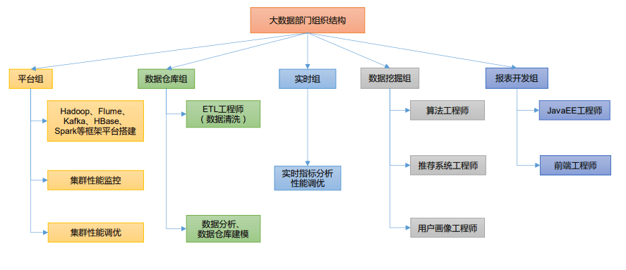
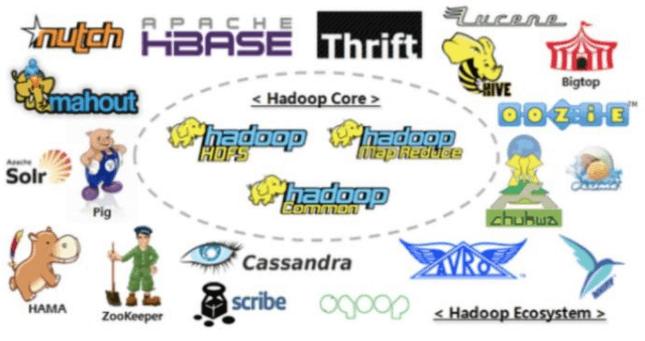
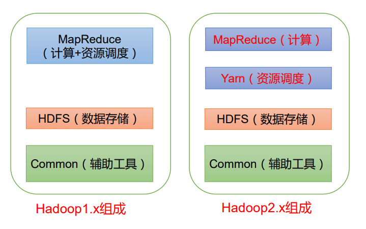
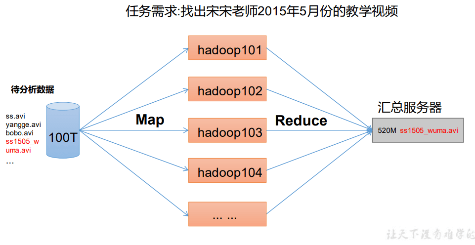
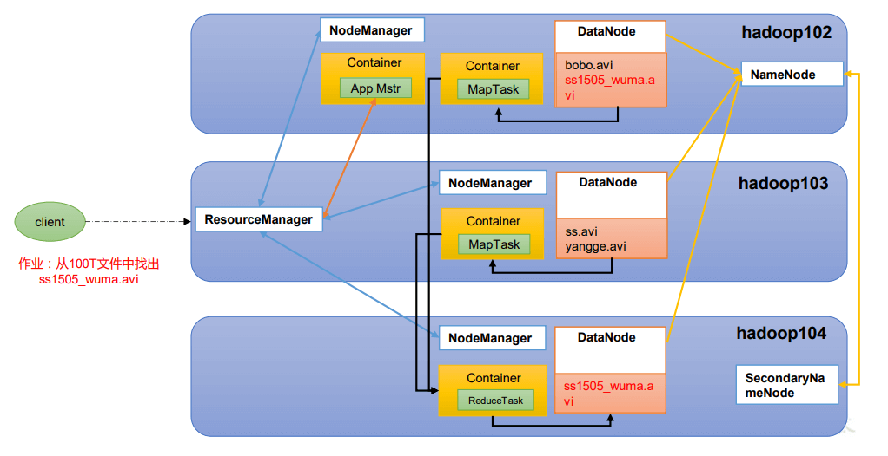
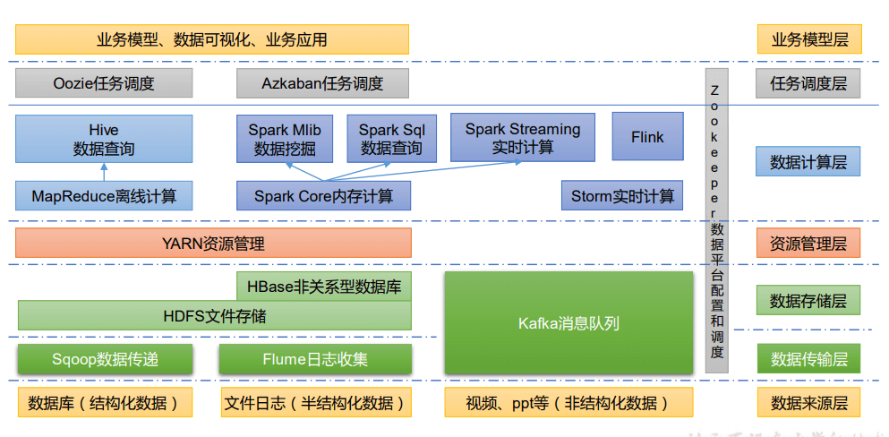
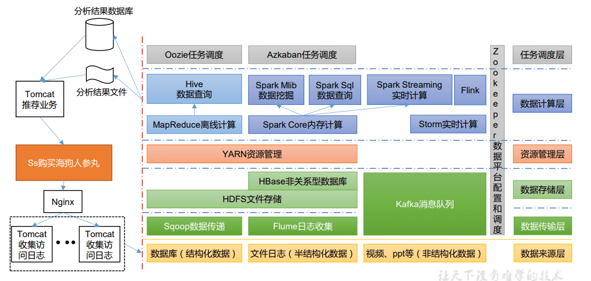
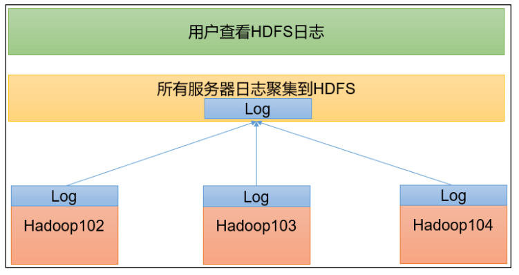
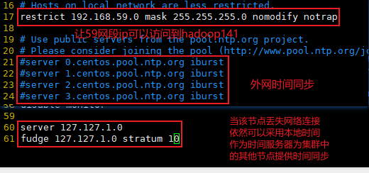

# Hadoop 入门

:elephant: 文章主要介绍大数据和 `hadoop` 的相关概念，以及 `hadoop` 的安装部署。

<!-- more -->

## 大数据概论

### 1 大数据概念

大数据: 指无法在一定时间范围内用常规软件工具进行捕捉,管理和处理的数据集合,是需要新处理模式才能具有更强的决策力,洞察发现力和流程优化能力的海量,高增长率和多样化的信息资产

### 2 大数据特点

#### 1.1 volume(大量)

截止目前,人类生产的所有印刷材料的数据量是 200PB.而里是上全人类总共说过的话的数据量大约是 5EB.当前典型个人计算机硬盘的容量为 TB 量级,而一些大企业的数据量已经接近 EB 量级

#### 1.2 velocity(高速)

这是大数据区分于传统数据挖掘的最显著特征,根据 IDC 的"数字宇宙"的报告,预计 2025 年,全球数据使用量将达到 163ZB,在如此海量的数据面前,处理数据的效率就是企业的生命

#### 1.3 variety(多样)

这种类型的多样性也是让数据被分为结构化数据和非结构化数据,相对于以往便于存储的以数据库/文本为主的结构化数据,非结构化数据越来越多,包括网络日志,音频,视频,图片,地理位置信息等,这些多类型的数据多数据的处理能力提出了更高的要求

#### 1.4 value(低价值密度)

价值密度的高低与数据总量的大小成反比.

### 3 大数据的应用场景

1. 抖音: 推荐的都是你喜欢的视频

2. 电商: 电商站内广告推荐: 给用户推荐可能喜欢的商品

3. 零售: 分析用户消费习惯,为用户购买商品提供方便,从而提升商品销量

4. 物流仓储: 京东物流,上午下单下午送达,下午下单次日上午送达

5. 保险: 海量数据挖掘及风险预测,助力保险行业精准营销,提升精细化定价能力

6. 金融: 多纬度体现用户特征,帮助金融机构推荐优质客户,防范欺诈风险

7. 房产: 大数据全面助力房地产行业,打造精准头车与营销,选出更合适的地,建造更合适的楼,卖给更合适的人

8. 人工智能+5G+物联网+虚拟与显示

### 4 大数据的发展前景

1. 党的十九大提出: 推动互联网,大数据,人工智能和实体经济深度融合

2. 2020 年初,中央推出 34 万亿"新基建"投资计划

3. 下一个风口,5G 的来临

4. 人才紧缺,竞争压力小

### 5 大数据部门间业务流程分析


### 6 大数据部门内组织结构



## hadoop 入门

### 1 Hadoop 概述

#### 1.1 Hadoop 是什么

1）Hadoop 是一个由 Apache 基金会所开发的`分布式系统基础架构`。

2）主要解决，海量数据的`存储`和海量数据的`分析计算`问题。

3）广义上来说，Hadoop 通常是指一个更广泛的概念——Hadoop 生态圈。



#### 1.2 Hadoop 发展历史（了解）

1）Hadoop 创始人 Doug Cutting，为 了实 现与 Google 类似的全文搜索功能，他在 Lucene 框架基础上进行优 化升级，查询引擎和索引引擎

2）2001 年年底 Lucene 成为 Apache 基金会的一个子项目

3）对于海量数据的场景，Lucene 框 架面 对与 Google 同样的困难，存 储海量数据困难，检 索海 量速度慢。

4）学习和模仿 Google 解决这些问题的办法 ：微型版 Nutch

5）可以说 Google 是 Hadoop 的思想之源（Google 在大数据方面的三篇论文）

6）2003-2004 年，Google 公开了部分 GFS 和 MapReduce 思想的细节，以此为基础 Doug Cutting 等人用 了 2 年业余时间实现了 DFS 和 MapReduce 机制，使 Nutch 性能飙升。

7）2005 年 Hadoop 作为 Lucene 的子项目 Nutch 的一部分正式引入 Apache 基金会。

8）2006 年 3 月份，Map-Reduce 和 Nutch Distributed File System （NDFS）分别被纳入到 Hadoop 项目 中，Hadoop 就此正式诞生，标志着大数据时代来临。

9）名字来源于 Doug Cutting 儿子的玩具大象

#### 1.3 Hadoop 三大发行版本（了解）

Hadoop 三大发行版本：Apache、Cloudera、Hortonworks。

Apache 版本最原始（最基础）的版本，对于入门学习最好。2006

Cloudera 内部集成了很多大数据框架，对应产品 CDH。2008

Hortonworks 文档较好，对应产品 HDP。2011

Hortonworks 现在已经被 Cloudera 公司收购，推出新的品牌 CDP。

#### 1.4 Hadoop 优势（4 高）

1）`高可靠性`：Hadoop 底层维护多个数据副本，所以即使 Hadoop 某个计算元 素或存储出现故障，也不会导致数据的丢失。

2）`高扩展性`：在集群间分配任务数据，可方便的扩展数以千计的节点。

3）`高效性`：在 MapReduce 的思想下，Hadoop 是并行工作的，以加快任务处 理速度。

4）`高容错性`：能够自动将失败的任务重新分配。

#### 1.5 Hadoop 组成（面试重点）



在 Hadoop1.x 时 代 ， Hadoop 中 的 MapReduce 同 时处理业务逻辑运算和资 源的调度，耦合性较大。 在 Hadoop2.x 时 代，增 加 了 Yarn。Yarn 只负责 资 源 的 调 度 ， MapReduce 只负责运算。 Hadoop3.x 在组成上没 有变化。

##### 1.5.1 HDFS 架构概述

1）NameNode（nn）：存储文件的元数据，如文件名，文件目录结构，文件属性（生成时间、副本数、 文件权限），以及每个文件的块列表和块所在的 DataNode 等。

2）DataNode(dn)：在本地文件系统存储文件块数据，以及块数据的校验和。

3）Secondary NameNode(2nn)：每隔一段时间对 NameNode 元数据备份。

##### 1.5.2 YARN 架构概述

Yet Another Resource Negotiator 简称 YARN ，另一种资源协调者，是 Hadoop 的资源管理器。

1）ResourceManager（RM）：整个集群资源（内存、CPU 等）的老大

2）NodeManager（N M）：单个节点服务器资源老大

3）ApplicationMaster（AM）：单个任务运行的老大

4）Container：容器，相当一台独立的服务器，里面封装了任务运行所需要的资源，如内存、CPU、磁盘、网络等。

##### 1.5.3 MapReduce 架构概述

MapReduce 将计算过程分为两个阶段：Map 和 Reduce

1）Map 阶段并行处理输入数据

2）Reduce 阶段对 Map 结果进行汇总



##### 1.5.4 HDFS、YARN、MapReduce 三者关系



#### 1.6 大数据技术生态体系



1）Sqoop：Sqoop 是一款开源的工具，主要用于在 Hadoop、Hive 与传统的数据库（MySQL） 间进行数据的传递，可以将一个关系型数据库（例如 ：MySQL，Oracle 等）中的数据导进 到 Hadoop 的 HDFS 中，也可以将 HDFS 的数据导进到关系型数据库中。

2）Flume：Flume 是一个高可用的，高可靠的，分布式的海量日志采集、聚合和传输的系统， Flume 支持在日志系统中定制各类数据发送方，用于收集数据；

3）Kafka：Kafka 是一种高吞吐量的分布式发布订阅消息系统；

4）Spark：Spark 是当前最流行的开源大数据内存计算框架。可以基于 Hadoop 上存储的大数 据进行计算。

5）Flink：Flink 是当前最流行的开源大数据内存计算框架。用于实时计算的场景较多。

6）Oozie：Oozie 是一个管理 Hadoop 作业（job）的工作流程调度管理系统。

7）Hbase：HBase 是一个分布式的、面向列的开源数据库。HBase 不同于一般的关系数据库， 它是一个适合于非结构化数据存储的数据库。

8）Hive：Hive 是基于 Hadoop 的一个数据仓库工具，可以将结构化的数据文件映射为一张 数据库表，并提供简单的 SQL 查询功能，可以将 SQL 语句转换为 MapReduce 任务进行运 行。其优点是学习成本低，可以通过类 SQL 语句快速实现简单的 MapReduce 统计，不必开 发专门的 MapReduce 应用，十分适合数据仓库的统计分析。

9）ZooKeeper：它是一个针对大型分布式系统的可靠协调系统，提供的功能包括：配置维护、 名字服务、分布式同步、组服务等。

#### 1.7 推荐系统框架图



### 2 Hadoop 运行环境搭建（开发重点）

1. 虚拟机要求: 4G 内存,50G 硬盘

2. 要有 jdk8 环境

#### 2.1 下载安装

```shell
#安装 epel-release
yum install -y epel-release
#net-tool：工具包集合，包含 ifconfig 等命令
yum install -y net-tools
#关闭防火墙
systemctl stop firewalld
#关闭防火墙开机启动
systemctl disable firewalld
#解压
tar -zxf hadoop-3.1.3.tar.gz
#移动
mv hadoop-3.1.3 /opt/
#配置环境变量
vim /etc/profile.d/my_env.sh
#放入以下内容
###########JavaEnvironment##############
export JAVA_HOME=/usr/local/src/jdk1.8.0_291
export PATH=$PATH:$JAVA_HOME/bin
export CLASSPATH=.:$JAVA_HOME/lib/dt.jar:$JAVA_HOME/lib/tools.jar
########################################
###########HadoopEnvironment############
export HADOOP_HOME=/opt/hadoop-3.1.3
export PATH=$PATH:$HADOOP_HOME/bin
export PATH=$PATH:$HADOOP_HOME/sbin
########################################
#测试Hadoop环境变量是否配置成功
hadoop version
#新建用户(hadoop不能用root启动)
useradd atguigu
passwd atguigu
```

#### 2.2 Hadoop 目录结构

1）bin 目录：存放对 Hadoop 相关服务（hdfs，yarn，mapred）进行操作的脚本

2）etc 目录：Hadoop 的配置文件目录，存放 Hadoop 的配置文件

3）lib 目录：存放 Hadoop 的本地库（对数据进行压缩解压缩功能）

4）sbin 目录：存放启动或停止 Hadoop 相关服务的脚本

5）share 目录：存放 Hadoop 的依赖 jar 包、文档、和官方案例

### 3 Hadoop 运行模式

1）Hadoop 官方网站：http://hadoop.apache.org/

2）Hadoop 运行模式包括：本地模式、伪分布式模式以及完全分布式模式。

➢ 本地模式：单机运行，只是用来演示一下官方案例。生产环境不用。 尚人工智能资料下载，可百度访问：尚硅谷官网

➢ 伪分布式模式：也是单机运行，但是具备 Hadoop 集群的所有功能，一台服务器模 拟一个分布式的环境。个别缺钱的公司用来测试，生产环境不用。

➢ 完全分布式模式：多台服务器组成分布式环境。生产环境使用。

#### 3.1 本地运行模式（官方 WordCount）

```shell
#创建文件夹进行测试
cd /opt/hadoop-3.1.3/ && mkdir wcinput
#编辑word.txt文件
vim wcinput/word.txt
#插入以下内容
hadoop yarn
hadoop mapreduce
atguigu
atguigu
#examples:示例 使用wordcount 输入wcinput 输出wcoutput(输入路径不能存在)
hadoop jar share/hadoop/mapreduce/hadoop-mapreduce-examples-3.1.3.jar wordcount wcinput/ wcoutput
#查看统计
cat wcoutput/part-r-00000
```

#### 3.2 完全分布式运行模式（开发重点）

1. scp（secure copy）安全拷贝

scp 可以实现服务器与服务器之间的数据拷贝。（from server1 to server2）

示例(-r 代表递归):

```shell
scp -r chen.txt root@hadoop142:/opt
```

2. rsync 远程同步工具

rsync 主要用于备份和镜像。具有速度快、避免复制相同内容和支持符号链接的优点。

rsync 和 scp 区别：用 rsync 做文件的复制要比 scp 的速度快，rsync 只对差异文件做更 新。scp 是把所有文件都复制过去。

示例:

```shel
rsync -av /opt/hadoop-3.1.3/ root@hadoop142:/opt/hadoop-3.1.3/
```

3. xsync 集群分发脚本

```shell
#创建传本
mkdir -p /root/bin/ && vim /root/bin/xsync
#编写脚本
#!/bin/bash
#1. 判断参数个数
if [ $# -lt 1 ]
then
	echo Not Enough Arguement!
	exit;
fi
#2. 遍历集群所有机器
for host in hadoop141 hadoop142 hadoop143
do
 	echo ==================== $host ====================
 	#3. 遍历所有目录，挨个发送
 	for file in $@
 	do
 		#4. 判断文件是否存在
 		if [ -e $file ]
 			then
 				#5. 获取父目录
		    	pdir=$(cd -P $(dirname $file); pwd)
 				#6. 获取当前文件的名称
 				fname=$(basename $file)
 				ssh $host "mkdir -p $pdir"
 				rsync -av $pdir/$fname $host:$pdir
 			else
 				echo $file does not exists!
		fi
	done
done
#给权限
chmod +x /root/bin/xsync
```

可以在任何位置使用 xsync 命令

##### 3.2.1 SSH 无密登录配置

```shell
#生成秘钥
ssh-keygen -t rsa
#拷贝秘钥到142 143
ssh-copy-id hadoop141
ssh-copy-id hadoop142
ssh-copy-id hadoop143
#连接142 143
ssh hadoop141
ssh hadoop142
ssh hadoop143
```

##### 3.2.2 集群配置

1）集群部署规划

➢ NameNode 和 SecondaryNameNode 不要安装在同一台服务器

➢ ResourceManager 也很消耗内存，不要和 NameNode、SecondaryNameNode 配置在 同一台机器上。

|      | hadoop141   | hadoop142       | hadoop143         |
| ---- | ----------- | --------------- | ----------------- |
| HDFS | NameNode    |                 | SecondaryNameNode |
|      | DataNode    | DataNode        | DataNode          |
| YARN |             | ResourceManager |                   |
|      | NodeManager | NodeManager     | NodeManager       |

2）配置文件说明

Hadoop 配置文件分两类：默认配置文件和自定义配置文件，只有用户想修改某一默认 配置值时，才需要修改自定义配置文件，更改相应属性值。

默认配置文件：

| 要获取的默认文件     | 文件存放在 Hadoop 的 jar 包中的位置                       |
| -------------------- | --------------------------------------------------------- |
| [core-default.xml]   | hadoop-common-3.1.3.jar/core-default.xml                  |
| [hdfs-default.xml]   | hadoop-hdfs-3.1.3.jar/hdfs-default.xml                    |
| [yarn-default.xml]   | hadoop-yarn-common-3.1.3.jar/yarn-default.xml             |
| [mapred-default.xml] | hadoop-mapreduce-client-core-3.1.3.jar/mapred-default.xml |

自定义配置文件：

`core-site.xml`、`hdfs-site.xml`、`yarn-site.xml`、`mapred-site.xml` 四个配置文件存放在 $HADOOP_HOME/etc/hadoop 这个路径上，用户可以根据项目需求重新进行修改配置。

3. 配置集群

配置 core-site.xml

```xml
<?xml version="1.0" encoding="UTF-8"?>
<?xml-stylesheet type="text/xsl" href="configuration.xsl"?>
<configuration>
 	<!-- 指定 NameNode 的地址 -->
 	<property>
 		<name>fs.defaultFS</name>
 		<value>hdfs://hadoop141:8020</value>
 	</property>
 	<!-- 指定 hadoop 数据的存储目录 -->
 	<property>
 		<name>hadoop.tmp.dir</name>
 		<value>/opt/hadoop-3.1.3/data</value>
 	</property>
 	<!-- 配置 HDFS 网页登录使用的静态用户为 chen -->
 	<property>
 		<name>hadoop.http.staticuser.user</name>
 		<value>chen</value>
 	</property>
</configuration>
```

配置 hdfs-site.xml

```xml
<?xml version="1.0" encoding="UTF-8"?>
<?xml-stylesheet type="text/xsl" href="configuration.xsl"?>
<configuration>
	<!-- nn web 端访问地址-->
	<property>
 		<name>dfs.namenode.http-address</name>
 		<value>hadoop141:9870</value>
 	</property>
	<!-- 2nn web 端访问地址-->
 	<property>
 		<name>dfs.namenode.secondary.http-address</name>
 		<value>hadoop143:9868</value>
 	</property>
</configuration>
```

配置 yarn-site.xml

```xml
<?xml version="1.0" encoding="UTF-8"?>
<?xml-stylesheet type="text/xsl" href="configuration.xsl"?>
<configuration>
        <!-- 指定 MR 走 shuffle -->
        <property>
                <name>yarn.nodemanager.aux-services</name>
                <value>mapreduce_shuffle</value>
        </property>
        <!-- 指定 ResourceManager 的地址-->
        <property>
                <name>yarn.resourcemanager.hostname</name>
                <value>hadoop142</value>
        </property>
        <!-- 环境变量的继承 -->
        <property>
                <name>yarn.nodemanager.env-whitelist</name>
        			  <value>JAVA_HOME,HADOOP_COMMON_HOME,HADOOP_HDFS_HOME,HADOOP_CONF_DIR,CLASSPATH_PREPEND_DISTCACHE,HADOOP_YARN_HOME,HADOOP_MAPRED_HOME</value>
        </property>
</configuration>
```

配置 mapred-site.xml

```xml
<?xml version="1.0" encoding="UTF-8"?>
<?xml-stylesheet type="text/xsl" href="configuration.xsl"?>
<configuration>
	<!-- 指定 MapReduce 程序运行在 Yarn 上 -->
 	<property>
 		<name>mapreduce.framework.name</name>
 		<value>yarn</value>
 	</property>
</configuration>
```

配置 workers(默认 localhost,删掉)

```shell
hadoop141
hadoop142
hadoop143
```

在集群上分发配置好的 Hadoop 配置文件

```shell
xsync /opt/hadoop-3.1.3
```

4. 启动集群

如果集群是第一次启动，需要在 hadoop141 节点格式化 NameNode

初始化成功会在 hadoop 家目录下多出 data 和 log 两个文件夹

```shell
hdfs namenode -format
```

启动集群

```shell
#进入sbin目录
cd /opt/hadoop-3.1.3/sbin/
#启动集群(不能用root启动,会报错)
./start-dfs.sh
#浏览器访问
192.168.59.141:9870
```

在配置了 ResourceManager 的节点（hadoop103）启动 YARN

```shell
#进入目录
cd /opt/hadoop-3.1.3/sbin/
#启动yarn(也是不能root登入)
./start-yarn.sh
```

##### 3.2.3 集群基本测试

1. 上传文件到集群

```shell
#创建文件夹
hadoop fs -mkdir /wcinput
#上传文件到hadoop(前面的wcinput是需要上传的本地文件,后面的wcinput是上传到hadoop的目录)
hadoop fs -put wcinput/word.txt /wcinput
#上传大文件测试
hadoop fs -put /opt/jdk-8u212-linux-x64.tar.gz /
#查看 HDFS 文件存储路径
cd /opt/hadoop-3.1.3/data/dfs/data/current/BP-1936985014-192.168.59.141-1624346811419/current/finalized/subdir0/subdir0
#查看 HDFS 在磁盘存储文件内容
cat blk_1073741825
#拼接
cat blk_1073741826 >> tmp.tar.gz
cat blk_1073741827 >> tmp.tar.gz
#解压
tar -zxf tmp.tar.gz
#发现解压出来的是jdk
```

2. 执行 wordcount 程序

```shell
hadoop jar share/hadoop/mapreduce/hadoop-mapreduce-examples-3.1.3.jar wordcount /wcinput /wcoutput
```

##### 3.2.4 配置历史服务器

配置 mapred-site.xml

```xml
<!-- 历史服务器端地址 -->
<property>
 	<name>mapreduce.jobhistory.address</name>
 	<value>hadoop141:10020</value>
</property>
<!-- 历史服务器 web 端地址 -->
<property>
 	<name>mapreduce.jobhistory.webapp.address</name>
 	<value>hadoop141:19888</value>
</property>
```

分发配置

```shell
xsync mapred-site.xml
```

在 hadoop141 启动历史服务器

```shell
#进入目录
cd /opt/hadoop-3.1.3/bin/
#启动历史服务器
mapred --daemon start historyserver
```

##### 3.2.5 配置日志的聚集

日志聚集概念：应用运行完成以后，将程序运行日志信息上传到 HDFS 系统上。



配置 yarn-site.xml

```xml
<!-- 开启日志聚集功能 -->
<property>
 	<name>yarn.log-aggregation-enable</name>
 	<value>true</value>
</property>
<!-- 设置日志聚集服务器地址 -->
<property>
 	<name>yarn.log.server.url</name>
 	<value>http://hadoop141:19888/jobhistory/logs</value>
</property>
<!-- 设置日志保留时间为 7 天 -->
<property>
 	<name>yarn.log-aggregation.retain-seconds</name>
 	<value>604800</value>
</property>
```

##### 3.2.6 集群启动/停止方式总结

1）各个模块分开启动/停止（配置 ssh 是前提）常用

```shell
#整体启动/停止 HDFS
start-dfs.sh/stop-dfs.sh
#整体启动/停止 YARN
start-yarn.sh/stop-yarn.sh
```

2）各个服务组件逐一启动/停止

```shell
#分别启动/停止 HDFS 组件
hdfs --daemon start/stop namenode/datanode/secondarynamenode
#启动/停止 YARN
yarn --daemon start/stop resourcemanager/nodemanager
```

##### 3.2.7 编写 Hadoop 集群常用脚本

启动停止集群

```shell
#!/bin/bash
if [ $# -lt 1 ]
then
        echo "No Args Input..."
        exit ;
fi
case $1 in
"start")
        echo " =================== 启动 hadoop 集群 ==================="
        echo " --------------- 启动 hdfs ---------------"
        ssh hadoop141 "/opt/hadoop-3.1.3/sbin/start-dfs.sh"
        echo " --------------- 启动 yarn ---------------"
        ssh hadoop142 "/opt/hadoop-3.1.3/sbin/start-yarn.sh"
        echo " --------------- 启动 historyserver ---------------"        ssh hadoop141 "/opt/hadoop-3.1.3/bin/mapred --daemon start historyserver"
;;
"stop")
        echo " =================== 关闭 hadoop 集群 ==================="
        echo " --------------- 关闭 historyserver ---------------"        ssh hadoop141 "/opt/hadoop-3.1.3/bin/mapred --daemon stop historyserver"
        echo " --------------- 关闭 yarn ---------------"
        ssh hadoop142 "/opt/hadoop-3.1.3/sbin/stop-yarn.sh"
        echo " --------------- 关闭 hdfs ---------------"
        ssh hadoop141 "/opt/hadoop-3.1.3/sbin/stop-dfs.sh"
;;
*)
        echo "Input Args Error..."
;;
esac
```

查看 jps

```shell
#!/bin/bash
for host in hadoop141 hadoop142 hadoop143
do
        echo =============== $host ===============
        ssh $host jps
done
```

##### 3.2.8 常用端口号说明

| 端口名称                   | hadoop2.x | hadoop3.x      |
| -------------------------- | --------- | -------------- |
| NameNode 内部通信端口      | 8020/9000 | 8020/9000/9820 |
| NameNode HTTP UI           | 50070     | 9870           |
| MapReduce 查看执行任务端口 | 8088      | 8088           |
| 历史服务器通信端口         | 19888     | 19888          |

##### 3.2.9 集群时间同步

如果服务器在公网环境（能连接外网），可以不采用集群时间同步，因为服务器会定期 和公网时间进行校准；

如果服务器在内网环境，必须要配置集群时间同步，否则时间久了，会产生时间偏差， 导致集群执行任务时间不同步。

1. 时间服务器配置（必须 root 用户）

```shell
sudo systemctl status ntpd
sudo systemctl start ntpd
```

2. 修改 hadoop141 的 ntp.conf 配置文件

```shell
#编辑配置文件
sudo vim /etc/ntp.conf
#追加内容
server 127.127.1.0
fudge 127.127.1.0 stratum 10
#编辑配置文件
vim /etc/sysconfig/ntpd
#追加内容
SYNC_HWCLOCK=yes
#重启ntpd
systemctl restart ntpd
#开启启动
systemctl enable ntpd
```



3. 其他机器配置（必须 root 用户）

```shell
#关闭所有节点上 ntp 服务和自启动
sudo systemctl stop ntpd
sudo systemctl disable ntpd
#在其他机器配置 1 分钟与时间服务器同步一次
sudo crontab -e
#编写定时任务如下：
*/1 * * * * /usr/sbin/ntpdate hadoop102
```

##### 3.2.10 集群环境搭建小结

1. 不能用 root 账户启动(创建新用户 --> 更改文件归属 chown -R 用户名:用户名 /opt/hadoop-3.1.3/ )

2. 如果报错提示没有权限,大部分原因是 ssh 免密登陆问题,重新搞搞就好了(进去.ssh 目录,看看有无认证文件)

3. 如果报错提示不能写入 log 文件,因为 log 和 data 是新生成的,普通用户没有权限,重新 chown 一下

4. hdfs-web 报错 Couldn't preview the file.(未设置 Windows-hosts 文件域名映射)

5. 如果造成了数据不一致需要删除所有的 data 和 log 然后初始化(hdfs namenode -format)
