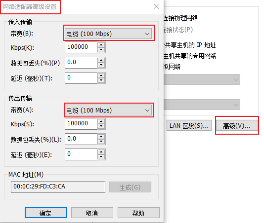
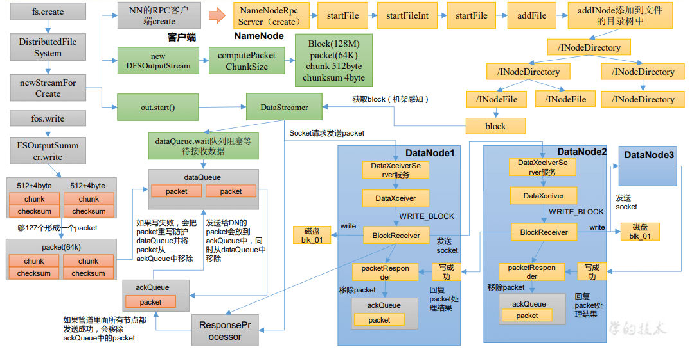

# Hadoop 进阶

:running: 文章主要介绍了 `hadoop` 生产环境的一些调优手段，以及 `hadoop` 各个组件的源码图解

<!-- more -->

## Hadoop 生产调优

### 1 HDFS—核心参数

#### 1.1 NameNode 内存生产配置

1）NameNode 内存计算

每个文件块大概占用 150byte，一台服务器 128G 内存为例，能存储多少文件块呢？

128 _ 1024 _ 1024 \* 1024 / 150Byte ≈ 9.1 亿

2）Hadoop2.x 系列，配置 NameNode

内存 NameNode 内存默认 2000m，如果服务器内存 4G，NameNode 内存可以配置 3g。在 hadoop-env.sh 文件中配置如下。

```shell
HADOOP_NAMENODE_OPTS=-Xmx3072m
```

3）Hadoop3.x 系列，配置 NameNode 内存

（1）hadoop-env.sh 中描述 Hadoop 的内存是动态分配的

（2）查看 NameNode 占用内存

```shell
 jmap -heap 进程id
```

查看发现 hadoop102 上的 NameNode 和 DataNode 占用内存都是自动分配的(大概 900 多兆)，且相等。 不是很合理。

[经验参考：]: https://docs.cloudera.com/documentation/enterprise/6/release-notes/topics/rg_hardware_requirements.html#concept_fzz_dq4_gbb


具体修改：hadoop-env.sh

```shell
export HDFS_NAMENODE_OPTS="-Dhadoop.security.logger=INFO,RFAS -Xmx1024m"
export HDFS_DATANODE_OPTS="-Dhadoop.security.logger=ERROR,RFAS -Xmx1024m"
```

分发配置文件,重启集群并查看 namenode 和 datanode 的最大内存

#### 1.2 NameNode 心跳并发配置


1）hdfs-site.xml

```xml
<!-- NameNode 有一个工作线程池，用来处理不同 DataNode 的并发心跳以及客户端并发的元数据操作 -->
<property>
 	<name>dfs.namenode.handler.count</name>
 	<value>21</value>
</property>
```

企业经验：print int(20\*math.log(3))

#### 1.3 开启回收站配置

开启回收站功能，可以将删除的文件在不超时的情况下，恢复原数据，起到防止误删除、 备份等作用。

1）回收站工作机制


2）开启回收站功能参数说明

（1）默认值 fs.trash.interval = 0，0 表示禁用回收站；其他值表示设置文件的存活时间。

（2）默认值 fs.trash.checkpoint.interval = 0，检查回收站的间隔时间。如果该值为 0，则该 值设置和 fs.trash.interval 的参数值相等。

（3）要求 fs.trash.checkpoint.interval <= fs.trash.interval。

3）启用回收站

修改 core-site.xml，配置垃圾回收时间为 1 分钟。

```xml
<property>
 	<name>fs.trash.interval</name>
 	<value>1</value>
</property>
```

4）查看回收站

回收站目录在 HDFS 集群中的路径：/user/atguigu/.Trash/….

5）注意：通过网页上直接删除的文件也不会走回收站。

6）通过程序删除的文件不会经过回收站，需要调用 moveToTrash()才进入回收站

```java
Trash trash = New Trash(conf);
trash.moveToTrash(path);
```

7）只有在命令行利用 hadoop fs -rm 命令删除的文件才会走回收站。

```shell
hadoop fs -rm -r /output
```

8）恢复回收站数据

```shell
hadoop fs -mv /user/chen/.Trash/Current/output /output
```

### 2 HDFS—集群压测

在企业中非常关心每天从 Java 后台拉取过来的数据，需要多久能上传到集群？消费者 关心多久能从 HDFS 上拉取需要的数据？

为了搞清楚 HDFS 的读写性能，生产环境上非常需要对集群进行压测。


HDFS 的读写性能主要受网络和磁盘影响比较大。为了方便测试，将 hadoop102、 hadoop103、hadoop104 虚拟机网络都设置为 100mbps。



100Mbps 单位是 bit；10M/s 单位是 byte ; 1byte=8bit，100Mbps/8=12.5M/s。

测试网速：找个有大文件的目录,开启 HTTP,web 访问,下载测速

```shell
python -m SimpleHTTPServer
```

#### 2.1 测试 HDFS 写性能

0）写测试底层原理


1）测试内容：向 HDFS 集群写 10 个 128M 的文件

```shell
hadoop jar share/hadoop/mapreduce/hadoop-mapreduce-client-jobclient-3.1.3-tests.jar TestDFSIO -write -nrFiles 10 -fileSize 128MB
```


➢ Number of files：生成 mapTask 数量，一般是集群中（CPU 核数-1），我们测试虚 拟机就按照实际的物理内存-1 分配即可

➢ Total MBytes processed：单个 map 处理的文件大小

➢ Throughput mb/sec:单个 mapTak 的吞吐量 计算方式：处理的总文件大小/每一个 mapTask 写数据的时间累加 集群整体吞吐量：生成 mapTask 数量\*单个 mapTak 的吞吐量

➢ Average IO rate mb/sec::平均 mapTak 的吞吐量 计算方式：每个 mapTask 处理文件大小/每一个 mapTask 写数据的时间全部相加除以 task 数量

➢ IO rate std deviation:方差、反映各个 mapTask 处理的差值，越小越均衡

2）注意：如果测试过程中，出现异常

（1）可以在 yarn-site.xml 中设置虚拟内存检测为 false

```xml
<!--是否启动一个线程检查每个任务正使用的虚拟内存量，如果任务超出分配值，则直接将其杀掉，默认是 true -->
<property>
 	<name>yarn.nodemanager.vmem-check-enabled</name>
 	<value>false</value>
</property>
```

（2）分发配置并重启 Yarn 集群

3）测试结果分析

（1）由于副本 1 就在本地，所以该副本不参与测试

一共参与测试的文件：10 个文件 \* 2 个副本 = 20 个

压测后的速度：1.61

实测速度：1.61M/s \* 20 个文件 ≈ 32M/s

三台服务器的带宽：12.5 + 12.5 + 12.5 ≈ 30m/s

所有网络资源都已经用满。

如果实测速度远远小于网络，并且实测速度不能满足工作需求，可以考虑采用固态硬盘 或者增加磁盘个数。

（2）如果客户端不在集群节点，那就三个副本都参与计算

#### 2.2 测试 HDFS 读性能

1）测试内容：读取 HDFS 集群 10 个 128M 的文件

```shell
hadoop jar share/hadoop/mapreduce/hadoop-mapreduce-client-jobclient-3.1.3-tests.jar TestDFSIO -read -nrFiles 10 -fileSize 128MB
```


2）删除测试生成数据

```shell
hadoop jar share/hadoop/mapreduce/hadoop-mapreduce-client-jobclient-3.1.3-tests.jar TestDFSIO -clean
```

3）测试结果分析：为什么读取文件速度大于网络带宽？由于目前只有三台服务器，且有三 个副本，数据读取就近原则，相当于都是读取的本地磁盘数据，没有走网络。

### 3 HDFS—多目录

#### 3.1 NameNode 多目录配置

1）NameNode 的本地目录可以配置成多个，且每个目录存放内容相同，增加了可靠性


2）具体配置如下

（1）在 hdfs-site.xml 文件中添加如下内容

```xml
<property>
 	<name>dfs.namenode.name.dir</name>
	<value>file://${hadoop.tmp.dir}/dfs/name1,file://${hadoop.tmp.dir}/dfs/name2</value>
</property>
```

注意：因为每台服务器节点的磁盘情况不同，所以这个配置配完之后，可以选择不分发

（2）停止集群，删除三台节点的 data 和 logs 中所有数据。

```shell
rm -rf data/ logs/
```

（3）格式化集群并启动。

```shell
hdfs namenode -format
myhadoop.sh start
```

3）查看结果


检查 name1 和 name2 里面的内容，发现一模一样。

#### 3.2 DataNode 多目录配置

1）DataNode 可以配置成多个目录，`每个目录存储的数据不一样`（数据不是副本）


2）具体配置如下

在 hdfs-site.xml 文件中添加如下内容

```xml
<property>
 	<name>dfs.datanode.data.dir</name>
	<value>file://${hadoop.tmp.dir}/dfs/data1,file://${hadoop.tmp.dir}/dfs/data2</value>
</property>
```

3）查看结果


4）向集群上传一个文件，再次观察两个文件夹里面的内容发现不一致（一个有数一个没有）

#### 3.3 集群数据均衡之磁盘间数据均衡

生产环境，由于硬盘空间不足，往往需要增加一块硬盘。刚加载的硬盘没有数据时，可 以执行磁盘数据均衡命令。（Hadoop3.x 新特性）


（1）生成均衡计划（我们只有一块磁盘，不会生成计划）

```shell
hdfs diskbalancer -plan hadoop103
```

（2）执行均衡计划

```shell
hdfs diskbalancer -execute hadoop103.plan.json
```

（3）查看当前均衡任务的执行情况

```shell
hdfs diskbalancer -query hadoop103
```

（4）取消均衡任务

```shell
hdfs diskbalancer -cancel hadoop103.plan.json
```

### 4 HDFS—集群扩容及缩容

#### 4.1 添加白名单

白名单：表示在白名单的主机 IP 地址可以，用来存储数据。

企业中：配置白名单，可以尽量防止黑客恶意访问攻击。


配置白名单步骤如下：

1）在 NameNode 节点的/opt/module/hadoop-3.1.3/etc/hadoop 目录下分别创建 whitelist 和 blacklist 文件

```shell
#进入配置文件目录
cd /opt/hadoop-3.1.3/etc/hadoop/
#（1）创建白名单
vim whitelist
#写入文件内容
hadoop141
hadoop142
#（2）创建黑名单
touch blacklist
```

2）在 hdfs-site.xml 配置文件中增加 dfs.hosts 配置参数

```xml
<!-- 白名单 -->
<property>
 	<name>dfs.hosts</name>
 	<value>/opt/hadoop-3.1.3/etc/hadoop/whitelist</value>
</property>
<!-- 黑名单 -->
<property>
 	<name>dfs.hosts.exclude</name>
 	<value>/opt/hadoop-3.1.3/etc/hadoop/blacklist</value>
</property>
```

3）分发配置文件 whitelist，hdfs-site.xml

```shell
xsync whitelist hdfs-site.xml
```

4）第一次添加白名单必须重启集群，不是第一次，只需要刷新 NameNode 节点即可

```shell
myhadoop.sh stop
myhadoop.sh start
```

5）在 web 浏览器上查看 DN


6）在 hadoop143 上执行上传数据

```shell
hadoop fs -put README.txt /
```

此时 143 只是作为客户端,并不能存储数据

7）二次修改白名单，增加 hadoop104

```shell
vim whitelist
# 修改内容
hadoop141
hadoop142
hadoop143
```

8）刷新 NameNode

```shell
hdfs dfsadmin -refreshNodes
```

9）在 web 浏览器上查看 DN


#### 4.2 服役新服务器

`内存不够,只记录步骤`

1）需求

随着公司业务的增长，数据量越来越大，原有的数据节点的容量已经不能满足存储数据 的需求，需要在原有集群基础上动态添加新的数据节点。

2）环境准备

（1）在 hadoop100 主机上再克隆一台 hadoop105 主机

（2）修改 IP 地址和主机名称

（3）拷贝 hadoop102 的/opt/module 目录和/etc/profile.d/my_env.sh 到 hadoop105

（4）删除 hadoop105 上 Hadoop 的历史数据，data 和 log 数据

（5）配置 hadoop102 和 hadoop103 到 hadoop105 的 ssh 无密登录

3）服役新节点具体步骤

（1）直接启动 DataNode，即可关联到集群

```shell
hdfs --daemon start datanode
yarn --daemon start nodemanager
```

4）在白名单中增加新服役的服务器

5）在 hadoop105 上上传文件

#### 4.3 服务器间数据均衡

1）企业经验：

在企业开发中，如果经常在 hadoop102 和 hadoop104 上提交任务，且副本数为 2，由于数据本地性原则，就会导致 hadoop102 和 hadoop104 数据过多，hadoop103 存储的数据量小。

另一种情况，就是新服役的服务器数据量比较少，需要执行集群均衡命令。


2）开启数据均衡命令：

```shell
sbin/start-balancer.sh -threshold 10
```

对于参数 10，代表的是集群中各个节点的磁盘空间利用率相差不超过 10%，可根据实际情况进行调整。

3）停止数据均衡命令：

```shell
sbin/stop-balancer.sh
```

注意：由于 HDFS 需要启动单独的 Rebalance Server 来执行 Rebalance 操作，所以尽量 不要在 NameNode 上执行 start-balancer.sh，而是找一台比较空闲的机器。

#### 4.4 黑名单退役服务器

黑名单：表示在黑名单的主机 IP 地址不可以，用来存储数据。

企业中：配置黑名单，用来退役服务器。


黑名单配置步骤如下：

1）编辑/opt/module/hadoop-3.1.3/etc/hadoop 目录下的 blacklist 文件

```shell
#进入配置文件目录
cd /opt/hadoop-3.1.3/etc/hadoop/
#（1）创建白名单
vim blacklist
#写入文件内容
hadoop105
```

2）分发配置文件 blacklist，hdfs-site.xml

```shell
xsync hdfs-site.xml blacklist
```

3）第一次添加黑名单必须重启集群，不是第一次，只需要刷新 NameNode 节点即可

```shell
hdfs dfsadmin -refreshNodes
```

4）检查 Web 浏览器，退役节点的状态为 decommission in progress（退役中），说明数据 节点正在复制块到其他节点

5）等待退役节点状态为 decommissioned（所有块已经复制完成），停止该节点及节点资源 管理器。注意：如果副本数是 3，服役的节点小于等于 3，是不能退役成功的，需要修改 副本数后才能退役

```shell
#stopping datanode
hdfs --daemon stop datanode
#stopping nodemanager
yarn --daemon stop nodemanager
```

6）如果数据不均衡，可以用命令实现集群的再平衡

```shell
sbin/start-balancer.sh -threshold 10
```

### 5 HDFS—存储优化

注：演示纠删码和异构存储需要一共 5 台虚拟机。尽量拿另外一套集群。提前准备 5 台 服务器的集群。

#### 5.1 纠删码

##### 5.1.1 纠删码原理

HDFS 默认情况下，一个文件有 3 个副本，这样提高了数据的可靠性，但也带来了 2 倍 的冗余开销。Hadoop3.x 引入了纠删码，采用计算的方式，可以节省约 50％左右的存储空间。


1）纠删码操作相关的命令

```shell
hdfs ec
```

2）查看当前支持的纠删码策略

```shell
hdfs ec -listPolicies
```

3）纠删码策略解释:

RS-3-2-1024k：

RS : 编码格式

3 : 3 个数据单元

2: 2 个效验单元

1024k : 每个单元大小

只要存活 3 个单元以上都可以恢复数据(后面的那些纠删码策略也是一样的,只是划分数据单元和编码格式有所区别)

##### 5.1.2 纠删码案例实操

内存不够,开不了 5 台,就用 XOR-2-1-1024k 策略测试下

文件大小: 2 兆以内,不超过 2 兆

```shell
# 开启XOR-2-1-1024k纠删码策略
hdfs ec -enablePolicy -policy XOR-2-1-1024k
# 查看策略是否开启
hdfs ec -listPolicies
# 创建测试目录
hadoop fs -mkdir /input
# 给新建目录设置纠删码策略
hdfs ec -setPolicy -path /input -policy XOR-2-1-1024k
```


测试: 删除某一个节点的数据,测试是否能够下载文件

结论: 可以下载,并且被删除的文件还会恢复,但删除两个节点或以上的数据就不能恢复了

#### 5.2 异构存储（冷热数据分离）

异构存储主要解决，不同的数据，存储在不同类型的硬盘中，达到最佳性能的问题。


1）关于存储类型

RAM_DISK：（内存镜像文件系统）

SSD：（SSD 固态硬盘）

DISK：（普通磁盘，在 HDFS 中，如果没有主动声明数据目录存储类型默认都是 DISK）

ARCHIVE：（没有特指哪种存储介质，主要的指的是计算能力比较弱而存储密度比较高的存储介质，用来解决数据量的 容量扩增的问题，一般用于归档）

2）关于存储策略


说明：从 Lazy_Persist 到 Cold，分别代表了设备的访问速度从快到慢

##### 5.2.1 异构存储 Shell 操作

```shell
# （1）查看当前有哪些存储策略可以用
hdfs storagepolicies -listPolicies
# （2）为指定路径（数据存储目录）设置指定的存储策略
hdfs storagepolicies -setStoragePolicy -path xxx -policy xxx
# （3）获取指定路径（数据存储目录或文件）的存储策略
hdfs storagepolicies -getStoragePolicy -path xxx
# （4）取消存储策略；执行改命令之后该目录或者文件，以其上级的目录为准，如果是根目录，那么就是 HOT
hdfs storagepolicies -unsetStoragePolicy -path xxx
# （5）查看文件块的分布
hdfs fsck xxx -files -blocks -locations
# （6）查看集群节点
hadoop dfsadmin -report
```

##### 5.2.2 测试环境准备

1）测试环境描述

服务器规模：3 台

集群配置：副本数为 2，创建好带有存储类型的目录（提前创建）

集群规划：

| 节点      | 存储类型分配            |
| --------- | ----------------------- |
| hadoop141 | RAM_DISK，SSD, ARCHIVE  |
| hadoop142 | SSD，DISK, ARCHIVE      |
| hadoop143 | DISK，RAM_DISK, ARCHIVE |

2）配置文件信息

（1）为 hadoop102 节点的 hdfs-site.xml 添加如下信息

```xml
<property>
    <name>dfs.hosts.exclude</name>
    <value>/opt/hadoop-3.1.3/etc/hadoop/blacklist</value>
</property>
<property>
    <name>dfs.replication</name>
    <value>2</value>
</property>
<property>
    <name>dfs.storage.policy.enabled</name>
    <value>true</value>
</property>
<property>
    <name>dfs.datanode.data.dir</name>
    <value>[SSD]file:///opt/hadoop-3.1.3/hdfsdata/ssd,[RAM_DISK]file:///opt/hadoop-3.1.3/hdfsdata/ram_disk,[ARCHIVE]file:///opt/hadoop-3.1.3/hdfsdata/archive</value>
</property>
```

（2）为 hadoop103 节点的 hdfs-site.xml 添加如下信息

```xml
<property>
	<name>dfs.replication</name>
	<value>2</value>
</property>
<property>
	<name>dfs.storage.policy.enabled</name>
	<value>true</value>
</property>
<property>
	<name>dfs.datanode.data.dir</name>
	<value>[SSD]file:///opt/hadoop-3.1.3/hdfsdata/ssd,[DISK]file:///opt/hadoop-3.1.3/hdfsdata/disk,[ARCHIVE]file:///opt/hadoop-3.1.3/hdfsdata/archive</value>
</property>
```

（3）为 hadoop104 节点的 hdfs-site.xml 添加如下信息

```xml
<property>
	<name>dfs.replication</name>
	<value>2</value>
</property>
<property>
	<name>dfs.storage.policy.enabled</name>
	<value>true</value>
</property>
<property>
	<name>dfs.datanode.data.dir</name>
	<value>[RAM_DISK]file:///opt/hadoop-3.1.3/hdfsdata/ram_disk,[DISK]file:///opt/hadoop-3.1.3/hdfsdata/disk,[ARCHIVE]file:///opt/hadoop-3.1.3/hdfsdata/archive</value>
</property>
```

3）数据准备

```shell
#（1）启动集群
hdfs namenode -format
myhadoop.sh start
#（2）在 HDFS 上创建文件目录
hadoop fs -mkdir /hdfsdata
#（3）将文件资料上传
hadoop fs -put NOTICE.txt /hdfsdata
```

##### 5.2.3 HOT 存储策略案例

```shell
#（1）最开始我们未设置存储策略的情况下，我们获取该目录的存储策略
hdfs storagepolicies -getStoragePolicy -path /hdfsdata
#（2）我们查看上传的文件块分布
hdfs fsck /hdfsdata -files -blocks -locations
```


##### 5.2.4 WARM 存储策略测试

```shell
#（1）接下来我们为数据降温
hdfs storagepolicies -setStoragePolicy -path /hdfsdata -policy WARM
#（2）再次查看文件块分布，我们可以看到文件块依然放在原处。
hdfs fsck /hdfsdata -files -blocks -locations
#（3）我们需要让他 HDFS 按照存储策略自行移动文件块
hdfs mover /hdfsdata
```


##### 5.2.5 COLD 策略测试

```shell
#（1）我们继续将数据降温为 cold
hdfs storagepolicies -setStoragePolicy -path /hdfsdata -policy COLD
#（2）手动转移
hdfs mover /hdfsdata
#（3）检查文件块的分布
hdfs fsck /hdfsdata -files -blocks -locations
```

所有文件块都在 ARCHIVE，符合 COLD 存储策略。

##### 5.2.6 ONE_SSD 策略测试

```shell
#（1）接下来我们将存储策略从默认的 HOT 更改为 One_SSD
hdfs storagepolicies -setStoragePolicy -path /hdfsdata -policy One_SSD
#（2）手动转移文件块
hdfs mover /hdfsdata
#（3）转移完成后，我们查看文件块分布
hdfs fsck /hdfsdata -files -blocks -locations
```

文件块分布为一半在 SSD，一半在 DISK，符合 One_SSD 存储策略

##### 5.2.7 ALL_SSD 策略测试

```shell
#（1）接下来，我们再将存储策略更改为 All_SSD
hdfs storagepolicies -setStoragePolicy -path /hdfsdata -policy All_SSD
#（2）手动转移文件块
hdfs mover /hdfsdata
#（3）查看文件块分布，我们可以看到
hdfs fsck /hdfsdata -files -blocks -locations
```

所有的文件块都存储在 SSD，符合 All_SSD 存储策略

##### 5.2.8 LAZY_PERSIST 策略测试

```shell
#（1）继续改变策略，将存储策略改为 lazy_persist
hdfs storagepolicies -setStoragePolicy -path /hdfsdata -policy lazy_persist
#（2）手动转移文件块
hdfs mover /hdfsdata
#（3）查看文件块分布
hdfs fsck /hdfsdata -files -blocks -locations
```

这里我们发现所有的文件块都是存储在 DISK，按照理论一个副本存储在 RAM_DISK,其他副本存储在 DISK 中，这是因为，我们还需要配置“dfs.datanode.max.locked.memory”，“dfs.block.size”参数。

那么出现存储策略为 LAZY_PERSIST 时，文件块副本都存储在 DISK 上的原因有如下两 点：

（1）当客户端所在的 DataNode 节点没有 RAM_DISK 时，则会写入客户端所在的 DataNode 节点的 DISK 磁盘，其余副本会写入其他节点的 DISK 磁盘

（2）当客户端所在的 DataNode 有 RAM_DISK，但“dfs.datanode.max.locked.memory” 参数值未设置或者设置过小（小于“dfs.block.size”参数值）时，则会写入客户端所在的 DataNode 节点的 DISK 磁盘，其余副本会写入其他节点的 DISK 磁盘

但是由于虚拟机的“max locked memory”为 64KB，所以，如果参数配置过大，还会报 出错误

### 6 HDFS—故障排除

注意：采用三台服务器即可，恢复到 Yarn 开始的服务器快照。

#### 6.1 NameNode 故障处理


1）需求：

NameNode 进程挂了并且存储的数据也丢失了，如何恢复 NameNode

2）故障模拟

```shell
#（1）kill -9 NameNode 进程
kill -9 19765
#（2）删除 NameNode 存储的数据
cd /opt/hadoop-3.1.3/data/dfs/name/
rm -rf *
```

3）问题解决

```shell
#（1）拷贝 SecondaryNameNode 中数据到原 NameNode 存储数据目录
scp -r chen@hadoop143:/opt/hadoop-3.1.3/data/dfs/namesecondary/* .
#（2）重新启动 NameNode
hdfs --daemon start namenode
#（3）向集群上传一个文件
```

#### 6.2 集群安全模式&磁盘修复

1）安全模式：文件系统只接受读数据请求，而不接受删除、修改等变更请求

2）进入安全模式场景

➢ NameNode 在加载镜像文件和编辑日志期间处于安全模式；

➢ NameNode 再接收 DataNode 注册时，处于安全模式


3）退出安全模式条件

dfs.namenode.safemode.min.datanodes:最小可用 datanode 数量，默认 0

dfs.namenode.safemode.threshold-pct:副本数达到最小要求的 block 占系统总 block 数的 百分比，默认 0.999f。（只允许丢一个块）

dfs.namenode.safemode.extension:稳定时间，默认值 30000 毫秒，即 30 秒

4）基本语法

集群处于安全模式，不能执行重要操作（写操作）。集群启动完成后，自动退出安全模 式。

```shell
hdfs dfsadmin -safemode get 	#（功能描述：查看安全模式状态）
hdfs dfsadmin -safemode enter 	#（功能描述：进入安全模式状态）
hdfs dfsadmin -safemode leave	#（功能描述：离开安全模式状态）
hdfs dfsadmin -safemode wait 	#（功能描述：等待安全模式状态）
```

5）案例 1：启动集群进入安全模式

```shell
#（1）重新启动集群
myhadoop.sh stop
myhadoop.sh start
# （2）集群启动后，立即来到集群上删除数据，提示集群处于安全模式
```

6）案例 2：磁盘修复

需求：数据块损坏，进入安全模式，如何处理

（ 1 ） 分别进入 hadoop141 、 hadoop142 、 hadoop143 删除某 2 个块信息

（ 2 ）重新启动集群

```shell
#查看当前是否处于安全模式
hdfs dfsadmin -safemode get
#离开安全模式
hdfs dfsadmin -safemode leave
#查看web页面
http://hadoop141:9870/dfshealth.html#tab-overview
```


（ 3 ）将元数据删除

7）案例 3：

需求：模拟等待安全模式

```shell
#（1）查看当前模式
hdfs dfsadmin -safemode get
#（2）先进入安全模式
hdfs dfsadmin -safemode enter
#（3）创建并执行下面的脚本
vim safemode.sh
#（4）填充以下内容
#!/bin/bash
hdfs dfsadmin -safemode wait
hadoop fs -put /opt/hadoop-3.1.3/README.txt /
#（5）给权限,执行脚本(会一直阻塞)
./safemode.sh
#（6）打开另一个节点,离开安全模式
hdfs dfsadmin -safemode leave
#（7）再观察上一个窗口
```


#### 6.3 慢磁盘监控

“慢磁盘”指的时写入数据非常慢的一类磁盘。其实慢性磁盘并不少见，当机器运行时 间长了，上面跑的任务多了，磁盘的读写性能自然会退化，严重时就会出现写入数据延时的问题。

如何发现慢磁盘？

正常在 HDFS 上创建一个目录，只需要不到 1s 的时间。如果你发现创建目录超过 1 分 钟及以上，而且这个现象并不是每次都有。只是偶尔慢了一下，就很有可能存在慢磁盘。 可以采用如下方法找出是哪块磁盘慢：

1）通过心跳未联系时间。

一般出现慢磁盘现象，会影响到 DataNode 与 NameNode 之间的心跳。正常情况心跳时 间间隔是 3s。超过 3s 说明有异常。


2）fio 命令，测试磁盘的读写性能

（1）顺序读测试

```shell
#下载测试工具
sudo yum install -y fio
#测试读数据
sudo fio -filename=/home/chen/test.log -direct=1 -iodepth 1 -thread -rw=read -ioengine=psync -bs=16k -size=2G -numjobs=10 -runtime=60 -group_reporting -name=test_r
```


（2）顺序写测试

```shell
sudo fio -filename=/home/chen/test.log -direct=1 -iodepth 1 -thread -rw=write -ioengine=psync -bs=16k -size=2G -numjobs=10 -runtime=60 -group_reporting -name=test_w
```


（3）随机写测试

```shell
sudo fio -filename=/home/chen/test.log -direct=1 -iodepth 1 -thread -rw=randwrite -ioengine=psync -bs=16k -size=2G -numjobs=10 -runtime=60 -group_reporting -name=test_randw
```


（4）混合随机读写：

```shell
sudo fio -filename=/home/chen/test.log -direct=1 -iodepth 1 -thread -rw=randrw -rwmixread=70 -ioengine=psync -bs=16k -size=2G -numjobs=10 -runtime=60 -group_reporting -name=test_r_w -ioscheduler=noop
```


#### 6.4 小文件归档

1）HDFS 存储小文件弊端


每个文件均按块存储，每个块的元数据存储在 NameNode 的内存中，因此 HDFS 存储 小文件会非常低效。因为大量的小文件会耗尽 NameNode 中的大部分内存。但注意，存储小 文件所需要的磁盘容量和数据块的大小无关。例如，一个 1MB 的文件设置为 128MB 的块 存储，实际使用的是 1MB 的磁盘空间，而不是 128MB。

2）解决存储小文件办法之一

HDFS 存档文件或 HAR 文件，是一个更高效的文件存档工具，它将文件存入 HDFS 块， 在减少 NameNode 内存使用的同时，允许对文件进行透明的访问。具体说来，HDFS 存档文 件对内还是一个一个独立文件，对 NameNode 而言却是一个整体，减少了 NameNode 的内存。


3）案例实操

```shell
#（1）归档文件
hadoop archive -archiveName input.har -p /input /output
#（2）查看归档
hadoop fs -ls /output/input.har
hadoop fs -ls har:///output/input.har
#（3）解归档文件到hdfs根目录
hadoop fs -cp har:///output/input.har/* /
```

### 7 HDFS—集群迁移

#### 7.1 Apache 和 Apache 集群间数据拷贝

1）scp 实现两个远程主机之间的文件复制

2）采用 distcp 命令实现两个 Hadoop 集群之间的递归数据复制

```shell
hadoop distcp hdfs://hadoop102:8020/user/atguigu/hello.txt hdfs://hadoop105:8020/user/atguigu/hello.txt
```

### 8 MapReduce 生产经验

#### 8.1 MapReduce 跑的慢的原因

MapReduce 程序效率的瓶颈在于两点：

1）计算机性能 CPU、内存、磁盘、网络

2）I/O 操作优化

（1）数据倾斜

（2）Map 运行时间太长，导致 Reduce 等待过久

（3）小文件过多

#### 8.2 MapReduce 常用调优参数

MapReduce 优化（上）


MapReduce 优化（下）


#### 8.3 MapReduce 数据倾斜问题

1）数据倾斜现象

数据频率倾斜——某一个区域的数据量要远远大于其他区域。

数据大小倾斜——部分记录的大小远远大于平均值。

2）减少数据倾斜的方法

（1）首先检查是否空值过多造成的数据倾斜

生产环境，可以直接过滤掉空值；如果想保留空值，就自定义分区，将空值加随机数打 散。最后再二次聚合。

（2）能在 map 阶段提前处理，最好先在 Map 阶段处理。如：Combiner、MapJoin

（3）设置多个 reduce 个数

### 9 Hadoop-Yarn 生产经验

#### 9.1 常用的调优参数

1）调优参数列表

（1）Resourcemanager 相关

```shell
#处理调度器请求的线程数量
yarn.resourcemanager.scheduler.client.thread-count ResourceManager
#配置调度器
yarn.resourcemanager.scheduler.class
```

（2）Nodemanager 相关

```shell
#使用内存数
yarn.nodemanager.resource.memory-mb NodeManager
#为系统保留多少内存，和上一个参数二者取一即可
yarn.nodemanager.resource.system-reserved-memory-mb NodeManager
#使用 CPU 核数
yarn.nodemanager.resource.cpu-vcores NodeManager
#是否将虚拟核数当作 CPU 核数
yarn.nodemanager.resource.count-logical-processors-as-cores
#虚拟核数和物理核数乘数，例如：4 核 8 线程，该参数就应设为 2
yarn.nodemanager.resource.pcores-vcores-multiplier
#是否让 yarn 自己检测硬件进行配置
yarn.nodemanager.resource.detect-hardware-capabilities
#是否开启物理内存检查限制 container
yarn.nodemanager.pmem-check-enabled
#是否开启虚拟内存检查限制 container
yarn.nodemanager.vmem-check-enabled
#虚拟内存物理内存比例
yarn.nodemanager.vmem-pmem-ratio
```

（3）Container 容器相关

```shell
#容器最小内存
yarn.scheduler.minimum-allocation-mb
#容器最大内存
yarn.scheduler.maximum-allocation-mb
#容器最小核数
yarn.scheduler.minimum-allocation-vcores
#容器最大核数
yarn.scheduler.maximum-allocation-vcores
```

### 10 Hadoop 综合调优

#### 10.1 Hadoop 小文件优化方法

##### 10.1.1 Hadoop 小文件弊端

HDFS 上每个文件都要在 NameNode 上创建对应的元数据，这个元数据的大小约为 150byte，这样当小文件比较多的时候，就会产生很多的元数据文件，`一方面会大量占用 NameNode 的内存空间，另一方面就是元数据文件过多，使得寻址索引速度变慢。`

小文件过多，在进行 MR 计算时，会生成过多切片，需要启动过多的 MapTask。每个 MapTask 处理的数据量小，`导致 MapTask 的处理时间比启动时间还小，白白消耗资源。`

##### 10.1.2 Hadoop 小文件解决方案

1）在数据采集的时候，就将小文件或小批数据合成大文件再上传 HDFS（数据源头）

2）Hadoop Archive（存储方向）

是一个高效的将小文件放入 HDFS 块中的文件存档工具，能够将多个小文件打包成一 个 HAR 文件，从而达到减少 NameNode 的内存使用

3）CombineTextInputFormat（计算方向）

CombineTextInputFormat 用于将多个小文件在切片过程中生成一个单独的切片或者少 量的切片。

4）开启 uber 模式，实现 JVM 重用（计算方向）

默认情况下，每个 Task 任务都需要启动一个 JVM 来运行，如果 Task 任务计算的数据 量很小，我们可以让同一个 Job 的多个 Task 运行在一个 JVM 中，不必为每个 Task 都开启 一个 JVM。

（1）未开启 uber 模式，在/input 路径上上传多个小文件并执行 wordcount 程序

```shell
hadoop jar share/hadoop/mapreduce/hadoop-mapreduce-examples-3.1.3.jar wordcount /input /output
```


（2）开启 uber 模式，在 mapred-site.xml 中添加如下配置

```xml
<!-- 开启 uber 模式，默认关闭 -->
<property>
 	<name>mapreduce.job.ubertask.enable</name>
 	<value>true</value>
</property>
<!-- uber 模式中最大的 mapTask 数量，可向下修改 -->
<property>
 	<name>mapreduce.job.ubertask.maxmaps</name>
 	<value>9</value>
</property>
<!-- uber 模式中最大的 reduce 数量，可向下修改 -->
<property>
 	<name>mapreduce.job.ubertask.maxreduces</name>
 	<value>1</value>
</property>
<!-- uber 模式中最大的输入数据量，默认使用 dfs.blocksize 的值，可向下修改 -->
<property>
 	<name>mapreduce.job.ubertask.maxbytes</name>
 	<value></value>
</property>
```

（3）分发配置

```shell
xsync mapred-site.xml
```

（6）再次执行 wordcount 程序

```shell
hadoop jar share/hadoop/mapreduce/hadoop-mapreduce-examples-3.1.3.jar wordcount /input /output1
```


#### 10.2 测试 MapReduce 计算性能

注：一个虚拟机不超过 150G 磁盘尽量不要执行这段代码

```shell
#（1）使用 RandomWriter 来产生随机数，每个节点运行 10 个 Map 任务，每个 Map 产 生大约 1G 大小的二进制随机数
hadoop jar share/hadoop/mapreduce/hadoop-mapreduce-examples3.1.3.jar randomwriter random-data
#（2）执行 Sort 程序
hadoop jar share/hadoop/mapreduce/hadoop-mapreduce-examples3.1.3.jar sort random-data sorted-data
#（3）验证数据是否真正排好序了
hadoop jar share/hadoop/mapreduce/hadoop-mapreduce-clientjobclient-3.1.3-tests.jar testmapredsort -sortInput random-data
-sortOutput sorted-data
```

#### 10.3 企业开发场景案例

##### 10.3.1 需求

（1）需求：从 1G 数据中，统计每个单词出现次数。服务器 3 台，每台配置 4G 内存， 4 核 CPU，4 线程。

（2）需求分析： 1G / 128m = 8 个 MapTask；1 个 ReduceTask；1 个 mrAppMaster 平均每个节点运行 10 个 / 3 台 ≈ 3 个任务（4 3 3）

##### 10.3.2 HDFS 参数调优

（1）修改：hadoop-env.sh

```shell
export HDFS_NAMENODE_OPTS="-Dhadoop.security.logger=INFO,RFAS -Xmx1024m"
export HDFS_DATANODE_OPTS="-Dhadoop.security.logger=ERROR,RFAS -Xmx1024m"
```

（2）修改 hdfs-site.xml

```xml
<!-- NameNode 有一个工作线程池，默认值是 10 -->
<property>
 	<name>dfs.namenode.handler.count</name>
 	<value>21</value>
</property>
```

（3）修改 core-site.xml

```xml
<!-- 配置垃圾回收时间为 60 分钟 -->
<property>
 	<name>fs.trash.interval</name>
    <value>60</value>
</property>
```

（4）分发配置

```shell
xsync hadoop-env.sh hdfs-site.xml core-site.xml
```

##### 10.3.3 MapReduce 参数调优

（1）修改 mapred-site.xml

```xml
<!-- 环形缓冲区大小，默认 100m -->
<property>
 	<name>mapreduce.task.io.sort.mb</name>
 	<value>100</value>
</property>
<!-- 环形缓冲区溢写阈值，默认 0.8 -->
<property>
 	<name>mapreduce.map.sort.spill.percent</name>
 	<value>0.80</value>
</property>
<!-- merge 合并次数，默认 10 个 -->
<property>
 	<name>mapreduce.task.io.sort.factor</name>
 	<value>10</value>
</property>
<!-- maptask 内存，默认 1g； maptask 堆内存大小默认和该值大小一致mapreduce.map.java.opts -->
<property>
 	<name>mapreduce.map.memory.mb</name>
 	<value>-1</value>
</property>
<!-- matask 的 CPU 核数，默认 1 个 -->
<property>
 	<name>mapreduce.map.cpu.vcores</name>
 	<value>1</value>
</property>
<!-- matask 异常重试次数，默认 4 次 -->
<property>
 	<name>mapreduce.map.maxattempts</name>
 	<value>4</value>
</property>
<!-- 每个 Reduce 去 Map 中拉取数据的并行数。默认值是 5 -->
<property>
 	<name>mapreduce.reduce.shuffle.parallelcopies</name>
    <value>5</value>
</property>
<!-- Buffer 大小占 Reduce 可用内存的比例，默认值 0.7 -->
<property>
 	<name>mapreduce.reduce.shuffle.input.buffer.percent</name>
 	<value>0.70</value>
</property>
<!-- Buffer 中的数据达到多少比例开始写入磁盘，默认值 0.66。 -->
<property>
 	<name>mapreduce.reduce.shuffle.merge.percent</name>
 	<value>0.66</value>
</property>
<!-- reducetask 内存，默认 1g；reducetask 堆内存大小默认和该值大小一致mapreduce.reduce.java.opts -->
<property>
 	<name>mapreduce.reduce.memory.mb</name>
 	<value>-1</value>
</property>
<!-- reducetask 的 CPU 核数，默认 1 个 -->
<property>
 	<name>mapreduce.reduce.cpu.vcores</name>
 	<value>2</value>
</property>
<!-- reducetask 失败重试次数，默认 4 次 -->
<property>
 	<name>mapreduce.reduce.maxattempts</name>
 	<value>4</value>
</property>
<!-- 当 MapTask 完成的比例达到该值后才会为 ReduceTask 申请资源。默认是 0.05-->
<property>
 	<name>mapreduce.job.reduce.slowstart.completedmaps</name>
 	<value>0.05</value>
</property>
<!-- 如果程序在规定的默认 10 分钟内没有读到数据，将强制超时退出 -->
<property>
 	<name>mapreduce.task.timeout</name>
 	<value>600000</value>
</property>
```

（2）分发配置

```shell
xsync mapred-site.xml
```

##### 10.3.4 Yarn 参数调优

（1）修改 yarn-site.xml 配置参数如下：

```xml
<!-- 选择调度器，默认容量 -->
<property>
	<name>yarn.resourcemanager.scheduler.class</name>
	<value>org.apache.hadoop.yarn.server.resourcemanager.scheduler.capacity.CapacityScheduler</value>
</property>
<!-- ResourceManager 处理调度器请求的线程数量,默认 50；如果提交的任务数大于 50，可以增加该值，但是不能超过 3 台 * 4 线程 = 12 线程（去除其他应用程序实际不能超过 8） -->
<property>
	<name>yarn.resourcemanager.scheduler.client.thread-count</name>
	<value>8</value>
</property>
<!-- 是否让 yarn 自动检测硬件进行配置，默认是 false，如果该节点有很多其他应用程序，建议手动配置。如果该节点没有其他应用程序，可以采用自动 -->
<property>
	<name>yarn.nodemanager.resource.detect-hardware-capabilities</name>
	<value>false</value>
</property>
<!-- 是否将虚拟核数当作 CPU 核数，默认是 false，采用物理 CPU 核数 -->
<property>
	<name>yarn.nodemanager.resource.count-logical-processors-ascores</name>
	<value>false</value>
</property>
<!-- 虚拟核数和物理核数乘数，默认是 1.0 -->
<property>
	<name>yarn.nodemanager.resource.pcores-vcores-multiplier</name>
	<value>1.0</value>
</property>
<!-- NodeManager 使用内存数，默认 8G，修改为 4G 内存 -->
<property>
	<name>yarn.nodemanager.resource.memory-mb</name>
	<value>4096</value>
</property>
<!-- nodemanager 的 CPU 核数，不按照硬件环境自动设定时默认是 8 个，修改为 4 个 -->
<property>
	<name>yarn.nodemanager.resource.cpu-vcores</name>
	<value>4</value>
</property>
<!-- 容器最小内存，默认 1G -->
<property>
	<name>yarn.scheduler.minimum-allocation-mb</name>
	<value>1024</value>
</property>
<!-- 容器最大内存，默认 8G，修改为 2G -->
<property>
	<name>yarn.scheduler.maximum-allocation-mb</name>
	<value>2048</value>
</property>
<!-- 容器最小 CPU 核数，默认 1 个 -->
<property>
	<name>yarn.scheduler.minimum-allocation-vcores</name>
	<value>1</value>
</property>
<!-- 容器最大 CPU 核数，默认 4 个，修改为 2 个 -->
<property>
	<name>yarn.scheduler.maximum-allocation-vcores</name>
	<value>2</value>
</property>
<!-- 虚拟内存检查，默认打开，修改为关闭 -->
<property>
	<name>yarn.nodemanager.vmem-check-enabled</name>
	<value>false</value>
</property>
<!-- 虚拟内存和物理内存设置比例,默认 2.1 -->
<property>
	<name>yarn.nodemanager.vmem-pmem-ratio</name>
	<value>2.1</value>
</property>
```

（2）分发配置

```shell
xsync yarn-site.xml
```

##### 10.3.5 执行程序

```shell
hadoop jar share/hadoop/mapreduce/hadoop-mapreduce-examples-3.1.3.jar wordcount /input /output
```

## Hadoop 源码解析

### 1 RPC 通信原理解析

0）回顾 HDFS、YARN、MapReduce 三者关系


1）需求：

模拟 RPC 的客户端、服务端、通信协议三者如何工作的


2）代码编写：

（1）创建 RPC 协议

```java
public interface RPCProtocol {
    long versionID=666;
    void mkdirs(String path);
}
```

（2）创建 RPC 服务端

```java
public class NNServer implements RPCProtocol {
    public static void main(String[] args) throws IOException {
        RPC.Server server = new RPC.Builder(new Configuration())
                .setBindAddress("localhost")
                .setPort(8888)
                .setProtocol(RPCProtocol.class)
                .setInstance(new NNServer())
                .build();
        System.out.println("服务器开始工作");
        server.start();
    }

    @Override
    public void mkdirs(String path) {
        System.out.println("服务器接受到了客户端请求"+path);
    }
}
```

（3）创建 RPC 客户端

```java
public class HDFSClient {
    public static void main(String[] args) throws IOException {
        RPCProtocol client = RPC.getProxy(RPCProtocol.class, RPCProtocol.versionID, new InetSocketAddress("localhost", 8888), new Configuration());
        System.out.println("客户端开始工作");
        client.mkdirs("/input");
        System.in.read();
    }
}
```

3）测试

（1）启动服务端

（2）启动客户端

4）总结

RPC 的客户端调用通信协议方法，方法的执行在服务端；

通信协议就是接口规范。

### 2 NameNode 启动源码解析

**NameNode 工作机制**


**NameNode 启动源码解析**


0）在 pom.xml 中增加如下依赖

```xml
<dependencies>
	<dependency>
		<groupId>org.apache.hadoop</groupId>
		<artifactId>hadoop-client</artifactId>
		<version>3.1.3</version>
	</dependency>
	<dependency>
		<groupId>org.apache.hadoop</groupId>
		<artifactId>hadoop-hdfs</artifactId>
		<version>3.1.3</version>
	</dependency>
	<dependency>
		<groupId>org.apache.hadoop</groupId>
		<artifactId>hadoop-hdfs-client</artifactId>
		<version>3.1.3</version>
		<scope>provided</scope>
	</dependency>
</dependencies>
```

ctrl + n 全局查找 namenode，进入 NameNode.java

### 3 DataNode 启动源码解析

**DataNode 工作机制**


**DataNode 启动源码解析**


ctrl + n 全局查找 datanode，进入 DataNode.java

### 4 HDFS 上传源码解析

**HDFS 的写数据流程**


**HDFS 上传源码解析**



### 5 Yarn 源码解析

**YARN 工作机制**


**YARN 源码解析**


### 6 MapReduce 源码解析

**Job 提交流程源码解析**


