# Hbase

:dolphin: `HBase` 是一种分布式、可扩展、支持海量数据存储的 NoSQL 数据库。

<!-- more -->

## 1 HBase 数据模型

逻辑上，HBase 的数据模型同关系型数据库很类似，数据存储在一张表中，有行有列。 但从 HBase 的底层物理存储结构（K-V）来看，HBase 更像是一个 `multi-dimensional map`。

### 1.1 HBase 逻辑结构

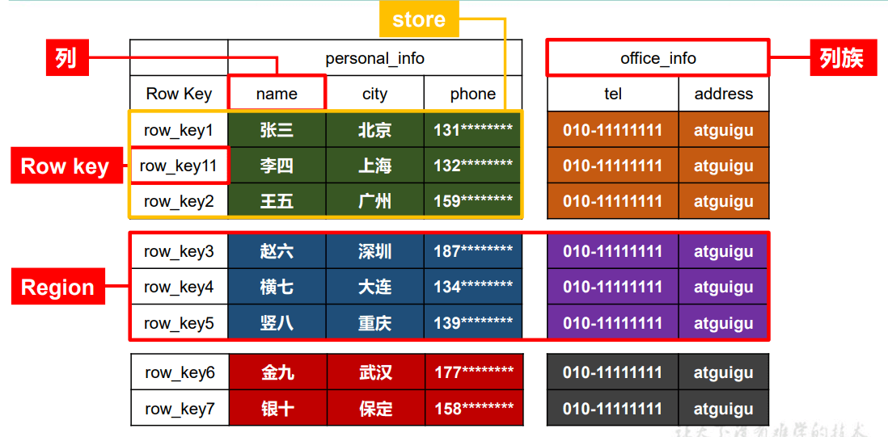

### 1.2 HBase 物理存储结构

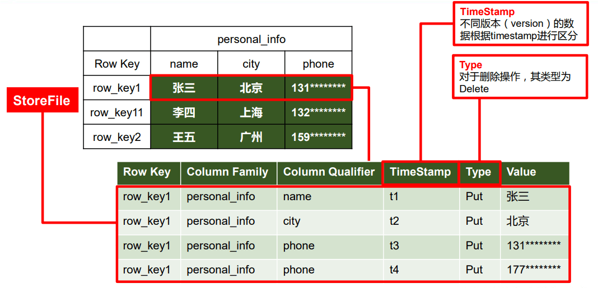

### 1.3 数据模型

1）Name Space

命名空间，类似于关系型数据库的 DatabBase 概念，每个命名空间下有多个表。HBase 有两个自带的命名空间，分别是 hbase 和 default，hbase 中存放的是 HBase 内置的表， default 表是用户默认使用的命名空间。

2）Region

类似于关系型数据库的表概念。不同的是，HBase 定义表时只需要声明列族即可，不需 要声明具体的列。这意味着，往 HBase 写入数据时，字段可以动态、按需指定。因此，和关 系型数据库相比，HBase 能够轻松应对字段变更的场景。

3）Row

HBase 表中的每行数据都由一个 RowKey 和多个 Column（列）组成，数据是按照 RowKey 的字典顺序存储的，并且查询数据时只能根据 RowKey 进行检索，所以 RowKey 的设计十分重 要。

4）Column

HBase 中的每个列都由 Column Family(列族)和 Column Qualifier（列限定符）进行限 定，例如 info：name，info：age。建表时，只需指明列族，而列限定符无需预先定义。

5）Time Stamp

用于标识数据的不同版本（version），每条数据写入时，如果不指定时间戳，系统会 自动为其加上该字段，其值为写入 HBase 的时间。

6）Cell

由{rowkey, column Family：column Qualifier, time Stamp} 唯一确定的单元。cell 中的数 据是没有类型的，全部是字节码形式存贮。

## 2 HBase 基本架构

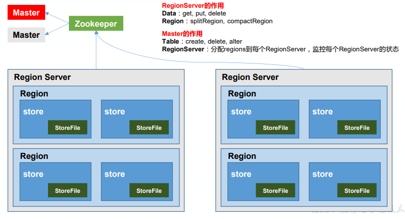

架构角色：

1）Region Server

Region Server 为 Region 的管理者，其实现类为 HRegionServer，主要作用如下:

对于数据的操作：get, put, delete；

对于 Region 的操作：splitRegion、compactRegion。

2）Master

Master 是所有 Region Server 的管理者，其实现类为 HMaster，主要作用如下：

对于表的操作：create, delete, alter

对于 RegionServer 的操作：分配 regions 到每个 RegionServer，监控每个 RegionServer 的状态，负载均衡和故障转移。

3）Zookeeper

HBase 通过 Zookeeper 来做 Master 的高可用、RegionServer 的监控、元数据的入口以及 集群配置的维护等工作。

4）HDFS

HDFS 为 HBase 提供最终的底层数据存储服务，同时为 HBase 提供高可用的支持。

## 3 HBase 快速入门

### 3.1 HBase 安装部署

#### 3.1.1 Zookeeper 正常部署

[Zookeeper 安装部署](./zookeeper.md)

#### 3.1.2 Hadoop 正常部署

<!-- TODO : hadoop集群部署 -->

<!-- [Hadoop 安装部署]() -->

#### 3.1.3 HBase 部署

1）解压

```shell
#解压
tar -zxvf hbase-1.3.1-bin.tar.gz -C /opt/
```

2）编辑配置文件 hbase-env.sh

```shell
#编辑配置文件
vim /opt/hbase-1.3.1/conf/hbase-env.sh
#修改内容
export JAVA_HOME=/usr/local/src/jdk1.8.0_291 #本机对应的Javahome
export HBASE_MANAGES_ZK=false #不使用内置的zookeeper
#配置方法区大小,java8去永久代,取而代之的是元空间,所以可以直接注释掉
# export HBASE_MASTER_OPTS=...
# export HBASE_REGIONSERVER_OPTS=...
```

3）编辑配置文件 hbase-site.xml

```xml
<configuration>
    <property>
        <name>hbase.rootdir</name>
        <value>hdfs://hadoop141:8020/hbase</value>
    </property>
    <property>
        <name>hbase.cluster.distributed</name>
        <value>true</value>
    </property>
    <!-- 0.98后的新变动，之前版本没有.port,默认端口为60000 -->
    <property>
        <name>hbase.master.port</name>
        <value>16000</value>
    </property>
    <property>
        <name>hbase.zookeeper.quorum</name>
        <value>hadoop141:2181,hadoop142:2181,hadoop143:2181</value>
    </property>
    <property>
        <name>hbase.zookeeper.property.dataDir</name>
        <value>/opt/zookeeper-3.4.11/zkdata</value>
    </property>
</configuration>
```

4）编辑配置文件 regionservers

```shell
hadoop141
hadoop142
hadoop143
```

5）软连接 hadoop 配置文件到 hbase：

```shell
#进到配置文件目录
cd /opt/hbase-1.3.1/conf/
#建立软连接
ln -s /opt/hadoop-3.1.3/etc/hadoop/core-site.xml .
ln -s /opt/hadoop-3.1.3/etc/hadoop/hdfs-site.xml .
```

6）分发

```shell
xsync /opt/hbase-1.3.1/
```

#### 3.1.4 HBase 服务的启动

1．启动方式 1

```shell
hbase-daemon.sh start master
hbase-daemon.sh start regionserver
```

提示：如果集群之间的节点时间不同步，会导致 regionserver 无法启动，抛出 ClockOutOfSyncException 异常。

修复提示：

a、同步时间服务

略

b、属性：hbase.master.maxclockskew 设置更大的值

```xml
<property>
    <name>hbase.master.maxclockskew</name>
    <value>180000</value>
    <description>Time difference of regionserver frommaster</description>
</property>
```

2．启动方式 2

```shell
#启动
bin/start-hbase.sh
#停止
bin/stop-hbase.sh
```

2.5 查看 HBase 页面

启动成功后，可以通过“host:port”的方式来访问 HBase 管理页面，例如：http://hadoop141:16010

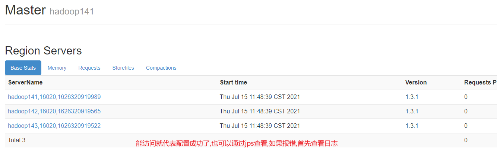

### 3.2 HBase Shell 操作

#### 3.2.1 基本操作

```shell
#进入 HBase 客户端命令行
bin/hbase shell
#查看帮助命令
help
#查看当前数据库中有哪些表
list
```

#### 3.2.2 表的操作

```shell
#1 创建表(前面是表名,后面是列族)
create 'student','info'
#2 插入数据到表(1001是rowkey,类似mysql主键的概念,因为面相列存储,所以需要rowkey将列族联系起来)
put 'student','1001','info:sex','male'
put 'student','1002','info:sex','male'
#'info:name'前面是列族,后面才是列名,然后跟上value
put 'student','1001','info:name','zhangsan'
put 'student','1003','info:name','lisi'
#3 扫描查看表数据
scan 'student'
#左闭右开,包左不包右(是按照字典顺序查找的,并不是按照数字大小)
scan 'student',{STARTROW => '1001', STOPROW =>'1003'}
scan 'student',{STARTROW => '1001'}
#4 查看表结构
describe ‘student’
#5 更新指定字段的数据(如果存在指定字段,执行更新,如果没有,执行新增)
put 'student','1001','info:name','Nick'
put 'student','1001','info:age','100'
#6 查看“指定行”或“指定列族:列”的数据
get 'student','1001'
get 'student','1001','info:name'
#7 统计表数据行数
count 'student'
#8 删除某 rowkey 的全部数据
deleteall 'student','1001'
#9 删除某 rowkey 的某一列数据
delete 'student','1002','info:sex'
#10 清空表数据
truncate 'student'
#变更表信息(即修改表的最大存放版本为3)
alter 'student',{NAME=>'info',VERSIONS=>3}
put 'student','1001','info:name','zhangsan'
put 'student','1001','info:name','lisi'
put 'student','1001','info:name','wangwu'
get 'student','1001',{COLUMN=>'info:name',VERSIONS=>3}
#raw: 原始值
scan 'student',{RAW => true,VERSIONS => 10}
#刷写到磁盘
flush 'student'
#合并文件
compact
```

## 4 HBase 进阶

### 4.1 架构原理

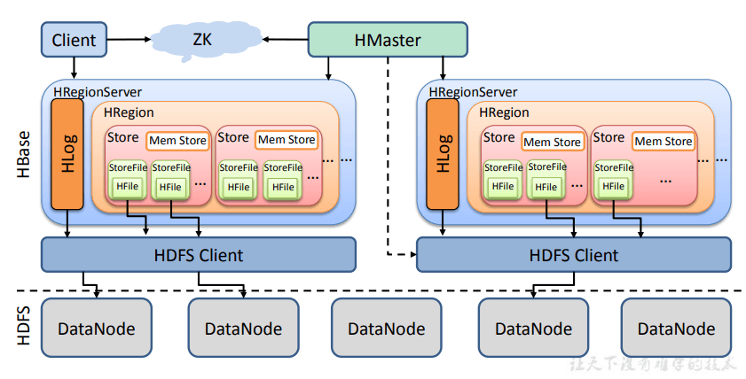

1）StoreFile

保存实际数据的物理文件，StoreFile 以 HFile 的形式存储在 HDFS 上。每个 Store 会有 一个或多个 StoreFile（HFile），数据在每个 StoreFile 中都是有序的。

2）MemStore

写缓存，由于 HFile 中的数据要求是有序的，所以数据是先存储在 MemStore 中，排好序后，等到达刷写时机才会刷写到 HFile，每次刷写都会形成一个新的 HFile。

3）WAL

由于数据要经 MemStore 排序后才能刷写到 HFile，但把数据保存在内存中会有很高的 概率导致数据丢失，为了解决这个问题，数据会先写在一个叫做 Write-Ahead logfile 的文件 中，然后再写入 MemStore 中。所以在系统出现故障的时候，数据可以通过这个日志文件重 建。

### 4.2 写流程

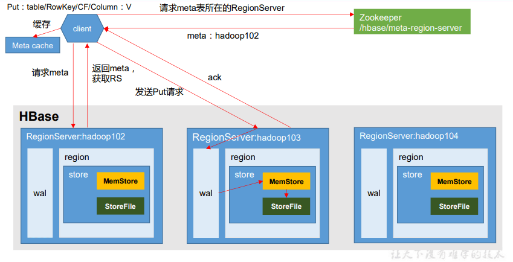

**写流程：**

1）Client 先访问 zookeeper，获取 hbase:meta 表位于哪个 Region Server。

2）访问对应的 Region Server，获取 hbase:meta 表，根据读请求的 namespace:table/rowkey， 查询出目标数据位于哪个 Region Server 中的哪个 Region 中。并将该 table 的 region 信息以 及 meta 表的位置信息缓存在客户端的 meta cache，方便下次访问。

3）与目标 Region Server 进行通讯；

4）将数据顺序写入（追加）到 WAL；

5）将数据写入对应的 MemStore，数据会在 MemStore 进行排序；

6）向客户端发送 ack；

7）等达到 MemStore 的刷写时机后，将数据刷写到 HFile。

### 4.3 MemStore Flush

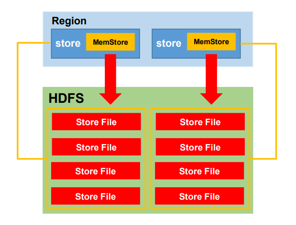

MemStore 刷写时机：

1.当某个 memstroe 的大小达到了 **hbase.hregion.memstore.flush.size（默认值 128M）**， 其所在 region 的所有 memstore 都会**刷写**。

当 memstore 的大小达到了 **hbase.hregion.memstore.flush.size（默认值 128M）"乘以" hbase.hregion.memstore.block.multiplier（默认值 4）**时，会**阻止**继续往该 memstore 写数据。

2.当 region server 中 memstore 的总大小达到 **java_heapsize "乘以" hbase.regionserver.global.memstore.size（默认值 0.4）"乘以" hbase.regionserver.global.memstore.size.lower.limit（默认值 0.95）**，region 会按照其所有 memstore 的大小顺序（由大到小）依次进行刷写。直到 region server 中所有 memstore 的总大小减小到上述值以下。

当 region server 中 memstore 的总大小达到 **java_heapsize "乘以" hbase.regionserver.global.memstore.size（默认值 0.4）**时，会**阻止**继续往所有的 memstore 写数据。

3.到达自动刷写的时间，也会触发 memstore flush。自动刷新的时间间隔由该属性进行 配置 **hbase.regionserver.optionalcacheflushinterval（默认 1 小时）**。

4.当 WAL 文件的数量超过 **hbase.regionserver.max.logs**，region 会按照时间顺序依次进 行刷写，直到 WAL 文件数量减小到 hbase.regionserver.max.log 以下（**该属性名已经废弃， 现无需手动设置，最大值为 32**）。

### 4.4 读流程

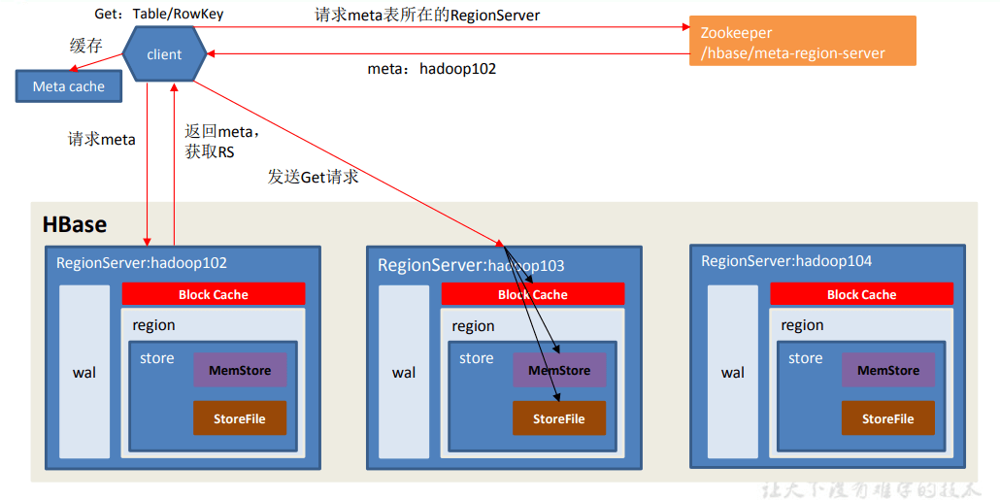

**读流程**

1）Client 先访问 zookeeper，获取 hbase:meta 表位于哪个 Region Server。

2）访问对应的 Region Server，获取 hbase:meta 表，根据读请求的 namespace:table/rowkey， 查询出目标数据位于哪个 Region Server 中的哪个 Region 中。并将该 table 的 region 信息以 及 meta 表的位置信息缓存在客户端的 meta cache，方便下次访问。

3）与目标 Region Server 进行通讯；

4）分别在 Block Cache（读缓存），MemStore 和 Store File（HFile）中查询目标数据，并将 查到的所有数据进行合并。此处所有数据是指同一条数据的不同版本（time stamp）或者不 同的类型（Put/Delete）。

5） 将从文件中查询到的数据块（Block，HFile 数据存储单元，默认大小为 64KB）缓存到 Block Cache。

6）将合并后的最终结果返回给客户端。

### 4.5 StoreFile Compaction

由于 memstore 每次刷写都会生成一个新的 HFile，且同一个字段的不同版本（timestamp） 和不同类型（Put/Delete）有可能会分布在不同的 HFile 中，因此查询时需要遍历所有的 HFile。为了减少 HFile 的个数，以及清理掉过期和删除的数据，会进行 StoreFile Compaction。

Compaction 分为两种，分别是 **Minor Compaction** 和 **Major Compaction**。Minor Compaction 会将临近的若干个较小的 HFile 合并成一个较大的 HFile，**但不会清理过期和删除的数据**。 Major Compaction 会将一个 Store 下的所有的 HFile 合并成一个大 HFile，并且**会清理掉过期和删除的数据**。

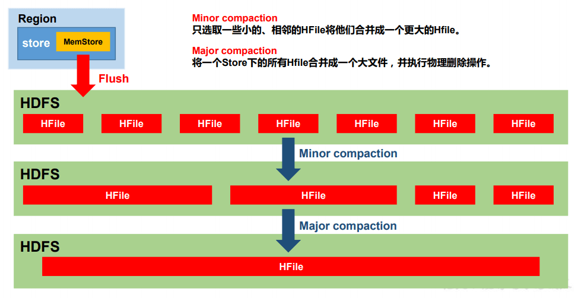

hbase.hstore.compactionThreshold(默认 3): 当一个 store 刷写的文件个数大于 this,major

hbase.hregion.majorcompaction(默认 7 天): 自动合并,major,生产环境一般都是关闭的

### 4.6 Region Split

默认情况下，每个 Table 起初只有一个 Region，随着数据的不断写入，Region 会自动进 行拆分。刚拆分时，两个子 Region 都位于当前的 Region Server，但处于负载均衡的考虑， HMaster 有可能会将某个 Region 转移给其他的 Region Server。

Region Split 时机：

1.当 1 个 region 中的某个 Store 下所有 StoreFile 的总大小超过**hbase.hregion.max.filesize(默认 10 个 G)**， 该 Region 就会进行拆分（0.94 版本之前）。

2.当 1 个 region 中 的 某 个 Store 下所有 StoreFile 的 总 大 小 超 过 **Min(R^2 \* "hbase.hregion.memstore.flush.size",hbase.hregion.max.filesize)**，该 Region 就会进行拆分，其中 R 为当前 Region Server 中属于该 Table 的个数（0.94 版本之后）。

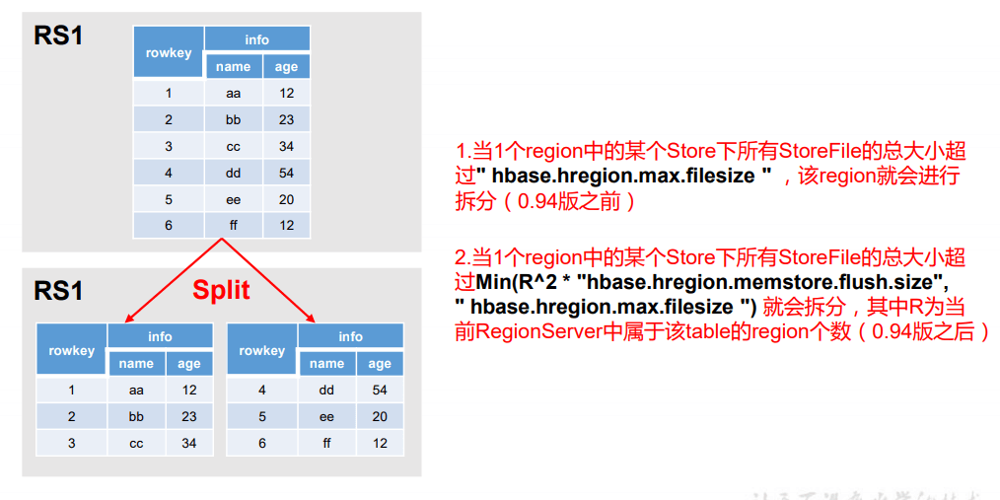

### 4.7 MapReduce

通过 HBase 的相关 JavaAPI，我们可以实现伴随 HBase 操作的 MapReduce 过程，比如使用 MapReduce 将数据从本地文件系统导入到 HBase 的表中，比如我们从 HBase 中读取一些原 始数据后使用 MapReduce 做数据分析。

#### 4.7.1 官方 HBase-MapReduce

1．查看 HBase 的 MapReduce 任务的执行(执行 MR 任务 hadoop 需要 hbase 的 jar 包)

```shell
bin/hbase mapredcp
```

2．环境变量的导入

（1）执行环境变量的导入（临时生效，在命令行执行下述操作）

```shell
#执行环境变量的导入（临时生效，在命令行执行下述操作）
#前提配置了HBASE_HOME
export HADOOP_CLASSPATH=`${HBASE_HOME}/bin/hbase mapredcp`
```

（2）永久生效：在/etc/profile 配置(3.x 没有 for 循环,试着直接 export)

```shell
#在 hadoop-env.sh 中配置：
export HADOOP_CLASSPATH=$HADOOP_CLASSPATH:/opt/hbase-1.3.1/lib/*
```

3．运行官方的 MapReduce 任务

```shell
yarn jar lib/hbase-server-1.3.1.jar rowcounter "chen:user"
```

#### 4.7.2 使用 MapReduce 将本地数据导入到 HBase

1）在本地创建一个 tsv 格式的文件：fruit.tsv

```shell
1001    Apple   Red
1002    Pear    Yellow
1003    Pineapple       Yellow
```

2）创建 Hbase 表

```shell
create 'fruit','info'
```

3）在 HDFS 中创建 input_fruit 文件夹并上传 fruit.tsv 文件

```shell
hdfs dfs -mkdir /input_fruit
hdfs dfs -put fruit.tsv /input_fruit
```

4）执行 MapReduce 到 HBase 的 fruit 表中

```shell
yarn jar lib/hbase-server-1.3.1.jar importtsv \
-Dimporttsv.columns=HBASE_ROW_KEY,info:name,info:color fruit \
hdfs://hadoop141:8020/input_fruit
```

### 4.8 与 Hive 的集成

#### 4.8.1 HBase 与 Hive 的对比

1．Hive

(1) 数据仓库

Hive 的本质其实就相当于将 HDFS 中已经存储的文件在 Mysql 中做了一个双射关系，以 方便使用 HQL 去管理查询。

(2) 用于数据分析、清洗

Hive 适用于离线的数据分析和清洗，延迟较高。

(3) 基于 HDFS、MapReduce

Hive 存储的数据依旧在 DataNode 上，编写的 HQL 语句终将是转换为 MapReduce 代码执 行。

2．HBase

(1) 数据库

是一种面向列族存储的非关系型数据库。

(2) 用于存储结构化和非结构化的数据

适用于单表非关系型数据的存储，不适合做关联查询，类似 JOIN 等操作。

(3) 基于 HDFS

数据持久化存储的体现形式是 HFile，存放于 DataNode 中，被 ResionServer 以 region 的形 式进行管理。

(4) 延迟较低，接入在线业务使用

面对大量的企业数据，HBase 可以直线单表大量数据的存储，同时提供了高效的数据访问 速度。

#### 4.8.2 HBase 与 Hive 集成使用

**环境准备**

因为我们后续可能会在操作 Hive 的同时对 HBase 也会产生影响，所以 Hive 需要持有操作 HBase 的 Jar，那么接下来拷贝 Hive 所依赖的 Jar 包（或者使用软连接的形式）。

```shell
ln -s $HBASE_HOME/lib/hbase-common-1.3.1.jar $HIVE_HOME/lib/hbase-common-1.3.1.jar
ln -s $HBASE_HOME/lib/hbase-server-1.3.1.jar $HIVE_HOME/lib/hbase-server-1.3.1.jar
ln -s $HBASE_HOME/lib/hbase-client-1.3.1.jar $HIVE_HOME/lib/hbase-client-1.3.1.jar
ln -s $HBASE_HOME/lib/hbase-protocol-1.3.1.jar $HIVE_HOME/lib/hbase-protocol-1.3.1.jar
ln -s $HBASE_HOME/lib/hbase-it-1.3.1.jar $HIVE_HOME/lib/hbase-it-1.3.1.jar
ln -s $HBASE_HOME/lib/htrace-core-3.1.0-incubating.jar $HIVE_HOME/lib/htrace-core-3.1.0-incubating.jar
ln -s $HBASE_HOME/lib/hbase-hadoop2-compat-1.3.1.jar $HIVE_HOME/lib/hbase-hadoop2-compat-1.3.1.jar
ln -s $HBASE_HOME/lib/hbase-hadoop-compat-1.3.1.jar $HIVE_HOME/lib/hbase-hadoop-compat-1.3.1.jar
```

同时在 hive-site.xml 中修改 zookeeper 的属性，如下：

```xml
<property>
    <name>hive.zookeeper.quorum</name>
    <value>hadoop141,hadoop142,hadoop143</value>
</property>
<property>
    <name>hive.zookeeper.client.port</name>
    <value>2181</value>
</property>
```

1．案例一

目标：建立 Hive 表，关联 HBase 表，插入数据到 Hive 表的同时能够影响 HBase 表。

(1) 在 Hive 中创建表同时关联 HBase

```sql
CREATE TABLE hive_hbase_emp_table(
empno int,
ename string,
job string,
mgr int,
hiredate string,
sal double,
comm double,
deptno int)
STORED BY 'org.apache.hadoop.hive.hbase.HBaseStorageHandler'
WITH SERDEPROPERTIES ("hbase.columns.mapping" = ":key,info:ename,info:job,info:mgr,info:hiredate,info:sal,info:comm,info:deptno")
TBLPROPERTIES ("hbase.table.name" = "hbase_emp_table");
```

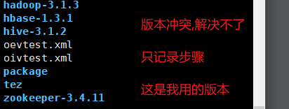

(2) 在 Hive 中创建临时中间表，用于 load 文件中的数据

```sql
CREATE TABLE emp(
empno int,
ename string,
job string,
mgr int,
hiredate string,
sal double,
comm double,
deptno int)
row format delimited fields terminated by '\t';
```

(3) 向 Hive 中间表中 load 数据

```sql
load data local inpath '/home/admin/softwares/data/emp.txt' into table emp;
```

(4) 通过 insert 命令将中间表中的数据导入到 Hive 关联 Hbase 的那张表中

```sql
insert into table hive_hbase_emp_table select * from emp;
```

(5) 查看 Hive 以及关联的 HBase 表中是否已经成功的同步插入了数据

```sql
select * from hive_hbase_emp_table;
scan ‘hbase_emp_table’
```

2．案例二

目标：在 HBase 中已经存储了某一张表 hbase_emp_table，然后在 Hive 中创建一个外部表来 关联 HBase 中的 hbase_emp_table 这张表，使之可以借助 Hive 来分析 HBase 这张表中的数 据。

注：该案例 2 紧跟案例 1 的脚步，所以完成此案例前，请先完成案例 1。

(1) 在 Hive 中创建外部表

```sql
CREATE EXTERNAL TABLE relevance_hbase_emp(
empno int,
ename string,
job string,
mgr int,
hiredate string,
sal double,
comm double,
deptno int)
STORED BY
'org.apache.hadoop.hive.hbase.HBaseStorageHandler'
WITH SERDEPROPERTIES ("hbase.columns.mapping" = ":key,info:ename,info:job,info:mgr,info:hiredate,info:sal,info:comm,info:deptno")
TBLPROPERTIES ("hbase.table.name" = "hbase_emp_table");
```

(2) 关联后就可以使用 Hive 函数进行一些分析操作了

```sql
select * from relevance_hbase_emp;
```

## 5 HBase 优化

### 5.1 高可用

在 HBase 中 HMaster 负责监控 HRegionServer 的生命周期，均衡 RegionServer 的负载， 如果 HMaster 挂掉了，那么整个 HBase 集群将陷入不健康的状态，并且此时的工作状态并 不会维持太久。所以 HBase 支持对 HMaster 的高可用配置。

```shell
#1．关闭 HBase 集群（如果没有开启则跳过此步）
bin/stop-hbase.sh
#2．在 conf 目录下创建 backup-masters 文件
vim conf/backup-masters
#3．在 backup-masters 文件中配置高可用 HMaster 节点(添加一下内容)
hadoop142
hadoop143
#4．分发到其他节点
xsync conf/backup-masters
```

### 5.2 预分区

每一个 region 维护着 StartRow 与 EndRow，如果加入的数据符合某个 Region 维护的 RowKey 范围，则该数据交给这个 Region 维护。那么依照这个原则，我们可以将数据所要 投放的分区提前大致的规划好，以提高 HBase 性能。

1．手动设定预分区

```sql
create 'staff1','info','partition1',SPLITS => ['1000','2000','3000','4000']
```

2．生成 16 进制序列预分区

```sql
create 'staff2','info','partition2',{NUMREGIONS => 15, SPLITALGO => 'HexStringSplit'}
```

3．按照文件中设置的规则预分区

```sql
#创建 splits.txt 文件内容如下：
aaaa
bbbb
cccc
dddd
#然后执行(hbase会排序)：
create 'staff3','partition3',SPLITS_FILE => 'splits.txt'
```

4．使用 JavaAPI 创建预分区

```java
//自定义算法，产生一系列 hash 散列值存储在二维数组中
byte[][] splitKeys = 某个散列值函数
//创建 HbaseAdmin 实例
HBaseAdmin hAdmin = new HBaseAdmin(HbaseConfiguration.create());
//创建 HTableDescriptor 实例
HTableDescriptor tableDesc = new HTableDescriptor(tableName);
//通过 HTableDescriptor 实例和散列值二维数组创建带有预分区的 Hbase 表
hAdmin.createTable(tableDesc, splitKeys);
```

### 5.3 RowKey 设计

一条数据的唯一标识就是 RowKey，那么这条数据存储于哪个分区，取决于 RowKey 处 于哪个一个预分区的区间内，设计 RowKey 的主要目的 ，就是让数据均匀的分布于所有的 region 中，在一定程度上防止数据倾斜。接下来我们就谈一谈 RowKey 常用的设计方案。

原则: 散列,唯一,长度

1．生成随机数、hash、散列值

原 本 rowKey 为 1001 的 ， SHA1 后 变 成 ：dd01903921ea24941c26a48f2cec24e0bb0e8cc7
原 本 rowKey 为 3001 的 ， SHA1 后 变 成 ：49042c54de64a1e9bf0b33e00245660ef92dc7bd
原 本 rowKey 为 5001 的 ， SHA1 后 变 成 ：7b61dec07e02c188790670af43e717f0f46e8913
在做此操作之前，一般我们会选择从数据集中抽取样本，来决定什么样的 rowKey 来 Hash 后作为每个分区的临界值。

2．字符串反转

20170524000001 转成 10000042507102
20170524000002 转成 20000042507102
这样也可以在一定程度上散列逐步 put 进来的数据。

3．字符串拼接

20170524000001_a12e
20170524000001_93i7

### 5.4 内存优化

HBase 操作过程中需要大量的内存开销，毕竟 Table 是可以缓存在内存中的，一般会分 配整个可用内存的 70%给 HBase 的 Java 堆。但是`不建议分配非常大的堆内存`，因为 GC 过 程持续太久会导致 RegionServer 处于长期不可用状态，一般 16~48G 内存就可以了，如果因 为框架占用内存过高导致系统内存不足，框架一样会被系统服务拖死。

### 5.5 基础优化

1．允许在 HDFS 的文件中追加内容

hdfs-site.xml、hbase-site.xml
属性：dfs.support.append
解释：开启 HDFS 追加同步，可以优秀的配合 HBase 的数据同步和持久化。默认值为 true。

2．优化 DataNode 允许的最大文件打开数

hdfs-site.xml
属性：dfs.datanode.max.transfer.threads
解释：HBase 一般都会同一时间操作大量的文件，根据集群的数量和规模以及数据动作，设置为 4096 或者更高。默认值：4096

3．优化延迟高的数据操作的等待时间

hdfs-site.xml
属性：dfs.image.transfer.timeout
解释：如果对于某一次数据操作来讲，延迟非常高，socket 需要等待更长的时间，建议把该值设置为更大的值（默认 60000 毫秒），以确保 socket 不会被 timeout 掉。

4．优化数据的写入效率

mapred-site.xml
属性：
mapreduce.map.output.compress
mapreduce.map.output.compress.codec
解释：开启这两个数据可以大大提高文件的写入效率，减少写入时间。第一个属性值修改为 true，第二个属性值修改为：org.apache.hadoop.io.compress.GzipCodec 或者其他压缩方式。

5．设置 RPC 监听数量

hbase-site.xml
属性：Hbase.regionserver.handler.count
解释：默认值为 30，用于指定 RPC 监听的数量，可以根据客户端的请求数进行调整，读写请求较多时，增加此值。

6．优化 HStore 文件大小

hbase-site.xml
属性：hbase.hregion.max.filesize
解释：默认值 10737418240（10GB），如果需要运行 HBase 的 MR 任务，可以减小此值，因为一个 region 对应一个 map 任务，如果单个 region 过大，会导致 map 任务执行时间过长。该值的意思就是，如果 HFile 的大小达到这个数值，则这个 region 会被切分为两个 Hfile。

7．优化 HBase 客户端缓存

hbase-site.xml
属性：hbase.client.write.buffer
解释：用于指定 Hbase 客户端缓存，增大该值可以减少 RPC 调用次数，但是会消耗更多内存，反之则反之。一般我们需要设定一定的缓存大小，以达到减少 RPC 次数的目的。

8．指定 scan.next 扫描 HBase 所获取的行数

hbase-site.xml
属性：hbase.client.scanner.caching
解释：用于指定 scan.next 方法获取的默认行数，值越大，消耗内存越大。

9．flush、compact、split 机制

当 MemStore 达到阈值，将 Memstore 中的数据 Flush 进 Storefile；compact 机制则是把 flush 出来的小文件合并成大的 Storefile 文件。split 则是当 Region 达到阈值，会把过大的 Region 一分为二。

涉及属性：

即：128M 就是 Memstore 的默认阈值

> hbase.hregion.memstore.flush.size：134217728

即：这个参数的作用是当单个 HRegion 内所有的 Memstore 大小总和超过指定值时，flush 该 HRegion 的所有 memstore。RegionServer 的 flush 是通过将请求添加一个队列，模拟生 产消费模型来异步处理的。那这里就有一个问题，当队列来不及消费，产生大量积压请求 时，可能会导致内存陡增，最坏的情况是触发 OOM。

> hbase.regionserver.global.memstore.upperLimit：0.4
>
> hbase.regionserver.global.memstore.lowerLimit：0.38

即：当 MemStore 使用内存总量达到 hbase.regionserver.global.memstore.upperLimit 指定值时，将会有多个 MemStores flush 到文件中，MemStore flush 顺序是按照大小降序执行的，直到 刷新到 MemStore 使用内存略小于 lowerLimit
