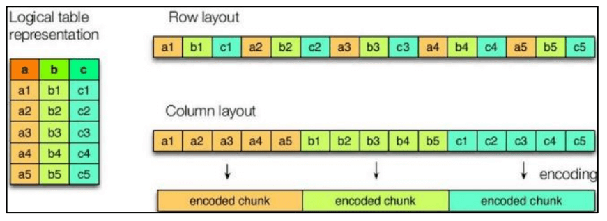

# Hive

:honeybee: 文章主要介绍 `hive` 的基本概念、优缺点、架构原理、安装部署等。

<!-- more -->

## 1 Hive 基本概念

### 1.1 什么是 Hive

1） hive 简介

Hive：由 Facebook 开源用于解决海量`结构化`日志的数据统计工具。

Hive 是基于 Hadoop 的一个`数据仓库工具`，可以将`结构化的数据文件映射为一张表`，并提供`类 SQL`的查询功能

2） Hive 本质：将 HQL 转化成 MapReduce 程序


（1）Hive 处理的数据存储在 HDFS

（2）Hive 分析数据底层的实现是 MapReduce

（3）执行程序运行在 Yarn 上

### 1.2Hive 的优缺点

#### 1.2.1 优点

（1）操作接口采用类 SQL 语法，提供快速开发的能力（简单、容易上手）。

（2）避免了去写 MapReduce，减少开发人员的学习成本。

（3）Hive 的执行延迟比较高，因此 Hive 常用于数据分析，对实时性要求不高的场合。

（4）Hive 优势在于处理大数据，对于处理小数据没有优势，因为 Hive 的执行延迟比较 高。

（5）Hive 支持用户自定义函数，用户可以根据自己的需求来实现自己的函数。

#### 1.2.2 缺点

1）Hive 的 HQL 表达能力有限

（1）迭代式算法无法表达

（2）数据挖掘方面不擅长，由于 MapReduce 数据处理流程的限制，效率更高的算法却 无法实现。

2）Hive 的效率比较低

（1）Hive 自动生成的 MapReduce 作业，通常情况下不够智能化

（2）Hive 调优比较困难，粒度较粗

### 1.3 Hive 架构原理


1）用户接口：Client

CLI（command-line interface）、JDBC/ODBC(jdbc 访问 hive)、WEBUI（浏览器访问 hive）

2）元数据：Metastore

元数据包括：表名、表所属的数据库（默认是 default）、表的拥有者、列/分区字段、 表的类型（是否是外部表）、表的数据所在目录等；

`默认存储在自带的 derby 数据库中，推荐使用 MySQL 存储 Metastore `

3）Hadoop

使用 HDFS 进行存储，使用 MapReduce 进行计算。

4）驱动器：Driver

（1）解析器（SQL Parser）：将 SQL 字符串转换成抽象语法树 AST，这一步一般都用第 三方工具库完成，比如 antlr；对 AST 进行语法分析，比如表是否存在、字段是否存在、SQL 语义是否有误。

（2）编译器（Physical Plan）：将 AST 编译生成逻辑执行计划。

（3）优化器（Query Optimizer）：对逻辑执行计划进行优化。

（4）执行器（Execution）：把逻辑执行计划转换成可以运行的物理计划。对于 Hive 来 说，就是 MR/Spark。


Hive 通过给用户提供的一系列交互接口，接收到用户的指令(SQL)，使用自己的 Driver， 结合元数据(MetaStore)，将这些指令翻译成 MapReduce，提交到 Hadoop 中执行，最后，将 执行返回的结果输出到用户交互接口。

### 1.4 Hive 和数据库比较

由于 Hive 采用了类似 SQL 的查询语言 HQL(Hive Query Language)，因此很容易将 Hive 理解为数据库。其实从结构上来看，Hive 和数据库除了拥有类似的查询语言，再无类似之处。 本文将从多个方面来阐述 Hive 和数据库的差异。数据库可以用在 Online 的应用中，但是 Hive 是为数据仓库而设计的，清楚这一点，有助于从应用角度理解 Hive 的特性。

#### 1.4.1 查询语言

由于 SQL 被广泛的应用在数据仓库中，因此，专门针对 Hive 的特性设计了类 SQL 的查 询语言 HQL。熟悉 SQL 开发的开发者可以很方便的使用 Hive 进行开发。

#### 1.4.2 数据更新

由于 Hive 是针对数据仓库应用设计的，`而数据仓库的内容是读多写少的`。因此，`Hive 中 不建议对数据的改写，所有的数据都是在加载的时候确定好的`。而数据库中的数据通常是需 要经常进行修改的，因此可以使用 INSERT INTO … VALUES 添加数据，使用 UPDATE … SET 修 改数据。

#### 1.4.3 执行延迟

Hive 在查询数据的时候，由于没有索引，需要扫描整个表，因此延迟较高。另外一个导 致 Hive 执行延迟高的因素是 MapReduce 框架。由于 MapReduce 本身具有较高的延迟，因此 在利用 MapReduce 执行 Hive 查询时，也会有较高的延迟。相对的，数据库的执行延迟较低。 当然，这个低是有条件的，即数据规模较小，当数据规模大到超过数据库的处理能力的时候， Hive 的并行计算显然能体现出优势。

#### 1.4.4 数据规模

由于 Hive 建立在 hadoop 集群上并可以利用 MapReduce 进行并行计算，因此可以支持很大规模 的数据；对应的，数据库可以支持的数据规模较小。

## 2 Hive 安装

### 2.1 Hive 安装地址

[1）Hive 官网地址]: http://hive.apache.org/
[2）文档查看地址]: https://cwiki.apache.org/confluence/display/Hive/GettingStarted
[3）下载地址]: http://archive.apache.org/dist/hive/
[4）github 地址]: https://github.com/apache/hive

### 2.2Hive 安装部署

#### 2.2.1 安装 Hive

```shell
#解压
tar -zxvf apache-hive-3.1.2-bin.tar.gz -C /opt/
#改个名字
mv apache-hive-3.1.2-bin/ hive-3.1.2
#配置环境变量
vim /etc/profile.d/my_env.sh
#添加内容
#HIVE_HOME
export HIVE_HOME=/opt/hive-3.1.2
export PATH=$PATH:$HIVE_HOME/bin
#解决日志 Jar 包冲突
mv $HIVE_HOME/lib/log4j-slf4j-impl-2.10.0.jar $HIVE_HOME/lib/log4j-slf4j-impl-2.10.0.bak
#初始化元数据库
cd /opt/hive-3.1.2/
bin/schematool -dbType derby -initSchema
```

#### 2.2.2 启动并使用 Hive

```shell
#启动 hive
./bin/hive
#使用 Hive
hive> show databases;
hive> show tables;
hive> create table test(id string);
hive> insert into test values('1001');
hive> select * from test;
```


Hive 默认使用的元数据库为 derby，开启 Hive 之后就会占用元数据库，且不与 其他客户端共享数据(即不支持多客户端连接)，所以我们需要将 Hive 的元数据地址改为 MySQL。

### 2.3 MySQL 安装

直接 docker 启动,懒得装了(在 hadoop143 启动)

```shell
docker run -d -p 3306:3306 --name mysql --net mynet -v /mydata/mysql/log:/var/log/mysql -v /mydata/mysql/data:/var/lib/mysql -v /mydata/mysql/conf:/etc/mysql -e MYSQL_ROOT_PASSWORD=root mysql:5.7
```

### 2.4 Hive 元数据配置到 MySQL

1）拷贝 mysql 驱动到 hive 的 lib 目录

```shell
cp /opt/package/mysql-connector-java-5.1.27-bin.jar /opt/hive-3.1.2/lib/
```

2）在$HIVE_HOME/conf 目录下新建 hive-site.xml 文件

```shell
vim $HIVE_HOME/conf/hive-site.xml
```

**添加如下内容**

```xml
<?xml version="1.0"?>
<?xml-stylesheet type="text/xsl" href="configuration.xsl"?>
<configuration>
 	<!-- jdbc 连接的 URL -->
 	<property>
 		<name>javax.jdo.option.ConnectionURL</name>
		<value>jdbc:mysql://hadoop143:3306/metastore?useSSL=false</value>
	</property>
 	<!-- jdbc 连接的 Driver-->
 	<property>
 		<name>javax.jdo.option.ConnectionDriverName</name>
 		<value>com.mysql.jdbc.Driver</value>
	</property>
	<!-- jdbc 连接的 username-->
 	<property>
 		<name>javax.jdo.option.ConnectionUserName</name>
 		<value>root</value>
	</property>
 	<!-- jdbc 连接的 password -->
 	<property>
 		<name>javax.jdo.option.ConnectionPassword</name>
 		<value>root</value>
	</property>
 	<!-- Hive 元数据存储版本的验证 -->
 	<property>
 		<name>hive.metastore.schema.verification</name>
 		<value>false</value>
	</property>
 	<!--元数据存储授权-->
 	<property>
 		<name>hive.metastore.event.db.notification.api.auth</name>
 		<value>false</value>
 	</property>
 	<!-- Hive 默认在 HDFS 的工作目录 -->
 	<property>
    	<name>hive.metastore.warehouse.dir</name>
 		<value>/user/hive/warehouse</value>
 	</property>
</configuration>
```

3）新建 Hive 元数据库


4） 初始化 Hive 元数据库

```shell
schematool -initSchema -dbType mysql -verbose
```

#### 2.4.3 再次启动 Hive

```shell
#1）启动 Hive
./bin/hive
#2）使用 Hive
hive> show databases;
hive> show tables;
hive> create table test (id string);
hive> insert into test values('1001');
hive> select * from test;
#3）在另一个窗口开启 Hive,测试是否可以多客户端
```

### 2.5 使用元数据服务的方式访问 Hive

1）在 hive-site.xml 文件中添加如下配置信息

```xml
<!-- 指定存储元数据要连接的地址 -->
<property>
 	<name>hive.metastore.uris</name>
 	<value>thrift://hadoop141:9083</value>
</property>
```

注意: 此时直接启动 bin/hive,虽然可以连接但是查不到数据的,查看日志会发现 9083 端口拒绝连接

3）启动 hive

```shell
#开启服务,前台进程,不会释放,需要再开一个窗口进行客户端连接
hive --service metastore
#启动(如果报错/tmp/hive需要写权限,删除hdfs上的tmp就行了)
bin/hive
```

### 2.6 使用 JDBC 方式访问 Hive

1）在 hive-site.xml 文件中添加如下配置信息

```xml
<!-- 指定 hiveserver2 连接的 host -->
<property>
 	<name>hive.server2.thrift.bind.host</name>
    <value>hadoop141</value>
</property>
<!-- 指定 hiveserver2 连接的端口号 -->
<property>
 	<name>hive.server2.thrift.port</name>
 	<value>10000</value>
</property>
```

2）启动 hiveserver2(日志会报错,它会去找 Tez,等会就好了)

注意: hiveserver2 也是一个前台进程,不会释放,需要再新开窗口进行后续操作

```shell
bin/hive --service hiveserver2
```

3）启动 beeline 客户端（需要多等待一会）

```shell
bin/beeline -u jdbc:hive2://hadoop141:10000 -n chen
```

注意: 查看日志报错**User: chen is not allowed to impersonate chen**

修改 hadoop 配置文件 core-site.xml,然后分发重启

```xml
<!-- chen是用户名 -->
<property>
    <name>hadoop.proxyuser.chen.hosts</name>
    <value>*</value>
</property>
<property>
    <name>hadoop.proxyuser.chen.groups</name>
    <value>*</value>
</property>
```

4）看到如下界面


5）编写 hive 服务启动脚本（了解）

（1）一些 shell 脚本语法,编写启动脚本用的

nohup: 放在命令开头，表示不挂起,也就是关闭终端进程也继续保持运行状态

/dev/null：是 Linux 文件系统中的一个文件，被称为黑洞，所有写入改文件的内容都会被自动丢弃

2>&1 : 表示将错误重定向到标准输出上

&: 放在命令结尾,表示后台运行

一般会组合使用: nohup [xxx 命令操作]> file 2>&1 &，表示将 xxx 命令运行的结 果输出到 file 中，并保持命令启动的进程在后台运行。

```shell
nohup hive --service metastore 2>&1 &
nohup hive --service hiveserver2 2>&1 &
```

（2） 为了方便使用，可以直接编写脚本来管理服务的启动和关闭

```shell
#!/bin/bash
HIVE_LOG_DIR=$HIVE_HOME/logs
if [ ! -d $HIVE_LOG_DIR ]
then
	mkdir -p $HIVE_LOG_DIR
fi
#检查进程是否运行正常，参数 1 为进程名，参数 2 为进程端口
function check_process()
{
 	pid=$(ps -ef 2>/dev/null | grep -v grep | grep -i $1 | awk '{print$2}')
 	ppid=$(netstat -nltp 2>/dev/null | grep $2 | awk '{print $7}' | cut -d '/' -f 1)
 	echo $pid
	[[ "$pid" =~ "$ppid" ]] && [ "$ppid" ] && return 0 || return 1
}

function hive_start()
{
 	metapid=$(check_process HiveMetastore 9083)
 	cmd="nohup hive --service metastore >$HIVE_LOG_DIR/metastore.log 2>&1 &"
 	[ -z "$metapid" ] && eval $cmd || echo "Metastroe 服务已启动"
 	server2pid=$(check_process HiveServer2 10000)
 	cmd="nohup hive --service hiveserver2 >$HIVE_LOG_DIR/hiveServer2.log 2>&1 &"
 	[ -z "$server2pid" ] && eval $cmd || echo "HiveServer2 服务已启动"
}

function hive_stop()
{
	metapid=$(check_process HiveMetastore 9083)
 	[ "$metapid" ] && kill $metapid || echo "Metastore 服务未启动"
 	server2pid=$(check_process HiveServer2 10000)
 	[ "$server2pid" ] && kill $server2pid || echo "HiveServer2 服务未启动"
}

case $1 in
"start")
 	hive_start
 	;;
"stop")
 	hive_stop
 	;;
"restart")
 	hive_stop
 	sleep 2
 	hive_start
 	;;
"status")
 	check_process HiveMetastore 9083 >/dev/null && echo "Metastore 服务运行正常" || echo "Metastore 服务运行异常"
 	check_process HiveServer2 10000 >/dev/null && echo "HiveServer2 服务运行正常" || echo "HiveServer2 服务运行异常"
 	;;
*)
 	echo Invalid Args!
 	echo 'Usage: '$(basename $0)' start|stop|restart|status'
 	;;
esac
```

3）添加执行权限并启动

```shell
chmod +x hiveservices.sh
hiveservices.sh start
```

4）为了方便学习,不使用 Metastroe 和 HiveServer2(使用本地直连,注释掉配置)


### 2.7 Hive 常用交互命令

```shell
bin/hive -help
```

1）“-e” 不进入 hive 的交互窗口执行 sql 语句

```shell
bin/hive -e "select * from test;"
```

2）“-f” 执行脚本中 sql 语句(文件里面写的就是 sql 语句)

```shell
bin/hive -f hive.sql
```

### 2.8 Hive 其他命令操作

```shell
#1）退出 hive 窗口：
exit;
quit;
#2）在 hive cli 命令窗口中如何查看 hdfs 文件系统
dfs -ls /;
#3）查看在 hive 中输入的所有历史命令
cd ~
cat .hivehistory
```

### 2.9 Hive 常见属性配置

#### 2.9.1 Hive 运行日志信息配

1）Hive 的 log 默认存放在/tmp/chen/hive.log 目录下（当前用户名下）

2）修改 hive 的 log 存放日志到/opt/hive-3.1.2/logs

```shell
#（1）修改/opt/hive-3.1.2/conf/hive-log4j2.properties.template 文件名称为
cd /opt/hive-3.1.2/conf/
mv hive-log4j2.properties.template hive-log4j2.properties
#（2）在 hive-log4j2.properties 文件中修改 log 存放位置
vim hive-log4j2.properties
#修改内容
property.hive.log.dir = /opt/hive-3.1.2/logs
```

#### 2.9.2 打印 当前库 和 表头

在 hive-site.xml 中加入如下两个配置:

```xml
<property>
    <name>hive.cli.print.header</name>
    <value>true</value>
</property>
<property>
    <name>hive.cli.print.current.db</name>
    <value>true</value>
</property>
```

#### 2.9.3 参数配置方式

（1）配置文件方式

默认配置文件：hive-default.xml

用户自定义配置文件：hive-site.xml

注意：`用户自定义配置会覆盖默认配置`。另外，Hive 也会读入 Hadoop 的配置，`因为 Hive 是作为 Hadoop 的客户端启动的`，Hive 的配置会覆盖 Hadoop 的配置。配置文件的设定对本 机启动的所有 Hive 进程都有效

（2）命令行参数方式

启动 Hive 时，可以在命令行添加-hiveconf param=value 来设定参数。

```shell
#注意：仅对本次 hive 启动有效
bin/hive -hiveconf mapred.reduce.tasks=10;
#查看参数设置：
hive (default)> set mapred.reduce.tasks;
```

（3）参数声明方式

可以在 HQL 中使用 SET 关键字设定参数

```shell
#注意：仅对本次 hive 启动有效
hive (default)> set mapred.reduce.tasks=100;
#查看参数设置：
hive (default)> set mapred.reduce.tasks;
```

上述三种设定方式的优先级依次递增。即配置文件<命令行参数<参数声明

## 3 Hive 数据类型

### 3.1 基本数据类型

| Hive 数据类型 | java 数据类型 | 长度                                                   |
| ------------- | ------------- | ------------------------------------------------------ |
| TINYINT       | byte          | 1byte 有符号整数                                       |
| SMALINT       | short         | 2byte 有符号整数                                       |
| INT           | int           | 4byte 有符号整数                                       |
| BIGINT        | long          | 8byte 有符号整数                                       |
| BOOLEAN       | boolean       | 布尔类型，true 或者 false                              |
| FLOAT         | float         | 单精度浮点数                                           |
| DOUBLE        | double        | 双精度浮点数                                           |
| STRING        | string        | 字符系列。可以指定字 符集。可以使用单引号或者双 引号。 |
| TIMESTAMP     |               | 时间类型                                               |
| BINARY        |               | 字节数组                                               |

对于 Hive 的 String 类型相当于数据库的 varchar 类型，该类型是一个可变的字符串，不 过它不能声明其中最多能存储多少个字符，理论上它可以存储 2GB 的字符数。

### 3.2 集合数据类型

| 数据类型 | 描述                                                                                                                                                                                     |
| -------- | ---------------------------------------------------------------------------------------------------------------------------------------------------------------------------------------- |
| STRUCT   | 和 c 语言中的 struct 类似，都可以通过“点”符号访 问元素内容。例如，如果某个列的数据类型是 STRUCT{first STRING, last STRING},那么`第 1 个元素可以通过字段.first 来 引用`。                 |
| MAP      | MAP 是一组键-值对元组集合，使用数组表示法可以 访问数据。例如，如果某个列的数据类型是 MAP，其中键 ->值对是’first’->’John’和’last’->’Doe’，那么`可以 通过字段名[‘last’]获取最后一个元素`   |
| ARRAY    | 数组是一组具有相同类型和名称的变量的集合。这些 变量称为数组的元素，每个数组元素都有一个编号，编号从 零开始。例如，数组值为[‘John’, ‘Doe’]，`那么第 2 个 元素可以通过数组名[1]进行引用`。 |

1）案例实操

（1）假设某表有如下一行，我们用 JSON 格式来表示其数据结构。在 Hive 下访问的格 式为

```json
{
  "name": "songsong",
  "friends": [
    //列表 Array
    "bingbing",
    "lili"
  ],
  "children": {
    //键值 Map
    "xiao song": 18,
    "xiaoxiao song": 19
  },
  "address": {
    //结构 Struct
    "street": "hui long guan",
    "city": "beijing"
  }
}
```

（2）基于上述数据结构，我们在 Hive 里创建对应的表，并导入数据。

创建本地测试文件 type-test.txt

```shell
songsong,bingbing_lili,xiao song:18_xiaoxiao song:19,hui long guan_beijing
yangyang,caicai_susu,xiao yang:18_xiaoxiao yang:19,chao yang_beijing
```

（3）Hive 上创建测试表 type_test

```sql
create table type_test(
name string,
friends array<string>,
children map<string, int>,
address struct<street:string, city:string>
)
row format delimited fields terminated by ','
collection items terminated by '_'
map keys terminated by ':'
lines terminated by '\n';
```

（4）测试

```shell
#上传文件
hadoop fs -put type-test.txt /user/hive/warehouse/type_test
#查询数据
select * from type_test;
#一些hql,查询集合中的数据
select friends[0] from type_test;	#查询array中的数据
select children["xiao song"] from type_test;	#查询map中的数据
select address.street from type_test;	#查询struct中的数据
```


### 3.3 类型转化

类似 java 的自动类型提升

1）隐式类型转换规则如下

（1）任何整数类型都可以隐式地转换为一个范围更广的类型，如 TINYINT 可以转换成 INT，INT 可以转换成 BIGINT。

（2）所有整数类型、FLOAT 和 STRING 类型都可以隐式地转换成 DOUBLE。

（3）TINYINT、SMALLINT、INT 都可以转换为 FLOAT。

（4）BOOLEAN 类型不可以转换为任何其它的类型。

2）可以使用 CAST 操作显示进行数据类型转换

例如: CAST('1' AS INT)将把字符串'1' 转换成整数 1；如果强制类型转换失败，如执行 CAST('X' AS INT)，表达式返回空值 NULL。

## 4 DDL 数据定义

### 4.1 创建数据库

```shell
CREATE DATABASE [IF NOT EXISTS] database_name	#IF NOT EXISTS 如果不存在
[COMMENT database_comment]	#注释
[LOCATION hdfs_path]	#指定数据库在 HDFS 上存放的位置
[WITH DBPROPERTIES (property_name=property_value, ...)];	#一些数据库信息:作者,数据库拿来干什么,邮箱类似这种,意义不大
```

### 4.1 创建数据库

```sql
#查询所有库
show databases;
#模糊查询
show databases like 'hi*';
#显示数据库信息
desc database hive;
#显示数据库详细信息
desc database extended hive;
#切换数据库
use hive;
```

### 4.3 修改数据库

```sql
#修改数据库扩展信息
alter database hive set dbproperties("CreateTime"="20210708");
#查看信息
desc database extended hive;
#其他东西改不了
```

### 4.4 删除数据库

```sql
#只能删除空的库
drop database hive3;
#如果数据库不为空，可以采用 cascade 命令，强制删除
drop database hive cascade;
```

### 4.5 创建表

```shell
CREATE [EXTERNAL] TABLE [IF NOT EXISTS] table_name
[(col_name data_type [COMMENT col_comment], ...)]
[COMMENT table_comment]
[PARTITIONED BY (col_name data_type [COMMENT col_comment], ...)]
[CLUSTERED BY (col_name, col_name, ...)
[SORTED BY (col_name [ASC|DESC], ...)] INTO num_buckets BUCKETS]
[ROW FORMAT row_format]
[STORED AS file_format]
[LOCATION hdfs_path]
[TBLPROPERTIES (property_name=property_value, ...)]
[AS select_statement]

# 参数说明
# [EXTERNAL] :外部的 --> hive中表有内外之分
# [PARTITIONED BY] : 分区表
# [CLUSTERED BY] : 分桶表
# [SORTED BY (col_name [ASC|DESC], ...)] INTO num_buckets BUCKETS] : 分桶表
# [ROW FORMAT row_format] : 定义行的格式
# [STORED AS file_format] : 指定文件格式
# [LOCATION hdfs_path] : 指定表的位置信息
# [TBLPROPERTIES (property_name=property_value, ...)] : 描述信息
# [AS select_statement] : 使用查询语句建表(和mysql一样)
```

示例: 指定文件分隔符(默认的分隔符很奇怪)

```sql
create table hive2(id int,name string)
row format delimited fields terminated by '\t';
#插入数据测试
insert into hive2 values(1001,'zs');
```

#### 4.5.1 管理表 与 外部表

默认创建的表都是所谓的管理表，有时也被称为内部表

使用关键字 EXTERNAL 创建的表为外部表

`当drop管理表时,hdfs上的数据也会被删除,而当drop外部表时,只有metastore会被删除(类似逻辑删除)`

#### 4.5.2 管理表与外部表的互相转换

```sql
#（1）查询表的类型
desc formatted hive;
#（2）修改内部表 hive 为外部表
alter table hive set tblproperties('EXTERNAL'='TRUE');
#（3）修改外部表 hive 为内部表
alter table hive set tblproperties('EXTERNAL'='FALSE');
```

`注意：('EXTERNAL'='TRUE')和('EXTERNAL'='FALSE')为固定写法，区分大小写！`

### 4.6 修改表

```sql
# 0）重命名表
alter table hive rename to hivedb;
# 1）查询表结构
desc dept;
# 2）添加列
alter table dept add columns(deptdesc string);
# 4）更新列
alter table dept change column deptdesc desc string;
# 6）替换列
alter table dept replace columns(deptno string, dname string, loc string);
# 7）删除表
drop table dept;
# 增加、修改和删除表分区: 详见 7.1 章分区表基本操作。
```

注：`ADD 是代表新增字段`，字段位置在所有列后面(partition 列前)

`REPLACE 则是表示替换表中所有字段`

## 5 DML 数据操作

### 5.1 数据导入

#### 5.1.1 向表中装载数据（Load）

1）语法

```sql
load data [local] inpath '数据的 path' [overwrite] into table tbl_name [partition (partcol1=val1,…)];
# 1）load data:表示加载数据
# 2）local:表示从本地加载数据到 hive 表；否则从 HDFS 加载数据到 hive 表
# 3）inpath:表示加载数据的路径
# 4）overwrite:表示覆盖表中已有数据，否则表示追加
# 5）into table:表示加载到哪张表
# 6）tbl_name:表示具体的表
# 7）partition:表示上传到指定分区
```

2）实操案例

```sql
# 0）创建一张表
create table student(id string, name string) row format delimited fields terminated by '\t';
# 1）加载本地文件到 hive( ~ 号不好使,直接使用hdfs -put上传文件,不会走元数据)
load data local inpath '/home/chen/student.txt' into table student;
# 2）加载 HDFS 文件到 hive 中(相当于与移动文件mv,移动到库对应的路径)
load data inpath '/student.txt' into table default.student;
# 3）加载数据覆盖表中已有的数据
load data inpath '/student.txt' overwrite into table default.student;
```

#### 5.1.2 通过查询语句向表中插入数据

```sql
# 1）创建一张表
create table student_par(id int, name string) row format delimited fields terminated by '\t';
# 2）基本插入数据(insert)
insert into table student values(1,'wangwu'),(2,'zhaoliu');
# 3）插入查询结果(overwrite:覆盖;into:增加)
insert overwrite table student_par select id, name from student;
# 4）多表（多分区）插入模式（了解即可）
hive (default)> from student
              > insert into student1
              > select id,name
              > insert into student2
              > select id,name;
# 5）查询语句中创建表并加载数据(as select)
create table student3 as select id, name from student;
# 6）创建表时通过 Location 指定加载数据路径
# /student 是 hdfs的路径,如果里面有数据,并且数据符合表的定义,是可以直接查到的
create external table if not exists student4(id int,name string)
row format delimited fields terminated by '\t' location '/student';
# 7）Import 数据到指定 Hive 表中
# 注意：先用 export 导出后，再将数据导入
import table student5 from '/user/hive/warehouse/export/student';
```

### 5.2 数据导出

```sql
# 1）将查询的结果导出到本地(发现使用的是默认的分隔符)
insert overwrite local directory '/home/chen' select * from student;
# 2）将查询的结果格式化导出到本地
insert overwrite local directory '/home/chen'
row format delimited fields terminated by '\t'
select * from student;
# 3）将查询的结果导出到 HDFS 上(没有 local)
insert overwrite directory '/student'
row format delimited fields terminated by '\t'
select * from student;
# 4）Hive Shell 命令导出(>:覆盖;>>:追加)
hive -e 'select * from default.student;' >> student.txt
# 5）Export 导出到 HDFS 上
export table default.student to '/student1';
# 6）import 导入到 hive上(/student1是hdfs目录)
#export 和 import 主要用于两个 Hadoop 平台集群之间 Hive 表迁移。
import table student5 from '/student1';
# 7）Sqoop 导出(后面讲)
# 8）清除表中数据（Truncate,外部表无效）
truncate table student5;
```

## 6 查询

[查询语句语法：]: https://cwiki.apache.org/confluence/display/Hive/LanguageManual+Select

```sql
SELECT [ALL | DISTINCT] select_expr, select_expr, ...
FROM table_reference
[WHERE where_condition]
[GROUP BY col_list]
[ORDER BY col_list]
[CLUSTER BY col_list
| [DISTRIBUTE BY col_list] [SORT BY col_list]
]
[LIMIT number]
```

学 mysql 时候用的 emp 表和 dept 表,建表并且 load data,用来练手

基本和 mysql 没有太多出入,区别:

full join: hive 才有的全连接,mysql 是没有的

order by: `reducer个数恒为1`,因为是全局排序

sort by: 每个 reducer 内部排序,并不能保证全局有序(当然,如果只有一个 reducer 那么它就是全局有序的)

**为了防止数据倾斜,sort by 是随机分区的,所有 sort by 一般都和 distribute by(分区)一起使用**

distribute by: 分区示例(默认 hash 分区,所以只有 0 和 2 有数据,区内是有序的)

```sql
#设置reducer个数
set mapred.reduce.tasks=4;
#查询语句
select e.ename,e.deptno,e.sal
from emp e
distribute by e.deptno
sort by e.sal;
```

Cluster By: 当 distribute by 和 sorts by 字段相同时，可以使用 cluster by 方式。`但是排序只能是升序排序`，不能指定排序规则为 ASC 或者 DESC。

## 7 分区表和分桶表

### 7.1 分区表

分区表实际上就是对应一个 HDFS 文件系统上的独立的文件夹，该文件夹下是该分区所 有的数据文件。`Hive 中的分区就是分目录`，把一个大的数据集根据业务需要分割成小的数据 集。在查询时通过 `WHERE 子句中的表达式选择查询所需要的指定的分区`，这样的查询效率 会提高很多。

#### 7.1.1 分区表基本操作

1）数据准备

dept1.txt dept2.txt dept3.txt

2） 加载数据

```sql
#创建一个分区表(注意是: partitioned)
create table dept_par(deptno int,dname string,loc int)
partitioned by(day string)
row format delimited fields terminated by ' ';
#加载数据(3个文件全加载,文件名日期递增)
load data local inpath 'dept1.txt' into table dept_par partition(day='2021-07-09');
load data local inpath 'dept2.txt' into table dept_par partition(day='2021-07-10');
load data local inpath 'dept3.txt' into table dept_par partition(day='2021-07-11');
```

3）查询分区表中数据

where 条件是分区的话,是不会进行全表扫描的(就是目录),效率更高

```sql
#单分区查询
select * from dept_par where day='2021-07-09';
#多分区联合查询
#or(不会触发MapReduce)
select * from dept_par where day='2021-07-09' or day='2021-07-10' or day='2021-07-11';
#union(会触发MapReduce)
select * from dept_par where day='2021-07-09'
union
select * from dept_par where day='2021-07-10'
union
select * from dept_par where day='2021-07-11';
```

4）操作分区

```sql
#新增分区(可以单个也可以同时增加多个,空格分隔)
alter table dept_par add partition(day='2021-07-12') partition(day='2021-07-13');
#删除分区(可以单个也可以同时增加多个,逗号分隔)
alter table dept_par drop partition(day='2021-07-12'),partition(day='2021-07-13');
#查看分区表的所有分区
show partitions dept_par;
#查看分区表结构
desc formatted dept_par;
```

#### 7.1.2 二级分区

```sql
#创建二级分区
create table dept_par2(deptno int,dname string,loc int)
partitioned by(day string,hour string)
row format delimited fields terminated by ' ';
#加载数据
load data local inpath 'dept1.txt' into table dept_par2 partition(day='2021-7-10',hour='11');
load data local inpath 'dept2.txt' into table dept_par2 partition(day='2021-7-10',hour='12');
load data local inpath 'dept3.txt' into table dept_par2 partition(day='2021-7-10',hour='13');
#查询数据
select * from dept_par2 where day='2021-7-10' and hour='12';
```

**把数据直接上传到分区目录上，让分区表和数据产生关联的三种方式**

（1）方式一：上传数据后修复

```shell
#创建目录并上传数据
hadoop fs -mkdir -p /user/hive/warehouse/dept_par2/day=2021-7-10/hour=14
#查询数据(发现查询不到刚刚上传的数据,也找不到14的分区信息)
select * from dept_par2 where day='2021-7-10' and hour='14';
#执行修复命令
msck repair table dept_par2;
#再次查询数据
select * from dept_par2 where day='2021-7-10' and hour='14';
```

（2）方式二：上传数据后添加分区

```sql
#创建目录并上传数据
hadoop fs -mkdir -p /user/hive/warehouse/dept_par2/day=2021-7-10/hour=15
#添加分区
alter table dept_par2 add partition(day='2021-7-10',hour='15');
#查询数据
select * from dept_par2 where day='2021-7-10' and hour='15';
```

（3）方式三：创建文件夹后 load 数据到分区

```shell
#创建目录,不上传文件,通过load加载
hadoop fs -mkdir -p /user/hive/warehouse/dept_par2/day=2021-7-10/hour=16
#load加载数据
load data local inpath 'dept1.txt' into table dept_par2 partition(day='2021-7-10',hour='16');
#查询数据
select * from dept_par2 where day='2021-7-10' and hour='16';
```

如果不指定分区,会被分到默认分区

#### 7.1.3 动态分区调整

1）开启动态分区参数设置

```shell
#（1）开启动态分区功能（默认 true，开启）
hive.exec.dynamic.partition=true
#（2）设置为非严格模式(默认 strict，表示必须指定至少一个分区为静态分区，nonstrict 模式表示允许所有的分区字段都可以使用动态分区)
hive.exec.dynamic.partition.mode=nonstrict
#（3）在所有执行 MR 的节点上，最大一共可以创建多少个动态分区。默认 1000
hive.exec.max.dynamic.partitions=1000
#（4）在每个执行 MR 的节点上，最大可以创建多少个动态分区。
hive.exec.max.dynamic.partitions.pernode=100
#（5）整个 MR Job 中，最大可以创建多少个 HDFS 文件。默认 100000
hive.exec.max.created.files=100000
#（6）当有空分区生成时，是否抛出异常。一般不需要设置。默认 false
hive.error.on.empty.partition=false
```

2）案例实操

```sql
#创建分区表
create table dept_no_par(dname string, loc string)
partitioned by(deptno int)
row format delimited fields terminated by '\t';
#静态分区(即指定分区)
insert into dept_no_par partition(deptno='70')
select dname,loc from dept;
#动态分区(不指定分区,默认根据最后一个字段进行分区)
insert into dept_no_par partition(deptno)
select dname,loc,deptno from dept;
```

报错解决(有提示,改为非严格模式):set hive.exec.dynamic.partition.mode=nonstrict;

`分区字段放在最后,如果是二级分区,则按照顺序放在最后两位`, hive3.x: partition(deptno) 这个可以省略, 2.x 会报错. 在严格模式下,也可以直接运行

```sql
insert into dept_no_par select dname,loc,deptno from dept;
```

### 7.2 分桶表

分区提供一个隔离数据和优化查询的便利方式。不过，并非所有的数据集都可形成合理 的分区。对于一张表或者分区，Hive 可以进一步组织成桶，也就是更为细粒度的数据范围 划分。

分桶是将数据集分解成更容易管理的若干部分的另一个技术。

`分区针对的是数据的存储路径；分桶针对的是数据文件。`

1）先创建分桶表

（1）数据准备

```shell
1001 ss1
1002 ss2
1003 ss3
1004 ss4
1005 ss5
1006 ss6
1007 ss7
1008 ss8
1009 ss9
1010 ss10
1011 ss11
1012 ss12
1013 ss13
1014 ss14
1015 ss15
1016 ss16
```

（2）分桶表操作

```shell
#创建分桶表
create table stu_buck(id int, name string)
clustered by(id) #指定分桶字段,字段就是创建表的字段,和partition不一样,partition是独立的表字段
into 4 buckets	#分多少个桶
row format delimited fields terminated by '\t';
#查看表结构
desc formatted stu_buck;
#加载数据
load data local inpath 'stu.txt' into table stu_buck;
#查看分桶数据
select * from stu_buck;
#insert 方式将数据导入分桶表
insert into table stu_buck select * from student_insert;
```


2）分桶表操作需要注意的事项:

（1）reduce 的个数设置为-1,让 Job 自行决定需要用多少个 reduce 或者将 reduce 的个 数设置为大于等于分桶表的桶数

（2）从 hdfs 中 load 数据到分桶表中，避免本地文件找不到问题

（3）不要使用本地模式

### 7.3 抽样查询

对于非常大的数据集，有时用户需要使用的是一个具有代表性的查询结果而不是全部结 果。Hive 可以通过对表进行抽样来满足这个需求。

语法: TABLESAMPLE(BUCKET x OUT OF y)

```shell
#查询表 stu_buck 中的数据。
select * from stu_buck tablesample(bucket 1 out of 4 on id);
#注意：x 的值必须小于等于 y 的值，否则
FAILED: SemanticException [Error 10061]: Numerator should not be bigger than denominator in sample clause for table stu_buck
```

## 8 函数

### 8.1 系统内置函数

```sql
#1）查看系统自带的函数
show functions;
#2）显示自带的函数的用法
desc function 函数名;
#3）详细显示自带的函数的用法
desc function extended 函数名;
```

### 8.2 常用内置函数

#### 8.2.1 空字段赋值

```shell
#空字段赋值
select comm,nvl(comm, -1) from emp; #即当comm为null,则输出-1
```

#### 8.2.2 case when then else end

```sql
##########数据准备##########
悟空 A 男
大海 A 男
宋宋 B 男
凤姐 A 女
婷姐 B 女
婷婷 B 女
##########建表##########
create table emp_sex(
name string,
dept_id string,
sex string)
row format delimited fields terminated by " ";
##########加载数据##########
load data local inpath 'emp_sex.txt' into table emp_sex;
##########查询##########
select dept_id,
 sum(case sex when '男' then 1 else 0 end) maleCount,
 sum(case sex when '女' then 1 else 0 end) femaleCount
from emp_sex
group by dept_id;
##########if函数 ##########
select dept_id,
 sum(if(sex='男',1,0)) maleCount,
 sum(if(sex='女',1,0)) femaleCount
from emp_sex
group by dept_id;
```

#### 8.2.3 行转列

CONCAT(string A/col, string B/col…)：返回输入字符串连接后的结果，支持任意个输入字符串;

CONCAT_WS(separator, str1, str2,...)：它是一个特殊形式的 CONCAT()。第一个参数剩余参 数间的分隔符。分隔符可以是与剩余参数一样的字符串。如果分隔符是 NULL，返回值也将 为 NULL。这个函数会跳过分隔符参数后的任何 NULL 和空字符串。分隔符将被加到被连接 的字符串之间;

COLLECT_SET(col)：函数只接受基本数据类型，它的主要作用是将某字段的值进行去重 汇总，产生 Array 类型字段。

```sql
##########数据准备##########
孙悟空 白羊座 A
大海 射手座 A
宋宋 白羊座 B
猪八戒 白羊座 A
凤姐 射手座 A
苍老师 白羊座 B
##########建表##########
create table person_info(
name string,
constellation string,
blood_type string)
row format delimited fields terminated by " ";
##########加载数据##########
load data local inpath "person_info.txt" into table person_info;
##########查询##########
select t1.c_b,
concat_ws("|",collect_set(t1.name))
from(
select name,concat_ws(",",constellation,blood_type) c_b
from person_info
) t1
group by t1.c_b;
```

#### 8.2.4 列转行

EXPLODE(col)：将 hive 一列中复杂的 Array 或者 Map 结构拆分成多行。

LATERAL VIEW

用法：LATERAL VIEW udtf(expression) tableAlias AS columnAlias

解释：用于和 split, explode 等 UDTF 一起使用，它能够将一列数据拆成多行数据，在此 基础上可以对拆分后的数据进行聚合。

```sql
##########数据准备##########
《疑犯追踪》_悬疑,动作,科幻,剧情
《Lie to me》_悬疑,警匪,动作,心理,剧情
《战狼 2》_战争,动作,灾难
##########建表##########
create table movie_info(
 movie string,
 category string)
row format delimited fields terminated by "_";
##########加载数据##########
load data local inpath "movie_info.txt" into table movie_info;
##########查询##########
select movie,category_name
from movie_info
lateral view
 explode(split(category,",")) movie_info_tmp as category_name;
```

#### 8.2.5 窗口函数（开窗函数）

1）相关函数说明

OVER()：指定分析函数工作的数据窗口大小，这个数据窗口大小可能会随着行的变而变化。

CURRENT ROW：当前行

n PRECEDING：往前 n 行数据

n FOLLOWING：往后 n 行数据

UNBOUNDED：起点，

UNBOUNDED PRECEDING 表示从前面的起点，

UNBOUNDED FOLLOWING 表示到后面的终点

LAG(col,n,default_val)：向下拉 n 行

LEAD(col,n, default_val)：向前推 n 行

这些都只能搭配 over()函数使用,包括下面的 rank()

```sql
##########数据准备##########
jack,2017-01-01,10
tony,2017-01-02,15
jack,2017-02-03,23
tony,2017-01-04,29
jack,2017-01-05,46
jack,2017-04-06,42
tony,2017-01-07,50
jack,2017-01-08,55
mart,2017-04-08,62
mart,2017-04-09,68
neil,2017-05-10,12
mart,2017-04-11,75
neil,2017-06-12,80
mart,2017-04-13,94
##########建表##########
create table business(
name string,
orderdate string,
cost int)
row format delimited  fields terminated by ',';
##########加载数据##########
load data local inpath "business.txt" into table business;
##########查询##########
#（1） 查询在 2017 年 4 月份购买过的顾客及总人数
select name,count(*) over ()
from business
where substring(orderdate,1,7) = '2017-04'
group by name;
#（2） 查询顾客的购买明细及月购买总额
select name,orderdate,cost,sum(cost) over(partition by month(orderdate))
from business;
#（3） 将每个顾客的 cost 按照日期进行累加
select name,orderdate,cost,
sum(cost) over() as sample1,	#所有行相加
sum(cost) over(partition by name) as sample2,	#按 name 分组，组内数据相加
sum(cost) over(partition by name order by orderdate) as sample3,	#按 name分组，组内数据累加
sum(cost) over(partition by name order by orderdate rows between UNBOUNDED PRECEDING and current row ) as sample4 ,	#和 sample3 一样,由起点到当前行的聚合
sum(cost) over(partition by name order by orderdate rows between 1 PRECEDING and current row) as sample5, 	#当前行和前面一行做聚合
sum(cost) over(partition by name order by orderdate rows between 1 PRECEDING AND 1 FOLLOWING ) as sample6,	#当前行和前边一行及后面一行
sum(cost) over(partition by name order by orderdate rows between current row and UNBOUNDED FOLLOWING ) as sample7 #当前行及后面所有行
from business;
#（4） 查看顾客上次的购买时间
select name,orderdate,cost,
lag(orderdate,1,'1900-01-01') over(partition by name order by orderdate ) as time1,
lag(orderdate,2) over (partition by name order by orderdate) as time2
from business;
#（5） 查询前 20%时间的订单信息
select * from (
 select name,orderdate,cost, ntile(5) over(order by orderdate) sorted
 from business
) t
where sorted = 1;
```

rows 必须跟在 order by 子句之后，对排序的结果进行限制，使用固定的行数来限制分区中的数据行数量

当指定了 order by 没有指定开窗词句,则默认是: rows between UNBOUNDED PRECEDING and current row

#### 8.2.6 Rank

1）函数说明

RANK() 排序相同时会重复，总数不会变(1,1,3)

DENSE_RANK() 排序相同时会重复，总数会减少(1,1,2)

ROW_NUMBER() 会根据顺序计算(1,2,3)

```sql
##########数据准备##########
孙悟空 语文 87
孙悟空 数学 95
孙悟空 英语 68
大海 语文 94
大海 数学 56
大海 英语 84
宋宋 语文 64
宋宋 数学 86
宋宋 英语 84
婷婷 语文 65
婷婷 数学 85
婷婷 英语 78
##########建表##########
create table score(
name string,
subject string,
score int)
row format delimited fields terminated by " ";
##########加载数据##########
load data local inpath 'score.txt' into table score;
##########查询##########
select name,
subject,
score,
rank() over(partition by subject order by score desc) rp,
dense_rank() over(partition by subject order by score desc) drp,
row_number() over(partition by subject order by score desc) rmp
from score;
#查询每门课程的前3名
select name,subject,score
from (select *,
      rank() over(partition by subject order by score desc) rk
      from score) t
where rk<=3;
```

### 8.3 自定义函数

当 Hive 提供的内置函数无法满足你的业务处理需要时，此时就可以考虑使用用户自定义 函数

函数类别分为以下三种：

1. UDF（User-Defined-Function）一进一出: 例如 length()
2. UDAF（User-Defined Aggregation Function）多进一出: 例如 count()
3. UDTF（User-Defined Table-Generating Functions）一进多出: 例如 explode()

这里一,多 指的是行,不是参数的个数

[官方文档地址]: https://cwiki.apache.org/confluence/display/Hive/HivePlugins

### 8.4 自定义 UDF 函数

0）需求:

自定义一个 UDF 实现计算给定字符串的长度

1）创建一个 Maven 工程 Hive

2）导入依赖

```xml
<dependencies>
    <dependency>
        <groupId>org.apache.hive</groupId>
        <artifactId>hive-exec</artifactId>
        <version>3.1.2</version>
    </dependency>
</dependencies>
```

3）创建一个类

```java
public class MyUDF extends GenericUDF {
    @Override
    public ObjectInspector initialize(ObjectInspector[] objectInspectors) throws UDFArgumentException {
        if (objectInspectors.length!=1) {
            throw new UDFArgumentException("参数个数不为1");
        }

        return PrimitiveObjectInspectorFactory.javaIntObjectInspector;
    }
    //处理数据
    @Override
    public Object evaluate(DeferredObject[] deferredObjects) throws HiveException {
        String input = deferredObjects[0].get().toString();
        return input==null?0:input.length();
    }

    @Override
    public String getDisplayString(String[] strings) {
        return "";
    }
}
```

4）打成 jar 包上传到服务器/home/chen/myudf.jar(如果放入 hive 的 lib 目录,那么 hive 启动的时候就会自动加载,不用每次都 add)

5）将 jar 包添加到 hive 的 classpath(因为我是在家目录启动的 hive)

```shell
add jar myudf.jar;
```

6）创建临时函数与开发好的 java class 关联

```sql
create temporary function my_len as "com.cssl.MyUDF";
```

7）即可在 hql 中使用自定义的函数

```sql
 select my_len("hello,world");
```

### 8.5 自定义 UDTF 函数

0）需求

自定义一个 UDTF 实现将一个任意分割符的字符串切割成独立的单词

1）代码实现

```java
public class MyUDTF extends GenericUDTF {
    private List<String> outputList=new ArrayList<>();
    @Override
    public StructObjectInspector initialize(StructObjectInspector argOIs) throws UDFArgumentException {
        //输出数据的默认列名,可以被别名覆盖
        List<String> fieldNames=new ArrayList<>();
        fieldNames.add("word");
        //输出数据的类型
        List<ObjectInspector> fieldOIs=new ArrayList<>();
        fieldOIs.add(PrimitiveObjectInspectorFactory.javaStringObjectInspector);
        //最终返回值
        return ObjectInspectorFactory.getStandardStructObjectInspector(fieldNames, fieldOIs);

    }

    //处理输入数据
    @Override
    public void process(Object[] objects) throws HiveException {
        //取出输入数据
        String input = objects[0].toString();
        //第二个参数,分隔符
        String splitKey = objects[1].toString();
        //切割
        String[] words = input.split(splitKey);
        //遍历数据写出
        for (String word : words) {
            //清空集合
            outputList.clear();
             //将数据放入集合
            outputList.add(word);
            //输出数据
            forward(outputList);
        }
    }

    @Override
    public void close() throws HiveException {

    }
}
```

## 9 压缩和存储

### 9.1 Hadoop 压缩配置

在 MapReduce 的博客中有

### 9.2 开启 Map 输出阶段压缩（MR 引擎）

```sql
#（1）开启 hive 中间传输数据压缩功能
set hive.exec.compress.intermediate=true;
#（2）开启 mapreduce 中 map 输出压缩功能
set mapreduce.map.output.compress=true;
#（3）设置 mapreduce 中 map 输出数据的压缩方式
set mapreduce.map.output.compress.codec=org.apache.hadoop.io.compress.SnappyCodec;
#（4）执行查询语句
select count(ename) name from emp;
```

### 9.3 开启 Reduce 输出阶段压缩

```sql
（1）开启 hive 最终输出数据压缩功能
set hive.exec.compress.output=true;
（2）开启 mapreduce 最终输出数据压缩
set mapreduce.output.fileoutputformat.compress=true;
（3）设置 mapreduce 最终数据输出压缩方式
set mapreduce.output.fileoutputformat.compress.codec =org.apache.hadoop.io.compress.SnappyCodec;
（4）设置 mapreduce 最终数据输出压缩为块压缩
set mapreduce.output.fileoutputformat.compress.type=BLOCK;
（5）测试一下输出结果是否是压缩文件
insert overwrite local directory 'distribute-result' select * from emp distribute by deptno sort by empno desc;
```

### 9.4 文件存储格式

Hive 支持的存储数据的格式主要有：TEXTFILE 、SEQUENCEFILE、ORC、PARQUET。

#### 9.4.1 列式存储和行式存储



如图所示左边为逻辑表，右边第一个为行式存储，第二个为列式存储。

1）行存储的特点 查询满足条件的一整行数据的时候，列存储则需要去每个聚集的字段找到对应的每个列 的值，行存储只需要找到其中一个值，其余的值都在相邻地方，所以此时行存储查询的速度 更快。

2）列存储的特点 因为每个字段的数据聚集存储，在查询只需要少数几个字段的时候，能大大减少读取的 数据量；每个字段的数据类型一定是相同的，列式存储可以针对性的设计更好的设计压缩算 法。

TEXTFILE 和 SEQUENCEFILE 的存储格式都是基于行存储的；

ORC 和 PARQUET 是基于列式存储的。

#### 9.4.2 TextFile 格式

默认格式，数据不做压缩，磁盘开销大，数据解析开销大。可结合 Gzip、Bzip2 使用， 但使用 Gzip 这种方式，hive 不会对数据进行切分，从而无法对数据进行并行操作

#### 9.4.3 Orc 格式

Orc (Optimized Row Columnar)是 Hive 0.11 版里引入的新的存储格式。

如下图所示可以看到每个 Orc 文件由 1 个或多个 stripe 组成，每个 stripe 一般为 HDFS 的块大小，每一个 stripe 包含多条记录，这些记录按照列进行独立存储，对应到 Parquet 中的 row group 的概念。每个 Stripe 里有三部分组成，分别是 Index Data，Row Data，Stripe Footer：


1）Index Data：一个轻量级的 index，默认是每隔 1W 行做一个索引。这里做的索引应该 只是记录某行的各字段在 Row Data 中的 offset。

2）Row Data：存的是具体的数据，先取部分行，然后对这些行按列进行存储。对每个 列进行了编码，分成多个 Stream 来存储。

3）Stripe Footer：存的是各个 Stream 的类型，长度等信息。

每个文件有一个 File Footer，这里面存的是每个 Stripe 的行数，每个 Column 的数据类 型信息等；每个文件的尾部是一个 PostScript，这里面记录了整个文件的压缩类型以及 FileFooter 的长度信息等。在读取文件时，会 seek 到文件尾部读 PostScript，从里面解析到 File Footer 长度，再读 FileFooter，从里面解析到各个 Stripe 信息，再读各个 Stripe，即从后 往前读。

#### 9.4.4 Parquet 格式

Parquet 文件是以二进制方式存储的，所以是不可以直接读取的，文件中包括该文件的 数据和元数据，`因此 Parquet 格式文件是自解析的`。

（1）行组(Row Group)：每一个行组包含一定的行数，在一个 HDFS 文件中至少存储一 个行组，类似于 orc 的 stripe 的概念。

（2）列块(Column Chunk)：在一个行组中每一列保存在一个列块中，行组中的所有列连 续的存储在这个行组文件中。一个列块中的值都是相同类型的，不同的列块可能使用不同的 算法进行压缩。

（3）页(Page)：每一个列块划分为多个页，一个页是最小的编码的单位，在同一个列块 的不同页可能使用不同的编码方式。

通常情况下，在存储 Parquet 数据的时候会按照 Block 大小设置行组的大小，由于一般 情况下每一个 Mapper 任务处理数据的最小单位是一个 Block，这样可以把`每一个行组由一 个 Mapper 任务处理，增大任务执行并行度`。Parquet 文件的格式。


上图展示了一个 Parquet 文件的内容，一个文件中可以存储多个行组，文件的首位都是 该文件的 Magic Code，用于校验它是否是一个 Parquet 文件，Footer length 记录了文件元数据的大小，通过该值和文件长度可以计算出元数据的偏移量，文件的元数据中包括每一个行 组的元数据信息和该文件存储数据的 Schema 信息。除了文件中每一个行组的元数据，每一 页的开始都会存储该页的元数据，在 Parquet 中，有三种类型的页：`数据页、字典页和索引页`。数据页用于存储当前行组中该列的值，字典页存储该列值的编码字典，每一个列块中最 多包含一个字典页，索引页用来存储当前行组下该列的索引，目前 Parquet 中还不支持索引 页。

#### 9.4.5 主流文件存储格式对比

存储文件的对比总结：ORC > Parquet > textFile

存储文件的查询速度总结：查询速度相近。

### 9.5 存储和压缩结合

[ORC 存储方式的压缩：]: https://cwiki.apache.org/confluence/display/Hive/LanguageManual+ORC

| Key                      | Default     | Notes                                                                         |
| ------------------------ | ----------- | ----------------------------------------------------------------------------- |
| orc.compress             | ZLIB        | high level compression (one of NONE, ZLIB, SNAPPY)                            |
| orc.compress.size        | 262,144     | number of bytes in each compression chunk                                     |
| orc.stripe.size          | 268,435,456 | number of bytes in each stripe                                                |
| orc.row.index.stride     | 10,000      | number of rows between index entries (must be >=1000)                         |
| orc.create.index         | true        | whether to create row indexes                                                 |
| orc.bloom.filter.columns | ""          | comma separated list of column names for which bloom filter should be created |
| orc.bloom.filter.fpp     | 0.05        | false positive probability for bloom filter (must >0.0 and <1.0)              |

注意：所有关于 ORCFile 的参数都是在 HQL 语句的 tblproperties 字段里面出现

压缩比: orc+zlib > orc+snappy > snappy+parquet

存储方式和压缩总结:

在实际的项目开发当中，hive 表的数据存储格式一般选择：orc 或 parquet。压缩方式一 般选择 snappy，lzo。

## 10 企业级调优

### 10.1 执行计划（Explain）

基本语法: EXPLAIN [EXTENDED | DEPENDENCY | AUTHORIZATION] query

```sql
 explain select * from emp;
 explain extended select * from emp;#详情
```

### 10.2 Fetch 抓取

Fetch 抓取是指，`Hive 中对某些情况的查询可以不必使用 MapReduce 计算`。

在 hive-default.xml.template 文件中 `hive.fetch.task.conversion` 默认是 more，老版本 hive 默认是 minimal，该属性修改为 `more 以后，在全局查找、字段查找、limit 查找等都不走 mapreduce`。

### 10.3 本地模式

多数的 Hadoop Job 是需要 Hadoop 提供的完整的可扩展性来处理大数据集的。不过， 有时 Hive 的输入数据量是非常小的。在这种情况下，为查询触发执行任务消耗的时间可能 会比实际 job 的执行时间要多的多。对于大多数这种情况，`Hive 可以通过本地模式在单台机 器上处理所有的任务。对于小数据集，执行时间可以明显被缩短`。

用户可以通过设置 hive.exec.mode.local.auto 的值为 true，来让 Hive 在适当的时候自动 启动这个优化。

```sql
#开启本地 mr(默认是false)
set hive.exec.mode.local.auto=true;
#设置 local mr 的最大输入数据量，当输入数据量小于这个值时采用 local mr 的方式，默认为 134217728，即 128M
set hive.exec.mode.local.auto.inputbytes.max=50000000;
#设置 local mr 的最大输入文件个数，当输入文件个数小于这个值时采用 local mr 的方式，默认为 4
set hive.exec.mode.local.auto.input.files.max=10;
```

1）案例实操：

```sql
#关闭本地模式（默认是关闭的），并执行查询语句
select count(*) from emp group by deptno;
#开启本地模式，并执行查询语句
set hive.exec.mode.local.auto=true;
select count(*) from emp group by deptno;
```

### 10.4 表的优化

#### 10.4.1 小表大表 Join（MapJOIN）

将 key 相对分散，并且数据量小的表放在 join 的左边，可以使用 map join 让小的维度表 先进内存。在 map 端完成 join。

`实际测试发现：新版的 hive 已经对小表 JOIN 大表和大表 JOIN 小表进行了优化。小表放 在左边和右边已经没有区别。`

1）需求介绍

测试大表 JOIN 小表和小表 JOIN 大表的效率

2）开启 MapJoin 参数设置

```sql
#（1）设置自动选择 Mapjoin(默认为 true)
set hive.auto.convert.join=true;
#（2）大表小表的阈值设置（默认 25M 以下认为是小表）：
set hive.mapjoin.smalltable.filesize=25000000;
```

#### 10.4.2 大表 Join 大表

1）空 KEY 过滤

有时 join 超时是因为某些 key 对应的数据太多，而相同 key 对应的数据都会发送到相同 的 reducer 上，从而导致内存不够。此时我们应该仔细分析这些异常的 key，很多情况下， 这些 key 对应的数据是异常数据，我们需要在 SQL 语句中进行过滤。例如 key 对应的字段为 空，操作如下：

空 key 过滤使用场景

1. 非 inner join(通过 explain 可以看到 inner join 会自动进行空 key 过滤)

2. 不需要字段为 null

```sql
#在join前剔除掉null
insert overwrite table jointable select n.* from (select
* from nullidtable where id is not null) n left join bigtable o on n.id =
o.id;
```

2）空 key 转换

有时虽然某个 key 为空对应的数据很多，但是相应的数据不是异常数据，必须要包含在 join 的结果中，此时我们可以表 a 中 key 为空的字段赋一个随机的值，使得数据随机均匀地 分不到不同的 reducer 上。

```sql
#随机分布空 null 值
insert overwrite table jointable
select n.* from nullidtable n full join bigtable o on
nvl(n.id,rand()) = o.id;
```

3）SMB(Sort Merge Bucket join) --> 分桶 join

（1）数据准备

```sql
#创建分通表 1,桶的个数不要超过可用 CPU 的核数
create table bigtable_buck1(
 id bigint,
 t bigint,
 uid string,
 keyword string,
 url_rank int,
 click_num int,
 click_url string)
clustered by(id)
sorted by(id)
into 6 buckets
row format delimited fields terminated by '\t';
load data local inpath 'data/bigtable' into table bigtable_buck1;
#创建分通表 2,桶的个数不要超过可用 CPU 的核数
create table bigtable_buck2(
 id bigint,
 t bigint,
 uid string,
 keyword string,
 url_rank int,
 click_num int,
 click_url string)
clustered by(id)
sorted by(id)
into 6 buckets
row format delimited fields terminated by '\t';
load data local inpath 'data/bigtable' into table bigtable_buck2;
```

（2）参数设置

```sql
set hive.optimize.bucketmapjoin = true;
set hive.optimize.bucketmapjoin.sortedmerge = true;
set hive.input.format=org.apache.hadoop.hive.ql.io.BucketizedHiveInputFormat;
```

（3）测试

```sql
insert overwrite table jointable
select b.id, b.t, b.uid, b.keyword, b.url_rank, b.click_num, b.click_url
from bigtable_buck1 s
join bigtable_buck2 b
on b.id = s.id;
```

#### 10.4.3 Group By

默认情况下，Map 阶段同一 Key 数据分发给一个 reduce，当一个 key 数据过大时就倾斜 了。


并不是所有的聚合操作都需要在 Reduce 端完成，很多聚合操作都可以先在 Map 端进行 部分聚合，最后在 Reduce 端得出最终结果。

1）开启 Map 端聚合参数设置

```sql
#（1）是否在 Map 端进行聚合，默认为 True
set hive.map.aggr = true
#（2）在 Map 端进行聚合操作的条目数目
set hive.groupby.mapaggr.checkinterval = 100000
#（3）有数据倾斜的时候进行负载均衡（默认是 false）
set hive.groupby.skewindata = true
```

`当选项设定为 true，生成的查询计划会有两个 MR Job`。第一个 MR Job 中，Map 的输出 结果会随机分布到 Reduce 中，每个 Reduce 做部分聚合操作，并输出结果，这样处理的结果 `是相同的 Group By Key 有可能被分发到不同的 Reduce 中`，从而达到负载均衡的目的；第二 个 MR Job 再根据预处理的数据结果按照 Group By Key 分布到 Reduce 中（这个过程可以保证 相同的 Group By Key 被分布到同一个 Reduce 中），最后完成最终的聚合操作。

#### 10.4.4 Count(Distinct) 去重统计

```sql
#设置 5 个 reduce 个数
set mapreduce.job.reduces = 5;
#执行去重 id 查询
select count(distinct id) from bigtable;
```

会发现还是只有一个 reduce

```sql
select count(id) from (select id from bigtable group by id) t;
```

虽然会多用一个 Job 来完成，但在数据量大的情况下，这个绝对是值得的。

#### 10.4.5 笛卡尔积

尽量避免笛卡尔积，join 的时候不加 on 条件，或者无效的 on 条件，Hive 只能使用 1 个 reducer 来完成笛卡尔积。

#### 10.4.6 行列过滤

列处理：在 SELECT 中，只拿需要的列，如果有分区，尽量使用分区过滤，少用 SELECT \*。

行处理：在分区剪裁中，当使用外关联时，如果将副表的过滤条件写在 Where 后面， 那么就会先全表关联，之后再过滤，比如：

```sql
#先关联两张表，再用 where 条件过滤
hive (default)> select o.id from bigtable b
join bigtable o on o.id = b.id
where o.id <= 10;
#通过子查询后，再关联表
hive (default)> select b.id from bigtable b
join (select id from bigtable where id <= 10) o on b.id = o.id;
```

谓词下推是内部自动优化的(也会失效),建议还是选择第二种写法

#### 10.4.7 分区

详见 7.1

#### 10.4.8 分桶

详见 7.2

### 10.5 合理设置 Map 及 Reduce 数

1）通常情况下，作业会通过 input 的目录产生一个或者多个 map 任务。

主要的决定因素有：input 的文件总个数，input 的文件大小，集群设置的文件块大小。

2）是不是 map 数越多越好？

答案是否定的。如果一个任务有很多小文件（远远小于块大小 128m），则每个小文件 也会被当做一个块，用一个 map 任务来完成，而一个 map 任务启动和初始化的时间远远大 于逻辑处理的时间，就会造成很大的资源浪费。而且，同时可执行的 map 数是受限的。

3）是不是保证每个 map 处理接近 128m 的文件块，就高枕无忧了？

答案也是不一定。比如有一个 127m 的文件，正常会用一个 map 去完成，但这个文件只 有一个或者两个小字段，却有几千万的记录，如果 map 处理的逻辑比较复杂，用一个 map 任务去做，肯定也比较耗时。

针对上面的问题 2 和 3，我们需要采取两种方式来解决：即减少 map 数和增加 map 数；

#### 10.5.1 复杂文件增加 Map 数

当 input 的文件都很大，任务逻辑复杂，map 执行非常慢的时候，可以考虑增加 Map 数， 来使得每个 map 处理的数据量减少，从而提高任务的执行效率。

增加 map 的方法为：根据

computeSliteSize(Math.max(minSize,Math.min(maxSize,blocksize)))=blocksize=128M 公式， 调整 maxSize 最大值。让 maxSize 最大值低于 blocksize 就可以增加 map 的个数。

```sql
#number of mappers: 1; number of reducers: 1
select count(*) from emp;
#设置最大切片值为 100 个字节
#number of mappers: 6; number of reducers: 1
set mapreduce.input.fileinputformat.split.maxsize=100;
select count(*) from emp;
```

#### 10.5.2 小文件进行合并

```sql
#在 map-only 任务结束时合并小文件，默认 true
SET hive.merge.mapfiles = true;
#在 map-reduce 任务结束时合并小文件，默认 false
SET hive.merge.mapredfiles = true;
#合并文件的大小，默认 256M
SET hive.merge.size.per.task = 268435456;
#当输出文件的平均大小小于该值时，启动一个独立的 map-reduce 任务进行文件 merge
SET hive.merge.smallfiles.avgsize = 16777216;
```

#### 10.5.3 合理设置 Reduce 数

1）调整 reduce 个数方法一

```sql
#（1）每个 Reduce 处理的数据量默认是 256MB
hive.exec.reducers.bytes.per.reducer=256000000
#（2）每个任务最大的 reduce 数，默认为 1009
hive.exec.reducers.max=1009
#（3）计算 reducer 数的公式
N=min(参数 2，总输入数据量/参数 1)
```

2）调整 reduce 个数方法二

```sql
#默认-1,当为-1时,走上面的逻辑
set mapreduce.job.reduces = 15;
```

3）reduce 个数并不是越多越好

（1）过多的启动和初始化 reduce 也会消耗时间和资源；

（2）另外，有多少个 reduce，就会有多少个输出文件，如果生成了很多个小文件，那 么如果这些小文件作为下一个任务的输入，则也会出现小文件过多的问题；

在设置 reduce 个数的时候也需要考虑这两个原则：处理大数据量利用合适的 reduce 数； 使单个 reduce 任务处理数据量大小要合适；

### 10.6 并行执行

Hive 会将一个查询转化成一个或者多个阶段。这样的阶段可以是 MapReduce 阶段、抽 样阶段、合并阶段、limit 阶段。或者 Hive 执行过程中可能需要的其他阶段。默认情况下， Hive 一次只会执行一个阶段。不过，某个特定的 job 可能包含众多的阶段，而这些阶段可能 并非完全互相依赖的，也就是说有些阶段是可以并行执行的，这样可能使得整个 job 的执行 时间缩短。不过，如果有更多的阶段可以并行执行，那么 job 可能就越快完成。

通过设置参数 hive.exec.parallel 值为 true，就可以开启并发执行。不过，在共享集群中， 需要注意下，如果 job 中并行阶段增多，那么集群利用率就会增加。

```sql
#打开任务并行执行,默认为false
set hive.exec.parallel=true;
#同一个 sql 允许最大并行度，默认为8。
set hive.exec.parallel.thread.number=16;
```

当然，得是在系统资源比较空闲的时候才有优势，否则，没资源，并行也起不来

### 10.7 严格模式

Hive 可以通过设置防止一些危险操作：

1）分区表不使用分区过滤

```sql
#默认false,设置为true时: 对于分区表，除非 where 语句中含有分区字段过滤条件来限制范围，否则不允许执行
set hive.strict.checks.no.partition.filter=true;
```

2）使用 order by 没有 limit 过滤

```sql
#默认false,设置为true时: 对于使用了 order by 语句的查询，要求必须使用 limit 语句
set hive.strict.checks.orderby.no.limit=true;
```

3）笛卡尔积

```sql
#默认false,设置为true时: 会限制笛卡尔积的查询
set hive.strict.checks.cartesian.product=true;
```

### 10.8 JVM 重用

详见 hadoop 优化文档中 jvm 重用

### 10.9 压缩

详见 9
