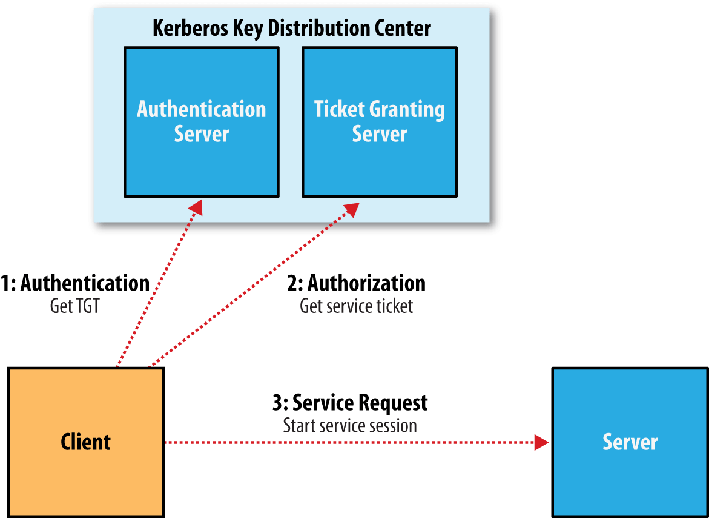

# Kerberos 入门

:trophy: `Kerberos` 主要用来做网络通讯中的身份认证，帮助我们高效，安全的识别访问者

<!-- more -->

::: info

kerberos 协议存在的组成：

1. `客户端`（Client）：发送请求的一方
2. `服务端`（Server）：接收请求的一方
3. `密钥分发中心`（Key distribution KDC）

:::



## 1 安装

```shell
#服务端
yum install krb5-libs krb5-server krb5-workstation
#客户端
yum install krb5-libs krb5-workstation
```

## 2 编辑配置文件

### 2.1 修改 kdc.conf（server）

修改 `/var/kerberos/krb5kdc/kdc.conf` 文件

```toml title="/var/kerberos/krb5kdc/kdc.conf"
[kdcdefaults]
kdc_ports = 88
kdc_tcp_ports = 88

[realms]
HADOOP.COM = {
  # master_key_type = aes256-cts
  # admin 用户权限
  acl_file = /var/kerberos/krb5kdc/kadm5.acl
  dict_file = /usr/share/dict/words
  # kdc进行检验的keytab
  admin_keytab = /var/kerberos/krb5kdc/kadm5.keytab
  # 支持的检验方式
  supported_enctypes = aes128-cts:normal des3-hmac-sha1:normal arcfour-hmac:normal camellia256-cts:normal camellia128-cts:normal des-hmac-sha1:normal des-cbc-md5:normal des-cbc-crc:normal
}
```

### 2.2 修改 krb5.conf（server and client）

修改 `/etc/krb5.conf` 文件

```toml title="/etc/krb5.conf"
# Configuration snippets may be placed in this directory as well
includedir /etc/krb5.conf.d/

[logging]
default = FILE:/var/log/krb5libs.log
kdc = FILE:/var/log/krb5kdc.log
admin_server = FILE:/var/log/kadmind.log

[libdefaults]
dns_lookup_realm = false
# 票据存在时间
ticket_lifetime = 24h
# 最大延长时间
renew_lifetime = 7d
forwardable = true
rdns = false
pkinit_anchors = FILE:/etc/pki/tls/certs/ca-bundle.crt
# 默认域
default_realm = HADOOP.COM
default_ccache_name = KEYRING:persistent:%{uid}
# 禁止使用udp
udp_preference_limit = 1

[realms]
HADOOP.COM = {
  # kdc服务地址
  kdc = hadoop101
  # admin server服务地址
  admin_server = hadoop101
}

[domain_realm]
.example.com = HADOOP.COM
example.com = HADOOP.COM
```

## 3 生成 kerberos 数据库

```shell
kdb5_util create -s
# 输入密码
Enter KDC database master key:
Re-enter KDC database master key to verify:
# 查看路径下是否生成以下文件
# kadm5.acl  kdc.conf  principal  principal.kadm5  principal.kadm5.lock  principal.ok
ls /var/kerberos/krb5kdc/
```

## 4 创建管理员主体/实例

```shell
kadmin.local -q "addprinc admin/admin"
# 输入密码
Enter KDC database master key:
Re-enter KDC database master key to verify:
# 给管理员实例的所有主体授权
vim /var/kerberos/krb5kdc/kadm5.acl
# 替换内容
*/admin@HADOOP.COM      *
# 前面的*代表所有主体，后面的*代表所有权限
```

## 5 启动服务（server）

```shell
systemctl start kadmin
systemctl enable kadmin
systemctl start krb5kdc
systemctl enable krb5kdc
```

## 6 创建普通主体/实例

```shell
kadmin.local -q "addprinc atguigu"
# 输入密码
Enter password for principal "atguigu@HADOOP.COM":
Re-enter password for principal "atguigu@HADOOP.COM":
```

## 常用命令

```shell
# 认证
kinit admin/admin
# 查看认证
klist
# 登入shell-server，输入?提示
kadmin.local
# 登入shell-client，输入?提示
kadmin
# 创建主体/实例
kadmin.local -q "addprinc atguigu"
# 修改主体/实例密码
kadmin.local -q "cpw atguigu"
# 查看所有主体/实例
kadmin.local -q "list_principals"
# 生成keytab，当生成keytab之后，使用密码将不能再登入
kadmin.local -q "ktadd -k /root/atguigu.keytab atguigu"
# 使用keytab进行认证
kinit -kt /root/atguigu.keytab atguigu
# 销毁凭证，提示有缓存，使用-A参数清空所有
kdestroy
```
